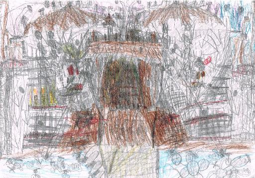

Introduction 
-------------------------------------------------- -------------------------------------------------- ----------

On the cover is a picture of a drawing made by a boy with autism. When he was small, people told him he was not drawing but scribbling. He felt so bad that at a certain point he did not want to draw anymore.

At home he talked about his drawings,and it was clear that he saw a lot more in them. While he spoke the drawings came to life. It turned out to be not just a drawing, but a epic story!

He was encouraged to continue drawing. He was given information and was shown examples of artists who each had their own style, and who were initially unappreciated. This gave him self-confidence and he started to draw again. When anyone said he was scribbling, he said that he had his own style and would start to explain the drawings. People began to see that he had indeed a unique style and that it was more than just a scribble. This reassured him in his drawingon style and his drawings became even more complex and more detailed, building layer upon layer.

That's how it is with autism. People with autism are often not well understood. They do not fit into society, they are not as they should be. Like with the drawing: it looks like scribbles. It is not how a drawing 'should be'.

But if you have patience and an open mind when looking at an autistic, you will see so much more. You may not understand everything, but you are open to the differences. You're taking a genuine look at the person who stands in front of you and not just at 'an autistic'. Like with the drawing: you want to see what is actually drawn, even if it is hard to do and not immediately obvious.

In order to really understand the person, you will have to listen to what someone with autism has to say. Really listen, ask questions and watch. Then you will be pleasantly surprised and even amazed with what comes to light. A whole personality, a whole story. Like with the drawing: you only see it come to life when you watch and listen carefully to the explanation.

Even then it remains hard. There is so much to discover about people with autism. Even if you think you know everything, there is always a lot more. Like with the drawing: layer upon layer.

Look carefully, watch and listen. A world will open up for you.

Despite the fact that a lot has been written about autism, many books still lack essential information about autism and autistics. This book aims to address all aspects of, and the issues related to autism. The various aspects and subjects are not always dealt with very deeply, because an attempt has been made to keep the book concise, however it tries to be as complete as possible with the information that is given. The book serves as a guide. If more information about a certain aspect or subject is required, the source reference can be consulted and/or further researched. The book should be an excellent companion to other books about autism.

The autistic person is the focus of this book. This distinguishes it from other books about autism which focus on the autistic traits, rather than the people behind the disorder itself. When the term 'autism' is used, the entire spectrum of autism disorders is meant. When 'autistic' is referred to, all people with a disorder in the autism spectrum are meant. The term autistic is deliberately chosen because the disorder is so interwoven with the person themselves and you can not disconnect them separately. Just as when you call a person deaf and usually do not say 'a person with a hearing impairment'.

This book is only about autistic people with a normal to high giftedness. All autistics we are talking about here are ordinary people with a normal intelligence who (want to) live as normal as possible. An autistic is also a child, father, mother, partner, pupil, student, employee or employer and participates in society, just like everyone else. Where he / him is used, she / her can also be read. 

Despite the fact that many disorders are related to each other and that people with one disorder often suffer from multiple disorders at the same time, this is not discussed very deeply in connection with the length of the book.

The book has been a journey of discovery to people with autism. During it's writing, certain discoveries were made and insights were gained. Logical reasoning was regularly followed, allowing certain conclusions to be drawn. However, attempts have also been made to remain as objective as possible and to provide all the information discovered on the various subjects, so that the reader can also draw their own conclusions. The intention is that, by reading the book, you are taken on a voyage of discovery yourself and that you can make your own discoveries and acquire your own insights. At the end of the book a number of conclusions, opinions and questions arise from the author.

