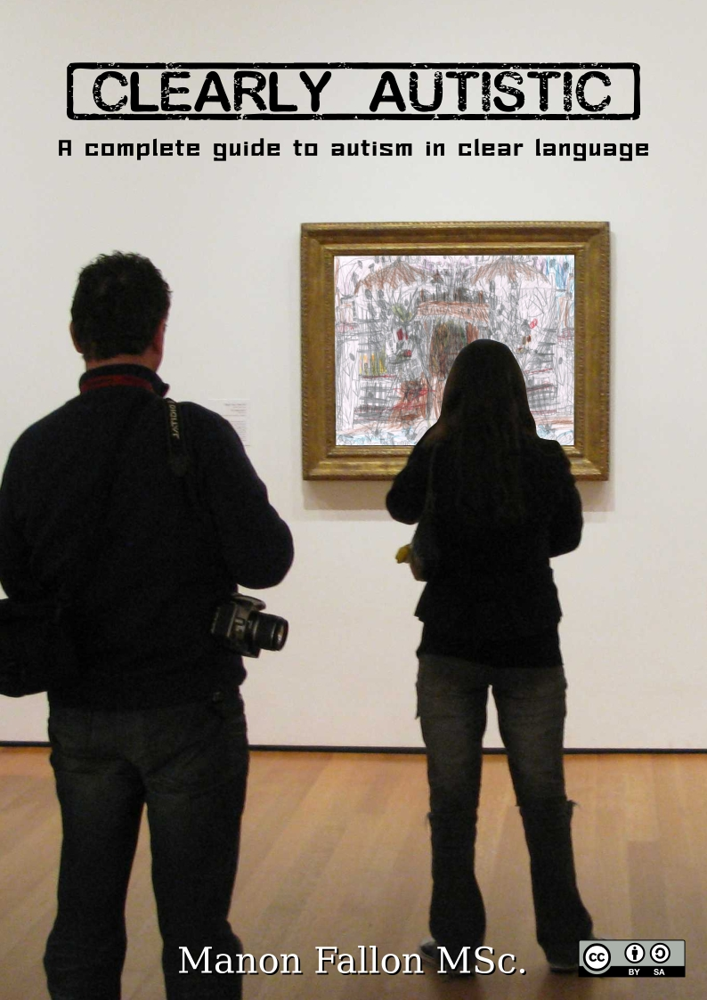
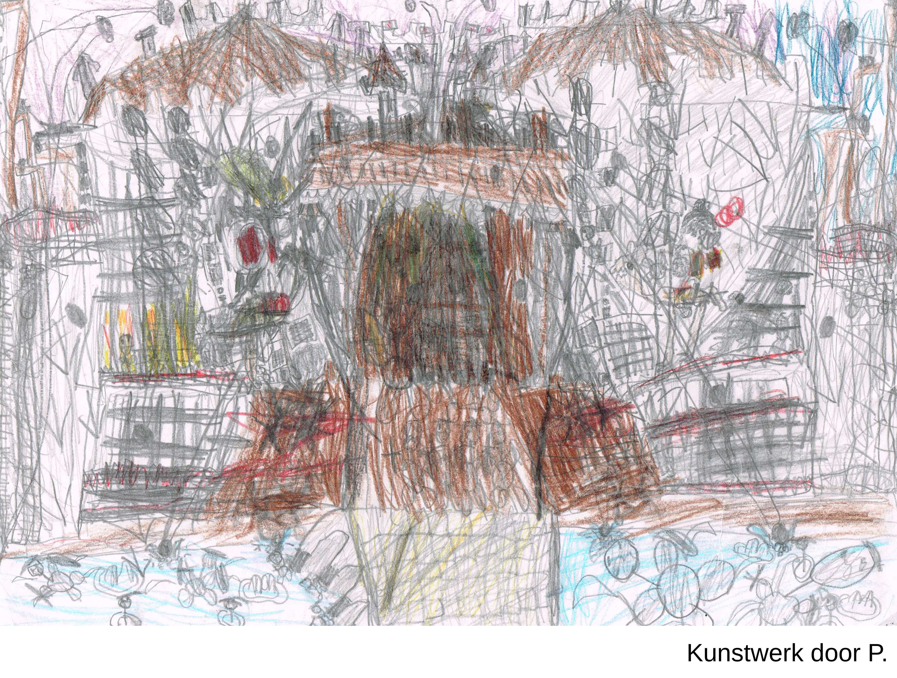

# Clearly Autistic … !

A complete guide about autism in clear language

Manon Fallon

# About the author

Manon Fallon is a well rounded social worker, teacher and developmental psychologist. She is interested in people and the way in which societies work.

She has gained a lot of experience living and working in Sweden, Ireland, England and the Netherlands. This is reflected in her work with people with disabilities, disorders and problems, both in their living and learning environment. She uses her love of language and communication to understand and support these people. She makes extensive use of body and sign language. Manon believes it is critical to give and receive information clearly.

# Copyright

**© Manon Fallon 2017**

This book, with the exception of [Chapter 33 Discoveries, insights and own opinion](#33), is published under the [Creative Commons Attribution-Share Alike 4.0 International](http://creativecommons.org/licenses/by-sa/4.0/)</a>.

This means that you **_may_ print, copy, redistribute** and, change[&#42;](#ii-0) and sell this work, as long as you mention the author and release the book under the same license.

&#42; _In [Chapter 33 Discoveries, insights and own opinion](#33) the author gives their own opinions on certain subjects. That is why this chapter is not released as BY-SA, but [Attribution-No Derivative Works 4.0 International](http://creativecommons.org/licenses/by-nd/4.0/). That means that no changes can be made to this chapter._

## Cover:

Drawing P. [Creative Commons Naamsvermelding-GelijkDelen 4.0 Internationaal](http://creativecommons.org/licenses/by-sa/4.0/)

Photograph Wholtone © (Own work) [CC BY 3.0](http://creativecommons.org/licenses/by/3.0), via [Wikimedia Commons](https://commons.wikimedia.org/wiki/File%3AStarry-night-in-moma-gallery.jpg)

soviet-box bold font, [Jyrki Ihalainen](mailto:yardan74@yahoo.com), © 2015 [SIL Open Font License, Version 1.1](http://scripts.sil.org/OFL).

Top Secret font, [Anfa](mailto:anfa67@yahoo.co.uk) © All Rights Reserved.

# Inleiding

On the cover is a picture of a drawing made by a boy with autism. When he was small, people told him he was not drawing but scribbling. He felt so bad that at a certain point he did not want to draw anymore.

At home he talked about his drawings,and it was clear that he saw a lot more in them. While he spoke the drawings came to life. It turned out to be not just a drawing, but a epic story!

He was encouraged to continue drawing. He was given information and was shown examples of artists who each had their own style, and who were initially unappreciated. This gave him self-confidence and he started to draw again. When anyone said he was scribbling, he said that he had his own style and would start to explain the drawings. People began to see that he had indeed a unique style and that it was more than just a scribble. This reassured him in his drawingon style and his drawings became even more complex and more detailed, building layer upon layer.

That's how it is with autism. People with autism are often not well understood. They do not fit into society, they are not as they should be. Like with the drawing: it looks like scribbles. It is not how a drawing 'should be'.

But if you have patience and an open mind when looking at an autistic, you will see so much more. You may not understand everything, but you are open to the differences. You're taking a genuine look at the person who stands in front of you and not just at 'an autistic'. Like with the drawing: you want to see what is actually drawn, even if it is hard to do and not immediately obvious.

In order to really understand the person, you will have to listen to what someone with autism has to say. Really listen, ask questions and watch. Then you will be pleasantly surprised and even amazed with what comes to light. A whole personality, a whole story. Like with the drawing: you only see it come to life when you watch and listen carefully to the explanation.

Even then it remains hard. There is so much to discover about people with autism. Even if you think you know everything, there is always a lot more. Like with the drawing: layer upon layer.

Look carefully, watch and listen. A world will open up for you.

Despite the fact that a lot has been written about autism, many books still lack essential information about autism and autistics. This book aims to address all aspects of, and the issues related to autism. The various aspects and subjects are not always dealt with very deeply, because an attempt has been made to keep the book concise, however it tries to be as complete as possible with the information that is given. The book serves as a guide. If more information about a certain aspect or subject is required, the source reference can be consulted and/or further researched. The book should be an excellent companion to other books about autism.

The autistic person is the focus of this book. This distinguishes it from other books about autism which focus on the autistic traits, rather than the people behind the disorder itself. When the term 'autism' is used, the entire spectrum of autism disorders is meant. When 'autistic' is referred to, all people with a disorder in the autism spectrum are meant. The term autistic is deliberately chosen because the disorder is so interwoven with the person themselves and you can not disconnect them separately. Just as when you call a person deaf and usually do not say 'a person with a hearing impairment'.

This book is only about autistic people with a normal to high giftedness. All autistics we are talking about here are ordinary people with a normal intelligence who (want to) live as normal as possible. An autistic is also a child, father, mother, partner, pupil, student, employee or employer and participates in society, just like everyone else. Where he / him is used, she / her can also be read. 

Despite the fact that many disorders are related to each other and that people with one disorder often suffer from multiple disorders at the same time, this is not discussed very deeply in connection with the length of the book.

The book has been a journey of discovery to people with autism. During it's writing, certain discoveries were made and insights were gained. Logical reasoning was regularly followed, allowing certain conclusions to be drawn. However, attempts have also been made to remain as objective as possible and to provide all the information discovered on the various subjects, so that the reader can also draw their own conclusions. The intention is that, by reading the book, you are taken on a voyage of discovery yourself and that you can make your own discoveries and acquire your own insights. At the end of the book a number of conclusions, opinions and questions arise from the author.

# Structure of the book

While writing this book it became clear how much information is needed to provide as clear a picture as possible about autism. That is why the choice was made to divide the book into parts, so that the information does not become a large jumble, but remains clear and well-organized.

The parts of the book are in turn subdivided into chapters. At the end of each part there is a short summary of what has been discussed.

Part 1 is about science. It highlights the history of science with regard to autism spectrum disorders and how scientists have been working to define what an autism spectrum disorder is.

Part 2 deals mainly with society's view on Autism Spectrum Disorders (ASD). It shows how society looks upon ASD and autistics. Here it explains what people in society notice about autistic people and how you can explain many of these traits back to the scientific theories described in part 1.

Part 3 is about how autism spectrum disorder is experienced by the autistics themselves. It plots many personal experiences of autistic people and shares what they experience, which is not very often discussed.

Part 4 is about neurobiological developmental disorder. The various areas of development are described, examined and viewed from the perspective of science and the experience of autistic people.

Part 5 goes deeper into different areas that often come to the fore in autism. It highlights points that have come to the fore in parts 2 and 3, so that there is a better picture of how complex certain aspects are and where bottlenecks may occur.

Part 6 deals with related disorders. In addition to the autism spectrum disorder, autistics can also suffer from other disorders, some of which have been highlighted and briefly reviewed.

Part 7 deals with changes that have taken place in society. In this way, we try to answer the question of why there are more diagnoses nowadays than before, and why there seems to be more and more people with a disorder.

Part 8 contains a summary of the entire book and it lists the conclusions and insights that were revealed. Points are also raised that require further discussion.

The postscript goes deeper into the journey of discovery that the book has been.

# Table of contents

[About the author](#i)

[Copyright](#ii)

[Introduction](#iii)

[Structure of the book](#v)

[Table of contents](#vi)

[PART 1](#a)

[Chapter 1 The Origin of Autism Spectrum Disorders](#1)

[Chapter 2 Autism spectrum disorders according to the DSM](#2)

[Chapter 3 Neurobiological development &#40;general&#41;](#3)

[Chapter 4 Neurobiological developmental disorder](#4)

[Summary of part 1](#a-1)

[PART2](#b)

[Chapter 5 Diagnosing an Autism Spectrum Disorder](#5)

[Chapter 6 Treatment of Autism Spectrum Disorders](#6)

[Chapter 7 Autism traits](#7)

[Chapter 8 Normalization and Acceptance of Autism](#8)

[Chapter 9 Autism - a minority or a disorder?](#9)

[Chapter 10 Further examination of Autism traits](#10)

[Summary of part 2](#b-1)

[PART3](#c)

[Chapter 11 Impact of an autism spectrum disorder in general](#11)

[Chapter 12 The young autistic in different environments](#12)

[Chapter 13 Adult life with ASD](#13)

[Summary of part 3](#c-1)

[PART 4](#d)

[Chapter 14 Problems in development](#14)

[Chapter 15 Development of motor skills](#15)

[Chapter 16 Cognitive development](#16)

[Chapter 17 Social-emotional development](#17)

[Summary part 4](#d-1)

[PART 5](#e)

[Chapter 18 Sleeping, eating, cleanliness and interoception](#18)

[Chapter 19 Communication and social interaction](#19)

[Chapter 20 &#40;Social&#41; Contacts](#20)

[Chapter 21 Stress, anxiety, depression and inferiority complex](#21)

[Chapter 22 Differences between men and women](#22)

[Summary part 5](#e-1)

[PART6](#f)

[Chapter 23 Comorbidity](#23)

[Chapter 24 Intellectual giftedness](#24)

[Chapter 25 Specific Learning Disorders](#25)

[Chapter 26 ADHD](#26)

[Summary part 6](#f-1)

[PART 7](#g)

[Chapter 27 Changes in the home life](#27)

[Chapter 28 Views on education and education then and now](#28)

[Chapter 29 Childcare and school through the ages](#29)

[Chapter 30 Work - from craftwork through to digitization.](#30)

[Chapter 31 The origins and development of psychiatry](#31)

[Summary part 7](#g-1)

[PART 8](#h)

[Chapter 32 Summary and conclusion](#32)

[Chapter 33 Discoveries, insights and own opinion](#33)

[Chapter 34 Discussion points](#34)

[Postscript](#35)

[Literature](#35-1)

[Web sites](#35-2)

[Some interesting wikipedia pages](#35-3)

# PART 1 

> The emergence of and the current scientific view on autism spectrum disorders

## Chapter 1 The origin of autism spectrum disorders

Autism has always existed. There was no name for it. Someone with autism was different, strange or eccentric. Because there was no word for autism, nothing has been described or written about. Only in the early part of the twentieth century was the term autism first used to describe people with a certain mental disorder. And in recent decades, the term autism has become increasingly well-known. Now almost everyone knows the term autism.

The concept of autism comes from the word 'autos'. It is a Greek word and means 'self'. It was already used in psychiatry around 1900 to describe people who were alienated from social interaction. An introvert.

Who exactly used the term autism first is controversial. It is said that a Swiss doctor, Eugen Bleuler, first used the term in 1911 to indicate certain characteristics of schizophrenia.

The name of a Russian doctor, Sukhareva, is also mentioned. She was the first to publish an article in 1925 in Russia with very accurate descriptions of children with what we now know as the Asperger Syndrome (an autism spectrum disorder). The article was translated into German in 1926 and published in a prominent journal for psychiatry and neurology in Germany. Doctor Sukhareva named it "schizoid psychopathy in children." Sukhareva thus initially saw it as a child form of schizophrenia. Only later did she use the term 'autistic psychopathy' in her articles.

The term 'Autism' became known through Leo Kanner. Leo Kanner was born in (what we now know as) Ukraine, from Jewish parents. He was sent to his uncle in Berlin when he was 12 years old to go to school there. On completing his studies as a doctor, after the first world war, he was persuaded by a colleague to emigrate to America. He emigrated in 1924. In America he found work in a hospital and studied psychiatry. He studied children he described in his article in 1943 as having 'Autistic Disturbances of Affective Contact'. Leo Kanner detailed in his article the disturbances of these children and called the children autistics. This made the term autism known as a psychiatric term.

Hans Asperger is also known for his work with children who have characteristics of Asperger Syndrome. He was born in Austria, near Vienna. He studied to become a pediatrician and began his career in 1932 in a children's clinic set up in 1911 by the leading physician Erwin Lazar. The clinic was aimed at children who were 'different' (in various ways). Lazar assumed that these children needed different education and other support and was as a result far ahead of his time. At the clinic, Asperger studied children whom he described as 'autistic psychopaths', also called 'autistic' in short. He described characteristics in these children that we now recognize as characteristics of Asperger's Syndrome. Perhaps he was also interested in these children, because he recognized a number of these symptoms in himself as a child. As early as 1938 he gave a lecture on 'autistic psychopaths' in which he emphasized the abilities of these children.

Leo Kanner and Hans Asperger have become known as the founders of autism spectrum disorders. Leo Kanner soon became known after publication with his description of autism. Only much later, in 1981, when Lorna Wing translated the German text of Hans Asperger into English, his work became known. It is only since then that children with characteristics of Kanner's autism, but who are more intellectual gifted and as a result are better able to intergrate into society, were diagnosed with Asperger's Syndrome. Hans Asperger did not live to experience this recognition as he died in 1980.

Many people wonder if the doctors mentioned above knew each other or that they happened to discover the same things at the same time. It probably had more to do with the spirit of the age. Neurology and psychiatry were disciplines that did not exist that long. It was very much 'in' to conduct research into it. Therefore, the physicians mentioned above will probably have kept themselves informed about what was going on in their field by reading the same (German) journals on psychiatry and neurology. As a result, it seems plausible that they knew about each other's work to a greater or lesser extent.

At the beginning of the last century, autism was thus still seen as part of, or a child form of, schizophrenia. Bleugel and Sukhareva conducted research on people with a disorder in the schizoid spectrum.

Schizophrenia usually becomes apparent in young adults between 15-30 years. Up until then you notice little or nothing special about someone with a disorder in the schizoid spectrum. When the disorder manifests itself, problems usually arise in social and emotional areas and there is often behavioral problems. The researchers tried to discover if there was any indications in childhood that would point to future schizophrenia. Because autistic people often experience problems socially and emotionally and sometimes also exhibit problematic behavior, it was thought that children who had difficulty with this exhibited a childrens form of schizophrenia. And when you look at the symptoms, there are indeed similarities.

Further study found that although the symptoms of both disorders were similar, there were substantial differences, which made Sukhareva and Asperger call it 'autistic psychopathy'.

The words psychopathy and psychopath have very negative associations nowadays. Many people think that psychopaths are serial killers or other very disturbed figures as can be seen in the films. But psychopathy has more to do with self-centeredness. Thinking only of yourself and not considering another person. Often these people are notorious liars and very good at manipulating others without any remorse or even thinking about how annoying it might be for the other to be lied to, deceived or otherwise manipulated.

Explained in this way, you might think that "autistic psychopaths" are inward-looking people who do not take other people into account. And who can not imagine what it is to live as the other person and who only think of themselves. And unfortunately many people do think this way about autistic people. Autistics have no feelings themselves, cannot recognize the feelings of others, and therefore cannot have empathy for the feelings of others. That is not true and that is discussed in more detail later on in this book.

Leo Kanner called autism 'autistic disruptions in affective contact'. He did not mention psychopathy. He saw autistic people as people who have difficulties in the area of ​​affection (affection) and the building of relationships with others by being introverted.

His emphasis was mainly on understanding and expressing through language. This is a point that is also mentioned by Sukhareva and Asperger, but plays a less prominent role in their descriptions of autistic people.

Problems with the language and speech is one of the criteria included in the diagnostic manual in psychiatry to determine whether there is Classical Autism. Until recently when there is little or no speech problem, but other criteria of Autism are met, it was assumed not to be Classic Autism, but rather Asperger Syndrome.

## Chapter 2 Autism spectrum disorders according to the DSM

In this chapter we look at the manual that mental health professionals use to determine whether a person has autism spectrum disorder.

Since the beginning of the last century there has been a lot of research into mental illnesses. In order to be able to investigate whether and which mental disorder someone has, guidelines and criteria have been drawn up, so that psychologists and psychiatrists can make the correct diagnoses. These guidelines and criteria are written down in a manual. This handbook is called the DSM, which is an abbreviation for: 'Diagnostic and Statistical Manual of Mental Disorders'. All mental disorders are described in detail in the DSM, so that it is easier to recognize the conditions in patients. 

The first DSM was written in 1952 by a number of leading psychiatrists and psychologists. Of course as further research was conducted, more and more became known about the different mental disorders so that over the course of time the manual had to be adapted. The current version of DSM-IV is now being replaced by the DSM 5. To ease the transition, both versions are often referred to when making the diagnosis.

In the DSM-IV autism spectrum disorders are classified under developmental disorders. Developmental disorders are neurological, psychological or physical disorders that occur in children or adolescents and that hamper normal development. 

The DSM-IV distinguishes the following groups of developmental disorders:

- Dementia (axis II)
- Learning disabilities (including dyslexia and dyscalculia)
- Motor disorders (dyspraxia)
- Communication disorders (including stuttering)
- Pervasive developmental disorders
- Attention deficit and behavioral disorders (ADHD, ODD, CD)
- Eating disorders in childhood (including pica and rumination disorder)
- Tic disorders (including Gilles de la Tourette syndrome)
- Disturbances with faeces (enuresis and encopres)
- Other disorders in childhood or adolescence (separation anxiety, attachment disorder, selective mutism, stereotype movement disorder)

Autism spectrum disorders is not listed here as it falls under the pervasive developmental disorders. The term Pervasive Developmental Disorder, (PDD) is a term in psychiatry with four developmental disorders plus a catch-all group "Not otherwise Specified" (NOS). Pervasive means 'deeply penetrating', which says that it is a disorder that has a drastic impact on all areas of life.

Autismespectrumstoornissen zien we hier niet bij staan. Autisme valt hierbij onder de pervasieve ontwikkelingsstoornissen. De term pervasieve ontwikkelingsstoornis (Pervasive Developmental Disorder, PDD) is een term in de psychiatriewaarmee vier ontwikkelingsstoornissenplus een restgroep (NOS – Not otherwise Specified, niet nader omschreven) worden aangeduid. Met 'pervasief' wordt 'diep doordringend' bedoeld, wat eigenlijk betekent dat het een stoornis betreft die ingrijpend is op alle levensgebieden.

Als synoniem wordt ook wel de term autismespectrumstoornissen of autismegebruikt, maar op etiologische (oorzakelijke)gronden en gedragsclassificaties houdt dit niet voor iedereen hetzelfde in. De oorzaken en de gedragingen bij een diagnose 'autismespectrumstoornis' zijn dus zeer divers. 

Bij de DSM-IV wordt autisme onderverdeeld in: klassiek autisme, het syndroom van Asperger en PDD-NOS. Bij PDD-NOS zijn er voldoende kenmerken van autisme aanwezig, maar alles bij elkaar voldoet het niet helemaal aan de criteria om te kunnen spreken van klassiek autisme of het syndroom van Asperger en horen daarom bij een restgroep. Deze namen (autisme, Asperger en PDD-NOS) zijn welbekend bij de meeste mensen. Verder vallen de stoornis van RETT, de 'desintegratiestoornis in de kinderleeftijd' en MCDD bij de DSM-IV nog onder de paraplu van autisme. Op deze stoornissen wordt in dit boek niet verder ingegaan.

Bij de DSM 5 is de onderverdeling van autisme anders dan bij de DSM-IV. De bekende namen als klassiek autisme, Asperger, PDD-NOS en dergelijke vallen weg. Deze stoornissen worden nu allemaal ASS (Autisme Spectrum Stoornis) genoemd. Er wordt nu meer gekeken naar de hulpbehoeftigheid, waarbij er onderscheid gemaakt wordt tussen ASS I, II en III. Behoor je tot de groep ASS I, dan ben je erg zelfredzaam en behoor je tot de groep ASS III dan heb je veel hulp nodig.

Lange tijd werd ook aangenomen dat de diagnose Autisme inherent was aan het hebben van een verstandelijke beperking en het syndroom van Asperger juist inherent aan het hebben van een hoog IQ. Niets is minder waar en daarom is de DSM5 ook aangepast aan wat we tegenwoordig weten van autisme en is de classificatie Klassiek Autisme, Asperger en PDD-NOS losgelaten om plaats te maken voor de classificatie van ASS naar aanleiding van de mate van hulpbehoevendheid.

In de DSM 5 heeft autisme een eigen categorie gekregen. Het valt nu onder de neurobiologische ontwikkelingsstoornissen.

De neurobiologische ontwikkelingsstoornissen zijn een groep van stoornissen, die zich manifesteren in de loop van de ontwikkeling van het individu, en vaak al op zeer jonge leeftijd. In de psychiatrie zegt men dat hersenafwijkingen hierbij een belangrijke rol spelen. Neurobiologisch wil zeggen: alles wat met de ontwikkeling en de werking van het zenuwstelsel te maken heeft. Het zenuwstelsel geeft prikkels door aan de hersenen. De hersenen zetten die prikkels om in informatie en zorgt ervoor dat het lichaam reageert op die informatie. De werking van het zenuwstelsel en de werking van de hersenen hebben dus grote invloed op hoe wij de wereld om ons heen waarnemen en hoe we reageren.

De neurobiologische ontwikkelingsstoornissen in de DSM 5 zijn:

* Aandachtsdeficiëntie-/hyperactiviteitsstoornis (ADHD)
* Autismespectrumstoornissen
* Verstandelijke beperkingen (globale ontwikkelingsachterstand)
* Communicatiestoornissen (taalstoornis, spraakklankstoornis, stoornis in de spraakvloeiendheid in de kindertijd, sociale (pragmatische) communicatiestoornis)
* Specifieke leerstoornissen (zoals dyslexie, dyscalculie)
* Motorische stoornissen (Coördinatieontwikkelingsstoornis, Stereotype-bewegingsstoornis)
* Ticstoornissen (stoornis van Gilles de la Tourette)

Een aantal stoornissen staan niet bij de neurobiologische ontwikkelingsstoornissen die wel bij de ontwikkelingsstoornissen stonden in de DSM-IV, zoals eetstoornissen, stoornissen met de ontlasting en andere stoornissen in de kinderleeftijd of adolescentie. Deze vallen nu in andere categorieën.

Wanneer we kijken naar de autismespectrumstoornissen in de DSM 5 zien we dat sommige criteria, waaraan voldaan moet worden, zijn aangepast. Er wordt in de DSM 5 bijvoorbeeld minder nadruk gelegd op het hebben van problemen met de spraak en de motoriek om van een autismespectrumstoornis te kunnen spreken.

Onderzoekers vinden het nog vaak moeilijk om kinderen volgens de DSM 5 te classificeren. Alle kinderen zijn namelijk nog hulpbehoevend. Ze zijn nog aan het groeien, aan het leren en het zich ontwikkelen. Normaal- tot hoogbegaafde autistische kinderen hebben vaak wat meer begeleiding en ondersteuning nodig, maar dat wil niet zeggen dat ze dat als volwassenen ook nog nodig zullen hebben. Het was tot nu toe niet gebruikelijk om een diagnose binnen de Autisme Spectrum Stoornissen aan te passen. Bij de DSM IV worden diagnoses gegeven, zoals Klassiek autisme, Asperger, PDD-NOS die je je hele leven blijft houden. Maar bij de DSM 5 is dat anders, want een kind met ASS II kan best uitgroeien tot een volwassene met ASS I. De DSM 5 kan autisten (en hun omgeving) stimuleren om te groeien naar een ASS I diagnose. Een diagnose met de minste hulpbehoevendheid.

## Hoofdstuk 3 Neurobiologische ontwikkeling (algemeen)

In de DSM 5 staat dat autisme een neurobiologische ontwikkelingsstoornis is en dat het dus te maken heeft met de mate waarin de hersenen de prikkels die binnen komen omzetten in praktische informatie waardoor je adequaat op een situatie kan reageren. Dit proces is bij mensen met een neurobiologische ontwikkelingsstoornis gestoord oftewel het functioneert anders dan bij de meeste mensen.

Er wordt nog veel onderzoek gedaan naar de werking van het brein, want er is weinig bekend over de hersenen en hoe ze werken. Het is erg ingewikkelde materie. Toch wordt hier een poging gedaan iets te vertellen over wat er op dit moment over het brein bekend is en dan natuurlijk met name over waar mensen met autisme tegenaan lopen. In dit hoofdstuk zal geprobeerd worden globaal iets te vertellen over de normale ontwikkeling van de hersenen en dan vooral over de gebieden die zich bij autisten anders lijken te ontwikkelen.

De ontwikkeling van de hersenen start tijdens de zwangerschap. De hersenen groeien en ontwikkelen door totdat iemand een jaar of 23 is.

Bij de geboorte lijkt de rechterhersenhelft het dominantst te zijn, dat wil zeggen dat de rechterhersenhelft de baby meer aanstuurt dan de linker-hersenhelft. Maar door de interesse van het kind in gezichten en door bekende spelletjes die volwassenen doen met baby's wordt de linkerhersenhelft gestimuleerd zich te ontwikkelen. Met een jaar of 4 tot 6 is de linkerhersenhelft zover dat deze nu domineert. Er wordt ook wel gezegd dat kinderen dan schoolrijp zijn, want voor school is de ontwikkeling van de linkerhersenhelft zeer belangrijk.

Er is veel te doen over dominantie van hersenhelften en of die dominantie wel echt bestaat, omdat de helften met elkaar samenwerken. Of je nou spreekt over dominantie of niet, het is een feit dat ondanks dat de beide hersenhelften nauw samenwerken, ze wel ieder hun eigen specialiteiten hebben. In sommige dingen is de ene hersenhelft beter dan de andere en andersom. Als er een hersenbeschadiging is in de ene hersenhelft, kan de andere het meestal gedeeltelijk overnemen, maar vaak blijft het toch behelpen.

Wetenschappers hebben veel onderzoek gedaan naar de specifieke functies van de hersenhelften. Er is bijvoorbeeld onderzoek gedaan naar mensen met veelvuldige epileptische aanvallen. Om de aanvallen tegen te gaan werden de hersenhelften chirurgisch gescheiden. De epileptische aanvallen werden beduidend minder, maar de signalen van de hersenhelften konden niet meer aan elkaar doorgegeven worden en werkten niet meer samen op de gewone manier. Daarnaast is er ook veel onderzoek geweest naar mensen met hersenletsel (door een ongeluk, tumor of anderszins) waarbij delen van de hersenen niet meer (optimaal) functioneerden. Uit al deze onderzoeken komt naar voren dat verschillende delen van de hersenen verschillende functies en specialiteiten hebben.

Hieronder worden de specialiteiten van de hersenhelften nader belicht.

De linker-hersenhelft richt zich vooral op zaken als analytisch en logisch denken, ordenen, structuur aanbrengen, categoriseren, plannen, spraak, spelling, woord-en nummerherkenning.

Mensen met een goed ontwikkelde linker-hersenhelft zijn meestal beter in het analyseren en verwerken van informatie, kunnen sneller vragen beantwoorden, denken verbaal, hebben betere expressieve taalvermogens, een lineaire benadering, zijn symbolisch, tijdgebonden, ordelijk, overzichtelijk, kunnen zich goed aan schema's houden en hebben weinig problemen met het afmaken van hun werk/taak.

Dit heeft grote voordelen op school, waar men zich vooral richt op die zaken waar de linker-hersenhelft goed in is en men het verder ontwikkelen daarvan stimuleert.

De rechterhersenhelft richt zich vooral op zaken als intuïtie, gevoeligheid, dagdromen, spontaniteit, humor, emoties, ontdekken, experimenteren, inventief zijn, muzikale expressie, leren door ervaringen, holisme (zaken als geheel zien) en creativiteit.

Mensen met een sterk ontwikkelde rechterhersenhelft zijn meestal beter in visualiseren, concretiseren, gebeurtenissen onthouden, verbanden leggen, processen doorzien, hebben een grotere fantasie, zijn innovatief, herkennen patronen sneller en hebben een groter functioneel en ruimtelijk inzicht.

School kan dus moeilijkheden opleveren, omdat die niet afgestemd is op het ontwikkelen van de rechterhersenhelft. Het huidige schoolsysteem kan zelfs talenten van mensen met een overontwikkelde rechterhersenhelft negeren of afstraffen.

Wanneer er in het boek gepraat wordt over een sterkere ontwikkeling of overontwikkeling van een van de hersenhelften, wordt er niet mee bedoeld dat de ene hersenhelft groter is dan de andere, maar dat de chemische en elektrische signalen in de ene hersenhelft beter door lijken te komen, beter lijken te werken en beter verwerkt lijken te worden dan die van de andere hersenhelft.

## Hoofdstuk 4 Neurobiologische ontwikkelingsstoornis

Er wordt over het algemeen vanuit gegaan dat de neurobiologische ontwikkeling bij autisten gestoord is. Dat wil zeggen dat de hersenen van autisten zich anders lijken te ontwikkelen dan die van de meeste mensen. Vroeger dacht men dat het volume van de hersenen van mensen met autisme groter was dan bij anderen. Ook nu nog geven sommige wetenschappers aan dat het hersenvolume van autistische kinderen tot het 6e jaar sneller groeit dan bij anderen en dat het daarna weer vertraagd. Zij geven aan dat deze groei de oorzaak is voor de problemen waar autisten tegenaan lopen. Echter, op dit moment wordt er steeds meer gedacht dat de oorzaak ligt aan het feit dat er teveel testosteron wordt aangemaakt tijdens de zwangerschap, waardoor de rechterhersenhelft zich bij de foetus sterker ontwikkelt dan de linkerhersenhelft. Een asynchronische ontwikkeling dus van de hersenen. Zoals in het [previous chapter](#3) al naar voren kwam, betekent dat dus niet dat het volume van de ene hersenhelft groter is dan dat van de andere helft, maar dat de verbindingen van de ene helft beter werken dan de verbindingen van de andere helft. De verbindingen tússen de twee helften lijken ook minder goed te werken bij een asynchronische ontwikkeling van de hersenen.

Dit schijnt trouwens ook het geval te zijn bij mensen met bijvoorbeeld dyslexie, dyscalculie, dysorthografie, dysfasie, hoogbegaafdheid en ADHD. Tegenwoordig wordt ook de term 'beelddenkers' veel genoemd in samenhang met talenten van de rechterhersenhelft die bij sommige mensen meer naar voren lijken te komen.

In dit boek gaan we, om te beginnen, vooral uit van de theorie van de asynchronische ontwikkeling van hersenhelften, omdat dit het beste lijkt te passen bij veel voorkomende problemen waar mensen met autisme tegenaan lopen en ook omdat deze theorie recentelijk meer op de voorgrond staat.

Zoals gezegd denkt men dat bij autisten de rechterhersenhelft zich sterker ontwikkelt dan de linkerhersenhelft. In het [previous chapter](#3) kwam naar voren dat bij alle kinderen de rechterhersenhelft bij de geboorte het dominantst is, dus lijkt dat heel normaal. Maar het probleem zit hem in het feit dat de rechterhersenhelft zo sterk ontwikkeld is dat deze kinderen moeite hebben met spelletjes die volwassenen doen met baby's om de linker-hersenhelft te stimuleren. Bijvoorbeeld: in plaats van naar gezichten, schijnen ze eerder naar vormen of het lichtspel om zich heen te kijken. Hierdoor komt de stimulatie van de linker-hersenhelft maar moeizaam op gang en gaat achterlopen ten opzichte van de ontwikkeling van andere kinderen. De rechterhersenhelft ontwikkelt zich ondertussen gewoon door. Daardoor komt er een scheefgroei in de ontwikkeling, oftewel een asynchronische ontwikkeling. Je ziet vaak dat deze kinderen aan de ene kant ver vooruit lopen op leeftijdgenootjes en aan de andere kant flink achterlopen, terwijl er op sommige vlakken wel een gewone leeftijdsadequate ontwikkeling plaatsvindt.

Het probleem voor mensen met een overgestimuleerde rechterhersenhelft is dat je de asynchronische ontwikkeling nooit meer recht kunt trekken. Je kan proberen de linkerhersenhelft extra te stimuleren. Dit zou de scheefgroei in kunnen perken, maar verdwijnen zal het niet. Er is nou eenmaal sprake van een achterstand aan de ene kant en een voorsprong aan de andere kant.

Wel schijnen de hersenen van autisten zich altijd te blijven ontwikkelen. De ontwikkeling stopt dus niet na de adolescentie (rond 23 jaar), zoals bij anderen, maar lijkt door te gaan tot ver in de volwassenheid. Hier wordt echter nog volop onderzoek naar gedaan.

Omdat iedereen anders is en ieders brein anders is aangelegd, hebben niet alle mensen met een overgestimuleerde rechterhersenhelft last van dezelfde problemen.

Mensen die een gewone ontwikkeling hebben doorgemaakt, zijn namelijk ook zeer divers. Hun hersenen zijn allemaal anders aangelegd en hebben zich anders ontwikkeld, doordat zij allemaal andere dingen hebben meegemaakt in hun leven en daardoor andere ervaringen hebben opgedaan. Datzelfde geldt dus ook voor mensen met een asynchronische hersenontwikkeling. De ene heeft meer problemen op het gebied van woord- of nummerherkenning (bijvoorbeeld dyslexie of dyscalculie), de ander heeft meer problemen in het structuur aanbrengen of ordenen (bijvoorbeeld ADHD).

Sommige mensen hebben last van het tegelijkertijd aanwezig zijn van twee of meer stoornissen of aandoeningen. Dat noemen wetenschappers 'comorbiditeit'. Dit komt geregeld voor; iemand heeft dus bijvoorbeeld ASS + Gilles de la Tourette of ADHD + dyspraxie of leerstoornissen + ASS.

Als dat het geval is kun je zeggen dat: 1 + 1 = 3, ADHD + ASS = extra veel moeilijkheden. Want: ASS is vervelend en daar kun je bij geholpen of ondersteund worden. ADHD is vervelend en daar kun je bij geholpen of ondersteund worden. Maar als er sprake is van twee stoornissen tegelijk dan heb je last van de ene stoornis (1) + last van de andere stoornis (1), maar ook last van de combinatie van stoornissen (=3). Want de stoornissen zijn van invloed op elkaar en dit kan grotere problemen teweeg brengen dan alleen de ene of de andere stoornis op zich.

Zo is de zorgvraag van mensen met een verstandelijke beperking + ASS vaak veel groter dan die van mensen met ASS zonder verstandelijke beperking. ASS + een verstandelijke beperking levert meer frustraties op voor de persoon in kwestie en dat uit zich in het vaker hebben van de stereotiepe gedragingen (driftbuien, geen aanrakingen of oogcontact, weinig spraak etc.) die mensen associëren met autisme. Lange tijd werd trouwens gedacht (en sommige mensen denken dit nog steeds) dat de diagnose klassiek autisme (Kanner's autisme) hetzelfde was als het hebben van een verstandelijke beperking. Het is niet bekend hoe dit praatje de wereld in is gekomen. Wellicht omdat Kanner grote nadruk legde op de moeilijkheden die veel autisten ervaren met de spraak en taal. Voor de meeste mensen staat het kunnen hebben van een inhoudelijk gesprek namelijk in directe relatie tot de intelligentie van iemand. Heb je moeite met het spreken of het verwerken van taal, dan wordt je vaak niet voor vol aangezien en wordt er anders met je omgegaan. 

In ieder geval is een verstandelijke beperking iets heel anders dan een autismespectrumstoornis. Mensen met een verstandelijke beperking hebben een globale (op alle fronten) ontwikkelingsachterstand, waarbij kinderen zich langzamer ontwikkelen dan hun leeftijdsgenootjes, maar wel volgens dezelfde ontwikkelingslijn als kinderen zonder stoornis. Bij autisten zie je juist dat de ontwikkeling anders verloopt er en dus niet dezelfde ontwikkelingslijn gevolgd wordt als bij kinderen zonder stoornis.

## Samenvatting deel 1

Mensen met een stoornis in het autismespectrum hebben altijd al bestaan. Pas recent, in de vorige eeuw, zijn wetenschappers autisme als aparte stoornis gaan zien. Eerst werd namelijk gedacht dat het een onderdeel was van schizofrenie.

Door alle onderzoeken naar geestelijke aandoeningen, was er behoefte aan een handboek waarin de criteria van de verschillende aandoeningen beschreven stonden, zodat onderzoekers konden vaststellen om welke stoornis het ging bij de patiënten.

Omdat wetenschappers steeds nieuwe dingen ontdekken over de stoornissen, is het nodig dat het handboek af en toe aangepast wordt.

In de laatste versie worden er geen aparte namen, zoals klassiek autisme, syndroom van Asperger en PDD-NOS, meer aan de autismespectrumstoornissen gegeven, maar wordt er gekeken naar de mate van hulpbehoevendheid. Ook vallen de autismespectrumstoornissen nu onder de neurobiologische ontwikkelingsstoornissen.

Neurobiologische ontwikkeling is de ontwikkeling van de hersenen en het centrale zenuwstelsel waarbij prikkels doorgegeven en verwerkt worden. Dit verloopt normaal gesproken op een bepaalde manier. Maar bij stoornissen in de neurobiologische ontwikkeling is de verwerking van de prikkels via het centrale zenuwstelsel en de hersenen verstoord.

Hersenen bestaan uit een linker- en een rechterhelft. De hersenhelften hebben ieder hun eigen functies en specialiteiten. Bij autisten, evenals bij o.a. dyslectici, hoogbegaafden, ADHD'ers, lijkt er een asynchronische ontwikkeling plaats te vinden van de linker- en de rechterhersenhelft, waardoor er enerzijds een voorsprong ontstaat en anderzijds een achterstand. Deze scheefgroei is niet meer recht te trekken.

Mensen met twee of meer stoornissen hebben niet alleen last van de stoornissen op zich, maar ook van de combinatie van stoornissen (comorbiditeit), waardoor grotere problemen ervaren kunnen worden dan met een enkele stoornis.

Er werd (en wordt) wel eens gedacht dat klassiek autisme hetzelfde is als het hebben van een verstandelijke beperking, maar bij een verstandelijke beperking is er sprake van een globale ontwikkelingsachterstand en bij autisme van een asynchronische ontwikkeling.

# DEEL2

> Hoe de maatschappij en de hulpverlening tegen autismespectrumstoornissen aankijken in samenhang met wetenschappelijke bevindingen

## Hoofdstuk 5 Diagnose stellen van een Autisme Spectrum Stoornis

De DSM wordt door diagnostica gebruikt om vast te stellen of er sprake is van een ASS. Niet iedereen is bevoegd om dit vast te stellen of om de onderzoeken uit te voeren die gedaan moeten worden om te weten te komen of een kind of volwassene ASS heeft. Degenen die de uiteindelijke diagnose mogen stellen zijn GZ-psychologen, psychiaters en Orthopedagoog-Generalisten. Omdat er veel bij zo'n onderzoek komt kijken, worden ze ondersteund door (ortho)pedagogen en psychologen. Zij voeren vaak een groot deel van de onderzoeken uit. Daarnaast wordt er medewerking gevraagd van ouders (lees: opvoeders/verzorgers), leerkrachten en andere betrokkenen om zoveel mogelijk informatie te vergaren over degene die onderzocht wordt.

Een diagnose Autisme Spectrum Stoornis wordt niet zomaar verstrekt. Er wordt eerst gedegen onderzoek gedaan, waarbij het erom gaat een oorzaak te vinden voor de dingen die niet fijn lopen in het leven van de cliënt en zijn/haar omgeving. Het is de bedoeling dat door het onderzoek de behoeften van de cliënt vastgesteld worden alsmede welke ondersteuning de cliënt (en de omgeving) kan gebruiken om zo optimaal mogelijk te functioneren.

Bij kinderen wordt vaak in de loop van de ontwikkeling opgemerkt dat deze niet volgens de verwachting verloopt. Thuis kan dit worden opgemerkt, maar ook op de opvang of op school. Wanneer er vragen zijn over de ontwikkeling wordt er meestal eerst naar de huisarts of de gemeente gegaan voor een verwijzing voor onderzoek. Het kind wordt aangemeld bij een instelling die onderzoek doet bij kinderen.

Daarnaast zijn er ook instellingen die onderzoek doen bij volwassenen. In dat geval zijn het meestal de volwassenen zelf die merken dat ze tegen bepaalde zaken aanlopen in het leven en gaan vervolgens zelf naar de huisarts of gemeente om verwezen te worden.

Na de aanmelding volgt er bijna altijd een periode van wachten. De meeste onderzoeksinstellingen hebben namelijk wachtlijsten. De wachttijd kan variëren van een paar weken tot 6 maanden.

Wanneer er plaats is om het kind of de volwassene te onderzoeken, wordt men uitgenodigd voor een intake gesprek. Afhankelijk van de leeftijd van de cliënt, worden alleen de ouders uitgenodigd of de ouders samen met het kind. In het geval van een volwassene wordt de volwassen cliënt uitgenodigd.

In het intake gesprek moet naar voren komen wat er aan de hand is, waarom er een verwijzing is aangevraagd en wat er precies onderzocht dient te worden (de hulpvraag). Er wordt gekeken of de instelling de juiste plek is om de hulpvraag te onderzoeken. De hulpvraag vaststellen is belangrijk, want deze is leidend bij de onderzoeken. Tijdens het gesprek worden meestal ook de gang van zaken na het intake gesprek uitgelegd.

De onderzoeken verlopen niet volgens een standaard procedure. Welke onderzoekstests er afgenomen gaan worden hangt af van vele factoren, zoals de leeftijd van de persoon, of er informatie uit eerdere tests beschikbaar is en de specifieke hulpvragen. De leeftijd is van belang, omdat dit bepaalt welke tests er afgenomen kunnen worden. De meeste tests zijn namelijk niet geschikt voor alle leeftijden.

Wat wel altijd gedaan wordt is een anamnese. Een anamnese is de voorgeschiedenis in kaart brengen, dus hoe de persoon in kwestie (de cliënt) zich heeft ontwikkeld in de kinderjaren. Bij een ASS laten kinderen namelijk een andere ontwikkeling zien dan gebruikelijk. Het is van belang te weten op welke vlakken de ontwikkeling anders is verlopen.

Een anamnese wordt afgenomen aan de hand van een vragenlijst die moet worden ingevuld en een gesprek waarbij de ontwikkeling van de cliënt en zijn/haar jeugd uitvoerig besproken worden. De vragenlijst en het gesprek worden meestal gedaan door/met de ouders. Bij jeugdige en volwassen cliënten wordt het door/met de cliënt zelf gedaan, maar daarnaast, indien mogelijk, ook nog met de ouders. In het geval van volwassenen waarbij de ouders niet (meer) in staat zijn om de vragenlijst en het gesprek te doen, worden soms wel andere mensen gevraagd die prominent aanwezig waren in de jeugd (broers, zussen, tante etc.). Soms is er niemand anders dan de cliënt zelf beschikbaar om over de jeugd te praten en moet dat volstaan.

Naast de anamnese worden alle verslagen van andere instanties opgevraagd en bekeken (na toestemming van de cliënt of diens ouders). Dit kunnen verslagen zijn van logopedie, fysiotherapie, intelligentieonderzoeken, medische gegevens enz. Alles wat meer licht zou kunnen werpen op de hulpvraag van de cliënt kan worden opgevraagd.

Bij kinderen worden meestal pedagogische en psychologische tests afgenomen. Intelligentietests, maar ook tests gericht op de concentratie, het werkgeheugen, de taal, communicatieve vaardigheden, gedrag enz. Deze tests geven veel gerichte informatie. Hierbij is het niet altijd nodig de gehele test af te nemen. Soms volstaat het een paar onderdelen eruit te halen, afhankelijk van de hulpvraag.

Bij volwassenen zijn deze tests niet standaard. Bij volwassenen die een gewoon leven leiden, maar op bepaalde gebieden problemen ervaren, hoeven deze tests niet per definitie afgenomen te worden. Wanneer het wel wordt gedaan, kan dit zijn omdat er verder niemand licht kan werpen op het verloop van de jeugd van de cliënt. Dan kunnen de tests meer informatie geven over hoe de ontwikkeling is verlopen en op welke gebieden er problemen zijn ontstaan door een andere ontwikkeling.

Naast deze psychologische en pedagogische tests, worden er bij kinderen over het algemeen ook observaties gedaan. De observatie kan thuis, op school, op de opvang, maar ook in een testruimte plaatsvinden. Er wordt geobserveerd hoe het kind in een groep functioneert of hoe het zich gedraagt tijdens een spelsituatie in de testruimte.

Daarnaast kunnen aanvullende onderzoeken plaats vinden, zoals logopedisch onderzoek, (senso)motorisch onderzoek of andere onderzoeken die nodig zijn om te kunnen bepalen of er sprake is van een ASS.

Wanneer alle onderzoeken gedaan zijn, worden de resultaten bij elkaar gelegd en wordt er een verslag van geschreven. Dit verslag wordt daarna bekeken en besproken door het multidisciplinair team. Het multidisciplinair team bestaat uit de onderzoekers die de tests hebben afgenomen en de psychiater (of GZ-psycholoog of Orthopedagoog-Generalist).

Een multidisciplinair team is een team mensen met verschillende functies. Omdat zij verschillende functies hebben, kijken zij allemaal met een iets andere blik naar de onderzoeken en de uitkomsten.

In het multidisciplinair overleg wordt besproken wat de bevindingen zijn en wat er aan handelingsadviezen gegeven zouden kunnen worden. De bevindingen en handelingsadviezen worden vervolgens verwerkt in het verslag.

Het verslag wordt aan de cliënt en/of de ouders voorgelegd in een adviesgesprek en met hen besproken. De eventuele opmerkingen van de cliënt/ouders worden toegevoegd en het definitieve verslag wordt naar de huisarts (de aanvrager) gestuurd. De cliënt/ouders krijgen daar een kopie van thuis gestuurd.

Na de onderzoeken en het verslag met handelingsadviezen kan er begonnen worden met de eventuele behandeling.

## Hoofdstuk 6 Behandeling van Autisme Spectrum Stoornissen

Vroeger werden stoornissen vaak beschouwd als ziektes die behandeld moesten worden. De patiënten. moesten genezen worden. Tegenwoordig zien de meeste mensen stoornissen niet meer als een ziekte, maar als iets waar je weinig aan kunt doen. Het is niet te genezen. Maar er wordt nog steeds behandeld. De behandeling staat nu in het teken van het verbeteren van de situatie. Dit gebeurt vaak door therapieën, cursussen, trainingen en soms ook medicatie. Omdat er veel verschillende vormen van behandelen zijn, wordt daar nu kort op ingegaan. Niet alle behandelvormen en -methoden worden genoemd.

### Meest voorkomende behandelingen direct na de diagnosestelling:

Allereerst wordt aan iedereen die de diagnose ASS heeft gekregen of diens ouders (indien er sprake is van een jong kind) _psycho-educatie_ aangeboden. Psycho-educatie is eigenlijk een kort programma, een aantal bijeenkomsten, waarin uitgelegd wordt wat een diagnose ASS inhoudt. Uitgangspunt is dat wanneer iemand inzicht heeft in de eigen problematieken (of die van het kind) het de eerste stap is naar verbetering, want dan leert men herkennen, analyseren, interpreteren van en anticiperen op probleemsituaties.

In het verlengde hiervan ligt de _gezinsondersteuning_, waarbij er ouderbegeleiding of oudertraining gegeven wordt en/of ondersteuning aan broertjes en zusjes. De hulpverlener begeleidt en ondersteunt het gezin zodat er zo goed mogelijk geleerd wordt om te gaan met het gezinslid/de gezinsleden met ASS. Deze ondersteuning kan aan het hele gezin, de ouders, maar ook specifiek de broertjes of zusjes hulp bieden. 

### Behandelingen bij zeer jonge kinderen met ASS:

Autistische kinderen met problemen op het spraaktaal gebied en onaangepast gedrag krijgen vaak een educatieve interventie aangeboden. De meest gebruikte educatieve methode is _TEACCH_ (Treatment and Education for Autistic Children and Children with Communicative Handicaps). Het is de bedoeling dat deze methode zo vroeg mogelijk wordt ingezet, omdat het doel is de kwaliteit van leven voor het autistische kind sterk te verbeteren. Hierbij zijn de voornaamste uitgangspunten dat het kind zich leert aanpassen, dat de omgeving voorspelbaar wordt gemaakt door een optimale structuur aan te bieden, dat problemen in de communicatie opgepakt worden door o.a. pictogrammen in te zetten en onaangepast gedrag te reduceren.

Ook worden regelmatig de Amerikaanse _'social stories'_ ingezet om jonge autistische kinderen inzicht te geven in sociale situaties; in gevoelens en reacties van anderen. Het zijn verhalen waarin sociale situaties aan bod komen en op die manier onder de aandacht worden gebracht van het kind. Een ander vroeg-interventieprogramma is _'joint attention'_ gericht op baby's en peuters die zo gedeelde aandacht leren ontwikkelen door samen te doen en te spelen.

### Gedragsmodificerende therapieën:

Gedragsmodificerende therapieën zijn therapieën gericht op het weghalen of minder worden van het probleemgedrag dat sommige autisten laten zien.

_Psychotherapie_. Hierbij worden er gesprekken gehouden met een deskundige hulpverlener en de cliënt(en) over de stoornis en de problemen. Psychotherapie kan op verschillende manieren gedaan worden. 

Een zeer bekende soort psychotherapie is de _Cognitieve Gedragstherapie_. Dit is eigenlijk een combinatie van Cognitieve therapie en Gedragstherapie, waarbij het gedrag en de gedachten die de problemen in stand houden uitgedaagd en besproken worden. Het uitgangspunt bij deze therapie is dat, door anders te leren kijken naar en anders te leren denken over een situatie die bepaalde gevoelens en bepaald gedrag uitlokt, dat gedrag en die gevoelens zullen veranderen.

Een andere veel toegepaste psychotherapie is de _Systeemtherapie_. Hieronder vallen de relatietherapie en de gezinstherapie. Het heeft tot doel om alle gezinsleden zich bewust te laten worden van de onderlinge reacties op elkaar en ze te leren begrijpen welke invloed zij op elkaar hebben. 

Psychoanalyse en psychoanalytische psychotherapie waarbij verborgen gevoelens en gedachten bewust worden gemaakt wordt minder vaak ingezet.

Wel worden er vaak met autistische kinderen therapieën ingezet waarbij er niet alleen gepraat wordt, maar ook iets gedaan wordt, zoals de _PsychoMotorische Therapie_. Het is gericht op lichaamsbeleving en het handelen in bewegingssituaties (zoals het herkennen van lichaamssignalen), waarbij de therapie gedragsverandering als doel heeft.

Toegepaste gedragsanalyse wordt veelvuldig ingezet. Dit heet eigenlijk _Applied Behaviour Analysis_. Bijna iedereen kent dit wel. Het is gebaseerd op belonen, ondersteunen en oefenen van gewenst gedrag. Een afgeleide hiervan is de _Pivotal Response Training_, waarbij gebruik wordt gemaakt van technieken om kinderen meer contact te laten maken en om functioneel taalgebruik te leren. Dit wordt meestal in de eigen omgeving gedaan.

Dan is er nog _Neurofeedback_ waarbij kinderen elektroden op het hoofd geplaatst krijgen waarbij ongewenste hersenactiviteit d.m.v. een beeld of geluid gestraft wordt en gewenste hersenactiviteit beloond. Op die manier worden de hersenen getraind, waardoor het kind rustiger wordt en meer zelfvertrouwen krijgt en waardoor concentratieproblemen kunnen verminderen.

### Andere therapieën:

_Creatieve therapieën_ worden ook wel gegeven aan kinderen. Alle creatieve therapie is gericht op het uiten van gevoelens en emoties en leren hoe hiermee om te gaan.

_Muziektherapie_ lijkt geen gedragsverandering op te leveren, maar schijnt wel positief te zijn voor de communicatie.

Dramatherapie wordt soms aangeboden, maar regelmatig wordt gedacht dat autistische jongeren dit niet aanspreekt door de moeite met het inleven in een ander. Drama lijkt echter juist erg goed aan te slaan bij veel autistische jongeren doordat je veilig kunt oefenen met sociale situaties terwijl je iemand anders speelt. Fouten maken is dan niet erg.

_Beeldende therapie_ is gericht op het zich uiten middels het maken van een creatie door bijvoorbeeld te tekenen, boetseren, etc. Dit kan helpen met het leren accepteren van de stoornis en het zich ontwikkelen.

Danstherapie en tuintherapie worden minder vaak ingezet bij autistische kinderen.

Met autistische kinderen die moeite hebben met de sensorische integratie (het verwerken van prikkels) wordt ook wel _sensorische integratietherapie_ gedaan waarbij het zenuwstelsel wordt beïnvloed en zintuiglijke prikkels worden afgegeven om zo de hersenen te leren hoe hiermee om te gaan.

Daarnaast wordt de _Reflexintegratie therapie_ regelmatig ingezet bij kinderen die nog reflexen hebben vanuit de babytijd. Baby’s hebben reflexen, zoals bijvoorbeeld wanneer de wang van de baby wordt aangeraakt, draait het hoofdje naar die kant toe om te drinken. De reflexen uit de babytijd gaan vanzelf weg wanneer het kind groeit en zich ontwikkelt. Maar soms blijft een aantal van de reflexen hangen. De therapie behandelt de reflexen, zodat het kind er geen last meer van heeft.

_Eye Movement Desensitization and Reprocessing (EMDR)_ wordt sinds kort gebruikt om autisten mee te behandelen. Deze therapie is gericht op het loskoppelen van emoties bij nare ervaringen in het verleden. Bijvoorbeeld een ongeluk of overlijden van iemand, maar het kan ook worden ingezet om pesten te verwerken. Door aan de gebeurtenis terug te denken, worden emoties opgeroepen die daarna ‘weggezet’ kunnen worden.

### Trainingen:

Naast alle genoemde therapieën wordt vaak op een gegeven moment _Sociale Vaardigheidstraining (SoVa)_ gegeven. SoVa trainingen worden vaak ook op scholen ingezet. De meest bekende zijn de Kanjertraining en Rots en Water., waarbij de Kanjertraining meer gericht is op samenwerken en jezelf presenteren en Rots en Water zich richt op weerbaarheid.

De SoVa trainingen die autisten meestal aangeboden krijgen zijn gericht op het leren uiten van gevoelens, zelfstandigheid, initiatieven nemen en contacten leggen.

_Mindfulness_ wordt ook steeds vaker ingezet. Deze, oorspronkelijk boeddhistische, methode leert mensen om meer in het ‘nu’ te leven en het ‘nu’ te beleven, waardoor de stressprikkels van vroeger en de toekomst verminderen. Er komt steeds meer belangstelling vanuit de samenleving voor deze manier van in het leven staan.

Af en toe wordt er ook _ToM_ (Theory of Mind, zie [Chapter 7 Autism traits](#7)) -training gegeven waarbij autistische kinderen wordt geleerd om emoties en bedrog te herkennen. Op die manier wordt getracht autistische kinderen inzicht te verwerven in anderen waardoor ze zich adequaat zullen gaan gedragen in sociale situaties. 

Verder zijn er veel specifieke cursussen, zoals _'Autisme en seksualiteit'_, _'stressregulatie'_ en dergelijke. Meestal is er wel een cursus, training of therapie die aansluit bij de hulpvraag van de autist of diens omgeving. Of die cursus, training of therapie gevolgd kan worden, hangt af van de beschikbaarheid en toegankelijkheid van de cursus, training of therapie. Er lijkt een tweedeling te bestaan van mensen die zeggen dat er veel hulp en ondersteuning is en dat ze die ook kunnen krijgen, en anderen die zeggen dat er weinig begrip, hulp en ondersteuning is. Waar dat aan ligt, hangt van vele factoren af.

### Medicatie:

Als laatste wordt de medicatie kort behandeld. Er wordt regelmatig medicatie voorgeschreven voor autisten. Vaak komt dit voor wanneer autistische kinderen agressie vertonen, symptomen hebben van ADHD of angst, depressie hebben of dwangmatig gedrag laten zien.

Bij _agressie_ (disruptief gedrag) wordt meestal _Risperidon_ gegeven, omdat het onrust, boosheid, driftaanvallen, zelfverwonding, hyperactiviteit en stereotiep gedrag vermindert. Er zitten wel bijwerkingen aan, zoals gewichtstoename en metabool syndroom (verstoringen in het lipiden- en glucosemetabolisme), maar ook slaperigheid, trillerigheid, speekselvloed enz. Minder vaak worden de middelen _Aripiprazole_ of _Pimpamperon_ voorgeschreven bij disruptief gedrag.

Ingeval van symptomen van ADHD wordt vooral _Ritalin_ voorgeschreven. Tweede keus is het _psychostimulantium dexamfetamine_. Helaas kunnen er heftige bijwerkingen ontstaan bij beiden, vooral wanneer er sprake is van een comorbiditeit met een verstandelijke handicap, zoals versterkt gedrag, met name driftbuien, dwangmatig gedrag of juist heel erg teruggetrokken gedrag.

Wanneer Ritalin of psychostimulantium dexamfetamine niet goed werken, kunnen _Atomoxetine_ of _Clonidine_ gegeven worden. Deze kunnen verschillende bijwerkingen hebben, van sufheid, slaperigheid, droge mond, vermindering van eetlust en dergelijke tot sexuele klachten, psychische klachten als depressiviteit, slaapproblemen, en nog meer.

Wanneer er sprake is van _angst_ of _depressie_ krijgen autisten meestal _fluoxetine_, _fluvoxamine_ of _citalopram_. Vaak zijn er lastige bijwerkingen waarbij er twijfel is of het effect opweegt tegen de bijwerkingen. De bijwerkingen bestaan vooral uit een grote toename in gedragsactivatie (hyperactief, dwanghandelingen etc.), maar ook slapeloosheid, hoofdpijn, eetlustvermindering, maag-darmklachten komen geregeld voor. Bijwerkingen, die minder vaak voorkomen maar wel ernstig zijn, zijn het serotonine syndroom en een toename in suïcidaal denken. Ook moet worden opgemerkt dat deze medicatie niet aan kinderen wordt voorgeschreven, omdat hun hersens nog niet volgroeid zijn en de kans op suïcidale neigingen veel groter is.

Bij _dwangmatig gedrag_ wordt ook _fluoxetine_ of _fluvoxamine_ voorgeschreven met kans op bovenstaande bijwerkingen. Soms wordt er wel _Risperidon_ of _Pimpamperon_ voorgeschreven zoals bij agressie. Af en toe, bij therapie resistente patiënten. wordt ook wel _valproaat_ of _carbamazepine_ voorgeschreven. Deze laatsten kunnen bijwerkingen hebben als maag-darmklachten, sufheid, slaperigheid, beven, toegenomen eetlust en gewicht, vermoeidheid, overgevoeligheid, en dergelijke.

Wanneer er sprake is van _slaapproblemen_ worden mensen vaak aangeraden _Circadin_ of _Melatonine_ te gebruiken. Melatonine is een hormoon dat het lichaam zelf produceert en invloed heeft op het slapen. Circadin en Melatonine zijn slaapmiddelen in de vorm van pilletjes die de werkzame stof melatonine bevatten. Je kunt het op recept in de apotheek krijgen, maar ook zonder recept kun je het in lage doseringen bij de drogist kopen. Er zijn zelden bijwerkingen, maar de bijwerkingen die het meest genoemd worden zijn: veranderingen in de bloeddruk, slaperigheid, nachtmerries en levendige dromen, lagere lichaamstemperatuur en een ochtendhumeur. Daarnaast worden ook genoemd jeuk, huiduitslag, hoofdpijn, duizeligheid, slapeloosheid, buikpijn, verstopping, droge mond, gewichtstoename, hartkloppingen, pijn op de borst, vaak en veel plassen (ook ‘s nachts), bloed in urine, irritatie, nervositeit, rusteloosheid, hyperactiviteit, zweten en gevoel van zwakte. Sommige bijwerkingen zijn tijdelijk van aard, maar het is belangrijk altijd een arts te raadplegen wanneer medicijnen gebruikt worden en vooral wanneer er bijwerkingen zijn.

## Hoofdstuk 7 Opvallendheden aan autisme

Wat veel mensen vooral opvalt aan autisten zijn de problemen die zij ervaren in het omgaan met autisten. Autisten denken en doen soms anders en dat wordt voor de buitenwereld meestal zichtbaar in de communicatie en op sociaal vlak.

Als je op zoek gaat naar kenmerken van autisme kom je veelal dezelfde opsommingen tegen. Over het algemeen wordt hierbij wel aangegeven dat het een mogelijkheid is dat een aantal van die kenmerken aanwezig zijn in een persoon met autisme en dat niet alle autisten van alle kenmerken (evenveel) last hebben.

Hieronder volgen een aantal voorbeelden die in boeken of op het internet weergegeven worden:

* Maken geen oogcontact
* Snappen emoties niet/geen inlevingsvermogen
* Begrijpen non-verbale communicatie niet
* Gaan helemaal op in een onderwerp
* Steken monologen af
* Houden strak vast aan routines
* Kunnen niet met veranderingen omgaan
* Reageren niet wanneer ze aangesproken worden
* Zijn niet geïnteresseerd in anderen
* Hebben geen fantasie of verbeelding
* Nemen alles in de taal letterlijk/begrijpen figuurlijk taalgebruik niet
* Maken stereotiepe bewegingen/herhalen bewegingen
* Gaan helemaal in de eigen wereld op
* Kunnen niet tegen prikkels
* Hebben een voorkeur voor voorwerpen i.p.v. mensen
* Hebben geen vrienden en zijn het liefst alleen
* Hebben plaatjes (picto’s) nodig om te helpen in de communicatie en duidelijk te maken wat er van hen verwacht wordt
* Begrijpen de wereld om hen heen niet

De bovenstaande punten worden als oorzaken aangewezen voor het problematisch gedrag dat mensen met autisme wel eens laten zien. Met het problematisch gedrag wordt bedoeld het hebben van driftbuien, dwarsheid, frustratie, boosheid en dergelijke.

Het opvallende aan deze lijst is dat de meeste opsommingen die je tegenkomt nogal negatief klinken.

In de psycho-educatie van professionele hulpverleners worden de bovenstaande punten over het algemeen bevestigd, hoewel meestal met iets andere woorden; wat genuanceerder en positiever benoemd. In de psycho-educatie wordt aan de lijst nog het een en ander toegevoegd, namelijk:

* Weinig initiatieven nemen
* Taalachterstand of opvallend taalgebruik en
* Moeite met het aanleren van grove en fijne motorische vaardigheden

Al de opvallendheden die hierboven genoemd zijn, worden in de psycho-educatie samengevat met een aantal termen. Samengevat wordt er gezegd dat autisten moeilijkheden hebben op het gebied van:

* Sociale interactie
* Communicatie
* Soepel denken en doen
* Motoriek (is nu minder een criterium voor autisme dan voorheen)
* Verbeelding/fantasie
* Zintuigen (prikkelverwerking)

In de psycho-educatie wordt de nadruk gelegd op de problemen in de informatieverwerking. De manier waarop informatie verwerkt wordt is essentieel, omdat het van invloed is op het moeiteloos verlopen van de 6 genoemde punten of dat er daarbij juist problemen ontstaan. Om informatie goed te kunnen verwerken en je zonder veel problemen staande te houden in deze maatschappij, heb je nodig:

ToM (Theory of Mind) – Het idee van mensen over hoe anderen denken en voelen oftewel het zich kunnen verplaatsen in gedachten en gevoelens van een ander.

CC (Centrale Coherentie) – Waarneming van de omgeving als geheel waarbij autisten de omgeving in losse delen waarnemen en het geheel niet goed overzien.

EF (Executieve Functies) – De 'regelfuncties' van de hersenen. Deze lijken minder goed te werken bij autisten.

SI (Sensorische Integratie) - Het registreren, verwerken en reageren op prikkels. Dit levert vaak problemen op bij autisten.

Ook de psycho-educatie geeft aan dat in deze punten de oorzaken liggen voor het problematisch gedrag (boosheid enz.) dat autisten vaak laten zien.

Ondanks dat de informatie die de professionals noemen genuanceerder, positiever en anders verwoord wordt, klinkt het vaak nog steeds wat negatief.

Omdat meer mensen zich daarvan bewust zijn, worden de sterke en positieve kanten van autisme steeds vaker belicht in boeken en op het internet. Dit levert een andere lijst op, namelijk:

* Kunnen logisch denken
* Verdiepen zich in een bepaald onderwerp waar ze alles van weten
* Kunnen erg geboeid zijn door ongewone zaken
* Zijn eerlijk en kunnen niet liegen
* Durven veel
* Gebruiken speelgoed op een eigen manier
* Zijn goede puzzelaars, goed in het systematiseren, analyseren, deduceren en classificeren (het ordenen, onderzoeken, iets afleiden van en het samenstellen van informatie)
* Kunnen erg goed schematische weergaven aflezen
* Zijn doorzetters, harder werkers die onverstoorbaar en lang geconcentreerd kunnen doorwerken
* hebben goede organisatorische vaardigheden
* Hebben een sterk (visueel) geheugen
* Zijn stipt, afspraak is afspraak
* Leven volgens de regels
* Merken een verandering in de omgeving snel op
* Zijn perfectionistisch, kunnen heel nauwkeurig werken
* Hebben oog voor detail
* Blinken soms uit in een bepaald iets, zoals rekenen, kunst, schrijven of muziek
* Zijn erg goed met computers
* Hebben een onderzoekende geest
* Zijn beleefd
* Zijn gericht op feiten en goed in het reproduceren hiervan
* Zijn geen aanstellers (ze stellen zich niet aan bij pijn)
* Kunnen goed alleen werken en zich goed alleen vermaken, hebben minder of geen behoefte aan sociale contacten
* Kunnen op een andere manier tegen een probleem aankijken en oplossingen aandragen
* Hebben een eigen soort humor
* Merken geluiden sneller op dan anderen
* Voelen een grote verantwoordelijkheid
* Sommigen zijn goed in taal en woordspelletjes
* Werken planmatig en stapsgewijs
* Zijn zichzelf
* Hebben een hoge spierspanning

Deze lijst klinkt inderdaad een stuk positiever.

Ondanks dat de ene lijst wat negatief overkomt en de andere lijst positief, lijken de opsommingen toch op elkaar. Dat komt omdat het in feite dezelfde punten zijn, maar dan anders geformuleerd. Op beide lijsten staan de punten vaak wat gegeneraliseerd en eenzijdig weergegeven. Dit kan natuurlijk ook niet anders, want er zijn zeer veel verschillen tussen autisten onderling. Er is geen eenduidig beeld te geven van autisme en autisten. Daarom herkennen niet alle autisten zich even gemakkelijk in de opsommingen.

## Hoofdstuk 8 Normalisatie en acceptatie van autisme

Wat vooral opvalt bij het lezen van de vorige twee hoofdstukken is dat de opvallendheden en de behandelingen van autisten vooral gericht zijn op de probleemgebieden van autisten zoals ze ervaren worden door mensen zonder stoornis. De probleemgebieden worden belicht en behandeld met het doel de autist zich zoveel mogelijk aan te laten passen aan de maatschappelijke norm. Ondanks dat de maatschappij stoornissen niet meer ziet als een ziekte, moet er blijkbaar toch nog iets 'beter' gemaakt worden. Des te normaler een autist overkomt, des te beter, schijnt het. Autisten moeten genormaliseerd worden, zodat ze kunnen integreren in de maatschappij.

Dit is natuurlijk heel kort door de bocht gezegd, maar sommige autisten voelen het wel zo. De beschreven opvallendheden (kenmerken, eigenschappen) worden weergegeven alsof het feiten zijn. Vaak wordt er geschreven: “Een autist is.....” of “Een autist doet....”, terwijl dat natuurlijk niet voor iedereen opgaat. Dat geeft soms een naar gevoel.

Wanneer er een lijst zou worden gemaakt over mensen (algemeen) met punten die alle mensen zouden hebben en er geschreven wordt: “Een mens is....” en “Een mens doet...” dan zouden de meeste mensen zich daar niet prettig bij voelen. Je bent meer dan dat, maar je krijgt het gevoel alsof degenen die het lezen het voor waar aannemen en je overeenkomstig zullen behandelen. Alsof ze denken alles al over je te weten en niet verder meer hoeven te kijken. Jij bent die lijst.

De lijsten uit [Chapter 7 Autism traits](#7) geven de beperkingen weer. Het lijkt of de lijst met positieve punten de mogelijkheden weergeeft, maar eigenlijk zijn het de beperkingen in een positief licht gesteld. Een autist is naast het autistisch zijn ook een mens, die alleen neurobiologisch wat anders is aangelegd. Er is dus veel meer te zien aan een autist dan de punten die genoemd worden op de lijsten.

De opsommingen kunnen een minderwaardig gevoel geven. De meeste autisten zouden graag als ieder ander mens zijn. Het zou het leven een stuk makkelijker maken. Helaas is dat niet mogelijk.

De meeste autisten proberen zich daarom aan te passen, proberen zo normaal mogelijk mee te doen, ook al zijn ze anders en voelen ze zich anders. Dag in dag uit proberen je aan te passen kost enorm veel energie en kan erg frustrerend zijn. Omdat het aanpassen regelmatig niet helemaal goed lukt, kan het een gevoel geven van falen, van onzekerheid en van gehandicapt zijn. 

Daarom kiezen sommige autisten ervoor om de cursussen, trainingen en therapieën te volgen, zodat ze leren om te integreren in de maatschappij en om zo 'normaal' mogelijk over te komen.

Normaal- tot hoogbegaafde autisten kunnen veel leren, zoals sociale regels, communicatie (ook nuances) en non-verbale communicatie. Bewust worden van de prikkelverwerking en problemen hierbij kan ervoor zorgen dat geleerd wordt ermee om te gaan. Ook kan geleerd worden wanneer het gepast is om je terug te trekken in je eigen wereld en wanneer niet. Doordat er meer bewustzijn is over wat je wel en niet kan, waar je wel en waar je niet goed in bent, kan je er beter mee leren omgaan en zal je ook minder vaak last hebben van niet-passend gedrag of weet je het in ieder geval in te perken of in te houden tot een plek waar het wel mogelijk is. Door bewustwording kun je de dingen beter een plek geven, maar het kost een heleboel energie. Ook zal het waarschijnlijk nooit helemaal eigen worden.

Uit het bovenstaande blijkt dat er een wisselwerking lijkt plaats te vinden:

De maatschappij ziet mensen met autisme niet voor vol aan en wil dat zij zich aanpassen, de mensen met autisme willen zich aanpassen om door de maatschappij voor vol aangezien te worden.

Om te kunnen integreren in de maatschappij moeten mensen die anders zijn zich aanpassen, waarmee er eigenlijk gezegd wordt dat de persoon niet geaccepteerd wordt zoals hij is.

Door beleidsmakers (en anderen) wordt steeds vaker geroepen dat er gewerkt moet worden aan een inclusieve samenleving, dat wil zeggen een samenleving waar iedereen tot zijn recht kan komen. Waarbij de mogelijkheden van mensen centraal staan en niet hun beperkingen. Dat zou inderdaad mooi zijn, maar helaas is de maatschappij nog niet zover. Dit kan pas als men accepteert dat iedereen anders is en als iedereen in zijn waarde gelaten wordt.

Normaal overkomen is dus voor veel autisten belangrijk. Er kleeft namelijk een behoorlijk stigma aan het hebben van autisme. Voor veel mensen (zonder stoornis) betekent autisme dat je vaak woede-uitbarstingen hebt of ander problematisch of antisociaal gedrag laat zien; alhoewel dit gedrag vaker voorkomt bij mensen die naast autisme ook een andere beperking of stoornis hebben dan bij autisten zonder die comorbiditeit. De normaal- tot hoogbegaafde volwassen autist laat over het algemeen minder tot geen problematisch gedrag zien. Deze persoon heeft meestal wel leren omgaan met frustraties.

Voor normaal- tot hoogbegaafde autistische kinderen is dit vaak anders. Zij moeten nog leren omgaan met frustraties. Ook zijn ze verplicht hele dagen naar school te gaan. Een plek waar ze keer op keer geconfronteerd worden met hun anders werkende brein. Dat is heel zwaar. Bij kinderen zie je vaker problematisch gedrag; thuis, maar regelmatig ook op school.

Het problematische gedrag wordt ook wel externaliserend gedrag genoemd. De tegenhanger is internaliserend gedrag. De algemene betekenissen hiervan zijn:

* _Externaliserend gedrag_: bij externaliserende gedragsproblemen is er te weinig controle over de emoties en worden deze uitgeageerd. Jongeren met externaliserende problemen hebben vaak conflicten met andere mensen of met de maatschappij. Typische externaliserende problemen zijn agressie, overactief gedrag en ongehoorzaamheid.
* _Internaliserend gedrag_: bij internaliserende gedragsproblemen is er een overcontrole over de emoties; ze worden naar binnen gericht en leiden tot innerlijke onrust. Typische internaliserende problemen zijn sociale teruggetrokkenheid, [fear](https://en.wikipedia.org/wiki/Fear), depressieen [psychosomatic](https://en.wikipedia.org/wiki/Psychosomatic_medicine) klachten.

Externaliserend gedrag van autistische kinderen wordt als zeer storend en vervelend ervaren voor de omgeving. Dat is ook zo, maar voor het kind zelf is het ook niet leuk. Het kiest er niet voor om dit gedrag te hebben. Het komt voort uit de moeilijkheden die het ervaart in de dagelijkse omgang met anderen.

Let goed op bij autistische kinderen die geen externaliserend gedrag vertonen, want internaliserend gedrag kan ook heel erg zijn; wellicht niet voor de omgeving, maar wel voor het kind zelf.

Sommige mensen denken dus dat externaliserend gedrag bij autisme hoort en dat autisme een gedragsstoornis is. Het is echter geen gedragsstoornis, maar een gedragsprobleem voortvloeiend uit het autisme. Het verschil tussen een stoornis en een probleem is dat een stoornis een hinderlijke onderbreking of belemmering is en een probleem een moeilijkheid of vraagstuk. De zwaarte ligt duidelijk anders. Een stoornis weegt veel zwaarder, je hebt er veel meer last van dan van een probleem. 

Het gedrag van een autist met een gedragsprobleem moet dan ook anders behandeld worden dan het gedrag van iemand met een gedragsstoornis, omdat de oorzaak bij de eerste uit het autisme voortvloeit en bij de tweede een heel andere oorzaak heeft. De symptomen kunnen hetzelfde zijn, maar de oorzaken heel verschillend. Doe je aan symptoombestrijding dan kan dat helemaal fout gaan, omdat de oorzaak op een ander vlak ligt.

Het is dus van belang dat professionele, vakbekwame mensen onderzoek doen om de behoeften (stoornissen/problematieken) van een individu in kaart te brengen, zodat duidelijk wordt welke ondersteuning er nodig is en de juiste hulp geboden kan worden.

Volgens de DSM 5 worden autisten onderverdeeld in ASS I, II en III al naar gelang de hulpbehoeftigheid. Om kinderen een diagnose volgens hulpbehoeftigheid te geven is lastig. Kinderen zijn per definitie hulpbehoevend, dus waar plaats je hen dan? Ze zijn nog volop in ontwikkeling. Normaal gesproken heb je een diagnose voor het leven. Het verandert niet. Maar volgens de DSM 5 zou de diagnose wel moeten kunnen veranderen. Wat eigenlijk logisch is, omdat je je leven lang niet statisch blijft; je ontwikkelt je en verandert. En zeker kinderen.

De meeste kinderen krijgen cursussen, medicatie en therapie, om hen na de diagnose zo snel mogelijk te leren hoe het moet (volgens de norm). Er wordt niet altijd gekeken of de kinderen eraan toe zijn, maar meer of de omgeving problemen ervaart. Wanneer dat het geval is, moet het probleem opgelost worden door het kind zich aan te laten passen. Dit kan tot gevolg hebben dat de druk die uitgeoefend wordt op het kind om normaal te zijn nog groter wordt en het kind meer boosheid uit. De ondersteuning (cursus, therapie, medicatie) heeft de beste kans van slagen wanneer gekeken wordt of het kind zelf problemen ervaart en wat de beste ondersteuning daarbij kan zijn voor het kind en vooral wanneer het kind bij de beslissing is betrokken en het onderschrijft.

Het negatieve stigma dat autisme heeft en waar eerder over gesproken is, kan erg ver doorwerken. Zo ver dat mensen uit de verschillende subcategorieën van de autismespectrumstoornissen verder van elkaar verwijderd lijken te raken. Er zijn namelijk steeds meer goed functionerende mensen die een diagnose binnen het autismespectrum krijgen. Vaak krijgen deze mensen automatisch de diagnose Syndroom van Asperger, omdat er geen sprake is van een belemmering in het leren spreken, maar veel andere kenmerken van autisme wel aanwezig zijn. 

De diagnose Asperger roept bij veel mensen associaties op van hoogbegaafdheid en een beetje anders zijn, maar vaak niet storend anders. Het wordt geassocieerd met genieën die in het een of ander uitblinken. Daarom vinden sommige mensen de diagnose Asperger Syndroom eigenlijk een pre, het is een compliment aan het intellect, iets om trots op te zijn. In dat licht zijn er steeds meer mensen die aan zelf-diagnose doen en zichzelf een 'Aspie' noemen. Het is 'in' om Asperger te hebben. Mensen die geen autisme hebben worden door hen 'neuro-typisch' genoemd. Dat wil zeggen dat ze geen 'anders werkend brein' hebben; een gewoon, typisch brein dus.

Er is zelfs een stroming binnen de groep mensen met het Asperger Syndroom ontstaan die zich afzet tegen het label 'autisme' en ook tegen de DSM 5, die alle categorieën samenvat onder de noemer Autisme Spectrum Stoornissen, omdat het woord autisme vaak nog steeds gezien wordt als het hebben van een verstandelijke beperking en veel externaliserend gedrag.

Uit het bovenstaande blijkt dat wat mensen denken te weten over autisme veelal negatief is en dat dit zo'n groot stigma op heeft geroepen dat zelfs mensen met een diagnose binnen de Autisme Spectrum Stoornissen er niet mee geassocieerd willen worden. Een subcategorie van de mensen met een
ASS is zich af gaan zetten tegen een andere subcategorie, omdat de naam van de ene categorie een ander beeld oproept bij mensen dan de naam van de andere categorie. Terwijl al deze mensen in wezen dezelfde neurobiologische stoornis zouden hebben.

In dit boek wordt er geen scheiding gemaakt tussen de subcategorieën van autisme. Er wordt van uitgegaan van de theorie dat alle mensen met een diagnose in het autismespectrum allemaal een overgestimuleerde rechterhersenhelft hebben waardoor ze moeilijkheden kunnen hebben in het dagelijks leven. Zoals in de inleiding staat zijn alle autisten waar we het hier over hebben, gewone mensen met een gewone intelligentie die een zo gewoon mogelijk leven (willen) leiden. Een autist is namelijk ook een kind, vader, moeder, partner, leerling, student, werknemer of werkgever en neemt deel aan de maatschappij, net als iedereen. 

## Hoofdstuk 9 Autisme - een minderheid of een stoornis?

Van mensen met autisme wordt verwacht dat ze zich aanpassen aan de maatschappij. Maar naast het autisme, zijn het eigenlijk gewone mensen, maar dan met een neurobiologische stoornis. Die stoornis bestaat, volgens de theorie van de asynchronische ontwikkeling van de hersenen, uit een bijzonder brein doordat de rechterhersenhelft overontwikkeld is. Ook dyslectici, ADHD'ers en anderen (zie [Chapter 4 Neurobiological developmental disorder](#4)) schijnen een bijzonder brein en een overontwikkelde rechterhersenhelft te hebben. Ongeveer 5% van de mensheid behoort tot deze categorie. Zij zijn dus in de minderheid. Is een bijzonder brein eigenlijk wel een stoornis of is er slechts sprake van een minderheid?

Die vraag kun je stellen, omdat homosexualiteit veertig jaar geleden namelijk nog als een stoornis gezien werd volgens de DSM. Ongeveer 5% van de mensheid is homosexueel. Tegenwoordig zouden we het niet meer in ons hoofd halen om te zeggen dat homosexualiteit een stoornis is. Homosexualiteit wordt nu gezien als zijnde een minderheid.

Dus is autisme een stoornis of is er sprake van autisme als een minderheid? Of is het een afwijking? Een beperking? Een handicap? Wat is het verschil eigenlijk?

* Een _stoornis_ is een hinderlijke onderbreking of belemmering. Hoewel het in de zorg ook wel eens omschreven wordt als zijnde een defect of het ontbreken van een orgaanfunctie of orgaan, dus kortweg als een afwijking op orgaanniveau. 
* Een _afwijking_ wordt omschreven als iets dat niet normaal of gebruikelijk is. Een verschil dus met hoe het meestal is.
* Een _beperking_ is een begrenzing van mogelijkheden door iets anders. In de zorg houdt dit meestal in dat vaardigheden niet (meer) optimaal gebruikt kunnen worden door een onderliggende stoornis.
* Een _handicap_ wordt ook wel omschreven als een belemmering, afwijking of beperking. Of als iets wat niet helemaal goed is. Hoewel de Wereldgezondheidsorganisatie zegt dat een handicap een participatieprobleem is die het sociaal-maatschappelijk functioneren belemmert. Of iemand een handicap heeft is in dat opzicht dus vooral de eigen beleving van de persoon in kwestie.
* Een _minderheid_ is een groep die binnen een groter geheel in aantal minder dan de helft uitmaakt.

Laten we autisme en homosexualiteit eens bekijken vanuit deze omschrijvingen.

Heeft het te maken met een stoornis?

Autisme – ja, het lijkt inderdaad om een afwijking op orgaanniveau (hersenen) te gaan

Homosexualiteit – nee, het is geen afwijking op orgaanniveau

Is het een afwijking?

Autisme – ja, er is een verschil met hoe het meestal is

Homosexualiteit – ja, er is een verschil met hoe het meestal is

Kun je het omschrijven als een beperking?

Autisme – ja en nee, het kan een begrenzing van mogelijkheden zijn door iets anders (een onderliggende stoornis), maar het hoeft niet. Dat is geheel van de persoon, de omgeving, de situatie en per moment afhankelijk .

Homosexualiteit – nee, het is geen begrenzing van mogelijkheden door iets anders

Kan het gezien worden als een handicap?

Autisme – ja en nee, het kan een participatieprobleem zijn die het sociaal-maatschappelijk functioneren belemmert, maar het hoeft niet.

Homosexualiteit – ja en nee, het kan een participatieprobleem zijn die het sociaal-maatschappelijk functioneren belemmert, maar het hoeft niet.

Betreft het een minderheid?

Autisme – ja, het betreft een groep die binnen een groter geheel in aantal minder dan de helft uitmaakt.

Homosexualiteit – ja, het betreft een groep die binnen een groter geheel in aantal minder dan de helft uitmaakt.

Autisme lijkt dus dieper te gaan dan homosexualiteit. Het lijkt, volgens verschillende theorieën over een andere ontwikkeling van de hersenen bij autisten, wel degelijk een stoornis te zijn en vaak leidt dit ook tot een beperking en dat blijkt bij homosexualiteit niet het geval te zijn. Maar het verschilt ook per persoon en per situatie in hoeverre autisme een beperking is. En zoals gezegd bepaalt iemand zelf in hoeverre ze hun afwijking als handicap ervaren. Maar daarnaast blijft autisme iets dat je anders maakt dan de meeste mensen om je heen. Autistische mensen zijn in de minderheid.

## Hoofdstuk 10 Opvallendheden bij autisme nader belicht

In dit hoofdstuk wordt er nogmaals stilgestaan bij de lijst met opvallendheden bij autisme (zie [Chapter 7 Autism traits](#7)), maar dan vanuit de theorie van een asynchronische ontwikkeling van de hersenen. Misschien wordt het dan nog duidelijker dat autisten eigenlijk gewone medemensen zijn, maar met een andere neurobiologische aanleg. Het valt hierbij op dat de opvallendheden (kenmerken) vooral de zwak ontwikkelde kanten van de linker-hersenhelft betreffen. Wanneer de punten bekeken worden vanuit het neurobiologisch ontwikkelingsstoornis perspectief komt er misschien een ander beeld over autisten tevoorschijn. Natuurlijk is het nodig om te generaliseren en zal niet iedereen met autisme alles ervan herkennen bij zichzelf.

Zoals gezegd is de communicatie een van de opvallende punten. De spraak en expressieve taalvermogens zijn vooral aanwezig in de linker-hersenhelft. Mensen met een overontwikkelde rechterhersenhelft kunnen dus moeite hebben met praten of zich uitdrukken middels taal. Sommige mensen met een comorbiditeit ASS + verstandelijke beperking leren nooit om te praten of minimaal.

Moeilijkheden op het gebied van de spraak en met name het ontwikkelen van spraak was lang ook een van de criteria voor een diagnose in het autismespectrum. Als je geen moeite had met het leren spreken, maar wel voldeed aan andere criteria van autisme, kwam je automatisch op Asperger terecht, oftewel hoogfunctionerend autisme. Tegenwoordig is dit anders en wordt er nog wel gekeken naar de spraakontwikkeling, maar wordt het minder gezien als een factor van autisme op zich.

Zoals eerder gezegd kunnen de hersenhelften gedeeltelijk elkaars functies overnemen. Des te zwakker 'links' is, des te moeilijker het wordt om te leren spreken. Spraak kan overgenomen worden door de rechterhersenhelft. Autisten kunnen dus gewoon leren praten, waarbij de rechterhersenhelft de linkerhersenhelft voor een groot deel kan ondersteunen bij het leren praten. Het blijft echter behelpen, want de nuances van taal en de expressieve taalvermogens zijn zeer moeilijk over te nemen door 'rechts' en blijven iets waar vooral 'links' goed in is. Dit strookt weer met het beeld dat mensen hebben van autisten die taal letterlijk nemen en moeite hebben met taal op een figuurlijke manier te gebruiken/begrijpen. Het begrijpen van taal kost een autist over het algemeen (iets) meer moeite, evenals het zich uiten via taal.

Hieruit volgt meteen het volgende punt: emoties. Sommige mensen denken nog steeds dat autisten geen gevoel, geen emoties hebben. Gelukkig zie je dat niet meer zo vaak terug in de kenmerken en zul je het professionele hulpverleners niet meer horen zeggen.

Autisten zijn, vanuit de theorie van de asynchronische ontwikkeling, juist gevoelsmensen. De rechterhersenhelft is gericht op gevoel en emoties. De moeilijkheid ligt in het zich uitdrukken van gevoelens via taal. Om emoties te beschrijven worden vaak de expressieve taalvermogens gebruikt. Het is nogal complex.

Denk maar na. Wanneer je iets voelt, is dit veelal lichamelijk. Als je bang of zenuwachtig bent, voel je dat in je buik. Verliefdheid voel je ook in je buik, maar anders. Het gevoel is op dezelfde plek, is hetzelfde, maar toch anders. Dat maakt het vaak moeilijk om te bevatten en te omschrijven. Kleine kinderen (peuters, kleuters) hebben nog niet de juiste woorden om emoties te omschrijven. Dit is iets dat volwassenen aan kleine kinderen leren. Ze leren hen lijfelijke gevoelens om te zetten in woorden die bij emoties passen. Normaal gesproken leer je als kind je gevoelens uit te drukken middels expressieve taal die anderen begrijpen.

Omdat de rechterhersenhelft meer ontwikkeld is bij autisten en de ontwikkeling van de linker-hersenhelft maar langzaam op gang komt, zijn autistische peuters/kleuters er nog niet aan toe om uitleg te ontvangen over het omzetten van lijfelijke gevoelens naar het praten over emoties. Later, wanneer ze er wel aan toe zijn, zijn ze al zo oud dat volwassenen geen uitleg meer geven. Dat is iets dat je automatisch doet bij jongere kinderen, maar bij oudere kinderen niet meer. Zo wordt dat stuk in de ontwikkeling bij autistische kinderen veelal minder duidelijk uitgelegd of zelfs overgeslagen. Autistische kinderen kunnen dan ook op latere leeftijd, net zoals peuters doen, nog steeds basaal reageren op de overweldigende emoties die in hen omgaan en kunnen gaan schreeuwen, schoppen, slaan of wegrennen, maar daarentegen ook verrukt staan kijken naar het mooie uitzicht of intens genieten van de zilte zeewind op hun gezicht.

Samenhangend met de overweldigende gevoelens en het verwoorden van emoties is het inleven in anderen. Peuters vinden het moeilijk de eigen emoties te bevatten en kunnen zich daarom (nog) moeilijk inleven in emoties van een ander. Autisten hebben vaak hetzelfde probleem. Dat betekent niet dat ze niet zorgzaam zijn of niet om anderen geven, maar als je niet weet wat er aan de hand is bij jezelf, kun je het moeilijk herkennen bij een ander. Dat moet geleerd worden. De meeste autisten kunnen dat ook prima leren indien het op de juiste tijd en de juiste manier wordt aangeboden. Dit geldt ook voor het interpreteren van non-verbale communicatie. Dat kan ook heel goed aangeleerd worden.

En hetzelfde geldt voor veel van de sociale regels die in de maatschappij gelden. Die regels zijn geen wetten, ze verschillen per cultuur, sommigen per land, per stad en zelfs per gezin. Het is niet altijd even duidelijk wat die regels zijn. Kleine kinderen pikken die regels gaandeweg op. Er wordt uitleg gegeven wanneer ze iets doen dat sociaal gezien niet de bedoeling is. Weer zien we hetzelfde probleem bij autisten. Zij zijn nog niet toe aan de (verbale) uitleg en wanneer ze er wel aan toe zijn, worden ze geacht de regels al te kennen en toe te passen.

Dat is eigenlijk een van de grootste problemen in het omgaan met autisten. Men verwacht dat kinderen op een bepaalde leeftijd al bekend zijn met nuances in communicatie, met het juist weergeven van de eigen gevoelens, het inleven in een ander en de sociale omgangsregels kennen. Wanneer de autistische persoon anders (jonger) reageert dan je zou verwachten op die leeftijd, komt het niet in de ander op om uitleg te geven, maar om te veroordelen en te straffen.

Dit alles wil niet zeggen dat we autisten als peuters moeten gaan behandelen! Verre van dat. Want in sommige opzichten zijn autisten hun leeftijdgenootjes juist ver vooruit. Een autist moet dus gewoon toegesproken worden zoals je met alle kinderen van die leeftijd zou doen, in gedachten houdend dat bepaalde dingen nog uitgelegd moeten worden die bij leeftijdsgenootjes al bekend zijn.

Zoals al eerder gezegd hebben mensen met een overontwikkelde rechterhersenhelft vaak veel kwaliteiten die meestal pas op latere leeftijd naar voren komen doordat ons schoolsysteem gericht is op de kwaliteiten van mensen met een gewone neurobiologische ontwikkeling. Vaak lees je dan ook dat deze mensen moeite hadden op school en pas later erkenning kregen voor hun talenten.

Het volgende wat vaak opvalt aan autisten is de prikkelverwerking. Wanneer je kijkt vanuit de asynchronische ontwikkeling, zie je dat mensen waarvan de rechterhersenhelft sterker ontwikkeld is, de wereld om hen heen vaak als geheel zien: holistisch. Dat is een goede kant, maar het kan ook vervelend zijn.

Alles in een keer zien levert behoorlijk veel informatie tegelijkertijd op. Als je alles in een keer ziet, maar het minder goed kan ordenen en categoriseren (want daar is 'links' weer beter in) kun je problemen krijgen met de informatieverwerking. Dat betekent meestal ook dat het moeilijk is om hoofd- van bijzaken te onderscheiden. Details zijn dus even belangrijk als het geheel, maar het geheel is moeilijk in een keer te bevatten. Je richten op details, de omgeving in delen waarnemen, kan dan het gevolg zijn.

Als je situaties als geheel ziet, is de wereld heel complex. Alles om je heen communiceert namelijk. Zelfs materiële zaken. Kamers hebben bijvoorbeeld hun eigen 'boodschap'. Een wachtkamer ziet er namelijk heel anders uit dan een slaapkamer. Alles geeft informatie door.

Ben je thuis en er staat een tv aan, iemand telefoneert, twee anderen spelen een spel en de buurman oefent op de trompet, dan levert dat heel veel auditieve informatie tegelijk op als alles als 'geheel' ervaren wordt. Als je daarnaast ook nog ziet dat de plant water nodig heeft, er een stapel papieren op tafel ligt en de jassen over de stoel gegooid zijn, levert dat ook nog eens veel visuele informatie op. Zo kun je doorgaan met alle zintuiglijke informatie die in een keer binnenkomt. Het vergt veel inspanning en oefening om daarmee om te kunnen gaan. Je bent de hele tijd bezig te ordenen in je hoofd. Je moet alles wegen. Is dit een hoofdzaak of een bijzaak? Wat is nu belangrijk en wat kan later nog?

En als je er al mee hebt leren omgaan, dan kan je het misschien niet meer op het moment dat je je niet lekker voelt of er komt nog iets bij wat je niet verwacht had. Een onverwachte verandering in de situatie is dan de druppel die de emmer doet overlopen. Dit geldt voor de meeste autisten, ongeacht de leeftijd. Maar ook neuro-typische mensen ervaren regelmatig die laatste druppel. Alleen komt die voor hen misschien wat later dan bij autistische mensen.

Alles als geheel zien en moeilijk kunnen ordenen kan flink wat chaos opleveren. Voor mensen met een overontwikkelde rechterhersenhelft kan het fijn zijn als die chaos geordend wordt. Als er regels zijn waar en wanneer iets plaats vindt (jassen aan de kapstok, tv uit als er niemand kijkt) kan dat verlichting geven.

Maar daarbij is het ook belangrijk de eigen regie te kunnen behouden. Wanneer je zelf mee kunt denken over wat prettig zou zijn voor je en je zelf richting kunt geven aan je leven, is het veel fijner dan wanneer iemand anders alle regels voor je bepaalt. Dat kan dan juist averechts werken en het moeilijker maken. Regels waar je zelf niet achter staat of die je zelf niet begrijpt, maar geacht wordt ze na te leven, leggen juist een extra druk. Daarom is afstemming op elkaar en uitleg aan elkaar waarom je een bepaalde regel in wil stellen zo belangrijk. Dat geldt voor iedereen, ongeacht of die persoon autistisch is of niet.

Wat verder nog verlichting kan geven is het wegduiken in je eigen wereld. Lekker lezen of spelen. Omdat mensen met een sterkere rechterhersenhelft vaak heel goed zijn in het verbeelden, ontdekken, experimenteren en inventief zijn, hebben ze niet veel nodig om toch weg te kunnen duiken in een eigen wereld. In gedachten worden er hele raketten gebouwd, nieuwe werelden ontdekt of machines uitgevonden.

De wereld om je heen valt een beetje weg als je ergens helemaal in op gaat. Dit komt doordat je hersencapaciteit vol schijnt te raken wanneer je je ergens helemaal op concentreert, zodanig dat andere visuele- en geluidsstimuli minder goed worden verwerkt. Dat geldt niet alleen voor autisten, maar voor iedereen. Heerlijk is dat, helemaal wegduiken in een goed boek. Ontspannend. Je bent dan zo in een andere wereld dat je het niet merkt wanneer anderen tegen je praten. Het kan zelfs erg storend zijn als iemand je uit een goed boek wil halen. Je wilt verder lezen en niet terug naar de realiteit waar er van alles gedaan moet worden.

Voor autisten werkt het, over het algemeen, net zo. Je duikt weg in je eigen wereld en wil liever niet gestoord worden. Vooral wanneer je niet in een boek leest, maar in gedachten bezig bent. De kans is namelijk groot dat je straks niet meer weet waar je was met het uitvinden of ontdekken, want je kunt geen bladwijzer in je gedachten stoppen. Vaak zit het hoofd helemaal vol met allerlei (onafgemaakte) gedachten. Want naast inventief zijn, zijn mensen met een overontwikkelde rechterhersenhelft meestal niet zo goed in het ordenen of het op papier zetten van ideeën (wat gaat dat schrijven langzaam in vergelijking met denken en welke woorden gebruik je dan). Met zo'n vol hoofd heb je niet veel behoefte aan mensen die iets van je willen of heb je minder zin om met vriendjes spelen (welke sociale regels zijn er en welke moet ik toepassen?). Wel is het fijn al die gedachten te kunnen delen met iemand, want dan zit je hoofd niet meer zo vol. Dit kan dan resulteren in lange monologen, omdat er gewoon zoveel te vertellen is en het moeilijk is de hoofd- en bijzaken van elkaar te onderscheiden. Alles is belangrijk.

Prikkelverwerking is eigenlijk het ordenen en classificeren van de sensorische (zintuiglijke) informatie die binnen komt. Er kan een overgevoeligheid of een ondergevoeligheid ontstaan voor prikkels.

De overgevoeligheid ontstaat doordat er teveel informatie tegelijk binnenkomt en ordenen een probleem kan zijn. Er zit geen filter op de informatie, zoals bij andere mensen. Andere, neuro-typische, mensen kunnen de prikkels bij het binnenkomen al ordenen, zodat ze weten of iets belangrijk is en gehoord/gezien etc. moet worden of niet. Wanneer dat filter er niet is en alle prikkels even hard binnenkomen, kan er teveel informatie tegelijk binnenkomen. De prikkels zijn dan moeilijker te verdragen. Dit uit zich in een (te) sterke reactie op de zintuiglijke informatie die binnen komt. Bijvoorbeeld overgevoeligheid voor licht of geluiden, maar ook voor eten of aanrakingen.

Het tegenovergestelde kan ook gebeuren, dus een ondergevoeligheid voor prikkels. Het verwerken van de sensorische informatie op zich kan moeilijkheden opleveren, waardoor prikkels (sensorische informatie) niet goed door kunnen komen. Vooral als het hoofd al vol zit met andere informatie, kan het zijn dat de prikkels niet goed verwerkt worden.

De motoriek van autisten is nog niet ter sprake gekomen, bekeken vanuit de asynchronische theorie. Daar wordt nu kort op in gaan. Mensen die een overontwikkelde rechterhersenhelft hebben kunnen problemen hebben met de motoriek, maar het hoeft niet. Als dat wel het geval is, kan het probleem zijn dat de hersenen het lichaam moeten sturen.

Baby's en (kleine) kinderen maken bepaalde stappen (fasen) door in hun lichamelijke ontwikkeling. Pas als de ene fase beheerst wordt, volgt de andere fase. Omdat er een andere ontwikkeling wordt doorgemaakt en alle ontwikkelingsgebieden met elkaar te maken hebben, kunnen sommige fasen bij autisten onverhoopt overgeslagen worden. Deze fasen worden dan niet of minder goed beheerst zodat de basis voor de fasen die daarna komen niet goed is aangelegd.

De linker-hersenhelft is goed in het stapsgewijs aanleren van zaken (niet alleen lichamelijk, maar ook bv schoolvakken). De lineaire benadering. Dit is iets wat voor mensen met een sterkere rechterhersenhelft moeilijker is. Het stapsgewijs iets aanleren, de vele informatie die verwerkt moet worden, het volle hoofd dat instructie moet geven aan het lijf. Dit alles kan in de weg staan van een vlotte lichamelijke ontwikkeling.

Tot zover de uitleg over de opvallendheden bij autisme bekeken vanuit de theorie van de asynchronische ontwikkeling van de hersenen. Wat hierbij wellicht is opgevallen is dat er in dit hoofdstuk wordt ingegaan tegen de algemene opvatting dat autisten moeite hebben met de Centrale Coherentie. Ter herinnering: de Centrale Coherentie staat voor het waarnemen van de omgeving als geheel. Er wordt gezegd dat autisten daar moeite mee hebben, dat ze de omgeving in losse delen waarnemen en het geheel niet goed kunnen overzien.

Dit strookt echter niet met het idee van een overontwikkelde rechterhersenhelft, waarin juist naar voren komt dat deze mensen zaken als geheel (holistisch) zien. In dit boek wordt er van uitgegaan dat het wel klopt dat autisten moeite hebben met de Centrale Coherentie, maar niet omdat ze de omgeving niet als geheel kunnen waarnemen. Het lijkt eerder voort te komen uit het feit dat het te overweldigend is om de omgeving als geheel te zien, waardoor het makkelijker is om je op een deel ervan te richten. Het niet goed overzien van de omgeving komt, in dat opzicht, voort uit het feit dat het ordenen van de omgeving als geheel moeite oplevert.

Een overzicht betekent namelijk iets kunnen overzien, een samenvatting of hoofdlijnen kunnen aangeven. En dat is inderdaad vaak wel het probleem bij autisten. Het ordenen dus van de wereld om je heen en weten wat de hoofd- en bijzaken zijn, zodat je een goed overzicht hebt van de omgeving of situatie. Hier wordt er dus van uitgegaan dat de moeilijkheid met de Centrale Coherentie daarin zit en niet om iets als geheel te ervaren.

Hieronder wordt nog even op rij zetten wat in dit hoofdstuk naar voren is gekomen. Hiervoor worden de hoofdlijnen van de psycho-educatie aangehouden, zoals beschreven in [Chapter 6 Treatment of Autism Spectrum Disorders](#6).

Samenvatting:

_Communicatie_: spraak zit in de linker-hersenhelft, is gedeeltelijk wel over te nemen door de rechterhersenhelft, maar de expressieve taalvermogens blijven moeilijk. Dit kan zich uiten in taal letterlijk nemen. Het beïnvloedt het begrijpen en verwoorden van emoties en gevoelens bij jezelf en die van een ander. 

_Sociale interactie_: ongeschreven sociale regels zijn moeilijk als de langzamere ontwikkeling van de linker-hersenhelft nog niet toe is aan het ontvangen van informatie daarover op jonge leeftijd en het later niet meer wordt aangeboden. Dan wordt het raden naar wat er om je heen gebeurd.

_Soepel denken en doen + prikkelverwerking_: Als de wereld om je heen ongenuanceerd en in één keer binnenkomt ('rechts'), wil je je vasthouden aan orde en structuur ('links'). Dat geeft rust. Anders loopt het hoofd over van alle informatie die het binnenkrijgt. Een verandering kan dan al teveel zijn. Alle sensorische informatie moet geordend worden wat veel tijd en energie kost, omdat 'links' daar goed in is en 'rechts' minder. 

_Verbeelding/fantasie_: Het is fijn om je terug te trekken van de drukke chaos. Wanneer je dat doet, merk je de wereld om je heen minder op en kan je minder snel overspoeld raken door alle prikkels.

_Motoriek_: De algehele ontwikkeling is over het algemeen ook bepalend voor de mate waarin de motoriek zich ontwikkelt. De lineaire benadering van het stapsgewijs aanleren van zaken, waar de linker-hersenhelft goed in is, kan moeilijk zijn voor de overgestimuleerde rechterhersenhelft en dit staat het makkelijk aanleren van zaken (zowel motorisch als cognitief) in de weg.

_Gedrag_: overweldigende, ongenuanceerde prikkels leiden vaak tot overweldigende emoties + het onvermogen om hier makkelijk over te communiceren kunnen leiden tot externaliserend gedrag.

## Samenvatting deel 2

Het stellen van een diagnose is een complexe zaak. Er is geen standaard procedure om iemand te onderzoeken, maar vereist maatwerk. Na de diagnose volgt soms een behandeling. Er zijn verschillende behandelvormen (cursussen, trainingen, therapieën en medicatie) die regelmatig toegepast worden bij autisme.

Wanneer de diagnose gesteld is en je op zoek gaat naar informatie over autisme, vind je vaak hele lijsten met kenmerken. Dingen die opvallen aan een autist, vanuit de belevenis van personen zonder stoornis, zijn over het algemeen gegeneraliseerd en vaak wat eenzijdig weergegeven. Sommige opsommingen klinken meer negatief, andere meer positief, maar uiteindelijk komen de punten met opvallendheden min of meer op hetzelfde neer.

Om deze opvallendheden te dempen worden er veel cursussen, trainingen, therapieën en medicatie aangeboden. Men verwacht dat autisten zich aan zullen passen aan de maatschappij. Veel autisten willen dit zelf ook, omdat het hun acceptatie door de maatschappij bevordert.

De opsommingen geeft sommige autisten een minderwaardig gevoel, alsof zij slechts punten op een lijst zijn. De naam autisme heeft zo'n negatieve klank, zo'n stigma, dat sommige mensen met Asperger zich af gaan zetten tegen de naam autisme en de DSM 5, terwijl het in feite om mensen met dezelfde stoornis gaat, namelijk eenzelfde anders werkend brein.

Omdat autisten eigenlijk gewone mensen zijn met een anders werkend brein, kun je je afvragen of het wel een stoornis betreft of dat het eigenlijk gewoon om een minderheid gaat die anders denkt. Door het anders werkende brein wordt autisme als een stoornis gezien die een minderheid van de mensen heeft.

Over het algemeen zijn de genoemde opvallendheden aan autisme te verklaren vanuit de gedachte dat autisme een neurobiologische stoornis is, waarbij de rechterhersenhelft overgestimuleerde is ten opzichte van de linker-hersenhelft.

# DEEL3

> Hoe een autismespectrumstoornis ervaren kan worden

## Hoofdstuk 11 Impact van een autismespectrumstoornis algemeen

Het is een gegeven dat sommige mensen worden geboren met een autismespectrumstoornis. Autismespectrumstoornissen openbaren zich op velerlei manieren; dat wil zeggen dat niet iedereen met autisme tegen dezelfde dingen aanloopt. Iedereen is anders, dus autisten ook. De impact van de stoornis op het leven is ook anders; de stoornis wordt anders beleefd. Toch zijn er ook veel dezelfde dingen waar autisten tegenaan lopen. In veel van de verhalen van autisten over hun leven worden situaties beschreven, waaraan opvalt dat ze vaak tegen dezelfde dingen aanlopen en van dezelfde dingen last kunnen hebben in het leven. Het levert boeken vol beschrijvingen op die soms grappig zijn, anekdotes, maar ook schrijnend kunnen zijn. Wat minder vaak beschreven wordt, zijn de gevoelens die daarmee gepaard gaan. Iets waar veel autisten moeite mee lijken te hebben om onder woorden te brengen. Toch kom je tussen de regels door de gevoelens tegen waar autisten door hun moeilijkheden met en in bepaalde situaties mee te kampen hebben (gehad). In gesprekken met autisten kun je gerichte vragen stellen over hoe het voelde om in bepaalde situaties te verkeren. Dit levert heel wat informatie op, alhoewel de gesprekken niet altijd even makkelijk zijn voor de betrokken personen. In dit deel van het boek wordt getracht weer te geven welke gevoelens een rol kunnen spelen in het leven van een autist en wat voor impact een autismespectrumstoornis kan hebben. Natuurlijk zal het niet precies van toepassing zijn op alle autisten en zal er gegeneraliseerd worden. En, zoals in de inleiding wordt aangegeven, kan ook hier weer voor hij/hem, zij/haar gelezen worden.

Het allereerste dat opvalt is dat autisten over het algemeen hun jeugd als frustrerend hebben ervaren. Er komt naar voren dat er veel onbegrip was, vooral van de maatschappij naar het autistische kind toe, maar ook andersom.

Een kind is nog zeer hulpbehoevend. Maar wanneer een kind anders in het leven staat dan de meeste andere kinderen is het fijn wanneer er mensen om hem heen zijn die daar ondersteuning bij kunnen bieden. Die proberen te kijken vanuit het kind en te luisteren naar het kind, zodat zij als een soort tussenpersoon tussen het kind en de wereld kunnen staan om het te kunnen begeleiden totdat het zelfstandig is. De meeste ouders proberen die tussenpersoon te zijn, maar het is vaak lastig.

Want meestal liggen de interesses van autistische kinderen op andere vlakken dan die van de meeste andere kinderen. Hierdoor is er minder aansluiting met andere kinderen, maar ook met volwassenen (ouders, verzorgers, leerkrachten, buren enz.) die er meestal moeite mee hebben om zich in het kind te verplaatsen. Dat is niet verwonderlijk, want het autistische kind heeft een andere beleving van de wereld dan wat volwassenen gewend zijn en volwassenen zijn er niet op bedacht dat er een andere beleving zou kunnen zijn bij het autistische kind. Je ziet autisme namelijk niet af aan de buitenkant van een mens. Een diagnose helpt wel in het begrijpen dat een kind anders is, maar zelfs dan kan men zich niet goed voorstellen hoe het is om autistisch te zijn.

Vanuit de hulpverlening komt naar voren dat autistische ouders minder moeite lijken te hebben om een autistisch kind op te voeden dan neuro-typische ouders, omdat zij hun kind beter begrijpen en meer inzicht hebben in hoe hun kind in het leven staat. Deze autistische gezinnen lijken onderling minder moeilijkheden te ervaren dan 'gemengde' gezinnen.

Langzamerhand wordt er steeds meer geschreven over hoe het is om een autistische ouder te hebben. De verhalen worden over het algemeen verteld door reeds volwassen kinderen over hun autistische ouder(s). Wat hieraan opvalt is dat de meeste kinderen hun ouder(s) zelf gediagnostiseerd hebben als zijnde autistisch. Die conclusie hebben ze getrokken uit herinneringen over hun ouder(s). Ouder(s) die bijvoorbeeld regelmatig woede-uitbarstingen had(den) of graag vasthield(en) aan bepaalde gewoontes worden tegenwoordig al snel als autistisch bestempeld. Woede-uitbarstingen en vasthouden aan gewoontes kunnen echter vele oorzaken hebben en hoeven niet per definitie te maken te hebben met een diagnose in het autismespectrum. Wanneer er geen officiële diagnoses zijn gesteld, leveren deze verhalen ons dus weinig concrete informatie op over de opvoeding van neuro-typische kinderen door autistische ouders. En daarom wordt deze informatie niet gebruikt in dit boek.

In dit deel van het boek wordt vooral gekeken naar wat de impact kan zijn van een autismespectrumstoornis vanuit een gezinsstructuur waarin ouders zonder autismespectrumstoornis een kind opvoeden met autismespectrumstoornis. Dit lijkt (officieel) het meeste voor te komen en lijkt voor de meeste onduidelijkheden en wrijving over en weer te zorgen.

De wrijving komt vooral voort uit het feit dat zowel de opvoeder als het autistische kind zich moeilijk kunnen verplaatsen in de leefwereld van de ander. Wanneer je niet anders kent, is het moeilijk uit te leggen of te begrijpen hoe het ook anders kan.

De opvoeder verwacht in eerste instantie dat het kind zich gaat gedragen als alle andere kinderen. Wanneer blijkt dat dit niet vanzelfsprekend is, wordt er van alles aan gedaan om het kind zich te laten aanpassen, zodat het minder opvalt dat hij anders is dan andere kinderen en zodat hij mee kan doen met anderen.

Voor het autistische kind is het meestal onduidelijk wat er precies van hem verwacht wordt en hoe dat moet: zich gedragen zoals andere kinderen. De opvoeders weten niet wat het kind wel en niet begrijpt omdat ze zich moeilijk in kunnen leven in de andere belevingswereld van het kind. Zo ontstaat een wederzijds onbegrip dat niks te maken heeft met onwil van beide kanten, maar met de onmacht om je in te kunnen leven in elkaars beleving van de wereld.

Veel van de autistische kinderen willen heel graag zijn als anderen en meedoen met anderen. Zij doen daar erg hun best voor. Maar doordat niet duidelijk is hoe dat moet, lopen ze keer op keer tegen problemen aan. Dit zorgt voor veel onzekerheid over zichzelf en de wereld om hen heen.

Onzekerheid over het eigen doen en laten, kan zeer ingrijpend zijn. Wanneer je nooit zeker weet of wat je doet juist is, brengt het onrust en spanning met zich mee. Iedere keer weer proberen het juiste te doen, niemand die op een (voor jou) passende manier uitlegt wat het juiste is en daardoor de plank dus regelmatig mis slaan, geeft een gevoel van falen.

Een autist kan ‘falen’ op velerlei gebieden. Sociale regels zijn onduidelijk en kunnen daarom leiden tot frictie. Er zijn autistische kinderen die moeite hebben met de motoriek en niet (goed) mee kunnen doen met fysieke spelletjes die andere kinderen spelen. Anderen hebben meer moeite met het spreken of hebben eetproblemen door sensitiviteit van de mond of het aansturen van de mondspieren. Veel autisten hebben last van slaapproblemen, omdat het hoofd vol zit met gebeurtenissen waarbij gefaald is of omdat de wereld zo ongrijpbaar lijkt.

Zo is er nog meer op te noemen dat problemen kan geven. Al deze dingen hebben invloed op het mee kunnen komen met de meerderheid. Het heeft allemaal gevolgen voor de sociale status, want als je bijvoorbeeld maar een beperkte variëteit in voedsel kunt verdragen in de mond, is het moeilijk bij iemand anders te gaan eten. Heb je moeite om een bal te gooien of te vangen, dan kun je niet meedoen met bepaalde spelletjes.

Hierdoor wordt het er niet makkelijker op om sociale contacten te leggen of te onderhouden. Autisten worden keer op keer geconfronteerd met het feit dat ze 'het' (wat dat dan ook is) niet goed (genoeg) doen en niet goed mee kunnen komen, terwijl daar geen (lichamelijke) aanwijsbare reden voor lijkt te zijn.

Door de onzekerheid en het gevoel van falen, ontstaat vaak angst. Angst om het weer fout te doen, maar ook angst voor het onbekende en niet weten wat er van je verwacht wordt. Een autistisch kind levert vaak grote inspanning om te voldoen aan wat anderen verwachten, zonder te weten hoe dat precies moet, en faalt geregeld zonder te weten waarom. Dit alles brengt, naast angst, een grote spanning teweeg. Het leven is op zo'n manier heel onrustig voor het kind. Veel autistische kinderen met een normale tot hoge begaafdheid hebben namelijk donders goed in de gaten dat zij anders zijn en dat het hun niet lukt mee te doen met de rest. Dit kan erg stressvol zijn.

Naast frustratie, onzekerheid, gevoelens van falen, angst, spanning en stress, worden er regelmatig andere negatieve gevoelens ervaren door autistische kinderen, zoals verwarring, teleurstelling, schaamte en schuld.

Een voorbeeld: Kinderen leren heel duidelijk wat goed en fout is, maar minder duidelijk dat er ook een grijs gebied is; een leugentje om bestwil bijvoorbeeld. Dat is moeilijk en luistert nauw. Want wanneer moet je de waarheid spreken (wat is waarheid?) en wanneer is een leugentje om bestwil (wat is dat eigenlijk?) toegestaan? Een autistisch kind wil graag helpen, laten zien dat het iets weet en kan daarom snel iemand verbeteren, terwijl het misschien op dat moment de persoon in kwestie voor gek laat staan, omdat die juist bezig was een leugentje om bestwil te vertellen. Het kind krijgt (later) een uitbrander. Terwijl het kind het juiste wilde doen en wilde helpen, heeft het het (weer) fout gedaan. Het kind kan zich verward voelen, omdat de informatie correct was en je niet mag liegen. En het kan zich teleurgesteld voelen, omdat de informatie niet werd gewaardeerd. Er is wellicht ook sprake van schaamte en schuld, omdat het de situatie (weer) niet heeft begrepen en het niet de bedoeling was iemand voor gek te laten staan.

Een ander voorbeeld: Van het gezegde: 'Wat je belooft, moet je doen' kan een autistisch kind behoorlijk aangedaan raken. Iets beloven is makkelijk en wordt vaak (te) snel gedaan, maar het nakomen is lastiger. Ouders (en anderen) beloven heel vaak dingen aan kinderen, al dan niet duidelijk verwoord, maar het wordt regelmatig niet nagekomen. Er kan natuurlijk iets tussen komen, waardoor het niet meer lukt om het na te komen. Maar wanneer dit niet duidelijk wordt gecommuniceerd aan het autistische kind, kan het een bron van frustratie en teleurstelling zijn. Wanneer een ouder zegt dat het na het eten een spelletje gaat doen, wordt dat ervaren als een belofte. Maar wanneer de ouder ineens niet kan of het vergeet, kan het teleurstellend zijn. Wanneer dit keer op keer met (bepaalde) mensen (ouders, kinderen, leerkrachten enz.) gebeurt, kan het kind het vertrouwen in die personen kwijtraken. Het vertrouwen in iemand kwijtraken wordt vaak gevoeld als een groot verlies. Het kan zelfs gevoelens van rouw geven. Wanneer het kind door meerdere mensen keer op keer teleurgesteld wordt, kan het minder vertrouwen gaan krijgen in andere mensen en wordt het moeilijker om een vertrouwensband met iemand aan te gaan. Dit bevordert het aangaan van relaties niet.

Als je heel goed kijkt en heel goed luistert naar het autistische kind, zie je vaak dat het kind angstig en onzeker is en dat het leeft met veel spanning, stress, schaamte, schuld en onrust en regelmatig verward en teleurgesteld is. Het is dan ook niet verwonderlijk dat veel autistische kinderen last hebben van het gevoel weinig waard te zijn. Hierdoor kan het kind een laag zelfbeeld krijgen en het kan depressief raken. Regelmatig doen autistische kinderen suïcidale uitspraken of hebben suïcidale neigingen. Omdat autistische kinderen over het algemeen moeite hebben om deze gevoelens onder woorden te brengen, komt externaliserend gedrag regelmatig voor. Daarmee laat het autistische kind zien dat het niet goed met hem gaat. Hoewel de tegenhanger, internaliserend gedrag, psychosomatische klachten kan geven en soms zelfs gevaarlijk kan zijn omdat het minder zichtbaar is (suicidaliteit).

Omdat emoties vaak moeilijk af te lezen zijn en het kind emoties moeilijk kan verwoorden, is het lastig om een autistisch kind te doorgronden. Er zijn fijne en minder fijne dagen, zoals bij iedereen. Het kind probeert mee te doen, lacht en doet zijn best. Het zijn echte doorzetters, omdat ze iedere dag weer opstaan en de wereld ingaan, ondanks alle moeilijkheden die een dag op kan werpen. Gelukkig hebben de meeste autisten gevoel voor humor, kunnen ze intens genieten van (kleine) dingen om zich heen en hebben vaak een positieve instelling.

Autisten zijn over het algemeen gevoelsmensen die emoties extra sterk kunnen voelen, maar ze minder goed kunnen verwoorden. Soms woedt er een ware storm aan emoties van binnen die van buiten moeilijk af te lezen is. Het is daarom zaak om goed naar het kind te kijken, mee te kijken en goed te luisteren.

## Hoofdstuk 12 De jeugdige autist in verschillende omgevingen

### Thuis

Hoe een autistisch kind thuis is en zijn thuis beleeft, is per gezin anders. Het hangt helemaal af van de gezinscultuur waarin het kind opgroeit. Dat maakt het moeilijk iets te zeggen over hoe een autistisch kind de thuissituatie beleeft. Voor het ene kind betekent de thuissituatie een veilige haven waar hij zichzelf kan zijn, voor een ander betekent het een onrustige omgeving met veel prikkels. Het is belangrijk voor ieder kind om een veilige thuishaven te hebben. Voor autistische kinderen is het bijna van levensbelang.

Thuis is de plek waar je jezelf kan zijn. Thuis is de plek waar je je kunt ontspannen en bijkomen van de dag. Thuis is de plek waar er minder eisen aan je worden gesteld. Wanneer er iets is gebeurd op het werk of op school, kun je er thuis met anderen over praten. Je kunt er je gevoelens uiten en dingen met elkaar delen. Fijne dingen, maar ook nare dingen, zodat je het van je af kunt zetten of juist nogmaals kunt beleven.

Wanneer je je thuis niet kunt ontspannen, niet bij kunt komen, jezelf niet kan zijn en er veel eisen aan je gesteld worden en wanneer je je niet kunt uiten en niet je verhalen kunt delen met anderen, kan de thuissituatie juist meer stress opleveren. Dat geldt voor iedereen, zeker voor autistische kinderen en autistische ouders.

Thuissituaties van (neuro-typische) ouders met hun autistische kind(eren) zijn vaak minder rustgevend dan gewild. Thuis is er vaak meer sprake van externaliserend gedrag door het autistische kind dan elders. Het gedrag is een manier van uiten en het delen hoe de dag verlopen is. Het is een manier die niet makkelijk te doorzien is voor vele ouders. Het is lastig te begrijpen wat er precies aan de hand is. Het kind begrijpt het namelijk ook vaak niet. Het kan meestal niet precies aangeven wat er gedurende de dag gebeurd is, omdat het de hele dag op zijn tenen heeft gelopen en er niet één, maar allerlei dingen zijn gebeurd die veel stress op hebben geleverd. 

Iedereen heeft wel eens dat je na een zware dag op je werk, thuis snel geïrriteerd bent. Dat komt omdat je je thuis minder in hoeft te houden. Je bent moe en ontspant je, waardoor de ontlading komt. Dat gebeurt ook met autistische kinderen. Alleen is de dag - iedere dag - over het algemeen zwaarder dan een zware werkdag die je als ouder wel eens hebt, vooral omdat niet duidelijk is wat er die dag precies is gebeurd dat zwaar was (alles was zwaar), waardoor de ontlading heviger is (vooral omdat het verwoorden van de gevoelens erg lastig is).

Dit is vervelend voor de ouders (en broers en zussen), maar zeker ook voor het autistische kind. Autistische kinderen willen dit gedrag niet vertonen, maar het gebeurd. Het is niet tegen te houden. Wanneer het weer voorbij is, kunnen autistische kinderen zich er dan ook erg voor schamen en zich schuldig voelen naar de ouders en brusjes (broers en zussen) toe. Dit helpt hun onzekerheid en hun lage zelfbeeld niet, maar wakkert het alleen maar meer aan.

Als er sprake is van internaliserend gedrag, is dit minder zichtbaar, maar desalniettemin erg storend (of zelfs destructief) voor het kind. Niet in kunnen slapen, nachtmerries en bedplassen zijn voorbeelden van psychosomatische klachten waar het kind tegenaan kan lopen. Het is lastig en ingrijpend en het kind kan zich er ook voor schamen en er niet over willen of kunnen praten met opvoeders. Maar een kind kan zich ook zo naar of anders voelen dat het aan zelfverwonding kan gaan doen, zichzelf eten of drinken kan onthouden, suïcidale neigingen kan hebben of andere manieren vindt om zichzelf te straffen of te pijnigen. Hierover zal een kind veelal niet praten. Het is dus zaak een autistisch kind met internaliserend gedrag goed in de gaten te houden.

Van de opvoeders wordt dan ook veel gevraagd. Zij moeten begrip hebben voor het kind en het begeleiden en ondersteunen op zo’n manier dat het kind zich gehoord voelt en vertrouwen heeft dat de opvoeder zijn best doet om het te begrijpen en te helpen waar het kind het nodig acht. Wanneer het kind dat vertrouwen heeft en weet dat de opvoeder er voor hem zal zijn, zal het internaliserend en externaliserend gedrag draagbaarder worden, zowel voor het kind als de opvoeder.

Het is dus zeer belangrijk dat er een veilige, rustige, begripvolle thuissituatie is, waar zowel het kind als de ouders tot rust kunnen komen.

Het autistische kind komt op veel plekken; opvang, school, sportclub, muziekles, op visite en ga zo maar door. Op al deze plekken worden er andere eisen aan het kind gesteld. Op de opvang moet het lekker spelen met andere kinderen, op school moet het lessen volgen, sport is meestal samenspel, muziekles volgt een bepaalde opbouw, bij iemand op visite moet je lief zijn. Het is bijna teveel om op te noemen. Dit stuk beperkt zich tot opvang en school, omdat de meeste kinderen daarmee te maken krijgen en er van sport, muziek of visite niet altijd sprake is, afhankelijk van de gezinssituatie.

### Opvang

Steeds meer ouders werken allebei, waardoor een groot aantal kinderen iedere week een aantal dagen naar de opvang gaat. Op de opvang zijn er veel kinderen aanwezig en een aantal opvoeders (begeleiders). Alle kinderen krijgen over het algemeen dezelfde dingen aangeboden, bijvoorbeeld dezelfde dagstructuur, hetzelfde speelgoed en hetzelfde eten. Er wordt ook verwacht dat ze allemaal dezelfde ontwikkeling vertonen.

In eerste instantie zijn de meeste kinderen nog erg klein wanneer ze naar de opvang gaan. In deze beginjaren valt het vaak niet zo snel op dat een kind autistisch is. Kleine kinderen zijn verbaal nog niet zo sterk, reageren meestal vanuit hun emoties en spelen nog niet altijd samen. Er wordt van hen nog niet verwacht dat ze alle (sociale) regels kennen en ernaar handelen. Het normaal tot hoogbegaafde autistische kind valt daarom vaak niet echt op, behalve als er moeilijkheden zijn met bijvoorbeeld eten, de motoriek, aanraken/aankijken of slapen.

Er is weinig bekend over hoe autistische kinderen de opvang tijdens de eerste jaren beleven, omdat het vooral de vroege kinderjaren betreft en een mens later niet goed meer weet wat er als klein kind gebeurd is.

Wat later, bij de naschoolse opvang wordt het anders. Dan gaat een kind eerst naar school en daarna nog eens naar de opvang. De opvang moet een rustige, veilige plek bieden waar kinderen na school tot rust kunnen komen en met elkaar kunnen spelen. Maar meestal is het geen rustige, veilige plek voor een autistisch kind, zeker niet als het ook nog verwacht wordt om met anderen te spelen. Er zijn veel kinderen (vaak niet dezelfde kinderen als van de klas) en meerdere begeleiders, wat onrustig kan zijn. Er gelden sociale regels die anders zijn dan die van school en thuis, wat verwarring kan geven.

Natuurlijk hangt het ook van de visie en uitvoering van de opvang af of het kind er tot rust kan komen. Er zijn verschillende vormen van opvang, van regulier tot antroposofisch. De visie van de instelling en de benadering van de kinderen op die instelling bepalen in grote mate hoe het kind zich voelt op de opvang. Toch blijft een groot deel van de autistische kinderen het moeilijk vinden om naar de opvang te gaan.

### Basisschool

School is eigenlijk een verhaal apart. Het reguliere onderwijs is een heel speciaal instituut dat in het leven is geroepen om kinderen basale kennis van rekenen, lezen en schrijven bij te brengen. Langzamerhand zijn er steeds meer vakken bij gekomen. Tegenwoordig wordt veel meer van kinderen verwacht dan vroeger het geval was. Het levert zowel bij leerkrachten als leerlingen een druk op die niet iedereen prettig vindt.

Daarnaast is het erg gericht op kinderen waarvan de linker-hersenhelft sterker ontwikkeld is, wat niet bij alle kinderen goed werkt. Het reguliere basisonderwijs is als een one-size-fits-all keurslijf waar alle kinderen in moeten passen, ongeacht of dit het beste is voor het kind. Met de wet Passend Onderwijs zou het keurslijf meer aangepast moeten gaan worden aan wat individuele kinderen nodig hebben, maar hoe dat gedaan moet worden binnen de huidige gang van zaken (en met de bezuinigingen) is voor niemand duidelijk en levert zowel bij leerkrachten en leerlingen als ouders frustraties op.

Het autistische kind ondervindt vaak moeilijkheden op school. Het is een plek waar veel mensen bij elkaar komen. Er zitten gemiddeld zo'n 225 kinderen op een school. Daarnaast lopen er veel volwassenen op school rond, waarvan het grootste deel leerkrachten, maar ook anderen zoals de conciërge, de Remedial Teacher, de directie, de administratieve kracht en dergelijke.

Gelukkig is een klas kleiner, gemiddeld zo’n 24 kinderen, maar ook daar zitten veel kinderen bij elkaar en er is een leerkracht die verwacht dat een kind bepaalde ontwikkelingen heeft doorgemaakt, op een bepaald punt in die ontwikkeling is en dat het daarop aanspreekbaar is. De ontwikkeling van het autistische kind verloopt echter anders en het kind zou daarom ook anders benaderd moeten worden. Op een reguliere school is hier echter nauwelijks ruimte voor.

Daarnaast bepaalt de leerkracht wat er op een dag gebeurt en is het niet altijd even duidelijk voor het kind wat er gaat komen. Op school worden hoge verwachtingen en eisen aan de kinderen gesteld waar het autistische kind maar moeilijk aan kan voldoen. Het leren is meestal niet het probleem (hoewel het niet aangeboden wordt in de meest optimale vorm voor veel autistische kinderen), maar alles erom heen, zoals het samen spelen/werken met andere kinderen, het concentreren op en het verwerken van verbale instructies, het op papier zetten van het werk (motorische problemen), antwoorden formuleren, enz. enz. Het kind wordt overvraagd en loopt op z'n tenen om een schooldag te overleven. Dit kost enorm veel energie en het kind is vaak doodmoe aan het einde van de schooldag en zit boordevol indrukken en emoties die verwerkt moeten worden.

### Middelbare school

Wanneer een autistisch kind naar de middelbare school gaat, verandert er veel. Het kind ondergaat een lichamelijke verandering en moet leren omgaan met de hormoonveranderingen die plaatsvinden, net als andere pubers. Maar daarnaast zal het vaak meer moeite hebben met de veranderingen die de middelbare school met zich mee brengt dan de meeste andere kinderen van die leeftijd. De middelbare school is een hele nieuwe ervaring, één waar niet alle autistische kinderen helemaal klaar voor zijn. Indien er een goed vertrouwen was opgebouwd op de basisschool, moet dit weer opnieuw opgebouwd gaan worden op de middelbare school.

De middelbare school ligt meestal op een andere locatie dan de basisschool. Je wordt geacht er zelfstandig naar toe te gaan. Een nieuwe route dus die geoefend moet worden. Er is veel minder ondersteuning van ouders mogelijk dan voorheen. Onverwachte dingen moeten daarom zelfstandig opgelost worden.

Het schoolgebouw is nieuw en vreemd. Je moet er zelf de lokalen zien te vinden. Ieder uur een ander lokaal en een andere leerkracht. Het kost tijd om daaraan te wennen. Het kan maanden duren voordat de autist weet waar alles is, want niemand neemt je op de middelbare school bij de hand en laat je zien waar wat is. Je moet het zelf uit zien te vinden.

Er zitten over het algemeen meer kinderen op een middelbare school, gemiddeld zo’n 1500 per school en gemiddeld 28 kinderen per klas. Dat zijn veel meer kinderen dan op de basisschool. Je kent niet iedereen meer op school (van gezicht). Er zijn ook veel meer leerkrachten dan op een basisschool. Na verloop van tijd leer je meestal wel kennen wie bij welk vak hoort, maar het kan een poos duren.

Op de meeste middelbare scholen heeft iedereen een ander lesrooster, de schooltijden staan niet vast. Mensen komen en gaan er de hele dag door. Ieder uur krioelt de school met alle tieners die naar een ander lokaal gaan en met elkaar praten en lachen. En die tijdens de pauzes of een tussenuur overal rondhangen of naar de winkels gaan en later weer terugkomen. Sommige klassen beginnen vroeg, anderen laat of ze eindigen vroeg en andere klassen juist laat. Er is dus vaak veel reuring op een middelbare school.

Dan is er ook nog het huiswerk. Op de meeste middelbare scholen wordt iedere dag huiswerk gegeven, wat je na schooltijd nog moet maken. Dat moet in de agenda komen en thuis gemaakt worden. Dit vergt veel planning en structuur. Het kan een groot struikelblok zijn voor de autistische leerling.

Daarnaast is een belangrijk deel van de middelbare schooltijd gericht op het ouder worden en leren van en met leeftijdsgenoten. Het is meestal heel belangrijk dat je mee kunt komen met de meerderheid op school. Wanneer je anders bent, kun je al snel buiten de groep komen te staan. Het is dan ook belangrijk dat je, wanneer je moeite hebt om met anderen mee te doen op sociaal gebied, in ieder geval zo min mogelijk opvalt. Veel autistische kinderen zijn namelijk al eens gepest op de basisschool. Maar op een middelbare school kan dit erger worden, vooral omdat er minder toezicht is door ouders en leerkrachten en een mentor ook niet altijd vat kan krijgen op een klas. De groepsdruk op een middelbare school is vaak heel groot.

Autistische pubers hebben dus te maken met hun veranderende lijf en hormoonhuishouding, moeten kunnen omgaan met de reuring op school en vooral ook mee kunnen komen met de meerderheid, ze moeten de weg kunnen vinden op school en naar huis en hun huiswerk kunnen plannen en ga zo maar door. Dit alles kan veel stress met zich meebrengen. Het is niet slechts zeer vermoeiend om naar een middelbare school te gaan, maar het is vaak slopend. De autistische puber komt vaak uitgeput thuis. En dan moet hij nog de berg huiswerk maken. Tijd voor het verwerken van ervaringen en emoties is er meestal nauwelijks meer.

## Hoofdstuk 13 Het volwassen leven met ASS 

### Opleiding

Wanneer de schoolperiode achter de rug is kan er een vervolgopleiding gekozen worden. Net als bij alle andere jongvolwassenen weten sommige autisten wel wat ze willen gaan doen en anderen niet.

Wat autistische (jong-)volwassenen anders maakt dan anderen is dat zij over het algemeen een scala aan negatieve ervaringen en emoties bij zich dragen vanuit de jeugd. Niet alle negatieve ervaringen en emoties die opgedaan zijn in de jeugd zullen nog even sterk beleefd worden, maar veel autisten zullen er wel hun hele leven last van blijven houden, zoals bijvoorbeeld de onzekerheid over het eigen doen en laten in de maatschappij of het lage zelfbeeld dat een stempel kan drukken op het leven.

Het volgen van een opleiding wordt soms ervaren als een opluchting door autisten. Het is een heel andere wereld dan die van school. In principe is iedereen op de opleiding geïnteresseerd in hetzelfde onderwerp, wat een band schept. De leerkrachten kunnen daarom erg gemotiveerd zijn om de studenten te ondersteunen hun doel te verwezenlijken, namelijk het leren van het vak en het behalen van een diploma.

Opleidingen kunnen een stuk veiligheid en vertrouwen bieden waardoor de autist kan groeien. De studententijd is over het algemeen ook de tijd voor jongvolwassenen om op eigen benen te leren staan en verantwoordelijkheid te nemen. Dit gaat met vallen en opstaan, maar tijdens de studentenjaren is dit heel gewoon. Dit geeft ruimte om ervaringen op te doen en zo te leren wat wel en wat niet acceptabel is in de maatschappij. Het is een belangrijke stap naar zelfstandigheid.

Het is ook het moment van leren reflecteren op het eigen handelen. Dit kan problemen opleveren voor sommige autisten, omdat het moeilijk is om te reflecteren wanneer je niet begrijpt waarom jouw handelen wel of niet goed was. Normaal gesproken bekijk je je acties tegen het licht van de maatschappelijke norm, van wat er van je verwacht wordt. Maar wanneer niet duidelijk is wat er precies van je verwacht wordt en je de maatschappelijke norm moeilijk kan bevatten omdat het zo anders is dan de eigen beleving van de wereld, is het lastig reflecteren. Dit kan een onzeker persoon nog onzekerder maken. Maar doordat er op een opleiding vaak supervisie en intervisie wordt gegeven en veel andere jongvolwassenen het ook moeilijk vinden om te reflecteren, valt het niet zo op, want men wordt meestal goed ondersteund bij het leren hoe je moet reflecteren op het eigen handelen.

Natuurlijk hangt het sterk van de opleiding af hoe het met de (autistische) student gaat. De opleiding kan ook veel moeilijkheden met zich meebrengen, want niet alle opleidingen bieden een veilige en vertrouwde omgeving waar intervisie en supervisie gegeven wordt en waar studenten en docenten gemotiveerd zijn om het einddoel te behalen.

Vaak hebben opleidingsinstituten duizenden studenten in opleiding; 5.000 – 10.000 studenten is heel normaal. Deze studenten doen verschillende opleidingen. Hoeveel studenten een bepaalde opleiding doen hangt helemaal van de populariteit van de studie af.

Een ROC, hogeschool of universiteit heeft vaak meerdere gebouwen (en locaties) waar les gegeven wordt. Dan is het dus niet alleen zoeken naar het juiste lokaal, maar ook nog eens naar het juiste gebouw en/of locatie. Over het algemeen ken je helemaal niemand op de opleiding wanneer je net begint en moeten er nieuwe sociale contacten gelegd worden.

Veel studenten wonen niet meer thuis en moeten dus zelf zorgen voor het huishouden; eten koken, kleren wassen, opruimen, schoonmaken, boodschappen doen en dergelijke. Dit doet men naast de studie. Ook hebben veel studenten een bijbaantje waarmee ze wat extra’s verdienen, wat vaak nodig is om de studie en het onderkomen te kunnen betalen. De meeste studenten delen het onderkomen met anderen, wat voor een autistische student een bron van moeilijkheden kan zijn. Na een enerverende dag op de opleiding, kan thuiskomen wellicht meer onrust en stress teweeg brengen dan dat hij er tot rust kan komen en de dag kan verwerken. Het is daarom erg belangrijk dat er een veilige (en vertrouwde) plek is waar hij zich terug kan trekken.

Het hangt dus van een heleboel factoren af of de autistische student kan uitgroeien tot een bewuste volwassene met veel kennis van zaken of dat het helemaal niet goed gaat met hem en de studie eventueel gestaakt moet worden.

### Werk

Na de schooltijd en/of de opleiding is het de bedoeling dat er een baan gevonden wordt. Sommige mensen zijn erg zeker van zichzelf, anderen zijn nog wat onzeker over het eigen kunnen. Er moeten keuzes gemaakt worden met betrekking tot welke baan zou passen. Je moet weten waar je de advertenties voor die baan kunt vinden en het solliciteren is iets dat velen nog moeten leren. Sommigen zijn er erg goed in en anderen minder goed. Een sollicitatiebrief schrijven, je C.V. opstellen, op gesprek gaan. Het zijn allemaal zaken die tijdens het solliciteren op je af komen.

Wanneer je een baan aangeboden krijgt, moet je beslissen of je die baan neemt en moet je een afweging maken of er bijvoorbeeld over het salaris of je uren onderhandeld kan worden of niet. Wanneer alles in kannen en kruiken is, wordt er een contract aangeboden.

Dan komt de eerste werkdag. Een nieuwe omgeving. Alles moet uitgezocht worden, zoals hoe je op het werk komt, hoe laat je moet opstaan en vertrekken, wat ze daar doen met het eten (meenemen of daar kopen), welke kleren men er draagt, enzovoort. Op het werk krijg je te maken met collega's, de werkplek zelf, de kantine, eventuele klanten of cliënten, noem maar op. Een groot team, een klein team of helemaal alleen werken, geen privacy op de werkplek (denk aan een open ruimte met bureaus) of juist wel, een grote kantine met slechte akoestiek waar vele mensen tegelijk eten of een rustige, gemoedelijke eetgelegenheid, klanten die in en uit lopen of niet, cliënten die constant aanwezig zijn of niet en ga zo maar door. Er komt veel op je af. Dat geldt voor iedereen. De meeste mensen zijn daarom ook erg moe die eerste weken, door de indrukken die opgedaan worden. Je moet je draai nog zien te vinden. Na een poosje gaat het meestal beter en na verloop van tijd ben je gewend.

Voor de autistische volwassene geldt dat ook allemaal, maar kan het een en ander wel heftiger binnenkomen. Het zijn allemaal potentiële bronnen van spanning. Hoe de autist daarmee omgaat, hangt af van de persoon zelf, van de werkgever, van collega's en van de werkomgeving als geheel.

Er kunnen moeilijkheden ontstaan. Dat kan om zeer uiteenlopende redenen zijn, want autisten zijn ook allemaal anders. Waar de een goed werkt in een geordende structuur met gerichte taken, werkt de ander beter in een flexibele organisatie waar je het werk meer naar eigen hand in kan delen. Het hangt er ook van af of collega's weten dat de persoon in kwestie autistisch is of niet en als ze het weten hoe ze ermee om gaan. Wanneer collega's en werkgevers de kwaliteiten van de persoon kunnen waarderen en autisme niet enkel als obstakel of beperking zien, dan hoeven er geen (grote) problemen te ontstaan.

Want autisten hebben vaak veel kwaliteiten. De meesten hebben gedegen kennis van bepaalde zaken en zij kunnen meestal op een andere manier tegen dingen aan kijken en met creatieve oplossingen komen. Ook zijn autisten over het algemeen harde werkers en erg consciëntieus. En zo zijn er nog een heel aantal dingen op te noemen waar veel autisten goed in zijn.

Het is dus zaak als autist om goed te weten wat bij je past, waar je goed en minder goed in bent en om dat kenbaar te maken aan anderen, waar mogelijk.

### Relaties

Een relatie is een verband tussen twee of meerdere personen. Je kunt een relatie hebben met je ouders, leerkrachten, buren, vrienden, partner, collega's enz. Voor een mens is het belangrijk om relaties met anderen aan te gaan, omdat hij anders vereenzaamt. Om relaties aan te kunnen gaan, is het handig om weet te hebben van de sociale regels die er zijn in de maatschappij. Ook is het belangrijk te kunnen communiceren en te anticiperen in een conversatie.

Dit zijn nu juist vaak struikelblokken voor autisten. Het aangaan en onderhouden van relaties kan daarom best moeilijk zijn. Weer neemt onzekerheid vaak een centrale rol in. Bijvoorbeeld: mensen waarvan je dacht er goed mee op te kunnen schieten, nodigen je niet uit voor een feest waarbij alle mensen om je heen wel zijn uitgenodigd. Waarom? Wanneer is iemand een vriend en wanneer niet? Autisten kunnen op die manier nogal eens worden gekrenkt. Zij behoren blijkbaar niet tot de mensen die gewaardeerd worden door anderen. Dat komt hard aan, zeker als het keer op keer gebeurt. En dat ligt niet alleen aan de autist, maar vaak ook aan de ander. Wanneer je bijvoorbeeld heel goed kan luisteren, wat veel autisten goed kunnen zonder een oordeel te vellen, en de ander vertelt je in vertrouwen veel diepgaande informatie, die de meeste autisten niet snel zullen doorspelen, dan ga je ervan uit dat dat een band schept. Wanneer je later merkt dat je niet tot de vriendenkring behoort, nooit op de koffie wordt gevraagd of dat je niet uitgenodigd wordt voor een feest, komt dat hard aan. Zijn die gesprekken (ben jij) dan niets waard?

Er zijn autisten die na ieder gesprek het gesprek nogmaals (meerdere malen) doorlopen om het op die manier te verwerken en om na te gaan hoe het gesprek is verlopen. Is het gesprek goed gegaan? Hoe werd die opmerking bedoeld? Was de reactie die ik gaf de juiste?

Wanneer een gesprek niet fijn was, of wanneer blijkt dat je niet als vriend beschouwd wordt, kan het zijn dat de 'schuld' bij zichzelf wordt gezocht, want de ervaring heeft de autist geleerd dat het meestal zijn schuld is wanneer sociale contacten niet goed verlopen (laag zelfbeeld).

Wanneer er wel een positieve relatie ontstaat, kan het onderhouden van de relatie moeilijk zijn. Wanneer ga je bij iemand op bezoek? Hoe vaak bel je? Is het wel of niet de bedoeling dat je iedere keer iets lekkers meeneemt? Kun je aangeven wanneer je iets niet prettig vindt, zoals bijvoorbeeld het onaangekondigd binnen komen vallen van een vriend? Hierbij komt alweer die onzekerheid naar voren.

In de psycho-educatie wordt wel eens benadrukt dat autisten (in de puberteit) moeite zullen hebben met het aangaan van relaties met een potentiële partner en dat ze daarbij al snel (sexueel) te ver zullen gaan tegen de wil van de ander in, omdat ze de (non-verbale) signalen van de ander niet kunnen herkennen. Dit is erg kort door de bocht, want wanneer je verhalen verneemt van autisten, merk je dat, over het algemeen, juist het tegenovergestelde het geval is. Autisten vinden het inderdaad moeilijk te herkennen of iemand geïnteresseerd is in hen en lopen daardoor juist vaker potentiële relaties mis.

Bij partnerrelaties kan een relatie tussen een neuro-typisch persoon en een autist meer moeilijkheden opleveren dan een partnerrelatie tussen autisten onderling. Zij herkennen vaak veel in elkaar en begrijpen elkaar vaak beter. Maar je kunt nu eenmaal niet bedenken op wie je verliefd gaat worden.

Al met al is het aangaan van relaties een groot struikelblok voor veel autisten. Er wordt gezegd dat autisten liever alleen zijn, maar wellicht komt dat voort uit het feit dat sociale contacten vaak niet goed lopen en het veel energie kost die aan te gaan of te onderhouden door problemen met de communicatie en de sociale omgangsregels.

### Ouderschap

Bij de meeste mensen komt er een tijd dat er een kinderwens ontstaat. Dat is bij autistische mensen niet anders. Er komt heel wat bij het opvoeden van een kind kijken, vooral wanneer blijkt dat de ontwikkeling van het kind anders verloopt dan verwacht. De jeugd van een kind met een ASS in een gezin met neuro-typische ouders is in dit stuk al eerder aan bod gekomen. Wanneer dit kind zelf een ouder wordt, is het mogelijk dat deze ouder een neuro-typisch kind krijgt, een kind met een ASS of een kind met een andere stoornis. In het geval dat de (gediagnostiseerde) autistische ouder zelf een kind met ASS krijgt, weet hij hoe het is om een autistisch kind te zijn en kan het daarom vaak de behoeften van het kind beter begrijpen en/of aanvoelen. In het geval van een neuro-typisch kind zal dat moeilijker worden omdat de belevingswerelden uiteen liggen. Ingeval het kind een andere stoornis heeft, kan de autistische ouder vaak misschien niet helemaal bevatten waar het kind tegenaan zal lopen (net als neuro-typische ouders), maar zal hij wel heel goed begrijpen dat het niet altijd even makkelijk zal zijn voor dit kind om op te groeien en zal de ouder over het algemeen zijn uiterste best doen dit kind te ondersteunen, net als andere (neuro-typische) ouders.

In de psycho-educatie wordt naar voren gebracht dat het krijgen van een autistisch kind 90% genetisch bepaald is. Wat niet wil zeggen dat de ouders autistisch hoeven te zijn om een autistisch kind te krijgen, maar dat zij bepaalde genen met zich meedragen die (samen) kans geven een autistisch kind te krijgen. De vraag hierbij is of autistische ouders meer kans hebben zelf een autistisch kind te krijgen, omdat zij die bepaalde genen met zich meedragen. Het onderzoek rondom de genen en autisme staat nog in de kinderschoenen, dus wordt er hier verder niet op ingegaan.

Wat er allemaal op een ouder af komt tijdens het opvoeden is veel. Daar zijn een heleboel boeken over geschreven. Wat er op een ouder afkomt tijdens het opvoeden van een kind met een andere ontwikkeling is nog veel meer. Daar zijn ook veel boeken over geschreven. Dit stuk zal summier ingaan op waar een autistische ouder tegenaan zou kunnen lopen bij het opvoeden van een neuro-typisch kind en bij het opvoeden van een kind met een ASS.

Zoals al eerder vermeld is het lastig iets te zeggen over autistische ouders met neuro-typische kinderen, omdat er geen betrouwbare bronnen zijn die deze situatie beschrijven. Autistische ouders zouden het lastig kunnen vinden dat hun neuro-typische kind andere interesses heeft dan zijzelf en andere dingen wil doen. De kinderen vinden visite, sporten en dergelijke wellicht hartstikke leuk en zullen misschien op veel clubjes willen. Als autistische ouder kan dat lastig zijn, omdat je, vooral wanneer de kinderen nog jong zijn, vaak mee moet. Dit betekent veel plannen, schakelen en (sociale) contacten aangaan. Dingen waar autisten meestal niet zo sterk in zijn. Zolang de autistische ouder een veilige en rustige thuissituatie heeft, waar hij tot rust kan komen en/of mensen om zich heen heeft (bv. partner, ouders) die deze activiteiten (voor een deel) over kunnen nemen of erbij kunnen ondersteunen, hoeft dit geen problemen op te leveren.

In het geval dat een autistische ouder een kind met autisme opvoedt, spelen weer andere dingen een rol. Het opvoeden van een autistisch kind bezorgt neuro-typische ouders vaak een hoop bezorgdheid, onzekerheid, verdriet, schuldgevoelens, boosheid enz. Dat is bij autistische ouders niet anders. Maar omdat deze gevoelens over het algemeen al vertegenwoordigd zijn bij autistische volwassenen, kan het hebben van een autistisch kind deze gevoelens nog versterken. Vooral als een autistische ouder een laag zelfbeeld heeft, kan het gevoelens van onmacht en onkunde met zich mee brengen. Daarnaast zijn autistische ouders zich ook bewust dat zij misschien meer moeite zullen hebben om hun kinderen te leren wat er in de maatschappij van hen verwacht wordt en hoe zij zich moeten gedragen, omdat zij daar zelf ook moeite mee hebben. En dan hebben autistische ouders ook nog vaak minder mensen om zich heen waarmee ze kunnen praten of die hen kunnen ondersteunen. Hoe een autistische ouder met de, vaak heftige, gevoelens van onmacht, verdriet enz. om kan gaan, hangt er daarom vaak ook van af of er anderen (partner, ouders) zijn die openstaan voor de problemen van de autistische ouder en daarbij willen ondersteunen.

Naast deze gevoelens, die ouders van autistische kinderen vaak hebben, is er ook regelmatig sprake van slaapgebrek. Slaapgebrek door de zorgen rondom het kind of doordat het kind zelf slaapproblemen heeft. Door slaapgebrek kunnen mensen niet helder denken en voel je je niet fijn, want slaapgebrek zorgt ervoor dat je gevoeliger bent voor prikkels en dat je minder kunt hebben. Voor autistische ouders geldt dat natuurlijk ook, maar dan dubbel. Zij hebben normaal gesproken al moeite met prikkels en slaapgebrek zal dit zeker verergeren.

Gelukkig kunnen de meeste autistische ouders ook intens genieten van hun kleintje. Dit geeft veel blijdschap en ook vaak de benodigde energie om voor het kind te (blijven) zorgen. Ze houden heel veel van het kind en begrijpen het kindje meestal heel goed. De eigen behoefte aan rust, duidelijkheid, enzovoort zal ervoor zorgen dat het kind dat ook krijgt. Vaak is er in een 'autistisch huis' dan ook sprake van een, van nature, veilige, rustige en begripvolle thuissituatie die dit kind zo hard nodig heeft.

### Bejaard

Over autistische ouderen is weinig bekend. Er wordt tegenwoordig wel bij mensen van middelbare leeftijd een autisme spectrum stoornis geconstateerd en ook wel bij mensen van in de zestig, maar bij ouderen komt dat nog niet vaak voor. We weten dus niet hoeveel ouderen er zijn met een normale tot hoge begaafdheid en autisme. Aan de hand van de informatie uit dit boek kunnen er wel bepaalde veronderstellingen gedaan worden over waar een autistische bejaarde tegenaan zou kunnen lopen.

Er zou sprake kunnen zijn van eenzaamheid doordat sociale contacten altijd moeizaam zijn verlopen. Wanneer er weinig aansluiting is met anderen, kan een autistische oudere vereenzamen doordat er geen natuurlijke contacten meer zijn op het werk of via de kinderen.

Mocht de autistische oudere in een verzorgingshuis komen te wonen, dan zijn er weer meer natuurlijke contacten, maar is er minder privacy. Verzorgers of andere ouderen die in en uit komen lopen, kleine kamers die vaak gehorig zijn en altijd zijn er mensen in de gangen of de gemeenschappelijke zaal. Dit kan juist weer zorgen voor overprikkeling.

Maar het hoeft niet. Wanneer een autistische oudere aangesloten is bij een club of als vrijwilliger iets doet, dan levert dat wellicht genoeg contact op met anderen. Of misschien wonen kinderen en kleinkinderen in de buurt, waardoor er voldoende ondersteuning is, zodat de oudere niet naar een verzorgingshuis hoeft en zo op de eigen, veilige, vertrouwde plek kan blijven wonen. Het hangt helemaal van de situatie van de oudere af of er voldoende balans is tussen rust en contact of het goed gaat met de autistische oudere of niet.

## Samenvatting deel 3

Wanneer je (levens) verhalen verneemt van autisten, worden er meestal situaties beschreven waarbij er iets gebeurde dat het anders zijn benadrukt. Minder duidelijk komt naar voren welke gevoelens daarmee gepaard gaan. Toch is het mogelijk, tussen de regels door en in gesprekken met autisten, die gevoelens eruit te halen. In dit deel van het boek zijn de gevoelens beschreven, zoals ze beleefd kunnen worden door autisten. Verder worden verschillende settings belicht waar autisten zich kunnen begeven en tegen welke moeilijkheden ze dan aan zouden kunnen lopen.

Wat daarbij vooral naar voren komt is dat autisten veel negatieve ervaringen en gevoelens opdoen in hun leven. Vooral de jeugd, waar men zich het hardst ontwikkelt en waar men veel ervaringen opdoet en de basis gelegd wordt voor het latere leven, wordt over het algemeen als frustrerend ervaren. In de jeugd neemt de school (en opvang) een prominente plaats in waar ervan uit gegaan wordt dat kinderen allemaal dezelfde ontwikkeling hebben doorgemaakt en er weinig ruimte is om anders te zijn.

De ervaringen in de jeugd leggen, net als bij iedereen, het fundament voor later. Later, wanneer het leven meer zelf ingevuld kan worden, wordt het soms iets makkelijker, hoewel de fundering uit de jeugd bij blijft. Het kan negatieve ervaringen en gevoelens opleveren die het hele leven bij blijven, zoals onzekerheid, falen, angst, spanning, stress, frustratie, verwarring, teleurstelling, schaamte, schuld, onrust, depressie en een laag zelfbeeld. Gelukkig zijn de meeste autisten vaak echte doorzetters die een goed gevoel voor humor hebben, alsmede een positieve instelling, die intens kunnen genieten, logisch denken en objectief, creatief en consciëntieus zijn. Zij kunnen anderen vaak veel rust en duidelijkheid bieden en een luisterend oor.

Of je als autist veel van deze beschreven situaties en gevoelens bij jezelf herkent of wat minder, de meeste autisten kost het sowieso veel energie om te leven in deze maatschappij. Want de meeste negatieve ervaringen en gevoelens worden opgedaan in maatschappelijke settings waar bepaalde dingen van je verwacht worden door andere, neuro-typische, mensen zonder dat er oog is voor de moeilijkheden die autisme met zich mee kan brengen. Het is daarom belangrijk dat de autist weet wat zijn sterke en zwakke kanten zijn, zodat hij daarop kan anticiperen.

Het hangt van vele factoren af of de autistische persoon zijn draai vindt in de verschillende omgevingen en settings in het leven of niet. Veelal heeft het te maken met de balans tussen rust en contact, uitdaging en voorspelbaarheid.

# DEEL4

> Problemen in de ontwikkeling per ontwikkelingsgebied bekeken

## Hoofdstuk 14 Problemen in de ontwikkeling 

In het vorige deel kwam naar voren dat veel autisten negatieve ervaringen hebben opgedaan in hun leven en wat voor impact dat kan hebben. Vooral tijdens de jeugd, wanneer mensen zich het snelst ontwikkelen, valt het anders zijn vaak op en worden de meeste negatieve ervaringen opgedaan die het hele leven een stempel kunnen blijven drukken. Veel van die negatieve ervaringen komen voort uit het anders zijn, uit de neurobiologische ontwikkelingsstoornis. Zoals al eerder gezegd (zie [Chapter 2 Autism spectrum disorders according to the DSM](#2)) is een neurobiologische ontwikkelingsstoornis pervasief, oftewel diep doordringend. Het heeft betrekking op alle aspecten van je leven, doordat het een stoornis is in de ontwikkeling. De manier waarop je je ontwikkelt heeft dus een directe invloed op je welzijn. Tijdens de jeugd ontwikkel je je het hardst, het gaat heel snel, waardoor de stoornis of het anders zijn dan ook vaak aan het licht komt.

Kinderen ontwikkelen zich op verschillende gebieden, zoals: de motorische (lichamelijke) ontwikkeling, de cognitieve ontwikkeling en de sociaal-emotionele ontwikkeling. De motorische (of lichamelijke) ontwikkeling staat voor het ontwikkelen en het bewegen van je lichaam wat deels een biologisch proces is. De cognitieve ontwikkeling staat voor het denken en het opmerkingsvermogen (het waarnemen). De sociaal-emotionele ontwikkeling staat voor het ontwikkelen van gevoelens, emoties en sociale vaardigheden (dus hoe je met anderen omgaat).

Alle ontwikkelingsgebieden (motorisch, cognitief en sociaal-emotioneel) hebben met elkaar te maken. Kinderen ontwikkelen zich namelijk niet eerst op het ene gebied en daarna pas op het andere gebied. De gebieden ontwikkelen zich tegelijkertijd, hoewel niet altijd even snel. Soms maakt het ene gebied een sprongetje in de ontwikkeling, dan weer het andere, maar over het algemeen zie je dat de verschillende gebieden elk hun eigen mijlpalen hebben die meestal binnen dezelfde leeftijdsgrenzen plaats vinden bij de meeste kinderen. Zoals bijvoorbeeld het feit dat de meeste kinderen tussen de 13 – 15 maanden oud de eerste stapjes zetten. Natuurlijk zijn er ook uitzonderingen op die regel, maar het gros van de kinderen zet de eerste stapjes rond 13 – 15 maanden oud.

De Zwitserse psycholoog Jean Piaget (1896 - 1980) heeft de verschillende ontwikkelingsstadia van kinderen in kaart gebracht. Een belangrijk uitgangspunt daarbij is dat kinderen bouwen op eerder verworven kennis. Nieuwe kennis kan dus alleen voortgebouwd worden op het fundament van eerder verworven kennis. Het fundament moet goed stabiel zijn, anders kan verder bouwen problemen opleveren (net als bij een huis).

Lev Vygotsky (1896 – 1934) vond dat de omgevingsfactoren ook een grote rol spelen bij de ontwikkelingen. Want hoe het kind in zijn ontwikkeling door de omgeving wordt uitgedaagd en hoe er wordt ingegaan op de ontwikkelingen en veranderingen die er plaats vinden, is sterk van invloed op hoe de ontwikkeling verloopt. Bijvoorbeeld: worden de juiste dingen op de juiste tijden aangeboden? Het belang hiervan is al eerder naar voren gebracht in [Chapter 10 Further examination of Autism traits](#10).

Over het algemeen wordt in de wetenschap aangenomen dat de genen (de erfelijke factoren), de ontwikkeling en de omgeving allemaal een rol spelen in het bepalen wie je uiteindelijk wordt. In dit deel van het boek staan we stil bij de verschillende ontwikkelingsgebieden en de moeilijkheden die daarbij kunnen ontstaan, vooral bekeken vanuit een ontwikkelingsstoornis en niet zozeer vanuit andere factoren, zoals bijvoorbeeld een lichamelijke beperking.

Omdat de ontwikkelingsgebieden die we hier gaan bespreken zich allemaal tegelijkertijd ontwikkelen, zijn ze ook van invloed op elkaar. Wanneer je moeite hebt met het ene ontwikkelingsgebied, kun je moeilijkheden krijgen in de andere ontwikkelingsgebieden.

Wanneer er een scheefgroei is in ontwikkeling, waarbij het ene gebied zich sneller of langzamer ontwikkelt t.o.v. het andere, kun je dat op alle gebieden merken. Vandaar dat de neurobiologische ontwikkelingsstoornis pervasief (diepdoordringend) wordt genoemd.

## Hoofdstuk 15 Motorische ontwikkeling

De motoriek vormt dus een belangrijke schakel in de algehele ontwikkeling van kinderen. Voor een deel bepaalt aanleg het verloop van de motorische ontwikkeling, maar voor een groot deel ook de omgeving. Of het kind opgroeit op een plek waar het gestimuleerd wordt om te bewegen en waar bewegen ook mogelijk is, of dat het kind opgroeit op een plek waar er nauwelijks mogelijkheid is om (buiten) te spelen, bepaalt in grote mate hoe het kind zich motorisch, maar dus ook cognitief en sociaal-emotioneel, ontwikkelt.

Al eerder is vermeld (zie [Chapter 11 Impact of an autism spectrum disorder in general](#11)) dat het niet mee kunnen spelen met anderen sociale contacten kan hinderen, maar motoriek is ook van invloed op de cognitie. Niet lekker (buiten) kunnen spelen, heeft dus ook een effect op het leren in zijn algemeenheid. Het is daarom van belang dat kinderen de mogelijkheid hebben om zich op alle gebieden te ontwikkelen en dus ook de mogelijkheid hebben om te spelen met andere kinderen.

De motoriek, het bewegen van het lichaam, wordt aangestuurd door de hersenen. Daarbij wordt gezegd dat er verschillende dingen moeten gebeuren, namelijk:

* Het vormen van een idee. Dus het vermogen hebben om een mentaal plaatje te creëren van het doel wat je wilt behalen en welke stappen er nodig zijn om dat doel te bereiken.
* Het plannen van de actie. Het vermogen om de verschillende stappen/bewegingen te plannen en te organiseren (welke volgorde van bewegingen er moet zijn), zodat het doel behaald kan worden.
* Het coördineren van de actie, zodat het individu de benodigde bewegingen in de juiste volgorde met precisie kan uitvoeren.
* Feedback. Het herkennen of het doel behaald is en wat de gevolgen daarvan zijn. Hoe is het gegaan?

Over het algemeen is men niet bewust bezig met deze stappen, behalve tijdens het aanleren van een actie. Wanneer iets al ingeoefend is, doe je de handeling, het bewegen, zonder er nog over na te denken. Het is geautomatiseerd.

Bij sommige mensen lukt dat minder goed. Het kost meer moeite om bewegingen aan te leren en te oefenen. Bewegingen zijn namelijk heel complex. Veel meer dan je denkt. Denk maar na over wat je nodig hebt om een bal te gooien. Het is niet alleen zwaaien met je arm, maar je gebruikt ook je ogen om te kijken waar je de bal naar toe wilt krijgen, je moet het gewicht van de bal en de kracht waarmee je de bal aanstuurt in kunnen schatten, je moet goed staan, zodat je niet omvalt tijdens het gooien, zwaai je onderhands of bovenhands, wanneer laat je de bal los en ga zo maar door. Het is niet voor iedereen even eenvoudig om dat allemaal tegelijkertijd te plannen en te coördineren. En al helemaal niet in een spel of tijdens gym waarbij je meestal snel moet reageren.

En dan hebben we het nog niet eens gehad over het afkijken van een handeling. Wanneer je iemand iets ziet doen, kan het zo makkelijk lijken. Je wilt het zelf ook proberen. Wanneer het niet meteen lukt, kijk je nog eens goed hoe de ander het doet. Hoe houdt hij de ringen beet, hoe zet hij af enz. Sommige mensen vinden het al moeilijk om deze informatie naar zichzelf toe te vertalen. Dit heeft met het verwerken van de zintuiglijke informatie te maken. Zowel bij het afkijken van de handeling en het vertalen naar het eigen lichaam, als bij het uitvoeren van de handeling gebruik je namelijk je zintuigen.

Zintuigen worden ook wel sensoren genoemd en het verwerken van de informatie die de zintuigen doorgeven werd eerst de sensorische integratie genoemd, maar wordt nu de sensorische informatieverwerking genoemd.

Een zintuig is een orgaan dat prikkels waarneemt. De meeste therapeuten geven aan dat er 7 zintuigen zijn, namelijk kijken, horen, ruiken, proeven, voelen, evenwicht (vestibulaire) en positie/houding (propriocepsis). Het lijf heeft ogen om te zien, oren om te horen, een neus om te ruiken, een mond om te proeven en huid om te voelen. Dat is voor de meeste mensen wel bekend. Daarnaast is er echter ook een evenwichtsorgaan (in het oor) om het evenwicht mee te bepalen. Wanneer je duizelig bent, werkt het evenwichtsorgaan (tijdelijk) niet goed, waardoor alles draait en je moeilijk kunt bepalen wat onder of boven, links of rechts is en waardoor je zelfs om kunt vallen.

En dan heb je nog de spieren, gewrichten en pezen die de positie/houding doorgeven. Op die manier weet je waar je arm is bijvoorbeeld. Je weet zonder te kijken of je arm slap langs je lijf ligt of dat je je vinger opsteekt. Wanneer de informatie van je spieren, gewrichten en pezen (tijdelijk) niet goed doorkomt, kun je die positie niet meer of minder goed bepalen. Bijvoorbeeld bij een slapende voet of arm. Je voelt dit lichaamsdeel niet meer en als je niet kijkt, kun je niet bepalen welke kant je voet op wijst of hoe de stand van je arm is.

Er zijn ook mensen die zeggen dat er meer dan 7 zintuigen zijn, omdat een zintuig een orgaan is dat prikkels waarneemt. De prikkels van binnen het eigen lichaam die de inwendige organen doorgeven, namelijk honger, dorst, slaap, of je naar de wc. moet en of je extra zuurstof nodig hebt, wordt daarom ook wel gerekend tot de zintuigen en wordt interoceptie genoemd.

Daarnaast geeft de huid niet alleen tast door, maar ook pijn en temperatuur, dus worden deze ook wel als afzonderlijke zintuigen genoemd, namelijk de nociceptie (pijn) en de thermoceptie (temperatuur).

De informatie die de zintuigen doorgeven is dus heel belangrijk voor het (over)leven, maar ook bij het bewegen van het lichaam. Wanneer er iets niet goed gaat in het doorgeven, ontvangen of verwerken van die informatie, kan het problemen opleveren voor de motorische ontwikkeling.

Veel autisten hebben moeite met de motoriek en de sensorische informatieverwerking. Autisme is volgens de DSM een neurobiologische ontwikkelingsstoornis en zoals in [Chapter 2 Autism spectrum disorders according to the DSM](#2) al naar voren kwam heeft een neurobiologische ontwikkelingsstoornis te maken met de ontwikkeling en de werking van het zenuwstelsel en de hersenen. En dus met het doorgeven, ontvangen en verwerken van prikkels. De ene autist heeft hier meer last van dan de andere, maar over het algemeen kun je stellen dat elke autist in meerdere of mindere mate last heeft van moeilijkheden op het gebied van de sensorische informatieverwerking.

Wel is er een verschil tussen hypo- en hypersensitiviteit. Hyposensitiviteit, ook wel onderprikkeling geheten, betekent het niet of weinig reageren op prikkels. De prikkels komen niet goed door. Dit kan ervoor zorgen dat mensen hun grenzen blijven opzoeken, ze willen meer en hardere prikkels. Hypersensitiviteit betekent dat prikkels te veel en te hard doorkomen, overprikkeling dus. Dit kan ervoor zorgen dat mensen bijvoorbeeld minder aangeraakt willen worden, ze willen minder prikkels.

Het hangt van de sensorische informatieverwerking af hoe prikkels beleefd worden. Dit kan bij iedereen, dus ook bij autisten onderling, weer anders zijn.

Door moeilijkheden met de sensorische informatieverwerking ontstaan er bij autisten meestal ook moeilijkheden met het aanvoelen van processen binnen het lichaam (bijvoorbeeld honger of verzadiging), maar ook bij de motorische ontwikkeling.

Soms worden de motorische problemen niet erg sterk of helemaal niet ervaren. Wanneer er wel problemen ervaren worden, kan er een heleboel aangeleerd worden. Het leren gaat vaak echter niet ‘vanzelf’ zoals bij neuro-typische kinderen. Het kost meer tijd, energie, geduld en inoefening om mee te (kunnen) doen met de rest. En ook al gaan ingeoefende handelingen na een tijdje min of meer automatisch, het hoeft niet te betekenen dat het volledig geautomatiseerd is. Veel autisten blijven ‘bewuster’ bezig met, dat wil zeggen moeten zich meer concentreren op, de handeling dan de meeste andere mensen.

Doordat veel handelingen meer concentratie vergen, hebben autisten vaak meer moeite met het (samen) sporten. Veel mensen zeggen dat sporten, fietsen of wandelen goed is voor je en dat het je rust brengt. Er wordt bijvoorbeeld gezegd dat je je hoofd helemaal leeg kunt maken door te sporten. Dit hoeft voor autisten niet altijd op te gaan. Het kan juist zijn dat het voor hen uitputtender is, omdat zij zich meer moeten concentreren en meer inspanning moeten leveren om het gewenste resultaat te behalen. Bewegen is goed en je lichaam heeft het nodig om gezond te blijven, maar meedoen met sporten (zeker teamsport) hoeft niet altijd even fijn te zijn voor autisten en kan juist een averechts effect hebben (helemaal leeg, opgebrand en uitgeput raken). Hoewel er natuurlijk ook autisten zijn die minder moeite hebben met de motoriek en die wel die rustbeleving hebben bij het sporten.

Maar wanneer je wel moeite hebt om mee te doen met sporten, kan het een belemmering vormen voor het aangaan van sociale contacten. Zeker in deze westerse maatschappij waarbij sport en spel een grote rol spelen. Niet goed mee kunnen doen en uitgeput raken terwijl alle anderen het heerlijk vinden, kan je een (nog) groter gevoel van anders zijn en van falen geven, wat natuurlijk niet bevorderlijk is voor het welzijn.

Er moet opgemerkt worden dat er een verschil is tussen de grove en de fijne motoriek. Bij de meeste sporten gebruik je de grove motoriek. Grove motoriek wil zeggen grote, praktische bewegingen die je met het lichaam maakt, zoals zwaaien, lopen, houding, hoofdbalans en dergelijke. Je maakt hierbij gebruik van je spierspanning, kracht, coördinatie en propriocepsis (houding).

De fijne motoriek wil zeggen fijne, kleine bewegingen die je bijvoorbeeld met je handen en vingers maakt voor het grijpen en manipuleren van een voorwerp, zoals schrijven, veters strikken en dergelijke. Je maakt hierbij vooral gebruik van de oog-hand coördinatie (het kijken en onderzoeken met de ogen, zodat je je hand en vingers goed kunt richten) en je hebt er aandacht en concentratie voor nodig.

Wanneer je moeite hebt met de grove motoriek, hoeft het niet te betekenen dat je ook moeite hebt met de fijne motoriek en andersom, maar vaak hebben mensen die moeite hebben met de motoriek last van moeilijkheden met zowel de grove als de fijne motoriek.

Er wordt ook wel eens genoemd dat veel autisten last lijken te hebben van hypermobiliteit. Nu hebben niet alleen autisten last van hypermobiliteit. Een groot deel van de mensheid heeft het. Het is erfelijk. Autisten hebben niet vaker last van hypermobiliteit dan andere mensen, maar het kan hen wel meer problemen opleveren, doordat hypermobiliteit nauw samenhangt met de sensorische informatieverwerking.

Hypermobiliteit betekent dat de pezen en banden te soepel zijn en daardoor niet de gewenste steun geven aan gewrichten, waardoor de gewrichten te beweeglijk worden. Het maakt het lichaam wel soepel (beweeglijk), maar kan klachten opleveren als: regelmatig verzwikken of moeite met schrijven (vasthouden van de pen). Daarnaast kan het ook pijn in de gewrichten en spieren geven. Pijn in de gewrichten, omdat ze niet de juiste steun krijgen en pijn in de spieren doordat die de soepelheid van de pezen en banden proberen op te vangen om de gewrichten de steun te geven die ze nodig hebben.

Je kunt wel sporten met hypermobiliteit, hoewel krachtsport niet aan te raden is, omdat kracht zetten niet alleen vanuit de spieren gebeurt, maar vooral ook met de pezen en banden te maken heeft.

Hypermobiliteit beïnvloedt de propriocepsis (zelfwaarneming/houding, zie boven). De spieren, pezen en banden geven namelijk de positie door van het lichaam en door de hypermobiliteit kan het zijn dat het doorgeven van die informatie minder makkelijk verloopt.

Hypermobiliteit kan dus mede problemen veroorzaken op het gebied van de sensorische informatieverwerking, de algehele motoriek, behendigheid bij sporten en dus ook op het welzijn van de persoon in kwestie.

Naast het mogelijke obstakel van de hypermobiliteit, worden problemen met de spierspanning ook vaak genoemd bij autistische mensen. Ook hierbij speelt de propriocepsis een grote rol, want het heeft te maken met het aanspannen of juist loslaten van je spieren. Het werd al eerder genoemd dat je bij een handeling moet kunnen inschatten hoeveel kracht je zet of nodig hebt. Wanneer sensorische informatie moeilijk doorkomt, kan een inschatting hiervan moeilijk zijn. Het gevolg kan zijn een te lage spierspanning (slap) of te hoge spierspanning (strak, hard, stijf). Dit hoeft niet alleen bij bepaalde handelingen voor te komen, maar kan voortdurend zijn wat betekent dat je je spieren dus constant te slap of te hard aanspant. Soms hoor je daardoor mensen commentaar geven op iemands houding (bv. je staat krom/gebogen, ga eens recht staan) bij een slappe spierspanning.

Wat ook van invloed is op de spierspanning is het ervaren van emoties als bijvoorbeeld stress of angst. Bij angst duik je in elkaar, wil je niet aanwezig zijn. Bij stress span je je spieren aan, klaar om weg te rennen (uitdrukking: je staat stijf van de stress). Wanneer dus gezegd wordt dat veel autistische mensen moeite hebben met spierspanning, kan dat zowel een lichamelijke als geestelijke oorzaak hebben, maar meestal is het een combinatie van die twee.

Bij de motorische ontwikkeling kunnen autisten dus last hebben van verschillende dingen.

Allereerst speelt de sensorische informatieverwerking een grote rol. Het doorgeven, ontvangen en verwerken van informatie levert meestal in meerdere of mindere mate problemen op, waardoor men hypo- of hypersensitief is.

Daarnaast is het automatiseren van handelingen door autisten vaak moeilijk, waardoor autisten meer inspanning en concentratie moeten leveren bij het sporten/bewegen. Hoewel het mogelijk is dat er moeilijkheden zijn met de grove motoriek of de fijne motoriek, is er vaak sprake van moeilijkheden met beiden.

En dan kan hypermobiliteit ook nog een rol spelen, wat invloed heeft op de spieren en gewrichten en de informatieverwerking van de propriocepsis (houding).

De propriocepsis, alsmede sterke gevoelens van bij voorbeeld angst of stress, kunnen van invloed zijn op de spierspanning, die sommige autisten niet goed kunnen sturen waardoor er een te hoge of te lage spierspanning ontstaat.

## Hoofdstuk 16 Cognitieve ontwikkeling 

Er is al eerder genoemd dat de verschillende ontwikkelingsgebieden van invloed zijn op elkaar. Wanneer bijvoorbeeld de motorische ontwikkeling niet goed verloopt, is het van invloed op de cognitieve ontwikkeling. Kinderen worden namelijk geboren met een drang tot ontdekken en onderzoeken. Meestal worden ze hier ook door de omgeving in gestimuleerd. Zodra de kinderen kunnen kruipen en lopen, krijgen ze de mogelijkheid meer zelfstandig op onderzoek uit te gaan waardoor de cognitieve en de sociaal-emotionele ontwikkeling ook meer ontwikkeld kunnen worden. Wanneer het zelfstandig ontdekken en onderzoeken door moeilijkheden met de motoriek belemmerd wordt, is het dus van invloed op de manier waarop de cognitie zich ontwikkelt.

De cognitieve ontwikkeling staat voor het ontwikkelen van het zich eigen maken van kennis en informatie door het te ontvangen, te verwerken, op te slaan en om het vervolgens weer uit het geheugen op te kunnen diepen en toe te passen. De cognitie, oftewel de mentale processen van het waarnemen, herinneren, denken, redeneren en begrijpen, moeten kunnen worden toegepast om effectief te zijn. Omdat dit hele proces van binnen zit en niet gezien kan worden, speelt het uiten via taal hier een grote rol bij. Je hoort wat iemand begrijpt/weet door de manier waarop hij erover praat. De spraak/taalontwikkeling staat dus in directe relatie tot de cognitieve ontwikkeling en wordt daarom vaak als onderdeel van de cognitieve ontwikkeling beschouwd.

Omdat het zo’n complex proces is, kan er natuurlijk heel wat misgaan. Allereerst moet er worden waargenomen. Om te kunnen waarnemen moet je je aandacht ergens op kunnen richten en vasthouden (concentratie). Je moet dus controle hebben over je aandacht. Wanneer je aandacht voor iets hebt, kun je het waarnemen, wanneer je je aandacht niet kan richten, zie/voel/ruik/hoor/proef (enz.) je het voorwerp wel vluchtig, maar neem je het niet echt waar. Waarnemen gebeurt wanneer informatie via de zintuigen doorgegeven wordt aan de hersenen en de hersenen er betekenis aan geven, zodat we ons bewust worden van de informatie die overgebracht wordt. Pas wanneer we ons bewust zijn van de informatie die de zintuigen doorgeven, vindt waarneming plaats. Waarnemen, aandacht en sensorische informatie hangen dus nauw met elkaar samen. Wanneer er moeite is met de sensorische informatieverwerking (zie [previous chapter](#15)) of wanneer er moeite is met het opbrengen van aandacht, wordt de waarneming gehinderd en daarmee het begin van het proces van het ontwikkelen van de cognitie.

Wanneer het wel lukt om informatie waar te nemen en te verwerken, moet het vervolgens worden opgeslagen in het geheugen, zodat het later weer tevoorschijn kan worden gehaald wanneer dat nodig is. In de psychologie gaat men ervan uit dat er 3 stadia van geheugen zijn, namelijk het sensorische geheugen, het werkgeheugen (of korte termijngeheugen) en het lange termijngeheugen.

Het sensorische geheugen is de informatie die je zintuigen doorgeven. Het is een groot geheugen, het kan wel 12 – 16 dingen tegelijkertijd onthouden, maar doordat het je maar vluchtig bijblijft, kun je het je moeilijk herinneren. Het wordt net lang genoeg vastgehouden om te beslissen of iets bewust waargenomen moet worden of niet. Dit betekent dus dat het sensorische geheugen de sensorische informatie net lang genoeg vasthoudt om deze informatie te kunnen sorteren op belangrijkheid. De belangrijke prikkels worden doorgegeven aan het werkgeheugen (of korte termijngeheugen) zodat ze langer bewaard (onthouden) kunnen worden en de andere prikkels worden vergeten. Wanneer dit proces niet goed werkt, komen alle prikkels dus even hard (of zacht) binnen en heb je problemen met de sensorische informatieverwerking.

Het werkgeheugen of korte termijngeheugen krijgt, in principe, alleen de belangrijke prikkels door. Dit geheugen kan veel minder dingen tegelijk onthouden dan het sensorische geheugen, namelijk maar zo’n 7 dingen. Wanneer het korte termijngeheugen vol zit en er komt nog iets bij, wordt er weer een deel van de al vastgehouden informatie vergeten. Dit kan ook belangrijke informatie zijn. Wanneer iets je aandacht helemaal opeist, en je je werkgeheugen dus volledig daarvoor benut, kan het zijn dat je belangrijke informatie mist; het komt niet door. Bijvoorbeeld wanneer iemand je naam noemt en je helemaal in een verhaal zit kan het zijn dat je niet hoort dat je geroepen wordt.

Het werkgeheugen kan informatie langer onthouden dan het sensorische geheugen, hoewel korter dan het lange termijngeheugen. Lang genoeg om informatie te kunnen coderen en te archiveren in het lange termijngeheugen.

Omdat 7 dingen tegelijk onthouden niet veel is, kun je informatie samenvoegen (‘chunking’) door bijvoorbeeld een naam als geheel te zien en niet als individuele letters of je kunt informatie herhalen om het te onthouden. Herhalen is echter niet handig om informatie over te brengen naar het lange termijngeheugen. Het werkt het beste om nieuwe informatie te koppelen aan informatie die al opgeslagen is. Op die manier worden verbanden gelegd en is het later makkelijker om de juiste informatie weer terug te halen.

Wanneer je moeite hebt informatie tijdelijk vast te houden in het werkgeheugen of wanneer je teveel prikkels binnenkrijgt, zodat andere (belangrijke) informatie verdwijnt, kan het belemmeringen opleveren bij het vasthouden van aandacht, het leren en de algehele cognitieve ontwikkeling.

Aan de andere kant zou het ook mogelijk kunnen zijn dat je daardoor sneller verbanden leert leggen en informatie op leert slaan in het langetermijngeheugen. Dit zou dan een positieve invloed kunnen hebben op de algehele cognitieve ontwikkeling.

Het langetermijngeheugen is het geheugen met de grootste capaciteit. Men gaat ervan uit dat het onbeperkt informatie op kan slaan voor onbeperkte tijd. Wanneer je iets vergeten bent, is dat niet omdat het uit het geheugen is verdwenen, maar omdat het te weinig associaties (verbindingen) heeft met andere informatie. Het langetermijngeheugen is in feite een enorm netwerk met verbindingen tussen stukjes informatie.

Het langetermijngeheugen wordt opgedeeld in het procedureel geheugen en het declaratief geheugen (ook wel hippocampus genaamd), waarbij het procedureel geheugen het geheugen is waarin aangeleerde vaardigheden worden opgeslagen. Hierdoor kun je handelingen uitvoeren zonder er teveel bij na te hoeven denken, zoals lopen of typen. Het declaratief geheugen is daarentegen het geheugen waarbij je wel bewust moet nadenken.

Dit declaratieve (bewuste) geheugen wordt op zijn beurt weer in tweeën gedeeld, namelijk in het episodische geheugen en het semantische geheugen. Het episodische geheugen stelt je in staat persoonlijke informatie te herinneren, zoals wat, waar en wanneer een gebeurtenis heeft plaatsgevonden. Het semantische geheugen onthoudt meer algemene informatie. Het onthoudt bijvoorbeeld woorden en concepten en is goed in het onthouden van schoolse kennis. Het kan gebeurtenissen van het episodische geheugen binnen een context plaatsen.

Bijvoorbeeld wanneer je iemand herkent op straat wordt het declaratieve geheugen ingeschakeld. Vaak herken je een gezicht en zoek je bewust in je geheugen waar je iemand van kent (episodisch geheugen) en hoe zij heten (semantisch geheugen). Soms is het lastig iemand te plaatsen (episodisch geheugen), omdat je hem normaal gesproken in een andere context tegenkwam, bijvoorbeeld in het zwembad en nu in de winkel of andersom. Dan moet het semantische geheugen hard werken om het episodische geheugen bij te staan om iemand te herkennen en te kunnen plaatsen.

Na het waarnemen en het herinneren (geheugen) zijn het denken, redeneren en begrijpen belangrijk voor de cognitie.

Denken betekent het zich vormen van een beeld, idee of herinnering.

Bij redeneren wordt bepaalde kennis met elkaar vergeleken, samengevoegd of juist van elkaar gescheiden en gesorteerd.

En begrijpen kun je omschrijven als: hoe dingen in elkaar steken, het kunnen bevatten van wat je weet of het mentaal (re)organiseren van informatie.

Normaal tot hoogbegaafde autisten lijken niet specifiek problemen te hebben met deze kanten van de cognitieve ontwikkeling. Ze lijken juist vaker bezig te zijn met (het oefenen van) de algehele cognitieve ontwikkeling.

Bij de cognitieve ontwikkeling kan er dus heel wat mis gaan, vooral met de aandacht, de sensorische informatieverwerking en het werkgeheugen, maar ook met het opslaan en terughalen van kennis. Wat hierbij opvalt is dat deze zaken vooral met de Executieve Functies te maken hebben (zie [Chapter 7 Autism traits](#7)). De Executieve Functies (EF) zijn de regelfuncties van de hersenen en zijn gehuisd in het deel van de hersenen dat de prefrontale cortex heet.

De prefrontale cortex ligt voor in het hoofd en bevindt zich zowel in het linker- als het rechter deel van de hersenen, waarbij het rechterdeel een belangrijke rol lijkt te spelen bij het terugvinden van informatie. De prefrontale cortex rijpt vrij langzaam in vergelijking met andere delen van de hersenen. De rijping gaat normaal gesproken door tot ongeveer het 23e levensjaar. Recent onderzoek wijst uit dat dit bij autisten nog langer door zou rijpen (zie [Chapter 4 Neurobiological developmental disorder](#4)), hoewel meer onderzoek echter nodig is op dit gebied.

De belangrijkste zaken die de prefrontale cortex regelt zijn de cognitieve executieve functies (ook wel ‘cool EF’s’ genoemd) en de emotionele executieve functies (ook wel ‘hot EF’s’ genoemd), waarbij het werkgeheugen, inhibitie, planning, organisatie, flexibiliteit, timemanagement en taakinitiatie onder de cognitieve executieve functies vallen en de motivatie, emotieregulatie en metacognitie onder de emotionele executieve functies. De emotionele executieve functies worden in het volgende hoofdstuk ([Chapter 17 Social-emotional development](#17)) beter bekeken. In dit hoofdstuk wordt gekeken naar wat de cognitieve executieve functies precies betekenen:

* Het werkgeheugen zorgt ervoor dat je informatie kan onthouden bij het uitvoeren van complexe taken (zie boven voor uitgebreide uitleg).
* Inhibitie is de mogelijkheid om selectief de aandacht te richten en weerstand te bieden aan verleidingen en het betekent ook nadenken voordat je iets doet.
* Planning is een plan maken om je doel te behalen en het heeft ook te maken met het kunnen onderscheiden van hoofd- en bijzaken.
* Organisatie betekent het systematisch ordenen van informatie.
* Flexibiliteit is het aan kunnen passen van je plan bij verandering en tegenslag.
* Timemanagement betekent het in kunnen schatten en verdelen van tijd om zo het doel te behalen.
* Taakinitiatie is het efficiënt starten van een taak, dus bijvoorbeeld zonder dralen en op tijd beginnen aan een taak.

Wanneer je uitgaat van een sensorisch informatieverwerkingsprobleem en een asynchronische ontwikkeling van de hersenen, kun je mogelijke verklaringen geven voor moeilijkheden bij een aantal van deze zaken.

Doordat sensorische informatie minder goed gefilterd wordt en alle prikkels dus even belangrijk lijken, kan het werkgeheugen problemen krijgen met het onthouden van informatie tijdens het uitvoeren van complexe taken. Ook heeft over- of onderprikkeling een effect op het richten en behouden van aandacht (inhibitie) en het systematisch ordenen van informatie (organisatie) zodat hoofd- van bijzaken kunnen worden onderscheiden (planning). Deze laatste punten, alsmede timemanagement, hebben ook betrekking op zaken waar de linkerhersenhelft goed in is en de rechterhersenhelft minder. Door moeilijkheden met deze punten, kan het regelmatig chaos opleveren in het hoofd, waardoor het moeilijker is om aan een taak te beginnen en flexibel te reageren wanneer dat nodig is.

Het terughalen van informatie (geheugen) daarentegen lijkt juist weer een sterker punt te zijn bij veel autisten.

Vooral autistische kinderen lijken meer problemen te hebben met de EF’s dan volwassen autisten. De laatste onderzoeken wijzen uit dat er geen of weinig verschillen meer zijn met neuro-typische mensen op de leeftijd tussen de 50 en de 85 jaar. Er lijkt dus niet fundamenteel iets mis te zijn met de prefrontale cortex zelf. Het lijkt er eerder op dat er een andere ontwikkeling plaatsvindt in vergelijking met de meeste mensen.

In samenhang met het waarnemen van prikkels uit de omgeving en het verwerken van die prikkels is de theorie van de Centrale Coherentie, oftewel het waarnemen van de omgeving als geheel (zie [Chapter 7 Autism traits](#7)).

De theorie gaat ervan uit dat alle mensen de drang hebben om een zinvol, samenhangend geheel van de binnenkomende sensorische informatie te maken. Ook wordt er bij deze theorie van uitgegaan dat neuro-typische mensen de sensorische informatie slechts globaal waarnemen en ze daarbij rekening houden met de context.

Context is de samenhang of het verband tussen situaties, voorwerpen, woorden en dergelijke. Door context kun je dus een voorwerp betekenis geven door te kijken naar de totale omgeving waarin het voorwerp zich bevindt, bijvoorbeeld: door de tandartsruimte krijgt de stoel in die ruimte betekenis als zijnde de tandartsstoel waar je in gaat zitten om onderzocht te worden. Maar een omgeving/ruimte zelf kan ook betekenis krijgen door de voorwerpen die zich in die ruimte bevinden, bijvoorbeeld het ene klaslokaal verschilt van het andere door de voorwerpen die erin staan, zoals een wereldbol bij aardrijkskunde of reageerbuisjes bij scheikunde.

Uta Frith heeft de theorie van de Centrale Coherentie vertaalt naar autisme. Zij opperde dat autistische mensen de omgeving niet als geheel zouden kunnen waarnemen, maar slechts als losse stukjes waar zij geen geheel van zouden kunnen maken. Zij zouden de wereld om zich heen daardoor gefragmenteerd waarnemen en verwerken, waardoor de context waarin zij zich bevinden niet duidelijk zou worden. Autisten zouden zich daarom erg richten op details en minder op het geheel. Zij zouden, volgens haar, meer moeite hebben te bepalen of zij bijvoorbeeld bij de tandarts zijn, omdat zij alleen een stoel zien en niet de rest. Hierdoor zouden autisten de wereld om zich heen als chaotisch ervaren, waardoor ze hun vlucht nemen tot structuur en routine en veranderingen willen weren. De theorie van de CC (centrale coherentie) wordt ook als reden gezien dat autisten moeite hebben met het veralgemeniseren van kennis, dus dat ze, wanneer ze iets geleerd hebben in de ene situatie, dit moeilijk in een andere situatie toe kunnen passen.

Deze theorie strookt echter niet helemaal met de theorie van de asynchronische ontwikkeling van de hersenen, waarbij mensen juist geneigd zouden zijn de wereld om hen heen holistisch waar te nemen en te ervaren, dus dat (bijna) alle omgevingsfactoren tegelijk worden waargenomen.

Het zich richten op details komt bij beide theorieën aan de orde, maar wordt vanuit een ander licht bekeken. Wanneer je kijkt naar de sensorische informatieverwerkingsproblemen en de problemen met de EF’s (met name het werkgeheugen), lijkt het aannemelijk te zijn dat de vele sensorische informatie wel degelijk als geheel binnenkomt, maar dat het verwerken ervan wat meer moeite oplevert. Hiervan uitgaande is het probleem eerder dat alle prikkels dus even sterk binnenkomen, waardoor het moeilijker is een hiërarchie aan te brengen in de informatie. Hierdoor kan het makkelijker zijn voor een autist om zich te richten op iets (een bepaald detail) dat zij interessant vinden, dan om de hele boel in een keer te moeten verwerken.

Het focussen op een bepaald detail komt, vanuit deze manier bekeken, niet voort uit het niet in staat zijn de omgeving als geheel waar te nemen. Het probleem lijkt juist de hoeveelheid informatie te zijn, waardoor het lastig wordt het geheel in een keer te verwerken.

Wanneer we kijken naar de vermeende moeilijkheden van het plaatsen van informatie in een context door een gefragmenteerd waarnemen, zien we ook dat dat niet helemaal klopt volgens de huidige theorie van de overontwikkelde rechterhersenhelft. De moeilijkheid met het plaatsen van informatie in een context zou in dat geval kunnen komen doordat er een teveel aan informatie binnenkomt, waardoor het lastig kan zijn al die informatie in te passen in een logische, begrijpelijke context. Echter komt het weinig voor dat normaal- tot hoogbegaafde autisten de context niet begrijpen. Eerder zou het kunnen zijn dat er zoveel informatie is, dat er verschillende mogelijkheden zouden kunnen zijn waarop een situatie of gesprek zou kunnen verlopen of een omgeving geïnterpreteerd zou kunnen worden door iemand met een creatief, andersdenkend brein. Die scala aan mogelijkheden kan dan wellicht verwarring opleveren. Een (nieuwe) situatie zou sommige autisten hierdoor erg onzeker kunnen maken, zodat zij teruggrijpen naar bekende (lees: vertrouwde en veilige) situaties, waardoor het erop lijkt of zij de context niet begrijpen.

Door uit te gaan van de theorie Uta Frith rondom de theorieën van de Centrale Coherentie, waarbij ervan uitgegaan wordt dat de autist de wereld fragmentarisch waarneemt en daardoor de context niet kan bevatten, lijk je geen recht te doen aan de autist die vaak juist zeer veel informatie in een keer binnen lijkt te krijgen en moet verwerken wat een scala aan mogelijkheden oplevert bij iedere (nieuwe) situatie, waardoor onzekerheid kan ontstaan.

Naast al deze informatie over de sensorische informatie en de verwerking ervan ten behoeve van de cognitieve ontwikkeling, wordt er in dit hoofdstuk nog stilgestaan bij de taalontwikkeling. Er is al eerder naar voren gekomen dat de taalontwikkeling en de cognitieve ontwikkeling vaak samen worden genoemd. Het gebruik van taal geeft mensen een mogelijkheid om in te schatten wat iemand begrijpt en weet.

Spraakontwikkeling en taalontwikkeling worden vaak door elkaar heen gebruikt, maar taalontwikkeling is eigenlijk het begrijpen (passief) van taal en spraakontwikkeling is het gebruiken (actief) van taal. Een baby leert taal eerst begrijpen, voordat het taal (verbaal) gaat gebruiken. Doordat gesproken taal een zeer moeilijk motorisch proces is, duurt het relatief lang voordat een kindje gaat praten in verhouding tot het begrijpen. Een baby begrijpt met een maand of 6 al redelijk wat wanneer er tegen hem gesproken wordt, maar produceert zijn eerste woordjes pas maanden later. Met 18 maanden (1,5 jaar) kan een kind meestal pas een paar woordjes spreken, hoewel de spraakontwikkeling, wanneer die eenmaal op gang is gekomen, daarna best snel kan gaan.

Een baby is echter al eerder is staat tot het produceren van gebaren, omdat dit minder gecompliceerde motorische vaardigheden vergt dan praten en een baby al heel vroeg de motorische vaardigheden van armen en handen oefent. Oftewel, de grofmotorische vaardigheden van de armen, benen en handen versus de fijne motorische vaardigheden van het spreken. Een baby ‘praat’ al met de ouders voor het zijn eerste woordjes zegt door de manier van kijken, gezichtsuitdrukkingen, wijzen en dergelijke. Dit geeft aan dat de taalontwikkeling op gang is gekomen en het de ouders gaat begrijpen.

Wanneer er moeilijkheden zijn met de sensorische informatieverwerking, de (ondergestimuleerde) linkerhersenhelft en de (fijn)motorische ontwikkeling, kan dat een impact hebben op de spraakontwikkeling, hoewel het dus niet perse van invloed hoeft te zijn op de taalontwikkeling. Het begrijpen van taal kan dus veel sterker ontwikkeld zijn bij een persoon dan het produceren van taal.

Als laatste wordt er in dit hoofdstuk stilgestaan bij leerstijlen. De manier van leren, de leerstijl, is van belang omdat het te maken heeft met hoe iemand met informatie omgaat.

Er zijn verschillende leerstijlen, maar ook verschillende leerfuncties, leerstrategieën en leertactieken die iemand toe kan passen om te leren.

Onder leerfuncties worden psychologische functies verstaan die tijdens het leren moeten worden uitgevoerd. Zo’n leerfunctie is bijvoorbeeld het in verband brengen van de te leren informatie met aanwezige voorkennis en het analyseren, selecteren, structureren, memoriseren, relateren, concretiseren/personaliseren, kritisch verwerken en toepassen ervan.

Onder leerstrategieën vallen strategieën die gebruikt worden bij informatieverwerking. Bijvoorbeeld: Welke vraag wordt mij gesteld en kan ik stap voor stap naar deze vraag toe-redeneren?

Onder leertactieken worden strategieën op micro-niveau verstaan die leerlingen inzetten bij het leren van de leerstof, zoals schema’s maken of alle belangrijke informatie onderstrepen.

Een leerstijl is de manier waarop een set van leerstrategieën wordt toegepast. Mensen hebben een voorkeur voor een bepaalde leerstijl, oftewel een spontane leerstijl, die als het ware neurobiologisch is voorgeprogrammeerd.

Mensen hebben dus hun natuurlijke leerstijl aan de ene kant en aangeleerde strategieën en tactieken aan de andere kant die middels de leerfuncties worden verbonden. Je leert jezelf meestal de strategieën en tactieken aan die bij je natuurlijke leerstijl passen, waardoor je op een bepaalde manier leert die bij jou past.

Er zijn mensen die van nature holistisch leren, maar er zijn ook mensen die serialistisch leren. Het holistisch leren houdt in dat je dingen als onderdeel van het geheel ziet. Het serialistisch leren houdt in dat je dingen op een rijtje zet zodat het leidt tot de oplossing van een probleem. Wanneer je holistisch leert, kun je snel de rode draad oppikken uit de lesstof en dingen met elkaar verbinden zodat het grotere overzicht duidelijk wordt. Dat kan handig zijn bij het leren, omdat je snel begrijpt wat de kern van de te leren stof is en je dus makkelijker de leerstof tot je neemt. Wanneer je serialistisch leert, leer je beter in stapjes. Door alles tot in detail door te nemen en alle stappen te doorlopen, kom je uit bij het juiste doel en heb je inhoudelijk veel kennis. Daarnaast zijn er mensen die zowel holistisch als serialistisch leren. Mensen die deze stijl gebruiken leren ‘versatilistisch’. Er zijn ook mensen die geen van beide manieren gebruiken. Die mensen leren heel oppervlakkig.

Naast een voorkeur voor een bepaalde leerstijl, hebben de meeste mensen ook nog een voorkeur voor een zintuig waarmee ze het liefst waarnemen om te leren: visueel, auditief en/of kinesthetisch (tast). 

Mensen met een visuele leerstijl nemen het liefst waar via hun ogen. Ze onthouden makkelijk beelden en hebben in hun geheugen allerlei filmpjes paraat. Als ze iets een keer gezien hebben kunnen ze het zo nadoen. 

Mensen met een auditieve leerstijl praten vaak in zichzelf. Ze herinneren zich dingen door bepaalde procedures, stappen en volgorde. Ze houden ervan informatie gepresenteerd te krijgen in grafieken en tabellen. 

Mensen met een kinesthetische leerstijl nemen het liefst waar via de tast en het gevoel. Ze onthouden door iets zelf te doen, ze gaan het liefst meteen aan de slag. Ze vinden het belangrijk dat de kleding lekker zit, zodat ze zich goed kunnen bewegen. Ze spreken vaak langzaam en nemen de tijd voor ze reageren. Ze zijn gevoelig voor lichamelijke beloningen zoals een schouderklopje of een aai. 

De meeste mensen gebruiken echter het liefst een combinatie van zintuigen om te leren.

De sensorische informatieverwerking speelt dus een grote rol bij het leren. Maar ook de executieve functies zijn belangrijk, omdat die het leren beter kunnen organiseren. Daarnaast is de (fijne) motoriek nodig om te leren, omdat men beter leert wanneer er een samenhangende handeling bij de te leren stof wordt uitgevoerd. Bijvoorbeeld: leren lezen en schrijven gaan over het algemeen hand in hand.

Hoe je leert is dus ook van invloed op de cognitieve ontwikkeling. De leerstijl, maar ook de leertactieken en leerstrategieën die je inzet om te leren zijn belangrijk. Hoe effectief het leren gaat, heeft niet alleen te maken met hoe jij het bovenstaande inzet, maar ook hoe het aangeboden wordt en hoe je het in mag zetten.

Het valt namelijk op dat, hoewel mensen verschillend leren, de lesboeken op de basisschool en de middelbare school worden gekenmerkt door een serialistisch, auditief leeraanbod, terwijl men er over het algemeen van uitgaat dat je makkelijker/beter leert wanneer alle zintuigen aangesproken worden. Het serialistische, auditieve leeraanbod stamt nog uit de tijd dat scholen werden opgezet volgens de toen geldende regels en normen. Een aanbod waarbij een combinatie van leerstijlen en zintuigen wordt gebruikt zou echter voor iedereen beter moeten werken. Veel scholen proberen daarom de lesmethoden aan te vullen met ander materiaal, zodat ook andere zintuigen worden aangesproken tijdens het leren.

Het valt ook op dat mensen met een goed gestimuleerde linkerhersenhelft liever een lineaire benadering (in stapjes, zie [Chapter 3 Neurobiological development &#40;general&#41;](#3)) prefereren en dus eerder serialistisch dan holistisch of versatilistisch zullen leren. De lineaire benadering en serialistisch leren past beter bij het serialistische aanbod van school, alhoewel dit niet wil zeggen dat een auditief leeraanbod bij deze mensen ook het beste zal werken.

Vaak worden aan leerlingen in het (middelbaar) onderwijs bepaalde leertactieken en leerstrategieën aangeleerd, zonder te kijken naar welke tactieken en strategieën bij hen passen. Dit kan problemen opleveren bij het leren.

Bij het beroepsonderwijs zijn er echter niet altijd meer lesboeken die opgebouwd zijn zoals in het basis- en middelbaar onderwijs. De boeken zijn vaak wetenschappelijke boeken die de docenten zelf omzetten tot leermateriaal. Ook hebben de docenten hun eigen manier van het aanbieden van de lessen ontwikkeld (hun eigen stijl).

Doordat het leermateriaal voornamelijk uit wetenschappelijke boeken bestaat is het voor sommige studenten makkelijker om hun eigen leerstijl in te kunnen zetten dan tijdens de basis- en middelbare school. Of de manier van lesgeven aansluit bij een student, hangt van de stijl van zowel de docent als de student af of het bij elkaar past.

In dit hoofdstuk komt naar voren dat de ontwikkeling van de cognitie zeer complex is. Het hangt nauw samen met de sensorische informatieverwerking, de executieve functies en de ontwikkeling van de hersenen in zijn algemeenheid. Wanneer er daarbij problemen zijn of de hersenen ontwikkelen zich op een andere manier, kan dit problemen opleveren bij het opnemen, verwerken en reproduceren van informatie. In samenhang met het hebben van een andere leerstijl dan wat er op de basis- en middelbare school meestal wordt aangeboden, kan het ook leiden tot problemen op school.

## Hoofdstuk 17 Sociaal-emotionele ontwikkeling

Zowel de motorische ontwikkeling als de cognitieve ontwikkeling zijn van invloed op de sociaal-emotionele ontwikkeling en andersom. Het kunnen spelen met anderen is al eerder aan bod gekomen, maar het leren is ook van belang. Wanneer je op een andere manier leert, praat en/of doet heeft dat een impact op het geaccepteerd worden door anderen en het mee mogen/kunnen doen met anderen, wat weer van invloed is op de sociaal-emotionele ontwikkeling en het welzijn. En wanneer de sociaal-emotionele ontwikkeling daardoor moeizaam verloopt, kun je meer moeilijkheden krijgen bij het leren en de motoriek, omdat je niet meer gemotiveerd bent om mee te doen met de rest en je je niet veilig en vertrouwd voelt. Wanneer je niet oppast ontstaat er op deze manier een negatieve spiraal die soms moeilijk doorbroken kan worden. Slechts wanneer men positieve ervaringen opdoet kan het vertrouwen, de veiligheid en de motivatie weer opgebouwd worden, waardoor men weer verder kan leren op motorisch, cognitief en sociaal-emotioneel gebied. Want veiligheid en vertrouwen, maar ook motivatie, zijn zeer belangrijk bij alle ontwikkelingsgebieden.

De sociaal-emotionele ontwikkeling wil zeggen het leren omgaan met anderen (sociaal) en de eigen emoties (emotioneel). Eigenlijk kun je het ook zien als het vormen van de eigen persoonlijkheid volgens verwachtingen van de omgeving. De omgeving leert je namelijk hoe je gevoelens heten en hoe je ermee om kunt gaan. Ook leert de omgeving je de sociale omgangsregels die bij jouw cultuur passen. De omgeving heeft dus veel met de sociaal-emotionele ontwikkeling te maken. Zonder de omgeving, de sociale contacten, kunnen mensen niet leven.

Er zijn wel experimenten geweest, zoals door dr. Spitz in 1944 in Amerika, waarbij baby's verzorgd werden, maar waar verder geen affectie aan werd gegeven. Er werd niet tegen hen gepraat, niet met hen gespeeld en de baby's werden zo min mogelijk aangeraakt. Na 4 maanden was de helft van de baby's doodgegaan en hebben ze het experiment gestaakt. Zelfs nadat ze ermee gestopt waren, gingen er nog een paar baby's dood. Alle baby's die waren overleden stopten eerst met het proberen om contact te maken met hun verzorgers. Later stopten ze ook met bewegen, waarna ze doodgingen.

Dit gruwelijke experiment geeft aan hoeveel invloed de omgeving heeft op de sociale en de emotionele ontwikkeling en hoeveel het sociale en emotionele gedeelte van de ontwikkeling met elkaar te maken hebben. Sociaal en emotioneel zijn zeer met elkaar verweven en worden daarom ook samen genoemd als zijnde één en dezelfde ontwikkeling. Ze horen bij elkaar.

Sociale vaardigheden (en dus de sociale ontwikkeling) worden je bijgebracht door de omgeving. Emoties hangen samen met je temperament. Je wordt ermee geboren, maar het wordt tevens sterk beïnvloed door de omgeving. Door de omgeving leer je je emoties te reguleren, oftewel onder controle te houden en niet op iedere impuls in te gaan, zodat je makkelijker sociale contacten aan kunt gaan. Om dit (emotieregulatie) goed te kunnen doen, moet je inzicht hebben in de situatie en in je eigen handelen.

Het reguleren van emoties en inzicht hebben in de situatie en het eigen handelen hebben, net als motivatie, te maken met de Executieve Functies. Zoals in het [previous chapter](#16) al naar voren is gekomen zijn er Executieve Functies die te maken hebben met emotie, de zogenoemde emotionele executieve functies, oftewel de motivatie, de emotieregulatie en metacognitie.

Motivatie betekent het formuleren van doelen en ernaar toe werken.

Emotieregulatie wil zeggen de emoties en het gedrag onder controle hebben.

Metacognitie is het overzien en evalueren van jezelf en de situatie.

In het [previous chapter](#16) konden de moeilijkheden met de cognitieve EF’s verklaard worden wanneer er vanuit gegaan werd dat er moeilijkheden met de sensorische informatieverwerking waren en een sterker ontwikkelde rechterhersenhelft. De emotionele EF’s kunnen ook (gedeeltelijk) hiervanuit verklaard worden.

Voor motivatie moet je niet alleen het doel en de rode lijn zien, maar ook stappen kunnen bedenken om hiernaar toe te werken, waardoor er ook nauw samengewerkt moet worden met de cognitieve EF’s. Omdat de linkerhersenhelft beter is in het stappen bedenken dan de rechterhersenhelft, kan het zijn dat het moeilijk is om motivatie voor iets op te brengen. Maar door het minder goed overzien van de stappen (te vluchtig of te makkelijk denken over de weg naar het doel), kan men ook juist erg gemotiveerd zijn. Wanneer men erg gemotiveerd is, kan het zeer teleurstellend zijn wanneer het doel niet bereikt wordt, omdat het niet loopt zoals gedacht (de stappen kloppen niet of het eindresultaat is anders dan bedacht).

De emotieregulatie kan lastig zijn doordat de sterker ontwikkelde rechterhersenhelft gericht is op emoties. De emoties worden vaak heftiger ervaren dan bij andere mensen. Dat betekent ook dat de regulatie moeilijker wordt. Wanneer dan ook nog alles even hard of zacht binnenkomt door de verstoorde informatieverwerking, kan over- (of onder-)prikkeling ervoor zorgen dat er teveel tegelijk gebeurd, waardoor emoties minder goed in de hand gehouden kunnen worden.

Wanneer alle prikkels even hard binnenkomen en je moeite hebt om hoofd- en bijzaken te onderscheiden kan het lastig zijn om de situatie te overzien en wat voor invloed je eigen handelen heeft op de situatie. Het evalueren kan dan ook lastig zijn, hoewel veel autisten hier veelvuldig mee bezig zijn (zie [Chapter 13 Adult life with ASD](#13)).

Behalve moeilijkheden met de sensorische informatieverwerking, de emotionele EF’s en de asynchronische ontwikkeling van de hersenen, speelt communicatie een grote rol bij de sociaal-emotionele ontwikkeling. Wanneer de omgeving je de sociale vaardigheden aanleert en de daarbij horende emotieregulatie, is het handig wanneer je met elkaar kunt communiceren. Wanneer er moeilijkheden zijn met de communicatie heeft dit dus direct invloed op de ontwikkeling van de sociaal-emotionele vaardigheden.

Omdat dit deel van het boek voornamelijk over het neurobiologische deel van de ontwikkelingsgebieden gaat en de sociaal-emotionele ontwikkeling meer te maken heeft met aangeleerde vaardigheden dan het doorgeven, ontvangen en verwerken van informatie zoals het zenuwstelsel en de hersenen doen, wordt er hier niet verder op de communicatie en (sociale) contacten ingegaan. Deze onderwerpen komen in het volgende deel uitgebreid terug.

Naast de motorische, cognitieve en sociaal-emotionele ontwikkeling wordt er door sommigen gezegd dat er ook een morele ontwikkeling bestaat. Dit houdt in het besef tussen goed en kwaad, oftewel het geweten. Omdat de morele ontwikkeling aangeleerd wordt en veel van de sociale en emotionele vaardigheden vraagt, kun je het ook onder de sociaal-emotionele ontwikkeling scharen.

Kinderen worden niet geboren met een moreel besef. Door sociale omgang met anderen wordt het aangeleerd. Daarbij is het goede voorbeeld geven en veel uitleg door opvoeders heel belangrijk, evenals het stellen van grenzen. Daarnaast is het zich kunnen verplaatsen in anderen belangrijk alsmede zelfcontrole en kunnen inschatten welk gedrag bevorderlijk is voor zowel het eigen welzijn als de omgeving.

De sociaal-emotionele ontwikkeling, inclusief de morele ontwikkeling, is voor het grootste deel dus aangeleerd. Je kunt het sociale deel van de ontwikkeling niet los zien van de emotionele ontwikkeling, aangezien ze met elkaar verweven zijn. Problemen met de sociaal-emotionele ontwikkeling hebben minder direct met de stoornis te maken die lijkt te zorgen voor verstoringen in de sensorische informatieverwerking, de executieve functies, de scheefgroei van de hersenhelften en de communicatie. Ze zijn er eerder een gevolg van, voortkomend uit een verstoorde relatie met de omgeving door de stoornis.

## Samenvatting deel 4

In dit deel is er dieper ingegaan op de verschillende ontwikkelingsgebieden, omdat ASS in de wetenschap bekend is als een pervasieve neurobiologische ontwikkelingsstoornis. Een diep doordringende stoornis dus die van invloed is op alle ontwikkelingsgebieden door een probleem met het doorgeven, ontvangen en verwerken van informatie. Vanuit deze gedachtengang zijn de ontwikkelingsgebieden bekeken en de problemen die daarbij kunnen ontstaan.

Bij de motorische ontwikkeling kwamen verschillende zaken naar voren, waarbij het doorgeven, ontvangen en verwerken van sensorische informatie een prominente rol inneemt. Vooral de propriocepsis (houding) is daarbij erg belangrijk en heeft een impact op het goed of minder goed motorisch kunnen functioneren.

De cognitieve ontwikkeling bij autisten wordt vooral gekenmerkt door problemen met de sensorische informatieverwerking en de executieve functies, alsmede het verschil in ontwikkeling tussen de linker- en rechterhersenhelft. Daarnaast valt op dat het lesaanbod op scholen vaak statisch is en niet goed kijkt naar en zich niet goed aanpast aan de natuurlijke leerstijlen van de leerlingen.

De sociaal-emotionele ontwikkeling heeft vooral te maken met het aanleren van vaardigheden en het benoemen van emoties, hoewel de emotionele executieve functies in het brein ook een rol spelen. Omdat sociaal-emotionele problemen dus voornamelijk een gevolg zijn van de neurobiologische ontwikkelingsstoornis, is er in dit deel niet uitgebreid op ingegaan.

Wel is het duidelijk dat de ontwikkelingsgebieden sterk met elkaar te maken hebben. De motorische en cognitieve ontwikkeling hebben een directere link met de sensorische informatieverwerking, de executieve functies en de asynchronische ontwikkeling van de hersenen dan de sociaal-emotionele ontwikkeling. Zij zijn direct en in grote mate beïnvloed door de stoornis. Maar de sociaal-emotionele ontwikkeling ondervindt er ook veel problemen door, doordat de ontwikkelingen met elkaar in verbinding staan. Je kunt de ontwikkelingsgebieden nu eenmaal niet los van elkaar koppelen. Het ene gebied is van invloed op het andere.

# DEEL5

> Autismegerelateerde onderwerpen

## Hoofdstuk 18 Slapen, eten, zindelijkheid en interoceptie

In het vorige deel zijn de verschillende ontwikkelingsgebieden bekeken met betrekking tot de neurobiologische ontwikkelingsstoornis. In dit deel kijken we naar een aantal andere problemen die niet direct aan een ontwikkelingsgebied en/of de neurobiologische stoornis te koppelen zijn, maar die er wel mee te maken hebben of er sterk door beïnvloed worden.

In dit hoofdstuk komen allereerst een aantal biologische onderwerpen aan de orde, zoals slapen, eten en zindelijkheid. De hoofdstukken erna wordt er dieper ingegaan op sociaal-emotionele vaardigheden. Daarna komen er zaken aan de orde die het welzijn van de mens negatief kunnen beïnvloeden en de gevolgen daarvan. Het deel wordt beëindigd met de verschillen tussen mannen en vrouwen.

Bij autisten komen vaak problemen voor met het slapen, het eten en de zindelijkheid (met name kinderen). Het zijn vervelende problemen die erg storend kunnen zijn voor henzelf en/of de omgeving, maar die meestal niet zo erg zijn dat ze als aparte stoornis kunnen worden gezien. Opvallend is dat veel autisten hier last van hebben en het dus gerelateerd lijkt aan ASS.

Allereerst wordt er gekeken naar de relatie met slapen. Goed en voldoende slapen is erg belangrijk voor een mens. Slapen wordt omschreven als een verminderd bewustzijn waarbij we prikkels minder waarnemen en waarbij zowel het lichaam als de geest tot rust komen. Maar ondanks dat de geest tot rust lijkt te komen, weet men tegenwoordig dat de hersenen op bepaalde tijden juist erg actief zijn tijdens de slaap om informatie te verwerken. Er zijn nog veel vragen rondom het slapen, maar er is in ieder geval vastgesteld dat slapen een noodzakelijke behoefte is. Je kunt namelijk niet lang zonder slaap, want na ongeveer 48 uur wakker te zijn geweest val je gewoon in slaap of je nu wilt of niet, waar je ook bent.

Tijdens het slapen, wordt het bewustzijn minder. De hartslag vertraagt, de ademhaling gaat langzamer, de spieren ontspannen zich, de bloeddruk daalt en de spijsvertering, stofwisseling en hersenactiviteit vertragen. Deze verlaagde hersenactiviteit betekent dat de hersenen prikkels van buitenaf weren, waardoor het bewustzijn vermindert. Tijdens de slaap worden herstelprocessen in gang gezet, zoals bijvoorbeeld bij spierweefsel of wonden. En wanneer je ziek bent, helpt slapen bij het herstel, omdat de energie ingezet kan worden voor het herstel van bijvoorbeeld het immuunsysteem. Slaap is dus hard nodig voor ons lichaam.

Maar ook zeer belangrijk voor onze geest, want als men te weinig slaapt is dat van invloed op het concentratievermogen, de reactiesnelheid, het nemen van besluiten, het plannen, het tijdsbesef, het herinneren (geheugen) en zelfs de manier waarop we praten (spraakvermogen). Te weinig slaap zorgt er ook voor dat je impulsiever en minder creatief bent. Daarnaast heeft het ook een effect op de emoties en emotieregulatie.

We zien dus dat slaap hard nodig is voor de hersenen. Hierbij valt op dat de hierboven genoemde problemen door te weinig slapen voornamelijk te maken hebben met functies van de linker-hersenhelft en de executieve functies (de EF’s).

Er zijn verschillende slaapstadia (ook wel slaapfases genoemd). Allereerst worden de meeste mensen slaperig. Dit geeft aan dat ze klaar zijn om naar bed te gaan. Slaperig worden gebeurt wanneer het lijf melatonine aanmaakt. Melatonine is een hormoon dat het lichaam zelf produceert en invloed heeft op het slapen (zie [Chapter 6 Treatment of Autism Spectrum Disorders](#6)). In de loop van de middag en avond maakt het lijf steeds meer melatonine aan. Licht en donker zijn hierbij van invloed. Des te donkerder ‘s avonds, des te meer melatonine er aan wordt gemaakt.

Wanneer men in bed ligt, volgt op een gegeven moment het in slaap vallen. Hierbij is het dus belangrijk dat het donker is, zodat het melatonine gehalte hoog is, maar het is ook belangrijk dat je je veilig voelt en dat je rust hebt in je hoofd en in je lijf zodat je je kunt ontspannen.

Wanneer men in slaap is gevallen volgen de REM slaap en de non-REM slaap elkaar op, oftewel de slaapcyclus, waarbij er zo’n 5 keer per nacht REM slaap plaatsvindt. REM slaap wil zeggen: Rapid Eye Movement. Tijdens de slaap zijn er tijden waarop de ogen snel heen en weer gaan en de hersenen zeer actief zijn. Dit heet de REM slaap. Tijdens de REM slaap, slaapt men zeer diep en droomt men. De ademhaling en hartslag gaan iets sneller, maar verder is men nog ‘buiten bewustzijn’ en wordt er totaal niet bewogen. Deze REM slaap lijkt belangrijk te zijn voor ons brein, omdat men ervan uitgaat dat tijdens de REM slaap informatie verwerkt wordt door het geheugen, zoals het opslaan of wissen van herinneringen en het opruimen en sorteren van informatie.

Aan het einde van de slaapcyclus is het melatoninegehalte in het lijf gezakt en word je wakker. Wanneer je midden in een REM slaap wakker (gemaakt) wordt, word je veel alerter wakker dan wanneer je wakker wordt uit een non-REM slaap. Wanneer mensen uit zichzelf wakker worden (dus zonder wekker), worden de meeste mensen uit een non-REM slaap wakker.

Het melatoninegehalte wordt gedurende de dag weer langzaam opgebouwd tot je ‘s avonds weer moe bent en wilt slapen.

Zoals gezegd hebben veel autisten moeite met slapen, voornamelijk met het inslapen, maar vaak ook met het doorslapen en soms zelfs met te vroeg wakker worden. Op zich maakt het niet uit wanneer je inslaapt als je maar voldoende kunt slapen. Het wordt een probleem wanneer je op een bepaalde tijd op moet staan en je niet op tijd in kunt slapen om zo de benodigde slaap te kunnen krijgen.

Slaapproblemen kunnen met meerdere dingen te maken hebben. Het kan te maken hebben met lichamelijke problemen, zoals pijnklachten bij bijvoorbeeld reuma. Maar het kan ook te maken hebben met gewoontes die het in slaap vallen niet bevorderen, zoals bijvoorbeeld tot laat televisie blijven kijken of veel en vet eten ‘s avonds laat. Daarnaast kunnen psychische zaken een rol spelen, zoals zorgen, angst of depressie.

De mogelijke oorzaken zijn natuurlijk per persoon verschillend, maar het is erg belangrijk dat er goed aandacht aan wordt besteed, omdat een slaaptekort veel klachten kan veroorzaken. Bij autisten zonder lichamelijke klachten, kunnen de gewoontes het beste onder de loep worden genomen, alsmede de mate van stress. Omdat autisten over het algemeen meer stress ervaren op een dag dan andere mensen (zie deel 3) is het belangrijk dat er ruim voor het naar bed gaan tijd is om de stress van de dag te verwerken en tot rust te komen. En omdat de hormonen die te maken hebben met het in slaap vallen (melatonine) gevoelig zijn voor licht en donker, is het goed om tijdens het tot rust komen niet teveel licht aan te hebben, waarbij moet worden opgemerkt dat schermen van televiesie, computer, telefoon, tablet en dergelijke een negatieve werking hebben op het melatoninegehalte, omdat dat teveel lichtprikkels geeft.

Net als slapen zijn eten en drinken basisbehoeften van mensen. Een mens kan niet zonder eten en drinken. Het is belangrijk dat er regelmatig, voldoende en gezond gegeten en gedronken wordt, omdat eten en drinken het lichaam voorzien van energie en voedingsstoffen.

Het komt wel voor dat iemand een allergie heeft voor bepaald voedsel, waarbij het lichaam niet goed tegen een bepaalde stof in dat voedsel kan. Dan kan dat voedsel beter vermeden worden. Natuurlijk kan het ook voorkomen dat iemand moeite heeft met eten en/of drinken door een lichamelijk probleem, zoals kauwen en slikken of maag-darmklachten.

Maar het tegenovergestelde kan ook, namelijk dat iemand ‘cravings’ krijgt wanneer het lichaam niet het juiste uitgebalanceerde voedsel krijgt. Er ontstaat dan een hunkering naar bepaald voedsel, hoewel dat niet altijd het voedsel is dat het lichaam nodig heeft. Meestal is het iets dat je erg lekker vindt, ongeacht de voedingswaarde van dat bepaalde eten. Iedereen heeft wel eens een ‘craving’ (hunkering), maar sommige mensen hebben er meer last van dan anderen. Verkeerde gewoontes kunnen hier ook een rol bij spelen.

Het lijf geeft meestal aan wanneer het eten en drinken nodig heeft en wanneer het verzadigd is.

Te veel eten en drinken, te weinig eten en drinken, ongezond eten en drinken, het heeft allemaal invloed op de lichamelijke, maar ook de geestelijke gesteldheid en het gedrag. Er wordt nog volop onderzoek gedaan naar de samenhang tussen eten, cognitie, emotie en gedrag. Bij die onderzoeken wordt aangenomen dat er een samenhang is tussen bepaalde voedingsstoffen en de werking van het brein en de emoties (gemoedstoestand). Deze beïnvloeden op hun beurt weer het gedrag.

Er zijn natuurlijk al tal van onderzoeken gedaan die hebben uitgewezen dat bepaalde voeding en voedingsstoffen een aantal lichamelijke klachten kunnen helpen voorkomen of genezen, omdat die voeding vitaminen en mineralen bevat die het lichaam nodig heeft (bijvoorbeeld vitamine C tegen scheurbuik). Maar het is moeilijker om te bewijzen dat bepaalde voeding en voedingsstoffen van invloed zijn op de cognitie, de emoties en het gedrag.

Toch lijken de onderzoeken logisch, want je kunt vaak merken dat wanneer iemand honger heeft, hij over het algemeen een verminderde concentratie heeft en zijn humeur er meestal niet op vooruit gaat. Ook kan iemand bij bijvoorbeeld stress of vermoeidheid juist meer of minder gaan eten. Dit duidt in ieder geval op een link tussen eten en gemoedstoestand (hoe je je voelt). En hoe je je voelt beïnvloedt weer het gedrag, want je reageert op hoe je je voelt.

Algemeen wordt aangenomen dat bepaalde voedingsstoffen een directe invloed hebben op de cognitie en het gedrag, zoals bijvoorbeeld omega 3, maar de onderzoeksresultaten daarover zijn tegenstrijdig. Wel kan er gezegd worden dat de cognitie profiteert van goede uitgebalanceerde voeding, omdat men zich dan lichamelijk en emotioneel beter voelt en men meer openstaat voor informatie. Hierbij moet worden opgemerkt dat mensen voornamelijk op voeding letten, maar dat daarbij drinken niet vergeten moet worden, want wanneer er niet regelmatig, voldoende en gezond gedronken wordt, kan dit evengoed (verregaande) lichamelijke (en daardoor geestelijke) ongemakken veroorzaken.

Veel autisten hebben problemen met het regelmatig, voldoende en gezond eten en drinken. Er worden veel speculaties gedaan waarom dit het geval is. Er kunnen natuurlijk uiteenlopende redenen voor zijn, bijvoorbeeld communicatieproblemen (het kenbaar maken van voorkeuren), moeite met sociale regels of motoriek (maaltijdetiquette) of structuur en context (waarbij het aangeboden eten niet precies hetzelfde eruit ziet als eerst of op de verkeerde plek of tijd wordt aangeboden). Hoewel deze problemen inderdaad voorkomen, spelen gevoeligheid in de mond en problemen met het gevoel van honger, dorst en verzadiging meestal ook een grote rol bij normaal- tot hoogbegaafde autisten.

Een groot deel van de autisten heeft moeite met de gevoeligheid van de mond. Zij hebben moeite met verschillende texturen en temperaturen van eten. Vaak willen ze het eten liever niet door elkaar gemengd hebben, omdat de smaken en texturen dan gemengd worden wat weer een heel andere sensatie geeft. De mond is een heel gevoelige plek waar geur, smaak, textuur en temperatuur een grote rol spelen. Daarnaast verandert eten door het in de mond te stoppen. Er komt spuug bij en je kauwt het waardoor de geur, smaak, textuur en temperatuur kunnen veranderen. Het doorslikken van het eten geeft weer een andere beleving ervan. Eten is dus eigenlijk een heel indringende en intieme ervaring.

Meestal hebben autistische kinderen meer moeite met eten dan autistische volwassenen. Eten is namelijk niet alleen iets dat je doet, maar ook dat je leert. Wanneer er geen lichamelijke problemen zijn die het eten belemmeren, maar vooral sensorische problemen (gevoeligheid) kun je in principe bijna alles leren eten. Door ervaringen met verschillende gerechten op te doen, leer je meer verschillende gerechten te eten. Door te leren over gezonde voeding, kun je jezelf aan (bepaald) eten laten wennen. Door het zelf klaar te maken, heb je controle over wat er in een gerecht gaat en kun je het naar eigen smaak samenstellen. Wanneer een kind een moeilijke eter is, wil dat niet zeggen dat hij als volwassene ook een moeilijke eter zal zijn. Wel zal het ouders zorgen geven of het kind voldoende voedingsstoffen binnenkrijgt en zullen de meeste ouders hun best doen hun kinderen te stimuleren te eten. Hierbij is het belangrijk dat de mate van stress (voor zowel de ouder als het kind) beperkt blijft, zodat eten niet geassocieerd wordt met een stressvolle bezigheid (hoewel dit natuurlijk makkelijker gezegd is dan gedaan).

Naast de gevoeligheid van de mond, kunnen autisten ook moeite hebben met het gevoel van honger, dorst of verzadiging. Een groot aantal autisten voelt honger of dorst niet en sommigen voelen het ook niet wanneer ze vol zitten (verzadiging). De prikkels die het lijf daarover doorgeeft komen niet of minder goed binnen of worden minder goed verwerkt.

Wanneer dat het geval is, is het van belang dat de dag structuur heeft, zodat aangeleerd wordt wanneer en hoeveel er op bepaalde tijden gegeten en gedronken moet worden. Na verloop van tijd raakt het lichaam hieraan gewend en kan het beginnen te voelen en te herkennen wanneer er honger of dorst is.

Naast het belang van slapen, eten en drinken, is zindelijkheid belangrijk voor een mens. De controle leren hebben over de sluitspier is hierbij van belang. Daar wordt men niet mee geboren, maar dit ontwikkelt zich in de eerste levensjaren. Het is een biologisch proces.

Daarnaast wordt een kind op een bepaalde leeftijd, meestal tussen de 2 en 4 jaar, geacht gebruik te leren maken van een potje en later de w.c.. Het is daarbij belangrijk dat een kind belangstelling heeft voor het naar de w.c. gaan. Hij moet het zelf willen.

Als laatste is het belangrijk dat je lijf de signalen van aandrang goed doorgeeft, zodat je leert herkennen wanneer je naar de w.c. moet gaan.

Wanneer het biologische proces prima is verlopen en het lijf dus controle heeft over de sluitspieren (rond de 9 maanden) is het dus belangrijk om het kind bewust te maken van het naar de wc. gaan en het te stimuleren gebruik te maken van het potje (en later de w.c.) wanneer het daaraan toe is. Meestal is dat rond de 18 maanden. Hierbij is het belangrijk dat het kind ontspannen kan zitten. Daarom wordt aangeraden dat het kind eerst op het potje zit, omdat het dan met zijn voeten bij de grond kan en het gat niet zo groot is dat hij het gevoel heeft dat hij erin kan zakken. Wanneer het kind bang is of stress ervaart om één of andere reden, zal het minder geneigd zijn te plassen en te poepen. Het wordt dan eerder opgehouden, wat natuurlijk niet goed is en verstopping of diarree kan veroorzaken.

Bij autistische kinderen kan het zijn dat zij pas later toe zijn aan zindelijkheidstraining, omdat zij op dat moment niet de interesse hebben om naar de wc. te gaan. Het kan zijn dat zij op het moment dat ze er aan toe zouden moeten zijn (rond 1,5 jaar), bezig zijn met andere dingen.

Daarnaast is het zo dat veel autisten moeite hebben om de aandrang te voelen of om wat ze voelen te interpreteren als zijnde aandrang. Dit heeft weer met de sensorische informatieverwerking te maken. Wanneer je de aandrang niet (goed) doorkrijgt of wanneer je niet (goed) begrijpt wat je voelt, kan het (plotseling) uitscheiden van stoffen een vervelende ervaring zijn. Alsof je er geen controle over hebt. Daarom kan het voorkomen dat zelfs als autistische kinderen eigenlijk al zindelijk zijn, ze nog het liefst met een luier om willen lopen (voor de zekerheid).

Later wanneer de kinderen wat groter zijn, kan het dus voorkomen dat ze nog steeds ongelukjes hebben. Dit kan komen doordat de sensorische informatie niet goed doorkomt, maar ook door een combinatie van het niet goed doorkomen van de informatie en het volledig opgaan in een andere bezigheid zodat de informatie niet wordt opgemerkt &#40;zie [Chapter 10 Further examination of Autism traits](#10) en [Chapter 15 Development of motor skills](#15)&#41;.

Weer valt het op dat het belangrijk is om informatie op de juiste tijd en de juiste manier aan te bieden aan autistische kinderen, want kleine kinderen leer je dat sensaties als bijvoorbeeld buikpijn verband kunnen houden met aandrang om naar de wc. te gaan, maar oudere kinderen (vanaf 4 jaar) meestal niet meer.

Bij zowel het slapen als het eten en het zindelijk worden valt op dat er vooral weer problemen lijken te zijn met de sensorische informatieverwerking. In [Chapter 15 Development of motor skills](#15) kwam al eerder aan bod dat het doorgeven van informatie van de innerlijke organen aan de hersenen interoceptie wordt genoemd.

Interoceptie is dus het doorgeven van prikkels van het hart, de longen, de blaas en darmen, de maag en het melatoninegehalte in het lijf. Het zorgt voor het gevoel van slaap, honger, dorst, verzadiging, aandrang om naar de wc. te gaan, het ademhalen en de hartslag.

Er lijken niet veel autisten te zijn die specifieke problemen hebben met ademhalen en het hart, maar dat zijn dan ook processen die al automatisch gaan sinds de geboorte of al ervoor, tijdens de zwangerschap. Pas wanneer er op ademhalen gewezen wordt (bewust ademhalen bij yoga bijvoorbeeld), kan het zijn dat sommige autisten daar moeite mee hebben en zich benauwd voelen of te krampachtig gaan ademen. Hoewel er ook autisten zijn die juist baat hebben bij bewust ademhalen om rustig te worden.

Ook kan het voorkomen dat er problemen zijn met het tegelijk ademhalen en eten, waardoor men zich meer kan verslikken of met open mond eet. Er zijn bijvoorbeeld veel autisten die door de mond ademhalen in plaats van door de neus, wat gevolgen kan hebben voor de mondmotoriek, het eten en het slapen. Hoewel er daarentegen heel wat autisten zijn die daar geen last van hebben.

Behalve het minder goed opmerken van prikkels, is het ook mogelijk dat er juist teveel van de innerlijke activiteiten gevoeld wordt, waardoor bijvoorbeeld de hartslag of het ademhalen irriterend en afleidend kunnen zijn.

Interoceptie is niet alleen belangrijk bij het niet, minder of juist teveel voelen van innerlijke prikkels, het is ook heel belangrijk bij het voelen van emoties, omdat emoties binnen in het lijf gevoeld worden (zie [Chapter 10 Further examination of Autism traits](#10)). Wanneer je zenuwachtig bent, kun je het op vele plekken in je lijf voelen. Je hart klopt sneller, je ademt wat sneller en oppervlakkiger, je krijgt zweethanden, je voelt je maag kriebelen, je moet naar de wc., je hebt geen trek, maar wel dorst. Allemaal mogelijke signalen van zenuwachtigheid.

Het lijf geeft dus bepaalde signalen door aan de hersenen die de informatie ontvangen en verwerken. Het interpreteren wat die signalen kunnen betekenen wordt je over het algemeen in je jeugd geleerd. Het verband tussen de signalen en de betekenis ervan wordt door de omgeving aangeleerd. Omdat er regelmatig iets mis gaat met de sensorische informatieverwerking en de interactie tussen de omgeving en de autistische persoon, kan er ook heel wat mis gaan met het interpreteren van de signalen die doorkomen.

Wanneer iemand met autisme moeite heeft met de interoceptie en de interactie met de omgeving kan het zijn dat de signalen van bijvoorbeeld zenuwachtigheid niet als zenuwachtigheid herkent worden, maar dat die persoon het beleeft als bijvoorbeeld ziek zijn. De reactie van de persoon die het beleeft als zenuwachtigheid en de persoon die het beleeft als ziek zijn zal ook anders zijn. Bij zenuwachtigheid zal iemand wellicht ademhalingsoefeningen doen om rustig te worden. Bij ziekte zal iemand liever gaan liggen en zich afvragen wat er met hem aan de hand is.

Interoceptie speelt dus een grote rol bij emoties en emoties spelen een grote rol bij gedrag. Daarnaast is interoceptie ook van invloed op zelfregulatie, omdat er, wanneer de signalen vanuit het lijf niet goed doorkomen of niet goed worden geïnterpreteerd, voorbijgegaan wordt aan de benodigdheden van het lijf en men het lijf daardoor niet goed reguleert. Hierbij kan dus aan lichamelijke ongemakken voorbijgegaan worden (worden niet herkend), totdat ze de persoon zo uit zijn doen brengen dat het gedrag erdoor beïnvloed wordt. Dit maakt het weer moeilijker om te bepalen waar het gedrag vandaan komt, omdat het onderliggende lichamelijk ongemak niet herkend wordt. Bijvoorbeeld niet herkennen dat je honger hebt en daardoor enorm chagrijnig worden, maar niet de oorzaak van de slechte bui weten.

De moeilijkheden die veel autisten hebben met slapen, eten en zindelijkheid kunnen dus verschillende oorzaken hebben; van lichamelijke problemen, verkeerde gewoontes en stress tot het niet goed (of teveel) kunnen voelen, herkennen of interpreteren van innerlijke prikkels (interoceptie).

## Hoofdstuk 19 Communicatie en sociale interactie

Naast de prikkels die het lijf doorgeeft, is communicatie met de omgeving heel belangrijk, omdat de omgeving op die manier helpt om vaardigheden aan te leren en om prikkels te leren herkennen. In dit hoofdstuk wordt er dieper ingegaan op de communicatie en sociale interactie die vaak problemen opleveren tussen autisten en hun omgeving. Communicatie is nodig bij het leren begrijpen van zichzelf, van anderen, van situaties en de omgeving als geheel. Dat geldt voor iedereen, dus ook voor autisten.

Communicatie is meer dan praten alleen. Het is het overbrengen van informatie naar een ander. Bij communicatie moet er een zender zijn die een boodschap stuurt, maar ook een ontvanger die de boodschap ontvangt. Je kunt met een ander communiceren door te praten (auditief), te gebaren (visueel), aan te raken (tast), beelden te gebruiken (plaatjes, film) en te schrijven of typen (brief, sms, e-mail, enz.).

Interactie wordt wel eens als synoniem gebruikt voor communicatie, maar het betekent eigenlijk 'wisselwerking'. Dit kan een wisselwerking zijn tussen zaken, processen of personen. Wanneer er een wisselwerking tussen personen plaatsvindt, heet dat sociale interactie. Het is niet alleen het overbrengen van een boodschap, maar ook het op elkaar reageren en het beïnvloeden van elkaar (het doet wat met je). Dit gebeurt door middel van communicatie.

Er komt veel meer bij communicatie en sociale interactie kijken dan veel mensen denken. Het is namelijk niet alleen het uitwisselen van boodschappen en het reageren op elkaar, maar ook het begrijpen van en afstemmen op elkaar. De ontvanger anticipeert wat de boodschap zou kunnen zijn van de zender en de zender anticipeert wat de reactie van de ontvanger kan zijn. Ook non-verbale communicatie, zoals gezichtsuitdrukkingen, tonatie van de stem en lichaamshouding, en het plaatsen van de boodschap in een context (bijvoorbeeld “Welterusten” bij het naar bed gaan) spelen een grote rol in het communiceren met en begrijpen van elkaar. Het beïnvloedt de boodschap die gegeven wordt in grote mate. Het is dus een gecompliceerd gebeuren. En omdat het zo'n gecompliceerd gebeuren is, kan er ook heel wat misgaan.

Wanneer je een boodschap over wilt brengen, moet je allereerst contact maken met de ander. De manier waarop dit gebeurt, kan van invloed zijn op hoe de communicatie en sociale interactie verloopt. Denk maar aan iemand die boos tegen je roept: “He, jij daar!” of iemand die rustig naar je toe loopt en je aandacht probeert te trekken door je aan te kijken of aan te raken. Een heel verschil. Bij het contact maken krijgt de ontvanger een enorme golf aan informatie over zich heen. De manier van contact maken, de non-verbale communicatie die afgegeven wordt, de ruimte waarin het contact plaatsvindt, en ga zo maar door. Het zijn allemaal stukjes informatie die (onbewust) afgegeven worden.

Wanneer je de aandacht van de ander hebt, kun je beginnen om je boodschap over te brengen. De boodschap moet eerst gehoord worden en daarna verwerkt. Soms hoort de ontvanger niet goed wat de boodschap is. Dat kan omdat de boodschap niet goed verstaan is. Iedereen heeft wel eens dat er storende geluiden of andere prikkels om je heen zijn waardoor je de boodschap niet goed kan verstaan. Maar het kan ook zijn dat de boodschap niet goed wordt verwerkt. Soms ben je (in je hoofd) zo druk bezig met iets anders dat de boodschap vertraagd of niet goed overkomt. Dit gebeurt regelmatig wanneer de zender al begint met de boodschap overbrengen voordat de ontvanger goed de aandacht heeft kunnen richten op de zender.

De manier waarop de zender de boodschap overbrengt is ook van belang. Of er gekozen wordt voor e-mail, telefoon of een persoonlijk gesprek heeft allemaal invloed op hoe een boodschap overkomt. De gemoedsstemming speelt daarbij een grote rol, vooral bij het overbrengen van een boodschap door middel van spraak. Spraak is een heel directe manier van communicatie, waarbij gevoelens vaak moeilijk te verbloemen zijn. Bijvoorbeeld wanneer iemand blij is, is het moeilijk om boos over te komen en andersom. Vooral via de telefoon heeft het grote invloed, omdat in een persoonlijk gesprek ook andere non-verbale zaken een rol spelen in het overbrengen van de boodschap die met de telefoon niet worden weergegeven.

Een boodschap via een persoonlijk gesprek is dus eigenlijk een kakofonie aan boodschappen. Wat er gezegd wordt is een, maar hoe een stem klinkt (waarin meestal het gevoel een grote rol speelt) is een ander, de manier van uitdrukken (de gekozen woorden) speelt mee, de gezichtsuitdrukking (expressief of juist vlak), de gebaren die iemand maakt (groot, klein, aanrakingen), de context van het gesprokene (of het duidelijk wordt waar het over gaat) geven allemaal een eigen boodschap af die door de ontvanger moet worden ontcijferd.

Wanneer er contact wordt gemaakt door de zender, weet de ontvanger dat er een boodschap aan zit te komen. De ontvanger vraagt zich af wat de ander zal gaan zeggen en kan dat soms al een beetje voorspellen. Dit wordt meestal niet bewust gedaan. Wanneer iemand je staande houdt op straat bijvoorbeeld, verwacht je waarschijnlijk dat er gevraagd gaat worden naar de weg. Wanneer de boodschap komt, moet de kakofonie aan informatie verwerkt worden. Alles moet met elkaar kloppen om er een samenhangend geheel van te kunnen maken. Dit gaat veelal ook onbewust. Het gesprokene staat meestal op de voorgrond, waarbij tonatie van de stem, gezichtsuitdrukking, houding en gebaren ook mee worden genomen.

Daarnaast is de ruimte waarin men communiceert ook van belang. Wat er om de zender en ontvanger heen gebeurt, is van invloed. Daardoor ontstaat er een soort hiërarchie van informatie die allemaal meespelen met het overbrengen en ontcijferen van de boodschap. Wanneer al deze informatie even hard binnenkomt en het moeilijk is om de belangrijkheid aan informatie te ordenen, kunnen verwerkingsproblemen ontstaan bij het ontcijferen van de boodschap.

Nadat de boodschap is gegeven, verwacht de zender meestal (meteen) een boodschap terug. Een reactie van de ontvanger. De zender is al aan het anticiperen welke boodschap de ontvanger terug gaat zenden, terwijl de ontvanger, al tijdens het verwerken van de gekregen boodschap, een reactie aan het voorbereiden is. Dit betekent het vinden van de juiste woorden met bijpassende stem(ming) (meelevend, boos, etc.), de juiste gezichtsuitdrukking en gebaren.

Zoals al eerder gezegd is communicatie en sociale interactie een complex gebeuren, waarbij er heel wat mis kan gaan. En wanneer er problemen zijn op het gebied van de communicatie, of het spreken zelf (spraakprobleem), kan dit leiden tot problemen op het gebied van de sociale interactie en dus sociale contacten. Het geeft vaak emotionele problemen (gevoel van niet begrepen worden of van falen). Maar andersom kunnen emotionele problemen ook leiden tot problemen in de communicatie of spraak (dichtgeknepen keel bij verdriet of stamelen van de zenuwen).

Wanneer er sprake is van een andere beleving van de wereld en het voor sommige autisten niet duidelijk is wat ze voelen en waarom ze dat voelen, kan het in de weg staan van het probleemloos kunnen communiceren met anderen. De communicatie kan dan op een andere manier geïnterpreteerd worden (door beide partijen) of er kan een beleving zijn dat er vele opties mogelijk zijn waarop de sociale interactie kan verlopen (autist), waardoor onduidelijkheid ontstaat.

Naast het communiceren met ánderen, zijn er ook mensen die wel eens een monoloog houden of die tegen zichzelf praten. Eigenlijk kan het praten tegen zichzelf niet als communicatie gezien worden, omdat er geen sprake is van een zender die een boodschap overbrengt aan een ontvanger. Toch is het van belang het te noemen, omdat veel mensen door tegen zichzelf te praten een gevoel van eenzaamheid verdrijven, hoewel mensen ook vaak tegen zichzelf praten om hun gedachten te ordenen. In dat laatste opzicht is de zender eigenlijk ook de ontvanger en zou je het wel degelijk kunnen zien als communicatie.

Of een monoloog onder communicatie valt of niet is afhankelijk van de vorm waarin een monoloog wordt gehouden. Het woord monoloog komt uit het Grieks en betekent alleenspraak, wat meestal zonder toehoorders is en kan dus gezien worden als een vorm van het tegen zichzelf praten. Maar het kan ook in de vorm van een toespraak zijn. In dat geval is er wel heel duidelijk sprake van communicatie, omdat het een boodschap is die de zender aan meerdere ontvangers tegelijk stuurt. Daarnaast kan een monoloog ook een functie hebben op het gebied van de taalverwerving, waarin nieuwe taalverworvenheden worden herhaald. Dat wil zeggen, het inprenten en inoefenen van nieuwe informatie, kennis en vaardigheden. Het tegen zichzelf praten of een monoloog houden, kan dus erg nuttig zijn.

Zoals in [Chapter 16 Cognitive development](#16) al naar voren is gekomen leert een mens eerst een taal begrijpen, voordat het zelf in staat is de taal te (re)produceren. Wanneer iemand moeite heeft met het produceren van taal, wil het daarom dus niet zeggen dat die persoon niet begrijpt wat er gezegd wordt. Veel mensen zonder stoornissen of problemen gaan hier de mist mee in wanneer ze in gesprek zijn met mensen met een communicatieprobleem of -stoornis of een andere beperking. Vaak wordt er niet eens contact gemaakt met die persoon of wordt er niet tegen die persoon gesproken, maar eerder met anderen om hen heen. Soms wordt er zelfs over de persoon met het probleem of de stoornis gesproken in zijn bijzijn alsof die niets zou begrijpen van wat er gezegd wordt. Het niet verstaan en begrepen worden en/of het niet serieus genomen worden door anderen door een probleem in de communicatie is een groot obstakel om gewoon mee te kunnen doen met anderen in de samenleving en geaccepteerd en gerespecteerd te worden.

Communicatie is dus essentieel voor het goed kunnen functioneren in de maatschappij, omdat je anderen in de maatschappij nodig hebt. Om met anderen in contact te komen en relaties aan te gaan, zijn communicatie en sociale interactie erg belangrijk. Wanneer de communicatie en/of de sociale interactie niet goed verlopen, kan dat grote gevolgen hebben voor de sociale status.

## Hoofdstuk 20 (Sociale) Contacten

Zoals in het [previous chapter](#19) naar voren is gekomen, is communicatie dus essentieel voor het leggen en onderhouden van contacten met anderen. Iemand groeten in het park, verbaal of non-verbaal (zwaaien, knikje), is al contact hebben met een ander. En een praatje maken in de winkel is dat ook. Maar deze vormen van contact zijn vluchtig en hebben meestal geen diepgang.

Sociale contacten zijn contacten mét diepgang. Deze contacten zijn erg belangrijk voor mensen, omdat het samenhangt met het welzijn van een persoon. Sociale contacten kunnen contacten zijn met bijvoorbeeld familie, vrienden of collega's. Goede sociale contacten hebben invloed op de mate van contentheid, van hoe gelukkig iemand is. Mensen die regelmatig sociale contacten hebben, blijken gelukkiger te zijn dan anderen. Maar dan moeten die sociale contacten wel betekenis hebben. Het gevoel dat iemand anders je begrijpt en dat je die ander kunt vertrouwen zijn hierbij heel belangrijk; eigenlijk veel belangrijker dan hoe vaak je de sociale contacten hebt. Om van vriendschap te spreken moeten de sociale contacten niet alleen het gevoel geven dat je iemand kunt vertrouwen en dat de ander je begrijpt, maar ook dat dit wederzijds is. Hierbij maakt het niet uit of het om familie, collega's of buren gaat. Je kunt met al deze mensen een vriendschapsband hebben of opbouwen. 

Mensen die dus kwalitatief goede sociale contacten hebben, zijn gelukkiger dan anderen en voelen zich, over het algemeen, niet eenzaam. Wanneer men geen kwalitatief goede sociale contacten heeft, kunnen gevoelens van eenzaamheid en ongelukkigheid ontstaan. Kwaliteit boven kwantiteit dus, want zelfs als iemand omringd wordt door anderen, kan men zich eenzaam voelen. Denk maar aan een feestje waar je bent, maar waar je niemand kent en je niet echt het gevoel hebt bij de groep te horen. Je voelt je een buitenstaander. Het kan je eenzaam doen voelen en meestal ben je dan niet zo gelukkig. Eenzaamheid is dus een gevoel en hoeft niets te maken te hebben met alleen zijn. Het is namelijk ook heel goed mogelijk om alleen te zijn en je niet eenzaam te voelen.

Een speciale manier van alleen zijn is het sociaal isolement. Dan leef je alleen, of met een groepje, in afzondering. Dit kan een bewuste keuze zijn (kluizenaar) of opgelegd door anderen (ballingschap of sekte). Je hoeft je in die situatie niet eenzaam en ongelukkig te voelen. Het hangt er helemaal van af hoe jij het zelf beleeft.

Wat wel opvalt is dat je steeds vaker in de westerse wereld hoort over mensen die zich eenzaam voelen. Mensen die meestal te midden van anderen wonen en leven. Vaak gaat het om oudere mensen of mensen met een ziekte of een verslaving of iets dergelijks die steeds minder sociale contacten met anderen hebben (het neemt af), waardoor ze steeds verder af komen te staan van mensen die hen begrijpen en die ze vertrouwen. Dit geeft dus minder contacten, zowel kwantitatief, maar ook kwalitatief.

Maar zelfs wanneer er sprake is van goede sociale contacten, kun je je nog eenzaam voelen. Het is, naast de kwaliteit, namelijk ook erg belangrijk dat je contacten hebt met gelijken. Gelijken begrijpen elkaar namelijk beter. Ouderen bijvoorbeeld waarvan alle vrienden, familie en buren van dezelfde generatie zijn overleden, kunnen het gevoel hebben eenzaam te zijn, ondanks de goede sociale contacten met vrienden, familie en buren die jonger zijn. Het gevoel te hebben de enige te zijn (binnen de sociale contacten) die iets beleeft (ouderdom, ziekte, stoornis enz.) kan ook een gevoel van eenzaamheid geven. De goede sociale contacten die er zijn, kunnen dan toch beleefd worden als kwalitatief minder dan wanneer er sociale contacten met gelijken zijn.

Sociale media kunnen een manier lijken om minder eenzaam te worden, maar vaak zijn de contacten niet van dien aard dat men een goede vertrouwensband op kan bouwen en men het gevoel heeft door anderen begrepen te worden. Het kan het gevoel van eenzaamheid zelfs versterken. Hoewel het voor sommigen ook een manier is om met gelijken (lotgenoten bijvoorbeeld) in contact te komen en zo het gevoel van eenzaamheid juist te verminderen.

Om goede sociale contacten aan te gaan en te onderhouden is het van belang dat er in de (vroege) jeugd een goede basis is gelegd voor het aangaan van sociale contacten. Mensen die in de jeugd minder vertrouwen op hebben kunnen bouwen met anderen en minder vaak het gevoel hebben gekregen begrepen te worden, kunnen meer moeilijkheden hebben om goede sociale contacten aan te gaan en/of te onderhouden (zoals bij mensen met een hechtingsstoornis of -probleem).

De voorwaarden om goede sociale contacten aan te kunnen gaan liggen voor een deel binnen jezelf en voor een deel erbuiten. Er zijn natuurlijk heel veel factoren die een rol spelen bij het ontwikkelen van behendigheid in het leggen van contacten, maar hieronder worden een paar belangrijke factoren er uitgelicht en besproken, namelijk: de pro-sociale vaardigheden, de opvoeding en het contact met gelijken.

De pro-sociale vaardigheden zijn vaardigheden die het aangaan van relaties bevorderen doordat het anderen een goed gevoel geeft waardoor ze sociale interactie aan willen gaan. Het zijn vaardigheden als: hulpvaardigheid, je kunnen conformeren aan de regels, vriendelijkheid en om anderen denken. Wanneer de ander door deze vaardigheden bereid is om contact te leggen en sociale interactie wil aangaan, zijn verdere pro-sociale vaardigheden noodzakelijk; ook wel de pro-sociale interactie vaardigheden genoemd. Dit zijn vaardigheden als: het kunnen delen en beurt afwachten, overleggen, om kunnen gaan met uitgestelde aandacht, oplossingsvermogen hebben, jezelf tot rust kunnen brengen (niet meteen boos worden bijvoorbeeld), de eigen emoties begrijpen, het begrijpen van de gevoelens van de ander, niet impulsief zijn en oogcontact kunnen maken. Dat zijn een heleboel vaardigheden voorafgaand aan goed contact kunnen leggen en goede sociale interactie kunnen hebben. Sommige vaardigheden hebben met de eigen persoonlijkheid te maken, maar veel van deze vaardigheden worden ook aangeleerd in de vroege jeugd wanneer het kind er, over het algemeen, ontvankelijk voor is.

Meestal zijn het de ouders (lees: ouders, familie en/of verzorgers) van wie het kind de meeste pro-sociale (interactie) vaardigheden leert, omdat de eerste sociale contacten die een kind heeft meestal contacten met de ouders zijn. Het is van belang dat er een goede affectieve (liefdevolle) relatie kan worden opgebouwd met de ouders. Het opbouwen van een goede affectieve relatie hangt van veel factoren af, maar voor een groot deel ook van de manier van opvoeden. De opvoedstijl die het beste lijkt te werken om een goede affectieve relatie op te kunnen bouwen tussen ouder en kind is een autoritatieve/democratische opvoedstijl waarbij duidelijkheid wordt geboden door regels te stellen en die consequent te hanteren en waarbij de gevoelens en ideeën van zowel de kinderen als de ouders worden gerespecteerd. Het herkennen en erkennen van elkaars gevoelens en ideeën en deze als waardevol beschouwen en willen ondersteunen zijn daarbij erg belangrijk. Een positieve affectieve relatie met de ouders is van belang bij het vormen van de eigen identiteit en het gevoel van eigenwaarde.

Een belangrijk onderdeel van het aanleren van de benodigde vaardigheden voor goed sociaal contact gebeurt door het imiteren. In eerste instantie is dat het imiteren van de ouders. Wanneer het kind de ouder nadoet, stimuleert het de ouders om nog meer contact te leggen met het kind en het nog meer uit te dagen tot imiteren. Het stimuleert een wederzijdse interesse in elkaar. Het kind leert hoe het zich moet gedragen door imitatie.

In eerste instantie is dat dus met de ouders, maar later vooral ook met leeftijdsgenootjes. Leeftijdsgenootjes imiteren vaak elkaars gedrag. Wanneer kinderen elkaars gedrag imiteren, wordt het ervaren als een bevestiging dat dat gedrag juist is. Leeftijdsgenootjes zijn in veel opzichten elkaars gelijken. Ze zijn van dezelfde generatie en bevinden zich meestal in dezelfde ontwikkelingsfase. Wanneer die gelijken elkaar dan ook nog begrijpen en vertrouwen, is de basis gelegd voor vriendschap. Het is belangrijk om door je gelijken geaccepteerd te worden. Want door geaccepteerd te worden, wordt de eigenwaarde bevestigd.

Wanneer een andere ontwikkeling gevolgd wordt dan gebruikelijk kan het het gevoel dat leeftijdsgenootjes gelijken zijn, wegnemen. Het kan leiden tot het niet geaccepteerd worden door leeftijdsgenootjes en het gevoel van eigenwaarde doen kelderen. Dan kan het erg belangrijk zijn om lotgenotencontact te hebben, kinderen die wellicht niet dezelfde leeftijd hebben, maar die wel eenzelfde andere ontwikkeling doormaken. Deze lotgenoten zijn dan de gelijken die het kind nodig heeft om geaccepteerd te worden en de eigenwaarde intact te laten.

Een speciaal soort gelijken zijn de broers en zussen, de zogenoemde brusjes. Brusjes zijn zowel familie als gelijken wat hen een bijzondere positie geeft. De leeftijd komt niet altijd helemaal overeen en de ontwikkeling ook niet altijd, maar ze hebben meestal wel dezelfde achtergrond en dezelfde opvoeding. Over het algemeen wonen brusjes het grootste deel van de jeugd bij elkaar en blijven vaak hun hele leven met elkaar in contact en, tot op zekere hoogte, onderdeel van elkaars leven. Brusjes kunnen veel van elkaar leren op sociaal gebied. Ze oefenen met elkaar in het samen spelen, ruzie maken, onderdeel van een groep uitmaken (gezin), zich van anderen onderscheiden waardoor je je identiteit verder ontwikkelt (door anders te willen zijn dan je brusjes) en ga zo maar door.

Je spiegelen aan gelijken, zowel leeftijdsgenootjes, lotgenoten of brusjes, is heel belangrijk in het ontwikkelen van de eigen identiteit en het leren omgaan met anderen wat van invloed is op het geaccepteerd worden door gelijken of niet.

Door een vertrouwensband op te hebben kunnen bouwen met de ouders, het aanleren van de pro-sociale vaardigheden in de jeugd en het oefenen van deze vaardigheden met gelijken, vormt men zich een identiteit en een gevoel van eigenwaarde waardoor iemand zijn eigen bedoelingen en emoties leert kennen. Door het kennen van de eigen bedoelingen en emoties worden ook de intenties en emoties van anderen herkend en begrepen. Dit laatste wordt ook wel de Theory of Mind genoemd, de ToM (zie [Chapter 7 Autism traits](#7)). Wanneer de pro-sociale vaardigheden zijn geleerd, zal sociale interactie over het algemeen positiever verlopen wat goede sociale contacten bevordert en het welzijn van de persoon in kwestie.

Wanneer er in dit proces van vertrouwen opbouwen, imiteren, aanleren van vaardigheden, oefenen en spiegelen iets misgaat, kan dat grote gevolgen hebben voor het aanleggen en onderhouden van goede sociale contacten wat weer gevolgen heeft voor het vormen van de eigen identiteit, het gevoel van eigenwaarde en het welzijn.

Geaccepteerd worden door gelijken heeft een positief effect op het hebben van goede sociale contacten, doordat de vaardigheden gespiegeld en geoefend kunnen worden en ingezet in verder sociaal contact. Het bevordert het vormen van de eigen identiteit, het gevoel van eigenwaarde en het welzijn.

Het aanleggen, opbouwen en onderhouden van sociaal contact kan gezien worden als een spiraal, waarbij het een spiraal kan zijn die negatief, neerwaarts, gaat of positief, opwaarts. Het is zaak om een positieve spiraal te hebben (of proberen te creëren) om zo een stabiele persoonlijkheid te vormen die goed sociaal contact heeft met gelijken.

## Hoofdstuk 21 Stress, angst, depressie en minderwaardigheidscomplex

In de previous chapterken is naar voren gekomen hoe belangrijk communicatie, sociale interactie en goede sociale contacten zijn voor het opbouwen van een eigen identiteit en het gevoel van eigenwaarde, wat weer essentieel is voor het welzijn van een mens.

In dit hoofdstuk komen zaken naar voren die het welzijn van een mens negatief beïnvloeden en wat de gevolgen daarvan kunnen zijn.

Allereerst wordt er gekeken naar stress en angst. Iedereen ervaart wel eens stress en heeft wel eens angstgevoelens. Dat is heel normaal. Het zorgt ervoor dat je in bepaalde situaties alerter bent en snel kunt reageren. Stress en angst hebben veel overeenkomsten. Er wordt bij allebei adrenaline aangemaakt in het lijf. Adrenaline is een hormoon en een neurotransmitter. Een neurotransmitter is een stof die zorgt dat zenuwprikkels ontvangen en verzonden worden. Het zorgt ervoor dat je bloed sneller rondgepompt wordt, dat je ademhaling sneller gaat, je bloeddruk stijgt en je pupillen groter worden (om meer informatie op te kunnen nemen) en dat je spieren aanspannen. Dit gebeurt bijvoorbeeld wanneer er een gevaarlijke situatie optreedt of ervaren wordt. De reactie van het lichaam zorgt ervoor dat je lijf klaar is om snel te reageren door te vechten of te vluchten. Dit is belangrijk om te kunnen overleven. Stress, angst en de daarbij gepaard gaande adrenaline zijn dus noodzakelijk en nuttig voor een mens ingeval er een gevaarlijke situatie optreedt.

Maar niet alleen bij een gevaarlijke situatie ontstaat er een stress- of angstreactie, maar ook bij alledaagse dingen kunnen deze reacties ontstaan, zoals bij het laten vallen van een kopje. In dat geval zul je zelden zeggen dat je een stress- of angstreactie had, maar eerder dat je schrok. In feite gebeurt er bij schrikken hetzelfde met je lichaam als bij angst en stress, namelijk dat je een stoot adrenaline krijgt waardoor het hart sneller klopt en dergelijke. Alleen duurt het bij schrikken minder lang en wordt het minder intens ervaren.

Stress en angst lijken dus erg op elkaar, maar zijn toch anders omdat de oorzaak anders is. Bij stress weet je vaak waar het vandaan komt, bijvoorbeeld tijdsdruk waarbij iets op tijd af moet. Het heeft meer te maken met zenuwen en frustratie. Je hebt meestal nog wel het gevoel enigszins controle over de situatie te hebben. Maar bij angst ben je je niet altijd bewust van de directe oorzaak, bijvoorbeeld wanneer je door een donker steegje loopt en er zo op het eerste oog geen direct gevaar is. Het angstige gevoel is echter niet minder wezenlijk en je kunt het omschrijven als onrust, zorgen, vrees, maar vooral ook hulpeloosheid. Het gevoel dat het buiten je macht ligt om er iets aan te doen. Daarom heeft angst een heftiger impact dan stress. Behalve wanneer stress langdurig is. Dan ben je te lang gespannen en kun je lichamelijke klachten krijgen en heeft het invloed op de werking van de hersenen, met name op het gebied van het geheugen.

Er gebeurt sowieso heel wat in de hersenen bij het beleven van een gevaarlijke situatie. Tijdens een gevaarlijke situatie krijg je veel informatie binnen. Het lijkt of de tijd stilstaat en je bent extra alert, dus je neemt extra informatie op. De informatie tijdens zo’n gevaarlijke gebeurtenis waarbij angstgevoelens ervaren worden wordt opgeslagen in de hersenen, zodat zo’n gevaarlijke situatie een volgende keer eerder herkend wordt en je nog sneller klaar bent om te reageren.

De informatie wordt opgeslagen in de amygdala. De amygdala zijn amandelvormige kernen van neuronen (de amygdala wordt daarom ook wel amandelkern genoemd). De amygdala legt verbanden tussen sensorische informatie en emoties en wordt daarom gezien als het geheugen voor emoties. De amygdala heeft sterke verbindingen met de ventromediale prefrontale cortex en de orbitofrontale cortex. Dit zijn onderdelen van de prefrontale cortex waar zich ook de EF’s (executieve functies) bevinden (zie [Chapter 16 Cognitive development](#16)) en dan met name die delen waar de emotieregulatie plaatsvindt (zie [Chapter 17 Social-emotional development](#17)). Door de amygdala staat de sensorische informatie dus in directe relatie met het beleven van emoties. De sensorische informatie bepaalt daardoor in feite de emotie die gevoeld wordt. En emoties bepalen op hun beurt weer het gedrag; bij angst reageer je anders dan bij blijdschap. De amygdala heeft daarom invloed op het gedrag. Dit alles gebeurt zeer snel en gaat automatisch. Je bent je niet bewust van deze processen. Het schijnt dat des te harder de amygdala werkt, des te minder goed de emotieregulatie in de prefrontale cortex werkt.

De amygdala speelt dus een belangrijke rol bij het leren herkennen van een situatie en het leren reageren op een situatie. Wanneer er problemen ontstaan met de amygdala (door bijvoorbeeld een ongeluk) kan men meestal minder goed of helemaal niet meer herkennen of een situatie gevaarlijk is of niet.

Kinderen weten bij de geboorte nog niet welke situaties gevaarlijk zijn en welke niet en hoe ze daarop moeten reageren. Dit leren ze meestal van hun directe omgeving. Ze leren of een situatie veilig is of niet en wat ze dan kunnen doen.

Soms geven ouders hierbij ongewild bepaalde angsten door. Bijvoorbeeld wanneer iemand erg bang is van spinnen, kan dit angstige gevoel onbedoeld aangeleerd worden aan kinderen. Zelfs wanneer er geen reden is om bang te zijn voor spinnen, omdat er geen giftige spinnen voorkomen in het land waar zij wonen, kan de angst voor spinnen ontstaan door de angst van de ouder aan te leren en over te nemen. Er hoeft dus niet direct een gevaarlijke situatie te zijn om mensen angst te laten ervaren.

Maar het kan ook voorkomen dat je wel degelijk iets traumatisch hebt meegemaakt waardoor je bang bent geworden voor iets. Wel kan die angst onevenredig groot zijn. Bijvoorbeeld het bang zijn voor alle mensen met een bivakmuts, omdat je een bankoverval hebt meegemaakt waarbij de overvaller een bivakmuts droeg.

Daarnaast zijn er mensen die risico’s moeilijk in kunnen schatten, waardoor er angst kan ontstaan voor dingen waar je in feite niet bang voor hoeft te zijn, zoals vliegen in een vliegtuig. De vliegtuigongelukken worden altijd groot uitgemeten in de media, waardoor er angst kan ontstaan. Wanneer je risico’s moeilijk in kunt schatten of minder goed kunt relativeren heb je bijvoorbeeld geen moeite om in een auto stappen, maar wel in een vliegtuig, terwijl er meer ongelukken gebeuren met auto’s en autorijden dodelijker is dan vliegen.

Ook zijn er zeer creatieve mensen die heel goed oplossingen en problemen kunnen bedenken. Mensen die oplossingen bedenken, zijn vaak ook erg goed in het bedenken van problemen. Je hebt namelijk een probleem nodig om tot een oplossing te komen. Problemen en oplossingen gaan dus hand in hand. Mensen die goed zijn in oplossingsscenario’s en probleemscenario’s bedenken, kunnen ook meer stress en angst ervaren. Deze mensen zien vaak al iets misgaan, voordat het daadwerkelijk gebeurt. Er zijn veel mensen die dat af en toe wel eens hebben, bijvoorbeeld wanneer je je kind in volle vaart van de schommel af ziet springen. Je ziet dan als het ware voor je dat ze zich gaan bezeren, terwijl dat helemaal niet zo hoeft te zijn. Maar er zijn ook mensen die dat heel vaak hebben en dus veel sneller ergens het gevaar van inzien. Deze mensen ervaren dus meer en eerder stress en/of angst.

Er zijn dus best veel manieren waardoor mensen vatbaarder kunnen zijn voor stress of angst. Mensen die langdurige stress of angst ervaren bij bepaalde situaties (of die stress en angst nu gegrond is of niet), zullen die situaties vaak gaan vermijden of ontwijken. Door het vermijden of ontwijken wordt er niets met de angst voor die situatie gedaan en zal de angst over het algemeen alleen maar toenemen. Het kan je dagelijkse leven en je levensvreugde erg beïnvloeden. Het is daarom heel belangrijk om angstgevoelens aan te pakken. Het achterhalen van de oorzaak is daarbij het allerbelangrijkst. Je realiseren waar de angst vandaan komt is vaak al een grote stap. Meestal hebben mensen hier hulp bij nodig, want wanneer je lange tijd angst hebt gehad is het niet altijd meer duidelijk waar het precies vandaan is gekomen. Bijvoorbeeld: angst voor mensen met bivakmutsen. Tijdens de overval is er onbewust opgemerkt dat de overvaller een bivakmuts droeg. Je bent je er niet bewust van geweest, doordat er zeer veel informatie tegelijk op je af kwam. De bivakmuts is echter wel opgeslagen in de amygdala. De angst voor mensen met bivakmutsen wordt in dit geval niet direct met de overval in verband gebracht, terwijl dat wel de feitelijke oorzaak is. Wat over is gebleven is een ongegrond geachte angst voor alle mensen met een bivakmuts op. Wanneer niet duidelijk is wat de echte oorzaak is en men zich alleen op de symptomen richt, kan het angstgevoel niet goed aangepakt worden en kan het zelfs erger worden. Wanneer je de oorzaak hebt achterhaald en je rationeel kunt beredeneren waarom je voor die situatie (tegenkomen van mensen met bivakmutsen) geen angst zou hoeven hebben (zij zijn geen overvallers), kun je vaak al veel angst weghalen.

Bij autisten spelen gevoelens van stress en angst vaak een grote rol in het leven (zie deel 3). Door onzekerheid, gevoelens van falen en minder goede sociale contacten, kunnen stress en angst ontstaan. Situaties mijden of ontwijken die stress of angst opleveren is niet of nauwelijks mogelijk (en ook niet per se wenselijk). De stressvolle of beangstigende situaties zijn namelijk vooral alledaagse maatschappelijke situaties, zoals boodschappen doen of naar school of werk toe gaan en dergelijke.

Autisten vinden het vaak moeilijk om sociale situaties in te schatten en/of een gepaste reactie te geven. Iedere situatie kan namelijk op veel verschillende manieren verlopen, waardoor je moeilijk kunt anticiperen hoe deze zal verlopen. Zelfs al lijken sommige situaties op elkaar, ze verlopen nooit helemaal hetzelfde. Vaak is er al veel ervaring opgedaan met het verkeerd inschatten van een situatie of te rigide toepassen van de sociale regels waardoor situaties scheef liepen. Dit zal in ieder geval een mate van stress hebben gegeven en wellicht zijn er ook angstgevoelens beleefd. Vaak hebben autisten het gevoel geen grip te hebben (gehad) op een situatie, waardoor eerder gevoelens van angst dan van stress kunnen worden ervaren.

Van situaties die als stressvol ervaren waren of waarbij angst is beleefd, zijn er hoogstwaarschijnlijk bepaalde details in de amygdala opgeslagen. Wat die details precies zijn, is moeilijk te achterhalen, maar wanneer die bepaalde details weer (onbewust) herkend worden door de amygdala, zal het stress of angst veroorzaken bij de persoon. Ongeacht of die stress of angst gegrond is.

Het is dan ook niet verwonderlijk dat autisten regelmatig vóór een gebeurtenis (borrel, schoolfeest, werkoverleg, een bepaalde les enz.) vele scenario’s bedenken over hoe het zou kunnen verlopen. Autisten zijn meestal erg creatief en kunnen veel dingen bedenken. Zij zijn daarom vaak goed in het vinden van oplossingen waar anderen nog niet aan gedacht hebben. Dit betekent dat zij meestal ook goed zijn in het bedenken van probleemscenario’s. Met het vaak moeilijker omgaan met sociale situaties, het vaak goed zijn in probleemscenario’s bedenken, het regelmatig beleven van angstgevoelens door het gevoel geen grip op de situatie te hebben en onbewuste informatie die opgeslagen is in de amygdala waardoor er meer stress en angst kan ontstaan, hebben veel autisten over het algemeen meer en vaker last van stress- en angstgevoelens dan de meeste andere mensen.

Het schijnt dat bij autopsie van enkele autisten gezien werd dat hun amygdala’s groter waren dan gemiddeld. Omdat het hier om slechts een paar autopsies gaat, is het moeilijk in te schatten of het iets te betekenen heeft. Er wordt geopperd dat autisten allemaal een vergrote amygdala zouden kunnen hebben en dat ze daarom eerder angstgevoelens zouden kunnen ervaren, maar dit is helemaal niet zeker. Het is wellicht ook mogelijk dat het omgekeerde het geval is en dat de amygdala vergroot was door het vaker ervaren van angstgevoelens. Of het was toeval. Er is hier namelijk nog weinig concreets over bekend.

Wanneer er veel stress en/of angst wordt ervaren in het leven, kan het zorgen voor een ophoping van bepaalde stoffen in het lijf. Er wordt vaak meer cortisol (stresshormoon, aangemaakt door de bijnieren) gevonden in het bloed. Nadat het lichaam adrenaline heeft aangemaakt om een potentiële gevaarlijke of stressvolle situatie het hoofd te kunnen bieden, wordt er cortisol aangemaakt. Cortisol zorgt ervoor dat de pijngrens hoger wordt, dat je bloedsuikerspiegel verhoogd wordt en dat er insuline wordt aangemaakt, zodat je lijf de situatie langer vol kan houden.

Naast de adrenaline en de cortisol, speelt ook het hormoon en tevens neurotransmitter serotonine een grote rol. Serotonine is de stof die belangrijke informatie doorgeeft en lichamelijke processen regelt, zoals bijvoorbeeld honger, verzadiging, slaap, temperatuur, geheugen, seksuele activiteit, pijn, gedrag, stemming en het heeft invloed op het leren. Het is dus een belangrijke stof voor de interoceptie (zie [Chapter 18 Sleeping, eating, cleanliness and interoception](#18)). Het heeft daarnaast ook een link met de prefrontale cortex waar de EF’s huizen (zie [Chapter 16 Cognitive development](#16) en [Chapter 17 Social-emotional development](#17)). Omdat het lijf niet zelf serotonine aanmaakt is het belangrijk dit uit de voeding te halen. Daarom is het ook belangrijk om regelmatig en gezond te eten en drinken (zie [Chapter 18 Sleeping, eating, cleanliness and interoception](#18)).

Maar tijdens een stressvolle of beangstigende situatie worden sommige lichaamsprocessen tijdelijk op een laag pitje gezet, zoals bijvoorbeeld het herstel van een wond, het verteren van eten en dat soort dingen. Er wordt dus minder informatie doorgegeven over die lichaamsprocessen. Dat betekent dat je op dat moment genoeg energie hebt om de situatie langere tijd het hoofd te kunnen bieden.

Maar wanneer de situatie erg lang duurt (weken, maanden) is het niet goed voor het lijf. Door de extra insuline die wordt aangemaakt voor extra energie kan het zorgen voor toename in gewicht. De adrenaline die langdurig aanwezig is, zorgt voor verhoogde, langdurige spierspanning en minder informatie over lichaamsprocessen. Dit heeft weer gevolgen voor de nachtrust, het seksleven, de spijsvertering, pijnklachten van de spieren (bv. spanningshoofdpijn), de bloeddruk (gaat vaak omhoog) en het kan zelfs verhoogde kans op hart- en vaatziekten en kanker geven. Doordat de energie in het lijf minder gericht is op het herstel, heeft het invloed op het immuunsysteem. Daardoor kun je vaker ziek worden.

Langdurige stress kan ook schade veroorzaken aan de hippocampus. De hippocampus ligt vlak naast de amygdala in de hersenen en heeft ook sterke verbindingen met de prefrontale cortex (waar de EF’s huizen). De hippocampus heeft te maken met navigeren, leren en context doordat het nieuwe informatie die te maken heeft met bepaalde feiten of gebeurtenissen opslaat in het geheugen. Het wordt ook wel het declaratieve geheugen genoemd (zie [Chapter 16 Cognitive development](#16)). Ook zorgt de hippocampus ervoor dat wanneer er veel cortisol is aangemaakt in verband met een stressvolle of beangstigende gebeurtenis, de aanmaak van cortisol na verloop van tijd weer wordt teruggeschroefd. En wanneer er minder cortisol wordt aangemaakt, kan het lijf zich weer gaan herstellen van de stressvolle situatie. Maar bij langdurige stress of angst blijft het cortisol niveau hoog en beschadigt zo de hippocampus. Wanneer er schade is aan de hippocampus heeft dat gevolgen voor het opslaan van nieuwe informatie van feiten of gebeurtenissen in het geheugen. En dus heeft het gevolgen voor het navigeren, leren en het plaatsen van gebeurtenissen in een context. Gelukkig kan de hippocampus zich wel weer herstellen, maar het herstel gaat langzaam en duurt erg lang. Een lange periode zonder stress of angst is daar dus voor nodig.

Er gebeurt dus heel wat met het lijf en de hersenen bij het langdurig ervaren van stress of angst. Het lijf en de psyche zijn nauw met elkaar verbonden en hebben invloed op elkaar.

Wanneer je moeite hebt om gebeurtenissen te verwerken, ervaar je langer gevoelens van stress. Des te langer je gevoelens van stress ervaart, des te meer lichamelijke ongemakken en klachten je krijgt. Wanneer je lichamelijk niet lekker in je vel zit, is het van invloed op hoe je de wereld om je heen beleeft. Het heeft invloed op je dagelijks leven en je levensvreugde. Bijvoorbeeld doordat het werk langdurig stress oplevert, kun je minder goed slapen en heb je weinig trek. Doordat je minder goed slaapt en je minder eet, heb je minder energie en wordt je sneller ziek. Je zit niet lekker in je vel en je bent sneller geïrriteerd. Je hebt geen zin meer om uit te gaan of iets te ondernemen. Daardoor heb je minder goede sociale contacten en kun je je ongelukkiger voelen en uiteindelijk depressief raken.

Gevoelens van stress en angst kunnen dus de levensvreugde beïnvloeden. Het kan zelfs zo ver gaan dat er een depressie ontstaat.

Een depressie kan ontstaan door verschillende factoren. Het kan te maken hebben met biologische, sociale en/of psychische factoren, maar ondanks dat er veel onderzoek is gedaan weten wetenschappers nog steeds niet precies waardoor iemand depressief wordt. Het is niet duidelijk waarom de ene persoon wel en de andere niet depressief raakt.

Het lijkt voor een deel samen te hangen met genetische factoren, met erfelijkheid dus. In sommige families komt namelijk meer depressiviteit voor dan in andere families.

Verder kunnen bepaalde (traumatische) gebeurtenissen zorgen voor depressiviteit. Het is per persoon verschillend hoe een bepaalde gebeurtenis wordt ervaren en hoe ermee wordt omgegaan.

Het verwerken van bepaalde (traumatische) gebeurtenissen is belangrijk. Hoe iemand dat doet is mede bepalend voor het verloop van de verwerking. Het hangt er daarbij van af of men kan relativeren, of er genoeg zelfvertrouwen is, of er makkelijk of juist moeilijk om hulp gevraagd kan worden, of er faalangst speelt, of het probleem oplossend vermogen groot is of juist klein enzovoort enzovoort. Het speelt allemaal een rol.

Sommige mensen geven aan dat positieve gedachten kunnen helpen bij het verwerken van gebeurtenissen. Uit onderzoek komt naar voren dat de linker prefrontale cortex in ons brein meer gericht is op positieve gedachten en de rechter prefrontale cortex meer gericht is op negatieve gedachten. Bij mensen die veel negatieve gedachten hebben, werd een vergrote activiteit aan de rechterkant van de prefrontale cortex gezien en een lage activiteit aan de linkerkant. Hierbij lijkt het op het trainen van spieren.

Wanneer je negatieve of positieve gedachten hebt, train je dat deel van de hersenen dat verantwoordelijk is voor de negatieve of positieve gedachten. Het wordt dan makkelijker om deze negatieve of positieve gedachten te hebben. En gedachten stellen verwachtingen aan wat gaat komen. Wanneer er bijvoorbeeld negatieve gedachten zijn, is het makkelijker negatieve verwachtingen te hebben over een te komen situatie, waardoor je al anders gaat reageren (lichamelijk en geestelijk) om je voor te bereiden op wat er verwacht wordt te gaan komen. Wanneer je bijvoorbeeld verwacht dat een gesprek niet fijn zal verlopen, kan je hart sneller gaan kloppen en zal je eerder kortaf (of zelfs defensief of agressief) reageren, wat het gesprek weer negatief beïnvloedt en de negatieve verwachting kan doen uitkomen. Daardoor wordt je weer gesterkt in het negatief denken en doen. Het is heel moeilijk dit patroon te doorbreken, zeker wanneer iemand depressief is. Alhoewel bewust worden van de situatie en het actief proberen om te veranderen soms kan helpen.

Maar wanneer iemand dat niet lukt, worden er ook wel antidepressiva voorgeschreven om zo de negatieve spiraal te doorbreken. De medicijnen hebben invloed op het serotoninegehalte. Dit gehalte gaat omhoog, zodat er weer meer informatie over lichaamsprocessen doorkomt wat het algehele herstel bevordert. Het onderdrukt tijdelijk, zolang de medicijnen worden ingenomen, de depressieve gevoelens. Wordt er echter niets gedaan met de onderliggende klachten, dan kan de depressie terugkomen wanneer er gestopt wordt met de medicatie.

Doordat autisten vaker en meer stress ervaren in hun leven, kan depressie eerder voorkomen. De meeste autisten ervaren wel een keer een depressie in hun leven, waarbij meestal ook suïcidale gedachten naar voren komen. Veel autistische kinderen hebben suïcidale gedachten en uiten dit ook regelmatig naar ouders toe. Dit geeft aan wat voor impact de stoornis heeft op hun leven.

Er kunnen verschillende zaken een rol spelen voor een autist bij het oplopen van een depressie.

Autisten die bijvoorbeeld last hebben met de interoceptie, zouden wellicht eerder last kunnen hebben van depressie, omdat de informatie van lichaamsprocessen dan al minder goed doorkomt. Hierdoor kunnen lichamelijke klachten ontstaan, zoals minder energie door te weinig slapen, eten en drinken. Dit is dan weer van invloed op hoe je je voelt en de wereld om je heen beleeft, wat weer kan zorgen voor neerslachtige gevoelens en depressiviteit. Ook verkeerde interpretaties van de informatie over de lichaamsprocessen kunnen hierbij een rol spelen.

Daarnaast kunnen de manier van omgaan met en het verwerken van gebeurtenissen een rol spelen. Veel autisten hebben bijvoorbeeld faalangst of minder zelfvertrouwen of kunnen minder op hulp van buitenaf rekenen, wat het goed verwerken van gebeurtenissen in de weg staat en dus kan zorgen voor depressiviteit.

En wanneer er gekeken wordt naar de theorie van de asynchronische ontwikkeling van de hersenen, dan is het ook nog mogelijk dat de meer ontwikkelde rechterhersenhelft meer kans geeft op negatieve gedachten, waardoor er meer kans is op het negatief beleven van situaties die anderen niet als negatief ervaren. Dit kan als gevolg hebben dat er meer negatieve verwachtingen zijn en meer negatieve ervaringen worden beleefd wat meer stress oplevert. Ook kan dit ervoor zorgen dat er meer negatieve situaties verwerkt moeten worden. Het is van invloed op de werking van de amygdala en de emotieregulatie alsook de hippocampus (oftewel het declaratieve geheugen).

Vooral wanneer er langdurig spanning wordt ervaren door de autist, kan het schade berokkenen aan de hippocampus waardoor er moeite met leren, navigeren en het plaatsen van gebeurtenissen in een context kunnen ontstaan. Hoewel problemen met de EF’s er ook voor zouden kunnen zorgen dat er veel spanning wordt opgebouwd wat weer van invloed is op de hippocampus.

Er moet nog veel onderzoek gedaan worden om hier meer duidelijkheid in te krijgen, maar er lijken in ieder geval vele redenen te zijn waardoor autisten vaker te maken zouden kunnen krijgen met een depressie.

Depressie zorgt er dus voor dat je gebeurtenissen in een negatief daglicht ziet. Het is van invloed op hoe je in het leven staat. Je kijkt anders tegen jezelf, anderen en de omgeving aan. Het beïnvloedt je gevoel van eigenwaarde en je zelfbeeld.

Het gevoel van eigenwaarde geeft aan hoe je over jezelf denkt. Het geeft aan hoeveel je zelf denkt dat je waard bent. Het gaat hierbij altijd om een vergelijking. Een vergelijking met hoe je zou willen zijn en wie je eigenlijk bent. De balans dus tussen het ideale zelf en het feitelijke zelf.

Het zelfbeeld is hoe iemand naar zichzelf kijkt. Het zijn de gedachten, ideeën en oordelen die iemand over zichzelf heeft. Deze hoeven niet reëel te zijn.

Depressie zorgt er dus voor dat je eerder vergelijkingen maakt met een negatieve uitkomst ten opzichte van jezelf en dat je eerder negatieve gedachten, ideeën en oordelen hebt over jezelf. Het maakt dat je jezelf minder waard voelt dan anderen en dat je een laag zelfbeeld hebt.

Vroeger werd het gevoel altijd tekort te schieten en minder waard te zijn dan anderen een minderwaardigheidscomplex genoemd. Tegenwoordig wordt het minderwaardigheidsgevoel genoemd. Door het gevoel tekort te schieten, ben je ook eerder geneigd schaamte en schuld te voelen, omdat je niet voldoet aan de verwachtingen. Je verwacht ook dat anderen jou minderwaardig vinden. Mensen met een minderwaardigheidsgevoel hebben vaak last van angstgevoelens met alle daarbij gepaard gaande lichamelijke processen als hartkloppingen, uitbrekend zweet en dergelijke.

Mensen die niet depressief zijn, maar zich wel minderwaardig voelen, kunnen daardoor juist depressief gaan worden. Het een beïnvloedt het ander en andersom.

De basis voor het gevoel van eigenwaarde en het zelfbeeld wordt al in de jeugd gelegd. Wanneer er sprake is van een laag gevoel van eigenwaarde en een laag zelfbeeld, kan dat bijvoorbeeld komen doordat kinderen soms een ideaal beeld hebben van hoe ze zouden moeten zijn dat niet reëel is. Ze kunnen er niet aan voldoen.

Hoewel het ook kan voorkomen dat ouders te hoge eisen stellen aan het kind, waar het kind niet aan kan voldoen. Dan wordt ook het zelfbeeld en het gevoel van eigenwaarde aangetast.

Daarnaast is het ook mogelijk om een laag zelfbeeld te ontwikkelen doordat iemand bijvoorbeeld gepest wordt. Het kind krijgt dan veelvuldig signalen van anderen dat het niet goed genoeg is, dat het minder waard is dan anderen (zeker dan de pesters zelf).

Natuurlijk kan ook het regelmatig beleven van negatieve situaties waarbij je hebt gefaald, van invloed zijn op de zelfbeleving en de eigenwaarde.

Niet alleen kinderen, maar ook volwassenen kunnen ook een minderwaardig gevoel ontwikkelen doordat er te hoge eisen gesteld worden. Dit kan doordat zij (in een bepaalde periode van hun leven) zelf hoge eisen stellen bijvoorbeeld: “Ik moet werken, het huishouden doen, voor de kinderen zorgen, een goede partner zijn, sociaal vaardig zijn” enzovoort of doordat er hoge eisen gesteld worden door bijvoorbeeld een werkgever.

Daarnaast hebben de media een enorme invloed op het gevoel van eigenwaarde, zowel bij kinderen als bij volwassenen. Het laat vaak een ideaalplaatje zien, waar maar weinig mensen aan kunnen voldoen. In de media komen er vooral succesverhalen aan het licht en er worden mensen getoond die op dat moment mooi worden gevonden of iets uitzonderlijks kunnen. De media geven over het algemeen geen reëel beeld van hoe de samenleving in elkaar zit en hoe mensen in elkaar zitten. Dit vertekenende beeld kan irreële verwachtingen scheppen van mensen aan zichzelf, maar ook aan anderen en de omgeving.

Het is heel moeilijk om uit minderwaardige gevoelens te komen, doordat je je sterke kanten kunt beredeneren, maar het diep van binnen niet zo kan voelen en geloven. Het voelen en geloven kan pas wanneer positieve ervaringen beleefd worden die stroken met de sterke kanten die beredeneerd worden. Dus wanneer de feitelijke beeldvorming bevestigd en daarmee reëel wordt.

Er zijn veel autisten met een laag gevoel van eigenwaarde, een laag zelfbeeld en/of minderwaardigheidsgevoelens. De reden waardoor dit is gekomen verschilt per persoon, maar in ieder geval zijn er wel een aantal dingen die de meeste autisten hebben meegemaakt of nog meemaken.

In de jeugd worden er (ongewild) vaak te hoge eisen aan autisten gesteld, doordat men verwacht dat zij de wereld beleven zoals de meeste anderen dat doen en zij eenzelfde ontwikkeling door zullen maken als andere kinderen, terwijl dit niet het geval is. Dit kan leiden tot gevoelens van onzekerheid, stress, angst, depressie, suïcidale gedachten enzovoort. Zij kunnen niet aan de verwachtingen van de omgeving voldoen.

Ook worden veel autistische kinderen gepest. Door het pesten wordt het gevoel gegeven dat zij niet goed genoeg zijn en niet mee kunnen komen met de rest.

Op school of het werk worden vaak eisen gesteld die niet altijd goed passen bij de autistische persoon. Hierdoor kan de druk (te) hoog worden en kan er een gevoel van falen ontstaan.

Normaal- tot hoogbegaafde autisten hebben heel goed in de gaten dat zij niet voldoen aan de neuro-typische normen, waardoor zij zich een ideaal beeld vormen over hoe ze zouden moeten zijn, maar waar zij niet aan kunnen voldoen.

En natuurlijk hebben de media ook een effect op autisten, net als bij iedereen.

Daarnaast heeft ook het stigma van het hebben van een diagnose ASS veel invloed op de eigenwaarde. De meeste mensen zien autisme namelijk nog steeds als iets negatiefs, bijvoorbeeld: wanneer je autistisch bent, ben je … en doe je … (zie [Chapter 7 Autism traits](#7)). Er lijkt iets mis met je te zijn.

Het is dus niet verwonderlijk dat autisten vaak het gevoel hebben minder waard te zijn ten opzichte van andere mensen. Zij krijgen vaak hun hele leven te horen dat zij het niet goed doen en ze hebben dit regelmatig ook zelf ervaren (bijvoorbeeld sociale flaters), waardoor het heel moeilijk is om een goed zelfbeeld en gezond gevoel van eigenwaarde op te bouwen en te beleven.

Veel autisten ervaren dus stress, angst, depressie en/of minderwaardigheidsgevoelens in hun leven. Dit kan verschillende oorzaken hebben, maar negatieve ervaringen door het niet kunnen voldoen aan de neuro-typische norm spelen er meestal wel een rol bij.

## Hoofdstuk 22 Verschillen tussen mannen en vrouwen

Wanneer we naar autisme kijken is het belangrijk om ook naar de verschillen tussen mannen en vrouwen te kijken. Deze verschillen zijn namelijk belangrijk bij het vaststellen van autisme. Autisme werd, en wordt nog steeds, vaker bij jongens en mannen vastgesteld dan bij meisjes en vrouwen. Dit komt voor een groot deel doordat Hans Asperger alleen maar jongens en Leo Kanner meer jongens dan meisjes die bepaalde overeenkomende kenmerken hadden (en die we nu relateren aan ASS), hebben onderzocht. Daardoor zijn bepaalde kenmerken beschreven die, over het algemeen, beter bij jongens met ASS passen dan bij meisjes met ASS. Bij veel vrouwen is er daardoor vroeger eerder een diagnose als persoonlijkheidsstoornis of MBD (Minimal Brain Damage) uit onderzoeken naar voren gekomen dan ASS. Doordat men nu veel meer weet over ASS en hoe ASS tot uiting komt bij meisjes, wordt er bij meisjes en vrouwen wel vaker ASS vastgesteld dan vroeger, maar toch wordt het vaak nog niet (h)erkend.

Verschillen tussen mannen en vrouwen zijn niet alleen van fysieke aard, ook hoe zij reageren op bepaalde situaties is veelal anders. Prominente verschillen die vaak worden genoemd liggen meestal op het gebied van de emotie en het sociaal gedrag. Er wordt dan gezegd dat vrouwen emotioneler en socialer zijn dan mannen. Vrouwen zouden makkelijker over hun gevoelens praten dan mannen en zij zouden meer op anderen gericht zijn. Het is meestal belangrijk voor vrouwen dat zij door anderen aardig gevonden worden. Vrouwen worden eerder als coöperatief gezien en zijn meer gericht op contact en samenwerking. Mannen zouden minder makkelijk over hun gevoelens praten. Zij zouden eerder boos of agressief worden dan vrouwen. Ook worden zij eerder in verband gebracht met zaken als competitie en hiërarchie, waarbij een rangorde van de sterksten over het algemeen wordt aangehouden.

Omdat deze stereotiepe opsommingen de meeste mensen wel bekend voorkomen en onderzoekers zich al lange tijd hebben afgevraagd waardoor de verschillen komen, zijn er verschillende theorieën over bedacht en zijn er diverse onderzoeken naar gedaan. Hieronder worden een aantal daarvan beschreven.

In de jaren ‘60 werd gedacht dat de manier van opvoeden de reden was waarom kinderen meer mannelijke of vrouwelijke eigenschappen kregen. Wanneer je meisjes op zou voeden als zijnde jongens, dan zouden ze grotere interesse tonen in meer ‘mannelijke’ onderwerpen en beroepen en andersom. Tegenwoordig zijn er nog steeds wetenschappers die van mening zijn dat de manier van opvoeden bepalend is. Natuurlijk heeft de omgeving en de opvoeding invloed op het ontwikkelen van de persoonlijkheid en het gedrag. Hoewel dat, volgens velen, niet de enige reden is waarom jongens en meisjes anders reageren en andere interesses hebben. Er spelen waarschijnlijk ook andere factoren een rol.

Sommige onderzoekers menen dat de verschillen zijn ontstaan vanuit de evolutie. Omdat mannen van oudsher voor de kost zorgden en vrouwen voor het huishouden en de kinderen, zijn er verschillen ontstaan in hormoonhuishouding die die stofjes aanmaken die nuttig waren voor bijvoorbeeld het jagen of juist het zorgen.

Andere onderzoekers zijn het niet eens met deze zogeheten evolutiepsychologie, maar zijn wel van mening dat het hormoon testosteron mede bepalend is voor de verschillen tussen mannen en vrouwen. Terwijl de zaadcel bepaalt of het kind een jongen of meisje wordt, is testosteron tijdens de zwangerschap wel mede bepalend voor een meer mannelijke of vrouwelijke ontwikkeling van het kind. Testosteron wordt aangemaakt door de testikels en de bijnieren waar ook de cortisol aangemaakt wordt (zie [Hoofdstuk 22 Verschillen tussen mannen en vrouwen](#22)). Bij vrouwen wordt testosteron in mindere mate aangemaakt in de eierstokken en ook in de bijnieren. Testosteron is bij mannen van invloed op het ontwikkelen van de zaadcellen. Maar daarnaast is het ook van invloed op de secundaire geslachtskenmerken, zoals haargroei (bij zowel de man als de vrouw). Tevens is het van invloed op de spieropbouw en spierontwikkeling, het verbetert je humeur, verhoogt je libido en geeft daadkracht in stresssituaties. De hoeveelheid testosteron die je aanmaakt is genetisch bepaald, maar je kunt het ook beïnvloeden door je levensstijl en door omgevingsfactoren.

Verder beïnvloedt testosteron emotieherkenning. De mate van invloed hangt af van de context waarin iemand zich bevindt en de hoeveelheid testosteron die in de baarmoeder is aangemaakt. Testosteron heeft in dat opzicht dus ook invloed op persoonlijkheidskenmerken, omdat vertrouwen in anderen en het herkennen van emoties te maken heeft met het opbouwen van de eigen identiteit (zie [Chapter 21 Stress, anxiety, depression and inferiority complex](#21)).

Ook lijkt testosteron invloed te hebben op de lateralisatie van de hersenen, dat wil zeggen het sterker ontwikkelen van bepaalde gebieden van de ene of de andere hersenhelft. Sommige wetenschappers concludeerden daardoor dat dit dus bepalend is voor een meer ‘vrouwelijk’ of meer ‘mannelijk’ brein. Het idee van een ‘mannelijk’ brein wordt door hen onderbouwd doordat testosteron in verband wordt gebracht met het verminderen van het vertrouwen tussen mensen en het verminderen van het herkennen van emoties van anderen wat men meer mannelijk dan vrouwelijk vindt.

De theorie van de asynchronische ontwikkeling van de hersenen is op het bovenstaande gestoeld (zie [Chapter 4 Neurobiological developmental disorder](#4)). Het lijkt ook een aantal autistische ‘kenmerken’, die genoemd worden in [Chapter 7 Autism traits](#7), te bevestigen, alsmede dat wetenschappers soms aangeven dat een autistisch brein een zeer ‘mannelijk’ brein zou zijn.

In andere onderzoeken naar de verschillen tussen mannen en vrouwen kwam naar voren dat vrouwen een sterkere verbinding tussen de beide hersenhelften zouden hebben, omdat de corpus callosum (de hersenbalk) zich meer ontwikkeld zou hebben. Hierdoor zou multitasken en oplossingen bedenken makkelijker zijn en zou er een betere ontwikkeling op taalgebied mogelijk zijn.

Ook kwam uit sommige onderzoeken naar voren dat de hippocampus beter ontwikkeld lijkt te zijn bij vrouwen. Vrouwen zouden daardoor beter zijn in het episodische geheugen, dus in het onthouden van de plaats van objecten in de ruimte, van ervaringen, namen, gezichten, smaak en geluiden en ze zouden sterker zijn in het beleven van hun emoties. Hoewel andere onderzoeken dit weer tegenspreken en aangeven dat de hippocampus van mannen weer beter ontwikkeld is, waardoor ze makkelijker kaart kunnen lezen en richting kunnen aangeven doordat het ruimtelijk inzicht beter is.

Volgens weer andere wetenschappers zouden mannen sterkere verbindingen hebben tussen de voorkant en de achterkant van de grote hersenen (= het buitenste deel van de hersenen) en bínnen de hersenhelften van de grote hersenen, terwijl bij vrouwen er een sterkere verbinding tússen de twee hersenhelften zou zijn. Bij de kleine hersenen (het binnenste deel van de hersenen) zou dit andersom zijn en zou er bij mannen een sterkere verbinding zijn tússen de hersenhelften van de kleine hersenen en bij vrouwen juist bínnen de hersenhelften zelf. Dit zou er mede voor zorgen dat meisjes na de geboorte eerder naar gezichten kijken en jongens naar voorwerpen en dat meisjes eerder oogcontact maken dan jongens, waarbij het oogcontact bij meisjes zou worden gemaakt omwille van het contact en bij jongens omwille van uitdaging. Ook zouden vrouwen daardoor meer letten op lichaamstaal dan mannen en beter zijn in het verwoorden van gevoelens. 

Er zijn daarnaast ook wetenschappers die het volledig oneens zijn met het verschil tussen ‘vrouwelijke’ en ‘mannelijke’ hersenen. Zij zeggen dat onderzoek naar grootte, vorm en de verbindingen in de hersenen uitwijzen dat er geen verschillen zijn en dat de verschillen die er zijn individueel bepaald zijn. Het heeft volgens hen dus niets met sekse te maken, maar is per individu verschillend. Iedereen heeft zijn eigen aanleg en talenten. Daarbij is de omgeving en de opvoeding bepalend in hoe er met de aanleg en talenten wordt omgegaan en dus hoe de aanleg en talenten verder worden ontwikkeld.

In het bovenstaande is duidelijk te lezen dat men er over het algemeen van uitgaat dat er verschillen bestaan tussen mannen en vrouwen (anders dan de biologische), maar dat er geen eenduidige opvattingen zijn over de mogelijke oorzaken. De meeste wetenschappers zijn het er wel over eens dat omgeving en opvoeding invloed hebben op de talenten en voorkeuren van een persoon en de ontwikkeling van de persoonlijkheid en dat ieder mens met bepaalde talenten en voorkeuren wordt geboren, maar verder lopen de theorieën, onderzoeksresultaten, conclusies en meningen erg uiteen over waarom die verschillen zouden bestaan.

Wel blijkt het zo te zijn dat mensen die meer voldoen aan de stereotiepe verschillen, over het algemeen eerder worden geaccepteerd door de omgeving. Dat komt omdat mensen het meestal makkelijk en fijn vinden om te categoriseren. Het scheelt namelijk een hoop energie om informatie, objecten en mensen te (kunnen) categoriseren. Een persoon is door het categoriseren makkelijker te identificeren (herkennen), waardoor je eerder bepaalde ideeën en verwachtingen hebt over een persoon en waardoor je eerder een passende reactie kunt voorbereiden en geven tijdens sociale interacties (zie [Chapter 18 Sleeping, eating, cleanliness and interoception](#18)). Daarnaast willen mensen graag bij een bepaalde groep horen om bevestigd te worden in hun gevoel van eigenwaarde en het opbouwen van de eigen identiteit (zie [Chapter 20 &#40;Social&#41; Contacts](#20)). Dit stimuleert mensen weer om aan bepaalde stereotiepen te voldoen van een bepaalde groep mensen. Dit geldt niet alleen voor de verschillen tussen mannen en vrouwen, maar voor iedere groep waar je onderdeel van uitmaakt of waarvan je onderdeel wilt zijn. Om je een man of een vrouw te voelen zul je je daarom waarschijnlijk wel een beetje conformeren aan een aantal stereotiepe kenmerken die bepalend zijn voor het algemene beeld van een man of een vrouw dat op dat moment gangbaar is.

Bij autisme zijn er, zoals al eerder aangegeven, ook verschillen tussen mannen en vrouwen, waarbij hier de meest prominente verschillen (volgens de wetenschap) worden weergegeven. Vrouwelijke autisten zijn over het algemeen socialer ingesteld dan mannen. Er is namelijk meestal wel oogcontact, een mate van empathie en de onderwerpen van interesse hebben meer te maken met dieren, literatuur of idolen, wat sociaal gezien meer geaccepteerd is. Vrouwelijke autisten hebben meestal meer belangstelling voor sociale processen, waarbij de sociale processen grondig bekeken, bestudeerd en geïmiteerd kunnen worden. Hierdoor komen autistische vrouwen vaak te sociaal over om als autistisch te worden herkend.

Van meisjes wordt over het algemeen al van jongs af aan verwacht dat ze socialer zullen zijn in de omgang met anderen dan jongens. Dit legt een bepaalde druk en verwachting op autistische meisjes. Daarnaast of mede daardoor hebben autistische meisjes vaak al heel jong in de gaten dat ze anders zijn. Dit betekent wel dat zij zich door de verwachtingen en het zich anders voelen eerder geneigd zullen zijn om hun best te doen om geaccepteerd te worden door anderen en dus om sociaal wenselijk gedrag te laten zien. Hierdoor valt het ook minder of helemaal niet op dat ze autistisch zijn. Daarbij komt ook nog dat autistische vrouwen vaker internaliserend gedrag hebben, wat minder opvalt dan externaliserend gedrag. Het gevolg van het aanpassen en het laten zien van sociaal wenselijk gedrag is dat autistische vrouwen meestal structureel overbelast worden. Daarnaast krijgen ze meestal geen of niet de juiste hulp. Vaak wordt er echter wel naar hulp gezocht, maar doordat de criteria in de DSM gebaseerd zijn op de meer mannelijke kenmerken van ASS, worden de klachten vaak toegeschreven aan andere stoornissen of problemen dan ASS.

Volgens sommige wetenschappers is autisme een extreme variant van het mannelijk brein doordat er teveel testosteron is aangemaakt tijdens de zwangerschap (zie [Chapter 3 Neurobiological development &#40;general&#41;](#3), [Chapter 4 Neurobiological developmental disorder](#4)). Er zouden dus mannelijke kenmerken uitvergroot zijn, zoals bijvoorbeeld het gericht zijn op logische systemen, waardoor de problemen ontstaan. Hierbij kunnen autistische vrouwen minder opvallen, volgens deze wetenschappers, omdat het extreem mannelijke brein wordt gecompenseerd door de vrouwelijke kanten van het brein, waardoor de autistische kenmerken minder naar voren komen.

Niet iedereen is het echter met deze theorie eens. Maar men is er in ieder geval wel over eens dat er verschillen bestaan tussen mannelijke en vrouwelijke autisten. En ook zijn de meeste wetenschappers erover eens dat de hersenen van autisten anders werken dan die van de meeste mensen. De termen ‘mannelijk’ en ‘vrouwelijk’ worden echter in twijfel getrokken wanneer men het heeft over de hersenen, omdat iedereen alle delen van het brein gebruikt. Bij autisten lijken er echter meer actieve verbindingen te zijn in de ene hersenhelft ten opzichte van de andere hersenhelft, hoewel dat voornamelijk nog theorie is. Er is namelijk nog geen gedegen onderzoek naar gedaan. Onderzoeken naar de werking van het brein zijn complex en de resultaten en conclusies zijn vaak niet eenduidig.

Zoals eerder gelezen in dit hoofdstuk zijn mensen geneigd om in stereotiepen te denken om zo sociale omgang te vergemakkelijken. Autistische mensen worden ook met stereotiepe kenmerken aangeduid om hen zo beter te kunnen herkennen (zie [Chapter 7 Autism traits](#7)). Maar stereotiepen hoeven niet te kloppen. Vaak zijn de kenmerken van de stereotiepen gebaseerd op uitvergrote en extreme opvallendheden. Denk bijvoorbeeld maar aan een leerkracht. Iedereen heeft wel een beeld bij mensen die het beroep leerkracht uitoefenen. Wanneer je het woordje ‘streng’, ‘ouderwets’ of juist ‘beginnend’ eraan toevoegt, kan dit beeld veranderen. Je past het meteen aan. Je hebt meteen een idee hoe de leerkracht voor de klas staat en hoe hij/zij zal reageren op de kinderen. De andere kant is dat de leerkrachten zelf ook voor een deel zullen conformeren aan het stereotiepe beeld. Zij zullen op school of in gesprek met collega’s, ouders of kinderen zich meestal een bepaalde houding aanmeten die past bij het leerkracht zijn. Dat gebeurt niet altijd bewust. Maar het algemeen gangbare beeld ‘moet’ redelijk kloppen, zowel vanuit de school bezien (de school heeft een bepaalde visie en een bepaalde uitstraling) als voor de omgeving en zelfs voor de leerkrachten zelf, zodat men eerder als leerkracht geaccepteerd wordt door anderen.

Bij autisten kan het beeld wat mensen van hen hebben (de stereotiepe kenmerken) heel anders zijn dan ze zich over het algemeen voelen. Het beeld dat mensen hebben is meestal nogal negatief (stigma), dus zullen niet veel normaal- tot hoogbegaafde volwassen autisten makkelijk vertellen dat ze autistisch zijn. Voor vrouwelijke autisten is het vaak nog moeilijker dan voor mannelijke autisten, omdat de omgeving vaak niet herkent (en erkent) dat er bij hen sprake zou kunnen zijn van autisme, omdat de vrouwen niet voldoen aan de stereotiepe autistische kenmerken die algemeen bekend zijn. Door de veelal negatieve stereotiepe autistische kenmerken zullen de meeste autisten zich niet willen conformeren aan het plaatje van wat andere mensen in hun hoofd hebben over hoe een autist is of zou moeten zijn.

Hoe dit precies bij autistische kinderen gaat werken is nog niet duidelijk. Vaak zijn autistische volwassenen pas op latere leeftijd gediagnostiseerd, maar kinderen die tegenwoordig gediagnostiseerd worden met autisme groeien op met een plaatje van wat autisme inhoudt. Zij hebben vaak psycho-educatie gehad op jonge leeftijd en er is meer lotgenotencontact mogelijk. Het is heel fijn dat kinderen dit al vanaf een jonge leeftijd hebben, want het belang van inzicht in de eigen mogelijkheden en beperkingen en het lotgenotencontact is heel belangrijk bij het opbouwen van de eigen identiteit en eigenwaarde (zie [Chapter 20 &#40;Social&#41; Contacts](#20)). De andere kant zou echter kunnen zijn dat zij, indien niet juist begeleid, zich zouden kunnen gaan conformeren aan het plaatje van hoe een autist ‘behoort’ te zijn volgens het beeld dat bijna iedereen zich er tegenwoordig over heeft gevormd.

Het is ook belangrijk om hier even stil te staan bij het idee dat autisten andere mensen vaak minder goed kunnen categoriseren en dus minder in stereotiepen denken dan de meeste mensen. Dit zou deels kunnen komen door problemen met de Sensorische Informatieverwerking (SI, zie [Chapter 15 Development of motor skills](#15)), waarbij alles even hard binnenkomt. Alle details aan iemand worden opgemerkt, waarbij een hiërarchie aanbrengen in de details en het categoriseren van de details soms lastig kan zijn. Daardoor zijn alle mensen weer anders en kun je ze minder goed in hokjes plaatsen, waardoor anticiperen en reageren op anderen lastiger kan worden. Dit zorgt vaak voor een onbevangenheid naar anderen toe, waardoor de autist kwetsbaarder wordt. Hoewel het er ook voor zorgt dat de autist minder vooroordelen heeft naar de ander toe.

Aan de ene kant hebben autisten vaak moeite om bij een bepaalde groep te horen. Zij voelen zich meestal anders en niet begrepen, waardoor zij net buiten de groep vallen. Maar aan de andere kant hebben ze vaak losse contacten met mensen uit vele, sociaal verschillende, groepen, omdat zij geen vooroordelen hebben. Dit geldt zowel voor vrouwelijke als mannelijke autisten, hoewel de mate van onbevangenheid en open staan voor anderen per persoon kan verschillen.

Het is dus heel belangrijk om stil te staan bij het verschil tussen autistische mannen en vrouwen, omdat autisme je leven vormt en omdat het belangrijk is om te begrijpen waarom je anders bent dan anderen. Wanneer je weet wat er met je aan de hand is, kun je het een plaatsje geven, jezelf beter begrijpen en kun je ermee om leren gaan.

## Samenvatting deel 5

In dit deel van het boek zijn uiteenlopende onderwerpen aan bod gekomen die met autisme te maken hebben. Het zijn onderwerpen die niet direct met de stoornis te maken hebben, maar eerder het gevolg ervan zijn.

Het slapen, eten en drinken en de zindelijkheid zorgen vaak voor moeilijkheden bij autisten. Dit kan uiteenlopende oorzaken hebben, maar wat deze dingen allemaal gemeen hebben is de interoceptie. Interoceptie is het doorgeven en verwerken van informatie over de innerlijke organen en daarom is het onderdeel van de sensorische informatieverwerking.

Communicatie levert ook vaak problemen op bij autisten. Het communiceren en de sociale interactie zijn zeer complex. Er komt ontzettend veel informatie tegelijkertijd op een persoon af tijdens het communiceren en de sociale interactie. Als het communiceren (en daardoor de sociale interactie) niet goed verloopt, kan dit grote gevolgen hebben voor de sociale status van een persoon.

Sociale contacten zijn bepalend voor het welzijn van een mens en het opbouwen van een eigen identiteit. Het is belangrijk dat er goed sociaal contact is met gelijken om op die manier bevestigd te worden. Gelijken kunnen leeftijdgenoten zijn, maar ook brusjes of lotgenoten. Wanneer sociale contacten niet goed verlopen, kan de eigenwaarde en het zelfvertrouwen van een persoon beschadigd raken.

Stress en angst spelen vaak een grote rol in het leven van autistische mensen. Wanneer dit langdurig is, kan het schade berokkenen aan bepaalde delen van de hersenen. Ook kan het depressie veroorzaken. Depressie en een negatief zelfbeeld gaan vaak hand in hand. Het geeft een minderwaardig gevoel. Maar andersom kunnen minderwaardige gevoelens ook een depressie veroorzaken.

Het is belangrijk om je te realiseren dat er verschillen bestaan tussen autistische mannen en vrouwen. Doordat de onderzoeken door Hans Asperger en Leo Kanner vooral georiënteerd waren op jongens, zijn de kenmerken en de gevolgen van autisme bij vrouwen onvoldoende in kaart gebracht, waardoor veel vrouwen met ASS een verkeerde diagnose hebben gekregen.

# DEEL6

> Comorbiditeit

## Hoofdstuk 23 Comorbiditeit

Een Autisme Spectrum Stoornis wordt in de wetenschap gezien als een levenslange stoornis die een verminderde kwaliteit van leven geeft. Kwaliteit van leven wordt beïnvloed door de psychologische gezondheid van een persoon. Zoals in andere delen van het boek beschreven staat, ervaren veel autisten moeilijkheden op het gebied van de psychologische gezondheid. Er is onder autisten meer sprake van psychische en somatische (lichamelijke) klachten dan bij mensen zonder ASS wat de kwaliteit van leven hevig kan beïnvloeden. Soms zijn de klachten zo ernstig en/of specifiek dat er sprake is van een andere stoornis naast de autistische stoornis. Het tegelijkertijd voorkomen van ASS + een andere stoornis heet comorbiditeit (zie [Chapter 4 Neurobiological developmental disorder](#4)).

Bij comorbiditeit zijn er verschillende vormen te onderscheiden. Concurrente comorbiditeit is het gelijktijdig voorkomen van meerdere stoornissen. Successieve (elkaar opvolgende) comorbiditeit is het voortvloeien van de ene stoornis in de andere stoornis. Wanneer iemand twee of meer stoornissen heeft van eenzelfde diagnostische groep heet dat homotypische comorbiditeit. En bij twee of meer stoornissen uit verschillende diagnostische groepen heet dat heterotypische comorbiditeit.

Bijvoorbeeld bij ASS + ADHD is er sprake van een concurrente homotypische comorbiditeit, omdat ze, volgens de DSM, beiden (levenslang) naast elkaar bestaan en uit dezelfde diagnostische groep (neurobiologische ontwikkelingsstoornis) komen.

Maar wanneer iemand ASS + depressiviteit heeft, is er sprake van een successieve, heterotypische comorbiditeit, omdat de depressie meestal uit de ASS is voortgekomen en het niet beiden onder dezelfde diagnostische groep valt.

Wanneer er sprake is van een comorbiditeit, kan het zijn dat de ene stoornis de andere ‘maskeert’. Symptomen kunnen op elkaar lijken of toebedeeld worden aan een andere oorzaak door het voorkomen van twee of meer stoornissen tegelijk. Hierdoor kan het zijn dat de behandeling niet of minder goed verloopt, omdat de stoornissen elkaar aan de ene kant versterken en aan de andere kant elkaar kunnen maskeren. Het is ingewikkeld om uit te zoeken van welke stoornis(sen) er precies sprake is en hoe iemand het beste geholpen kan worden. Soms gaat het daarom wel eens mis.

Omdat niet alle mogelijke stoornissen en problematieken waarmee een comorbiditeit met ASS kan zijn in dit boek kunnen worden besproken, zal er een keuze gemaakt moeten worden. Om een goede keuze te kunnen maken, wordt er gekeken naar de beschikbare gegevens over hoeveel autisten een comorbiditeit hebben (gehad) met een andere stoornis en om welke stoornis(sen) het vooral gaat. Veel bronnen geven aan dat bepaalde stoornissen en problematieken vaker voorkomen bij mensen met een ASS dan andere stoornissen en problematieken, maar er wordt niet aangegeven hoe men aan die gegevens is gekomen. De weinige concrete gegevens die hierover te vinden zijn (bijvoorbeeld door vragenlijsten), zijn daarom leidend geweest bij het schrijven van dit hoofdstuk.

Allereerst is het belangrijk te weten hoeveel mensen er zijn met een ASS. Er wordt geschat dat zo'n 1 - 3% van de mensen een Autisme Spectrum Stoornis hebben. Daarvan heeft ongeveer 80% (een keer) te maken (gehad) met comorbiditeit of een hoge mate van psychologisch disfunctioneren. Comorbiditeit komt dus veel voor bij autisten, zowel bij kinderen als bij volwassenen.

Het blijkt dat de meest voorkomende combinaties van ASS met andere stoornissen betreffen (op volgorde van meest voorkomend naar minst voorkomend): ADHD, verstandelijke beperking, stemmingsstoornissen zoals depressie, angststoornissen, leerstoornissen, motorische beperkingen, spraak-taalstoornissen, epilepsie, ticstoornissen zoals Gilles de la Tourette, OCD (Obsessive Compulsive Disorder oftewel dwangstoornis), gedragsstoornissen, psychoses, persoonlijkheidsstoornissen, eetstoornissen, Posttraumatische Stressstoornis (PTSS), verslaving, visuele handicap, auditieve handicap, een syndroom (bijvoorbeeld Down of Fragile X) en schizofrenie. Daarnaast kunnen er ook andere stoornissen en problematieken zijn, zoals bijvoorbeeld hoogbegaafdheid en sensorische informatieverwerkingsproblemen (ook wel sensorische integratieproblemen of zelfs sensorische integratiestoornis genoemd). Hoogbegaafdheid en sensorische informatieverwerking worden niet omschreven in de DSM. Hoe vaak deze voorkomen in combinatie met ASS is daarom ook niet bekend.

Hoewel deze gegevens over comorbiditeit met ASS interessant zijn, zegt het echter niet zoveel zonder de algemene gegevens erbij te halen. Het is beter om te kijken naar welke stoornissen of problematieken bij mensen uit de algehele bevolking het meest voorkomen en dit te vergelijken met de bovenstaande informatie over mensen met ASS die die stoornis of problematiek hebben. Wanneer we dat doen valt op dat het over het algemeen niet veel van elkaar afwijkt. Veel van de genoemde percentages komen met elkaar overeen, zoals bijvoorbeeld bij ADHD, leerstoornissen, motorische beperkingen, spraak-taalstoornissen, ticstoornissen, OCD, eetstoornissen, visuele handicaps, auditieve handicaps en schizofrenie.

Daarnaast zijn er stoornissen en problematieken die veel vaker voor lijken te komen bij de algehele bevolking dan bij autisten, zoals bijvoorbeeld depressie, angststoornissen, epilepsie, gedragsstoornissen, psychoses, persoonlijkheidsstoornissen, PTSS en verslaving. Wel is het hierbij belangrijk om in gedachten te houden dat een comorbiditeit altijd moeilijker te diagnostiseren is, waardoor sommige stoornissen minder duidelijk naar voren zouden kunnen komen. Ook zal van sommige kenmerken aangenomen worden dat ze bij ASS horen en dus niet herkend worden als zijnde een onderdeel van een andere stoornis. Maar dat neemt niet weg dat sommige stoornissen/problemen zoveel vaker voor lijken te komen bij de algehele bevolking dan bij autisten dat gesteld kan worden dat deze bij autisten minder vaak voorkomen.

Opvallende verschillen zie je bijvoorbeeld bij gedragsstoornissen. Het aantal mensen dat ooit wel eens last heeft gehad van een gedragsstoornis of ernstige gedragsproblemen ligt significant hoger bij de algehele bevolking (ongeveer een vijfde deel) dan bij autisten (een honderdste deel). Voor een deel is dat natuurlijk te verklaren doordat problematisch gedrag vaak gezien wordt als zijnde onderdeel van de ASS, maar het verschil in percentages lijkt te groot om dat helemaal op die manier te kunnen verklaren. Een logische conclusie zou daarom kunnen zijn dat er wellicht juist minder vaak sprake is van gedragsstoornissen bij autisten dan bij de gemiddelde bevolking. Een verklaring voor de mening die veel mensen hebben dat autisme juist een gedragsstoornis is, kan zijn dat er bij autistische kinderen (en autisten met een comorbiditeit met bijvoorbeeld een verstandelijke beperking) vaker sprake is van externaliserend gedrag voortkomend uit frustraties die het leven oproepen door de ASS wat verward kan worden met het hebben van gedrag dat voortkomt uit een gedragsstoornis (zie [Chapter 10 Further examination of Autism traits](#10)).

Een andere mening die vaak gehoord wordt over autisten is dat zij eerder kans hebben verslaafd te raken dan andere mensen. Verslaving is een lastig onderwerp, want men kan niet alleen verslaafd zijn aan verdovende middelen, maar ook aan koffie, tabak, gamen of heel andere dingen. Uit de weinige gegevens die beschikbaar zijn, komt niet duidelijk naar voren om wat voor soort verslaving(en) het gaat. Het is dus lastig om hier iets over te zeggen. Maar algemene gegevens wijzen erop dat bijna een tiende deel van de bevolking ergens aan verslaafd is, waarbij het daarbij voor drie kwart gaat om legale middelen. Het aantal autisten dat verslaafd lijkt te zijn (geweest) is beduidend minder (minder dan een honderdste deel). Deze gegevens lijken de algemene opvatting dat autisten eerder geneigd zouden zijn tot verslavingen dan neuro-typische mensen tegen te spreken.

Echter bij andere stoornissen of problematieken die volgens de gegevens bij de algemene bevolking veel vaker voorkomen dan bij autisten laten zien dat het andersom ook het geval kan zijn. Omdat psychologisch disfunctioneren zo vaak voorkomt bij autisten, komt een depressie waarschijnlijk minder snel aan het licht bij iemand met een ASS, terwijl er wel degelijk van een depressie sprake kan zijn (zie [Chapter 21 Stress, anxiety, depression and inferiority complex](#21)). Juist omdat deze stemmingsstoornis regelmatig voortvloeit uit de ASS problematieken (successieve heterotypische comorbiditeit), is het vaak moeilijker te herkennen. Ook zullen autisten waarschijnlijk minder snel hulp zoeken bij psychologische problemen, omdat ze altijd al meer problemen hebben ervaren op dit gebied, ze de oorzaak eerder in zichzelf zoeken en anderen minder snel vertrouwen om te begrijpen wat er in hen omgaat.

Opvallend is dat de weinige beschikbare gegevens laten zien dat er geen bepaalde stoornissen of problemen vaker voor zouden komen bij autisten. Dit veronderstelt dat wanneer er sprake is van autisme, er geen verhoogd risico hoeft te zijn op een andere stoornis of problematiek dan bij de bevolking in zijn algemeenheid.

Wat jammer is, is dat er praktisch geen gegevens bekend zijn over hoeveel autisten ook hoogbegaafd zijn en/of sensorische informatieverwerkingsproblemen hebben, omdat er zeer veel autisten zijn die moeilijkheden ervaren met de sensorische informatieverwerking (zie deel 4 en 5) en er geregeld (hoog)begaafdheid aan het licht komt bij autisten.

In dit deel van het boek zullen dus een paar stoornissen en problematieken belicht worden. Omdat er in het boek niet gesproken wordt over een verstandelijke beperking, wordt daar verder niet op ingegaan. Verder is er al eerder in het boek geschreven over depressie, angst, sensorische informatieverwerking, motoriek, eten, spraak-taalontwikkeling, gedrag en schizofrenie en wordt er daar ook niet verder op ingegaan.

Omdat er echter zowel bij de algemene bevolking als bij autisten zeer veel mensen met ADHD zijn (ongeveer een op de zeven mensen), zal deze stoornis wel worden belicht. En omdat een leerstoornis ook veel voorkomt bij de algehele bevolking en kinderen met ASS veel moeite kunnen hebben op school om zich staande te houden zonder leerstoornis, laat staan met leerstoornis, zal hier ook aandacht aan besteed worden. Er wordt echter begonnen met een hoofdstuk over hoogbegaafdheid, omdat dit boek specifiek gaat over normaal- tot hoogbegaafde autisten.

## Hoofdstuk 24 Hoogbegaafdheid

Er zijn veel mensen met een verstandelijke beperking met een ASS, maar er zijn ook veel normaal- tot hoogbegaafde mensen met een ASS. Er zijn echter geen gegevens bekend over hoeveel normaal- tot hoogbegaafde mensen er zijn met autisme. Dit zou deels kunnen komen doordat iemand die normaal- tot hoogbegaafd is, heel goed in de gaten heeft dat een diagnose in het autistisch spectrum niet bevorderlijk is voor het dagelijks leven aangezien er een behoorlijk negatief stigma heerst over ASS in de maatschappij. En wanneer een autist een hoge mate van functioneren heeft en men daardoor een (redelijk) normaal leven kan leiden, zal er niet snel een hulpvraag aangegeven worden en/of een onderzoek worden ingesteld.

Mensen zijn altijd al geïnteresseerd geweest in wat ‘slim zijn’ precies is en hoe je dit kunt zien, testen en weergeven. Vooral in de 19e eeuw ging men op zoek naar manieren om iemand te testen op intelligentie. Over het algemeen wordt er vanuit gegaan dat de wetenschappers Binet en Simon in 1900 met de Binet-Simon Intelligence Scale de eerste waren om een test op de markt te krijgen. Al gauw werd deze test aangepast om een verstandelijke beperking vast te kunnen stellen. In verband met de Eerste Wereldoorlog werd de test aangepast om er een simpele groepstest van te maken voor het vaststellen van de intelligentie van soldaten.

In 1905 werd in Frankrijk de eerste intelligentietest ontwikkeld voor kinderen. Omdat er over de hele wereld vraag was naar deze test, werd hij al snel vertaald in het Engels. De term I.Q., wat Intelligentie Quotiënt betekent, werd bedacht omdat de uitslag van de test gebaseerd was op het delen van de verstandelijke leeftijd door de chronologische leeftijd en quotiënt een wiskundige term is voor deling.

In 1939 kwam de eerste intelligentietest op de markt die ontwikkeld was door David Wechsler, de Wechsler Adult Intelligence Scale, de WAIS. Deze test was vernieuwend door de manier waarop hij opgezet was. De testresultaten werden niet meer uitgedrukt in mentale leeftijd, maar in IQ scores. In 1949 kwam de Wechsler Intelligence Scale for Children uit, de WISC. Ook is er in 1967 een kleuterversie ontwikkeld, deWechsler Preschool and Primary Scale of Intelligence, de WPPSI. De WAIS, de WISC en de WPPSI zijn nog steeds veel gebruikte tests, hoewel er wel aanpassingen zijn geweest in de loop der jaren. Daarnaast zijn er ook andere tests ontwikkeld, zoals bijvoorbeeld in Nederland de RAKIT (Revisie Amsterdamse Kinder-Intelligentie-Test), de GIT (Groninger Intelligentie Test) en de NIO (Nederlandse Intelligentietest voor Onderwijsniveau), maar de Wechsler tests zijn nog steeds het meest gebruikt en het meest bekend.

Wechsler baseerde de test die hij ontwikkelde op de stelling dat het gedrag van een mens bepaald wordt door aan de ene kant de cognitieve aspecten van een mens, dus door het waarnemen, herinneren, denken, redeneren, begrijpen en toepassen, en aan de andere kant door de motivatie en affectie van een mens, dus door aandacht, nieuwsgierigheid, interesse, doorzettingsvermogen en sociale, morele en ethische waarden.

Hierbij worden de cognitieve aspecten ook wel de intellectuele factoren genoemd en de motivatie en affectie de niet-intellectuele factoren. Intelligentie wordt in dit licht ook wel gezien als capaciteiten die een mens zich eigen heeft gemaakt om doelgericht bezig te kunnen zijn, rationeel te kunnen denken en zo effectief mogelijk om te kunnen gaan met de omgeving.

Bij het meten van intelligentie wordt dus in feite gemeten in hoeverre een mens zich deze bepaalde capaciteiten eigen heeft gemaakt in de loop der jaren, waarbij er vanuit gegaan wordt dat wanneer men ouder wordt (van kind naar volwassene), men deze capaciteiten meer in zou moeten kunnen zetten.

Wel is het zo dat de genoemde capaciteiten hevig beïnvloed kunnen worden door de omgeving waarin iemand opgroeit, de scholing die iemand heeft ontvangen, de ervaringen die men heeft opgedaan en de training die iemand heeft gedaan om die capaciteiten beter in te kunnen zetten.

De intelligentietest is dus in feite minder gebaseerd op de capaciteiten waarmee je geboren wordt, maar eerder de capaciteiten die je mede door je omgeving hebt weten te ontwikkelen. Natuurlijk is het daarbij wel zo dat bepaalde aangeboren aspecten de ontwikkeling van een persoon zullen beïnvloeden, waardoor sommige intellectuele factoren zich minder goed zouden kunnen ontwikkelen.

Door te meten in hoeverre de cognitieve aspecten zijn ontwikkeld, gedeeld door de chronologische leeftijd, kom je dus te weten in hoeverre de ontwikkeling van de capaciteiten afwijkt van de norm en daarmee is dus vast te stellen in hoeverre iemand meer of minder moeite zal hebben met bepaalde zaken, zoals het leren op school of het functioneren in de maatschappij.

Een intelligentietest geeft dus bij benadering aan hoe intelligent iemand is. Er kan mee aangegeven worden hoe goed mensen zich bepaalde functies eigen hebben gemaakt, maar hierbij moet dus rekening gehouden worden met leeftijd, met scholing, met verschillen in cultuur en dergelijke. Iemand die bijvoorbeeld bepaalde dingen niet aangeboden heeft gekregen door slechte scholing zal op bepaalde punten minder goed scoren. En ouderen kunnen meer moeite hebben met het geheugen, dus zal er bij het ouder worden slechter gescoord kunnen worden op de functie van het geheugen. Het is ook belangrijk om in gedachten te houden dat het een momentopname is, want wanneer iemand zich bijvoorbeeld niet lekker voelt, zal die persoon een minder hoge score halen, dan wanneer iemand zich fit voelt. Daarnaast is het zo dat intelligentietests van oudsher meer gericht zijn op zaken waar mannen meestal beter in zijn, zoals het ruimtelijk inzicht, waardoor vrouwen over het algemeen wat lager scoren dan mannen. Ook kun je de vaardigheden waarop getest wordt gaan trainen, waardoor de uitslag beïnvloed wordt. Kortom, het vaststellen van iemands intelligentie is niet makkelijk en is nooit helemaal betrouwbaar. Daarnaast is de score maar twee jaar geldig, doordat mensen zich ontwikkelen waardoor de score na twee jaar anders zou kunnen uitvallen.

Om aan te geven hoe intelligent iemand is, worden er verschillende gradaties aangegeven, zodat de mate van intelligentie makkelijker te bevatten is. Hierbij wordt uitgegaan van een gemiddelde. De scores die de meeste mensen behalen op de test wordt 100 genoemd, met een marge van 10 naar boven en naar beneden. Elke 10 punten hoger of lager wordt ingeschaald, wat de volgende tabel oplevert:

|          |                                        |
| ---------|----------------------------------------|
| &gt; 130 | Hoogbegaafd                            |
| 120-129  | Begaafd                                |
| 110-119  | Bovengemiddeld                         |
| 90-109   | Normaal                                |
| 80-89    | Benedengemiddeld                       |
| 70-79    | Lichte verstandelijke beperking        |
| 50-69    | Matige verstandelijke beperking        |
| 25-49    | Ernstige verstandelijke beperking      |
| &lt; 25  | Zeer ernstige verstandelijke beperking |

Wanneer er in dit boek gesproken wordt over normaal- tot hoogbegaafde autisten, wordt er dus gedoeld op mensen die een intelligentiescore zouden kunnen behalen van 90 of hoger. Maar, ongeacht de score, wordt er vooral mee bedoeld dat deze autisten in principe in staat zouden zijn om een leven te leiden dat normaal is of in ieder geval normaal overkomt. In feite gaat het dus over autisten die als hoogfunctionerend te boek staan oftewel de diagnose ASS I (weinig hulpbehoevend) zouden krijgen volgens de DSM 5 (zie [Chapter 2 Autism spectrum disorders according to the DSM](#2)).

Dit wil niet zeggen dat er nooit hulp nodig zal zijn of gevraagd zal worden door deze mensen. Bijna iedereen heeft wel eens in zijn leven een periode waarin meer hulp nodig is. Dat kan bijvoorbeeld zijn wanneer iemand een burn-out krijgt, ouder wordt, een ongeluk krijgt of wanneer er traumatische gebeurtenissen hebben plaatsgevonden. Dat geldt voor iedereen, dus ook voor autisten. Maar in principe zijn normaal- tot hoogbegaafde autisten dus mensen die in staat zijn een relatief normaal leven te leiden.

Bij intelligentietests wordt gekeken naar de verbale en de performale intelligentie, oftewel de VIQ en de PIQ. Het verbale IQ (VIQ) meet alles wat betrekking heeft op woordenschat, taalgevoel, redeneringsvermogen en dergelijke. Rekenen is evengoed redeneren en valt dus ook onder het verbale IQ. Het performale IQ (PIQ) meet hoe je praktisch omgaat met je kennis; de uitvoering. Dus hoe je praktisch een probleem oplost bijvoorbeeld. Het totale IQ (TIQ) wordt berekend door het gemiddelde te nemen van de VIQ en de PIQ. 

Over het algemeen scoren mensen vrijwel gelijk (een paar punten verschil is niet erg) op de VIQ en de PIQ. Wanneer dat het geval is wordt er gesproken van een harmonisch profiel. Het komt echter ook voor dat de VIQ en de PIQ ver uit elkaar liggen. Dan wordt er gesproken van een disharmonisch intelligentieprofiel. Bij een verschil van 12 punten wordt er over een ‘kloof’ gesproken van de verbale en performale intelligentie. Een verschil van 12 punten hoeft niet per se problemen op te leveren, maar bij een verschil van 25 punten of meer ondervinden mensen er meestal wel duidelijk hinder van. Bij een V/p kloof, waarbij er op het verbale deel veel hoger is gescoord dan op het performale deel, kunnen mensen het merken bij het uitvoeren van taken. Het begrijpen is bijvoorbeeld makkelijk, maar het omzetten naar de praktijk kan lastig blijken. Andersom is ook mogelijk. Dan is er sprake van een v/P kloof, waarbij er op het performale deel veel hoger is gescoord dan op het verbale deel. Mensen zijn dan eerder praktisch ingesteld en leren dan vaak ook makkelijker door te doen. Bij veel autisten wordt een V/p kloof gemeten, maar een v/P kloof komt ook wel voor.

In de vernieuwde intelligentietest van Wechsler, de WISC IV, die sinds 2003 al in Amerika en andere landen wordt gebruikt, is het onderscheid tussen een verbale en performale schaal echter niet meer te vinden. In plaats daarvan worden vier factoren onderscheiden: Verbaal Begrip, Perceptueel Redeneren, Werkgeheugen en Verwerkingssnelheid. De WISC IV wordt niet in Nederland uitgegeven. Het wachten is op de WISC V die naar verwachting op z’n vroegst in 2018 op de markt komt.

Omdat verbale communicatie veelal gezien wordt als directe uiting van hoe intelligent iemand is (zie [Hoofdstuk 19 Communicatie en sociale interactie](#19)) en de WISC erg talig is, zijn er tests ontwikkeld voor mensen die daar moeite mee hebben, zoals dove mensen of mensen met een communicatieprobleem of -stoornis. Een voorbeeld daarvan is de SON-test (Snijders-Oomen Niet-verbale intelligentietest). Ook zijn er speciale tests voor immigranten die zich de taal nog niet dusdanig eigen hebben gemaakt dat de WISC kan worden afgenomen.

Er zijn mensen die vinden dat de bovengenoemde intelligentietests voorbij gaan aan de kwaliteiten die iemand heeft. Het is inderdaad zo dat de scores van de intelligentietests niet per se alle kwaliteiten weergeven die iemand heeft, maar eerder hoe goed zij zich de normen van doelgerichtheid, rationaliteit en effectieve omgang eigen hebben gemaakt volgens de westerse cultuur. De westerse maatschappij hecht echter veel waarde aan deze normen en ook aan de scores van de intelligentietests.

Sommige mensen vinden dus dat de scores geen recht doen aan de mens erachter. In de jaren ‘80 is daardoor het begrip ‘meervoudige intelligenties’ ontstaan door de Amerikaanse psycholoog dr. Gardner. Zijn theorie geeft aan dat er verschillende intelligenties zijn op de volgende gebieden: verbaal/linguïstische intelligentie (taalslim), logisch/mathematische intelligentie (rekenslim), visueel/ruimtelijke intelligentie (beeldslim), muzikaal/ritmische intelligentie (muziekslim), lichamelijke/kinesthetische intelligentie (beweegslim), interpersoonlijke intelligentie (samenslim), interpersoonlijke intelligentie (zelfslim), natuurgerichte intelligentie (natuurslim). Dr. Gardner zegt dat de meeste intelligentietests slechts de eerste drie punten meten en niet kijken naar de andere punten. Volgens hem is intelligentie het kunnen leren en problemen oplossen en hoe vaardig men daarin is. De theorie van de meervoudige intelligenties is echter niet te meten en is daarom een omstreden begrip in de wetenschap. 

Wanneer uit de intelligentietests, zoals die van Wechsler, blijkt dat iemand hoogbegaafd is, wordt er vanuit gegaan dat er een andere ontwikkeling in de hersenen heeft plaatsgevonden. Het blijkt dat wanneer er gekeken wordt naar het brein van een hoogbegaafde, er wordt geconstateerd dat de grote hersenen zich anders ontwikkelen dan bij de meeste mensen.

De grote hersenen, ook wel de cortex cerebri of hersenschors genaamd, is de buitenste laag van de hersenen (zie [Chapter 21 Stress, anxiety, depression and inferiority complex](#21)). Deze buitenste laag is heel dun, slechts een paar millimeter dik. Toch is deze laag heel belangrijk voor het functioneren van de hersenen, omdat die ervoor zorgt dat de informatie uit de rest van het lichaam wordt ontvangen, geanalyseerd en geïnterpreteerd. De geïnterpreteerde informatie wordt, middels dezelfde hersenschors, vervolgens omgezet in gedachten en concrete handelingen.

De schors bestaat uit een temporaal kwab, occipitaal kwab, pariëtaal kwab en de frontaal kwab. De temporale kwab boven de oren (bij de slaap, ook wel slaapkwab genaamd) zorgt voor het verwerken van taal (taalbegrip) en is verantwoordelijk voor het verbale geheugen, de spraak en het gehoor. De occipitale kwab aan de achterkant van de hersenen (visuele schors, achterhoofdskwab) zorgt voor het ontvangen, integreren en verwerken van visuele informatie tot beelden. De pariëtale kwab hoog achterin de hersenen (wandbeenkwab) zorgt voor het verwerken van informatie met betrekking tot de spieren en gewrichten, de gegevens van de zintuigen en het vermogen tot ruimtelijk denken. De frontale kwab aan de voorkant (voorhoofdskwab) zorgt voor de persoonlijkheid alsmede andere functies, zoals de concentratie, motivatie, planning, redeneren, beslissingen nemen en dergelijke (zie deel 4 en 5 over de EF’s, executieve functies).

Door onderzoek is aan het licht gekomen dat de hersenschors zich anders lijkt te ontwikkelen bij hoogbegaafde mensen. Uit de onderzoeken komt naar voren dat de hersenschors bij heel jonge hoogbegaafde kinderen dunner is dan bij leeftijdsgenoten. Maar de hersenschors groeit bij hoogbegaafde kinderen erg snel en is aan het begin van de tienerjaren juist dikker dan bij anderen, vooral op het gebied van de prefrontale cortex. Tegen de tijd dat men ongeveer 20 jaar is, is de hersenschors weer net zo dik als bij leeftijdsgenoten.

Deze afwijkende ontwikkeling zou dus voor een andere (of, volgens de tabel, een hogere) intelligentie zorgen.

Ook de hersenen van autisten lijken een andere ontwikkeling door te maken. Zoals aangegeven in [Chapter 4 Neurobiological developmental disorder](#4) gaan sommige onderzoekers ervan uit dat het hersenvolume tot het 6e jaar enorm groeit, waarna het weer vertraagd. Vooral het volume van de grijze stof, die nodig is voor informatieverwerking, zou sterk groeien wat voor veel lokale verbindingen in de hersenen zou zorgen. De witte stof echter, die voor informatie tussen de verschillende hersendelen zorgt, zou van andere kwaliteit zijn en daardoor problemen geven bij de informatieverwerking tussen de hersendelen. De witte en grijze stof bevinden zich vooral in de cortex cerebri (hersenschors). Wanneer men volwassen is, schijnt er echter geen verschil meer te zijn tussen de grijze stof van autisten en die van neuro-typische mensen.

De theorie van het grotere hersenvolume bestaat al heel lang. Daarom ging men er eerst (zelfs nog in 2008) vanuit dat autisten herkent zouden kunnen worden aan een grotere schedel. Tegenwoordig gaan wetenschappers die op deze theorie voortborduren ervan uit dat dit niet het geval is, maar dat het volume wel voor een andere ontwikkeling zorgt.

Echter, bij de theorie die in het begin van dit boek vooral naar voren kwam, waarbij er uitgegaan wordt van een asynchronische ontwikkeling van de hersenen, lijkt men niet uit te gaan van een ander volume van de hersenen, maar eerder van een andere hormoonhuishouding waardoor de ontwikkeling anders verloopt.

Het is in ieder geval duidelijk dat er nog veel onderzoek gedaan wordt en gedaan moet worden om meer duidelijkheid te verkrijgen over de verschillende theorieën van de afwijkende ontwikkeling van de hersenen bij autisten.

Zo’n 10% van de mensen is meer begaafd dan gemiddeld, dus met een gemeten IQ van 111 of hoger. Slechts 2% daarvan kan hoogbegaafd genoemd worden, dus met een gemeten IQ van 131 of hoger. Omdat de term ‘hoogbegaafd’ erg bekend is en makkelijk in het gebruik, wordt er verder in het boek over ‘hoogbegaafd’ gesproken wanneer de begaafdheid hoger is dan gemiddeld.

Ook al is iemand hoogbegaafd, dan wil dat nog niet zeggen dat hij succesvoller is in het leven dan anderen. Hierbij wordt er met succesvol bedoeld dat iemand zich goed voelt over zichzelf en zijn (intellectuele) mogelijkheden en dat hij die mogelijkheden weet te benutten.

Slechts een klein deel van de hoogbegaafden ontwikkelt zich tot een evenwichtige, succesvolle volwassene, namelijk van iedere 1000 mensen, zijn er 20 die hoogbegaafd zijn, waarvan er maar 4 uiteindelijk succesvol zijn. Dat betekent dat maar 20% van de hoogbegaafden uiteindelijk succesvol wordt en 80% niet.

Er lijkt bij hoogbegaafden dus sprake te zijn van een scheefgroei (asynchronische ontwikkeling) in de hersenen (zie [Chapter 4 Neurobiological developmental disorder](#4)) door de andere ontwikkeling van de cortex. Daarnaast zijn hoogbegaafden veelal gevoelsmensen en hoogsensitief. Veel van de hoogbegaafde mensen ervaren daardoor moeilijkheden op het gebied van de sociaal-emotionele ontwikkeling en hebben last van het ‘anders’ zijn. Zij denken op een andere manier wat hen moeite kan opleveren, bijvoorbeeld op sociaal gebied. Zij hebben daardoor ook vaak meer moeite met het maken van vrienden. Leeftijdgenoten begrijpen het hoogbegaafde kind vaak niet, omdat ze op andere manieren communiceren en interacteren. Het is voor hoogbegaafde kinderen daarom meestal prettiger om om te gaan met lotgenoten, omdat ze elkaar beter begrijpen (zie [Chapter 20 &#40;Social&#41; Contacts](#20)).

Om succesvol te kunnen zijn als hoogbegaafde is het nodig om, naast goede sociale contacten, te hebben leren falen, want je leert van je fouten en wanneer je geleerd hebt dat het niet erg is om soms een fout te maken, ben je er niet bang voor. Helaas hebben veel hoogbegaafden juist faalangst opgebouwd doordat de lesstof vaak niet uitdagend genoeg is en zij op die manier niet geleerd hebben dat het niet erg is om fouten te maken.

Ook wordt de belangrijkheid van de EF’s (executieve functies, zie deel 4) vaak onderschat bij hoogbegaafden. Een aantal van de EF’s vallen namelijk onder de niet-intellectuele factoren die in mindere mate gemeten worden. Hoogbegaafde kinderen hebben vaak wel een verhoogde motivatie, aandacht, nieuwsgierigheid, interesse en dergelijke (de zogeheten niet-intellectuele factoren), maar om die effectief in te kunnen zetten, is vaak meer ondersteuning en begeleiding nodig dan dat gegeven wordt. Hierdoor kan het zijn dat die EF’s minder goed ingezet en verder ontwikkeld worden dan nodig is om succesvol te worden.

Pas wanneer deze elementen: goede sociale contacten, leren falen en executieve vaardigheden, maar ook (aangeleerde) leerstrategieën, aanwezig zijn, is het mogelijk om succesvol te zijn. Dan is er sprake van de mogelijkheid om voldoende zelfvertrouwen op te bouwen en zelfstandigheid te ontwikkelen om uitdagingen aan te gaan.

Wanneer deze elementen niet of onvoldoende ontwikkeld zijn, is het mogelijk dat het mis gaat. Een kind kan gaan onderpresteren of uitdagend gedrag vertonen, omdat het aan de ene kant onvoldoende wordt uitgedaagd (de stof is saai) en aan de andere kant onvoldoende wordt begeleid bij taken die wel uitdagend zijn om zo bijvoorbeeld de juiste leerstrategieën aan te kunnen leren.

Er wordt dus vaak bij hoogbegaafde mensen waargenomen dat er, naast de intellectuele factoren, ook sprake is van een grotere mate van aandacht, nieuwsgierigheid, interesse, doorzettingsvermogen en sociale, morele en ethische waarden, zoals beschreven werd door Wechsler als zijnde onderdeel van de motivatie en affectie en dus van de niet-intellectuele factoren. Het lijkt er daardoor op dat zij niet alleen op het gebied van de gemeten cognitie vooruitlopen op leeftijdsgenoten, maar ook op andere vlakken. Wanneer een hoogbegaafd kind hier echter niet goed bij wordt ondersteund en begeleid, kan het alsnog tegen veel moeilijkheden aanlopen, waardoor het zich minder goed kan ontwikkelen. Een kind met een hogere begaafdheid moet dus voldoende begeleid worden, thuis en op school, zodat dit kind zich tot een evenwichtige volwassene kan ontwikkelen met voldoende zelfvertrouwen, zelfkennis en zelfstandigheid om een succesvol leven te kunnen leiden.

Alhoewel er bij hoogbegaafden dus een andere ontwikkeling van de hersenen plaats lijkt te vinden, wordt hoogbegaafdheid echter niet als stoornis geclassificeerd in de DSM. Wanneer je kijkt naar de omschrijving van wat een stoornis is (zie [Chapter 9 Autism - a minority or a disorder?](#9)), zou het echter wel zo gedefinieerd kunnen worden. Het zou een stoornis kunnen heten, want het is een afwijking op orgaanniveau. En doordat mensen met hoogbegaafdheid meestal ook andere moeilijkheden tegenkomen in het leven, waaronder vooral op sociaal-emotioneel en soms ook op motorisch gebied, zou het zeker als belemmering en handicap kunnen worden ervaren.

Waarom hoogbegaafdheid niet is opgenomen in de DSM is niet duidelijk, hoewel er wel iets opvalt wanneer je kijkt naar de DSM. De DSM beschrijft vooral stoornissen waarbij andere mensen hinder ondervinden van de personen met de stoornis. Het beschrijft het anders zijn van personen, waarbij de opvallendheden meestal worden beschreven aan de hand van wat veel mensen zien als zijnde de negatieve aspecten van de stoornis/persoon. ‘Intelligent zijn’ staat daarentegen juist, over het algemeen, in hoog aanzien bij mensen. Wellicht dat dat een reden is waarom het niet in de DSM is opgenomen.

Daarnaast is het zo dat veel hoogbegaafden meestal in staat zijn veel van hun moeilijkheden te verbloemen of te compenseren. Hierdoor valt vaak niet op dat er moeilijkheden zijn. De meeste moeilijkheden worden ervaren door de hoogbegaafde persoon in kwestie, maar in mindere mate door de omgeving. Er is daardoor minder vaak sprake is van een hulpvraag. Hierdoor is het niet nodig om onderzoek te doen, waardoor het niet nodig is om hoogbegaafdheid in de DSM op te nemen.

Ook vallen een heleboel hoogbegaafden niet op, omdat er vaak sprake is van onderpresteren en/of uitdagend gedrag. Door het onderpresteren en/of het uitdagende gedrag is het vaak niet duidelijk dat het om hoogbegaafdheid gaat (het valt niet op door de leerprestaties), waardoor er eerder wordt gezocht naar een andere oorzaak dan hoogbegaafdheid, zoals bijvoorbeeld ADHD.

Maar er kan ook worden beargumenteerd dat het wel een afwijking betreft, maar dat deze afwijking slechts tijdelijk is, omdat het op volwassen leeftijd niet meer aanwezig is, aangezien de cortex cerebri bij hoogbegaafden op volwassen leeftijd weer even dik is als die van de gemiddelde mens. Hoewel tijdelijke stoornissen over het algemeen wel in de DSM worden opgenomen (zoals depressie of psychose).

Er zouden dus veel redenen kunnen zijn waarom hoogbegaafdheid niet in de DSM is opgenomen. De bovengenoemde redenen zijn slechts speculaties aangezien er geen gegevens over bekend zijn.

Zoals al eerder gezegd, kunnen autisten met een normale tot hoge begaafdheid minder opvallen doordat ze zich meer weten aan te passen aan de omgeving en een redelijk normaal leven kunnen leiden. Wat wel opvalt is dat een groot deel van de moeilijkheden waar veel hoogbegaafden tegenaan lopen, ook bij veel autisten voorkomen. Zowel een asynchronische ontwikkeling van de hersenen als sensitiviteit komt ook bij autisten voor, evenals het feit dat autisten over het algemeen ook gevoelsmensen zijn. Mensen die anders zijn, vooral die anders denken, zoals bijvoorbeeld hoogbegaafde mensen, ervaren meestal dezelfde gevoelens als autisten (zie deel 3), waarbij eenzaamheid, frustratie, moeite op sociaal niveau, ondergestimuleerd, ondergewaardeerd, niet begrepen, gepest, onzekerheid, minderwaardigheidsgevoelens enz. enz. een rol kunnen spelen. Omdat zowel hoogbegaafden als autisten soms dezelfde kenmerken kunnen vertonen, zoals moeite op sociaal gebied, worden hoogbegaafden ook wel eens autistisch genoemd, terwijl ze dat niet zijn. Dat kan vervelend zijn, vooral omdat de meeste hoogbegaafden vaak zeer tegen autisme en autisten gekant zijn, net als de meeste mensen, door het negatieve stigma dat autisme met zich mee draagt. Dat is jammer, want hoogbegaafde autisten en hoogbegaafden zonder autisme zouden juist veel aan elkaar kunnen hebben, omdat zij veelal op dezelfde manier denken en tegen dezelfde moeilijkheden aanlopen. Hierdoor zouden ze juist elkaars lotgenoten kunnen zijn, wat belangrijk is voor het opbouwen van een goed zelfbeeld.

Wat ook nog genoemd moet worden is dat hoogbegaafde kinderen meestal graag als volwassenen behandeld willen worden op sommige vlakken. Dat komt omdat ze op vele gebieden vooruit lopen. Het betekent dat ze als gelijke behandeld willen worden, serieus genomen willen worden en dat ze met respect behandeld willen worden, dus zoals volwassenen in principe met elkaar omgaan. Zij hechten meestal ook veel waarde aan sociale, morele en ethische waarden (groot rechtvaardigheidsgevoel), waardoor zij liever niet hebben dat zij misleidt worden of dat iemand iets doet wat onterecht is in hun ogen. Wanneer zij nieuwsgierig zijn en interesse voor iets hebben, willen ze niet weggestuurd worden, maar ze willen dat er serieus mee omgegaan wordt. De algemene regel is dat respect gegeven moet worden en dat vertrouwen verdiend moet worden. Dit staat dan ook in hoog aanzien bij veel hoogbegaafde kinderen.

Wanneer hoogbegaafde kinderen verteld wordt wat ze moeten doen zonder dat er uitleg wordt gegeven of overlegd is met hen, zullen ze dat vaak niet waarderen. Of wanneer volwassenen lachen omdat een kind bijvoorbeeld iets verkeerd zegt of doet, zal het hoogbegaafde kinderen tegenstaan. Ze kunnen zich door dit soort gedrag ondergewaardeerd en uitgelachen voelen. Het voelt respectloos aan. Het zijn gedragingen die volwassenen onderling niet snel naar elkaar toe zullen doen. Wanneer hoogbegaafde kinderen op deze manier behandeld worden, kunnen ze het vertrouwen in zichzelf en in anderen verliezen.

Ditzelfde geldt voor normaal- tot hoogbegaafde autistische kinderen. Zij willen ook graag op een meer volwassen manier benaderd worden, waarbij er uitleg en overleg is. Ook zij hebben een verhoogd rechtvaardigheidsgevoel en willen serieus genomen worden. Respect naar elkaar toe wordt ook bij autisten hoog gewaardeerd. In dat opzicht lijken hoogbegaafde mensen en autistische mensen dus ook erg op elkaar en kunnen ze als elkaars gelijken worden beschouwd.

Hoogbegaafden hebben, zoals eerder gezegd, vaak moeite met sociale omgang. Alhoewel veel van de kenmerken over sociale omgang bij hoogbegaafden overeenkomen met ASS, zoals veel over een onderwerp kunnen praten bijvoorbeeld, wordt er gezegd dat het verschil tussen hoogbegaafdheid en ASS het aanleren van de ToM is (de Theory of Mind, zie [Chapter 7 Autism traits](#7) en [Chapter 20 &#40;Social&#41; Contacts](#20)). Er wordt gesteld dat hoogbegaafden wel uit zichzelf wederkerigheid in sociaal contact leren en autisten niet. Ook wordt er aangegeven dat hoogbegaafde kinderen zich eerder dit soort concepten en theorieën eigen kunnen maken dan andere kinderen door de hoogbegaafdheid. Daarbij wordt het belang van gelijkgestemden (lotgenoten) benadrukt bij het ontwikkelen van deze capaciteiten. Wanneer zij echter geen aansluiting kunnen vinden bij leeftijdgenoten, zouden ze kunnen gaan onderpresteren, waardoor het lijkt alsof ze de sociale vaardigheden niet zouden beheersen.

Er wordt dus vanuit gegaan dat hoogbegaafde kinderen eerder de ToM bereiken dan andere kinderen waardoor er problemen kunnen ontstaan in de sociale omgang en bij autistische kinderen dat zij de ToM niet (of later) zouden kunnen bereiken waardoor er problemen ontstaan in de sociale omgang.

De Theory of Mind (ToM) is een theorie, omdat het bedacht is naar aanleiding van bepaald gedrag van jonge kinderen (en in sommige onderzoeken dieren) in hun sociale omgang. Het gaat ervan uit dat mensen menselijk gedrag begrijpen. Het heet echter niet de gedragstheorie (Theory of Behaviour) omdat gedrag beïnvloed wordt door wat er in mensen omgaat, door hun emoties en gedachten over die emoties, waardoor men het gemoedstheorie (Theory of Mind) heeft genoemd.

Er wordt bij de theorie vanuit gegaan dat mensen (en tot op zekere hoogte dieren) de psychische toestand van een ander kunnen begrijpen en kunnen begrijpen dat de psychische toestand van een ander anders kan zijn dan die van zichzelf. Het hebben van een ToM wordt gezien als synoniem voor het hebben van empathie. Het is in feite hetzelfde. Empathie is namelijk het vermogen om je in te kunnen leven in de gedachten en beleving van de ander en je te kunnen verplaatsen in de situatie van de ander. Bij de ToM wordt er ook vanuit gegaan dat men de eigen psychische toestand moet kunnen begrijpen, voordat men de psychische toestand van anderen kan begrijpen. Met psychische toestand wordt bedoeld het kunnen begrijpen wat iemand voor bedoelingen heeft, wat hij gelooft en voor waar houdt, welke kennis hij heeft, wat hij hoopt en wil, maar ook wat hij zal doen of zeggen. Hierbij is het belangrijk dat men begrijpt dat dit voor iedereen anders kan zijn.

De ToM zegt dus dat je het gedrag van een ander kan begrijpen, omdat je begrijpt wat de bedoelingen van de ander kunnen zijn. Aan de bedoelingen liggen emoties ten grondslag, dus om iemand’s acties te kunnen begrijpen, moet je zijn emoties en bedoelingen kunnen begrijpen en dus kunnen begrijpen dat dit anders kan zijn dan wat jij op dat moment voelt, wilt en denkt.

Gedrag, emoties en gedachten zijn dus sterk aan elkaar verbonden, maar ze zijn ook sterk verbonden met de maatschappij waarin je opgroeit. Er wordt tijdens het opgroeien geleerd hoe je je moet gedragen, maar ook hoe je je daarbij moet voelen en wat je erover moet denken. In de ene cultuur mag je bijvoorbeeld niet boeren aan tafel, in een andere cultuur juist wel. Dit bepaalt hoe je tegen boeren aankijkt. De ene persoon zal geleerd hebben dat het niet mag en slecht is. Hij zal het niet snel zelf doen en het niet fijn vinden wanneer een ander het doet. De andere persoon zal geleerd hebben dat het boeren een compliment is en dus goed. Hij zal het zelf doen en het fijn vinden wanneer iemand anders het doet. Gedrag, emoties en gedachten zijn dus cultureel bepaald.

Wanneer je niet bekend bent met de cultuur van iemand anders kan het zijn dat een persoon aan tafel boert terwijl dat in die maatschappij niet gewoon is. De anderen aan tafel zullen dan ook niet makkelijk kunnen begrijpen waarom degene die boerde blij kijkt. Zij kunnen echter wel de emotie ‘blijdschap’ aflezen, maar begrijpen de bedoelingen erachter niet. Degene die geboerd heeft, zal kunnen zien dat de anderen boos kijken, maar niet begrijpen waarom zij boos zijn.

Uitgaande van de definitie van de ToM, waarbij men inzicht heeft in de psychische toestand van de ander en men kan herkennen dat die anders kan zijn dan de eigen psychische toestand, is hier slechts gedeeltelijk sprake van een ToM. Het herkennen van de gevoelens van een ander en begrijpen dat dit anders is dan de eigen gevoelens is duidelijk. Het begrijpen van de bedoelingen en het gedrag is echter niet duidelijk. Wanneer je een andere beleving hebt, is het dus heel moeilijk je in te leven in de beleving van de ander.

Kinderen wordt geleerd hoe ze de wereld om hen heen moeten beleven. Wanneer een ander een andere beleving heeft, is het dus lastig de ander te begrijpen. Wel kan men respect tonen voor de andere beleving, waarbij respect wel van twee kanten dient te komen.

Wanneer de mensen die boeren niet netjes vinden en de persoon die geboerd heeft beiden open staan voor andere manieren van denken en doen, is het mogelijk dat er over het verschil in gedrag wordt gepraat en kan worden herkent en erkent dat dit verschillend is door de verschillende achtergrond (cultuur).

Maar wanneer een van beide partijen er niet voor openstaat en vasthoudt aan de eigen waarden en normen, gaat men voorbij aan het anders denken en doen van de andere partij, waardoor die niet het respect krijgt dat hij zou moeten krijgen. Er kan wrijving ontstaan en dit zal de relatie tussen beide partijen niet ten goede komen. Want op deze manier wordt er geprobeerd de ander de eigen waarden en normen op te leggen. De eigen waarden en normen worden in die situatie dus belangrijker geacht dan de waarden en normen van de ander, waarmee eigenlijk gezegd wordt dat de eigen psychische toestand superieur is over die van de ander.

In de wetenschap worden verschillende stadia van Theory of Mind aangegeven.

Van 0 – 8 maanden vindt er al maatschappelijke beeldvorming plaats. Baby's hebben meestal meer aandacht voor mensen dan voor dingen. Zij hebben aandacht voor en met de ouder (lees: verzorger) en leren door imitatie. Hierdoor wordt sociaal gedrag gestimuleerd. Vanaf 8 – 18 maanden leren kinderen gedeelde aandacht (met de ouder) te hebben voor iets anders, zoals samen met een blokje spelen bijvoorbeeld. Hele jonge kinderen kijken vaak al naar de ouder om te zien hoe ze op bepaalde situaties moeten reageren. Er wordt aangegeven dat kinderen in deze leeftijd zich al bewust worden van het feit dat mensen bepaalde doelen hebben en objecten niet. Vanaf 18 maanden kunnen kinderen zich al een voorstelling gaan maken van iets dat er niet is, dus dat iets er kan zijn of kan gebeuren wat (nog) niet te zien is. Ze gaan zich een beeld vormen van de situatie, emoties herkennen, bepaalde dingen gaan wensen, doen alsof (het verschil tussen werkelijkheid en je je ergens een voorstelling van kunnen maken) en dergelijke. Deze ontwikkeling duurt tot een jaar of drie (0 – 3 jaar) en wordt ook wel de ToM 1 genoemd. Sommigen zien dit als de voorloper van de uiteindelijke ToM.

De ToM 2 begint wanneer een kind een jaar of 4 á 5 is. Sommigen noemen deze fase ook wel het ‘first order belief’ oftewel de ‘eerste manifestatie’. De kinderen ontwikkelen op deze leeftijd het causaal denken (oorzaak-gevolg) en gaan misleiding begrijpen. Zij leren dat een ander andere kennis kan hebben dan zijzelf en daardoor anders zal denken en/of doen. Bijvoorbeeld wanneer een kleuter een snoepblik vindt (en er snoepjes in verwacht te zien), maar er blijken kleurtjes in te zitten, kunnen ze zich voorstellen dat een ander ook zal verwachten dat er snoepjes in zullen zitten. Een 3-jarige zal dat besef nog niet hebben. Ook kunnen kleuters begrijpen dat iets anders is dan dat het er op het eerste gezicht uit ziet. Bijvoorbeeld wanneer een steen een spons blijkt te zijn, maar ook dat mensen kunnen doen alsof ze lachen terwijl ze in het echt verdrietig zijn. Kleuters kunnen dan ook gaan oefenen met liegen, geheimpjes, verrassingen en dergelijke.

Als laatste is er de ToM 3, wat als hoogste niveau wordt gezien, oftewel de ‘second order belief’. Deze ToM ontwikkelt zich vanaf de leeftijd van ongeveer 6 á 7 jaar waardoor metacognitief denken (denken over het denken, belangrijk voor het ontwikkelen van leerstrategieën), het begrijpen van complexe humor en zich een voorstelling kunnen maken van de gedachten van de ander worden ontwikkeld. Kinderen op deze leeftijd kunnen bijvoorbeeld begrijpen dat iemand iets over iemand anders denkt (hij denkt dat zij denkt dat…). En dat wanneer twee mensen dezelfde prikkels worden gegeven (hetzelfde zien of horen bijvoorbeeld), zij deze op verschillende manieren kunnen interpreteren. Deze laatste ToM is bij kinderen uitgerijpt rond een jaar of 8. Er wordt gesteld dat kinderen rond deze leeftijd empathisch zijn.

De sociale ontwikkeling, en met name spelen en samenspel, is nauw verwant met de ToM, want daarin kun je zien dat 0- tot 3-jarigen zich bewust beginnen te worden van anderen, maar dat er nog geen echt samenspel plaatsvindt. Bij 4- tot 6-jarigen is er nog sprake van een egocentrisme, waarbij samenspelen eigenlijk alleen plaatsvindt wanneer beide partijen er het nut van inzien. En vanaf 6 á 7 jaar is het mogelijk dat er een vriendschapsontwikkeling plaatsvindt op basis van wederkerigheid. Met wederkerigheid wordt bedoeld de verplichting tussen mensen onderling om een gift met een tegengift te beantwoorden. Bij een gelijkwaardige relatie en een gelijkwaardige gift heet dat reciprociteit, bij ongelijkwaardige wederkerigheid wordt gesproken over redistributie.

Bij hoogbegaafde kinderen wordt er dus vanuit gegaan dat zij sneller de stadia van de ToM zouden doorlopen dan andere kinderen, waardoor er minder goed aansluiting gevonden wordt bij leeftijdsgenootjes. Hierdoor kan een kind zich dus gaan terugtrekken en meer in zichzelf gekeerd raken, waardoor het lijkt alsof de sociale ontwikkeling juist achterloopt ten opzichte van anderen. Het zich terugtrekken en in zichzelf gekeerd raken wordt zowel bij hoogbegaafde kinderen als bij kinderen met ASS waargenomen.

Bij hoogbegaafde kinderen wordt er vanuit gegaan dat dit dus te maken heeft met het sneller doorlopen van de ToM stadia. In dat geval zou er in principe gezegd kunnen worden dat, wanneer andere kinderen de ToM volledig hebben ontwikkeld, er geen verschil meer zou moeten zijn en hoogbegaafde kinderen, sociaal gezien, weer gewoon mee zouden moeten kunnen doen. Maar hierbij lopen ze er vaak tegenaan dat zij cognitief ook al verder zijn dan leeftijdsgenootjes, waardoor aansluiting nog steeds moeilijk blijkt te zijn. Het gevolg is dat er toch vaak problemen blijven bestaan op sociaal gebied bij hoogbegaafde kinderen.

Bij kinderen met ASS wordt er dus vanuit gegaan dat het zich terugtrekken en in zichzelf gekeerd raken komt doordat de ToM niet of later bereikt wordt en er dus geen goede aansluiting met andere kinderen kan plaatsvinden.

Vroeger werd verondersteld dat de ToM ontwikkeling bij autistische kinderen niet of minder goed geleerd kon worden door een defect in de hersenen. Tegenwoordig wordt er vanuit gegaan dat er sprake is van een afwijkende of vertraagde ontwikkeling, met name op het gebied van de spiegelneuronen die zorgen voor het kunnen imiteren van anderen, en een vertraging van de rijping van het centrale zenuwstelsel en de (met name linker-) prefrontale cortex (waar de EF’s huizen) waardoor de ontwikkeling van de ToM achterloopt.

Deze theorieën hangen samen met het idee van een overgestimuleerde rechterhersenhelft. Er wordt bij de theorie van de asynchronische ontwikkeling van de hersenen vanuit gegaan dat de ToM dus wel ontwikkeld kan worden, maar dat er een vertraging plaatsvindt van ongeveer 2 jaar. Ook wordt hierbij genoemd dat normaal- tot hoogbegaafde autisten bij het ontwikkelen van de ToM hun cognitieve vermogens in kunnen zetten, zodat de ToM in plaats van aangevoeld, beredeneerd kan worden.

Wanneer je vanuit deze gedachtegang naar de ToM ontwikkeling kijkt bij autistische kinderen, kun je zien dat het mogelijk is dat er minder aandacht is na de geboorte voor mensen en meer voor objecten. Dit eerste sociale contact, wat de sociale omgang stimuleert door imitatie, kan betekenis hebben voor het opbouwen van de sociale ontwikkeling.

In hoeverre de basis van de aandacht voor de ander en het imiteren problemen op zou kunnen leveren voor de ontwikkeling van de ToM is (nog) niet duidelijk.Er is dus geen duidelijkheid of aandacht voor objecten en/of het beperkte imiteren als baby in de weg zou staan voor de volgende stappen in de ToM ontwikkeling. Het zou, in principe, de gedeelde aandacht voor een object niet in de weg hoeven staan, doordat de aandacht voor het object er al is. Wellicht zijn autistische kinderen daardoor zelfs eerder toe aan gedeelde aandacht. Wel kan er minder gekeken worden naar de ouder om te leren hoe er gereageerd moet worden in bepaalde situaties. Maar dat mensen doelen hebben en objecten niet, kan weer eerder opgemerkt worden dan bij andere kinderen. Zich een voorstelling kunnen maken van iets dat er op dat moment niet is, doen alsof en dergelijke zouden in feite niet specifiek achter hoeven te lopen bij andere kinderen. Zelfs het herkennen van emoties hoeft niet perse achter te gaan lopen, omdat emoties niet alleen afgelezen worden aan een gezicht. Houding, tonatie, bewegingen, alles aan een mens kan zijn emoties uitdrukken, ook hoe er omgegaan wordt met objecten. Het kan zelfs de sfeer in een ruimte bepalen. En omdat autisten in principe geen moeite hebben met de CC (centrale coherentie, omgeving als geheel waarnemen, zie [Chapter 7 Autism traits](#7) en [Chapter 16 Cognitive development](#16)), maar over het algemeen juist heel veel prikkels tegelijk binnenkrijgen, zullen ze deze (kleine) veranderingen in een persoon (en de sfeer in de ruimte) ook op kunnen merken.

Er zouden dus gedeeltelijk problemen kunnen ontstaan bij het ontwikkelen van de ToM 1. Er zou een achterstand opgelopen kunnen worden bij het aanleren van de sociale omgang doordat er minder aandacht is voor de ouder en daardoor voor hoe er in bepaalde situaties moet worden gereageerd. Maar er zou een voorsprong kunnen zijn op het gebied van gedeelde aandacht en zich een voorstelling kunnen maken van iets dat er niet is. Op ander gebied zou het kind een gewone ontwikkeling kunnen laten zien, bijvoorbeeld bij het doen alsof, wensen en zelfs emotieherkenning (omdat er niet alleen van gezichtsuitdrukkingen geleerd wordt, maar ook van alle andere informatie die iemand onbewust doorgeeft) en dergelijke. De uiteenlopende ontwikkeling die bij autisten voor lijkt te komen is in [Chapter 4 Neurobiological developmental disorder](#4) en [Chapter 10 Further examination of Autism traits](#10) ook al aan het licht gekomen met betrekking tot andere gebieden.

Verder zou er in principe ook geen noemenswaardige problemen hoeven te zijn met het ontwikkelen van de ToM 2 (causaal denken en misleiding) en de ToM 3 (metacognitie).

Een paar voorbeelden:

Een 9-jarig, meerbegaafd, autistisch kind wil niet dat algemeen bekend wordt dat er bij hem sprake is van autisme, omdat mensen dan een vooroordeel zouden hebben en hem anders zouden gaan behandelen.

Hier is overduidelijk sprake van empathie en een ToM 3. Wanneer dit kind zich niet zou kunnen verplaatsen in gedachten en gevoelens van een ander, zou dit kind niet inzien dat anderen het kind anders zouden kunnen gaan behandelen door de diagnose ASS.

Een ander voorbeeld: een 10-jarig, autistisch kind zit langs de spoorbaan om zelfmoord te plegen. Hij wil berekenen wanneer de beste tijd is om te springen of op de rails te gaan liggen, dus laat hij een aantal treinen langs gaan. De machinisten in de treinen kijken geschokt. Het kind ziet dit en beseft dat het verschrikkelijk moet zijn voor machinisten om een kind dood te rijden. Hij springt uiteindelijk niet voor de trein. Wat het kind later ook aan zelfmoordmogelijkheden bedenkt, hij beseft dat iemand hem zal moeten vinden. Dat wil hij een ander niet aandoen en besluit dat hij dan maar moet blijven leven, maar om dat te doen moet het leven wel dragelijk worden. Er worden verschillende strategieën uitgedacht en toegepast om het leven dragelijk te maken. Het autistische kind groeit uit tot een volwassene waarbij zelfmoordgedachten niet meer relevant zijn.

Dit voorbeeld geeft aan dat ook hier wel degelijk sprake is van empathie, van een ToM 3. Daarnaast geeft dit voorbeeld aan hoe een autistisch kind zeer logisch kan redeneren en daardoor tot een logische conclusie kan komen, waarna het zijn creatieve probleemoplossend vermogen inzet om het leven dragelijk te maken.

Deze voorbeelden stroken met de resultaten van onderzoeken die gedaan waren om de werking van de ToM vast te stellen bij 50 tot 85-jarigen met en zonder ASS. Het ging hierbij om de mate van empathie van deze mensen. Uit dit onderzoek kwam naar voren dat er geen of nauwelijks verschil was tussen de volwassenen met en zonder ASS. Bij de volwassen autisten konden er dus geen significante problemen op het gebied van de ToM geregistreerd worden. Hieruit zou geconcludeerd kunnen worden dat de ToM geen (chronisch) probleem zou hoeven zijn bij autisten.

Ook kwam uit het onderzoek nog naar voren dat er geen dementerende autisten geregistreerd staan.

Deze resultaten doet wetenschappers vermoeden dat het autistische brein zeer plastisch is en mogelijk altijd door blijft leren en niet, zoals bij andere mensen, rond het 23e jaar stopt met ontwikkelen.

Op zich lijkt er dus geen reden te zijn om grote problemen te verwachten met het ontwikkelen van de ToM en dus van empathie. Aan de andere kant hebben bepaalde onderdelen van de ToM wel een grote invloed op het ontwikkelen van sociale vaardigheden en dus van sociale contacten (zie [Chapter 20 &#40;Social&#41; Contacts](#20)). De sociale vaardigheden worden daarom vaak bewust aangeleerd door autisten om goed sociaal contact op te kunnen bouwen. Normaal – tot hoogbegaafde autisten pikken dit in de loop der jaren vaak zelf op, maar er wordt ook wel gekozen voor een sociale vaardigheidstraining.

Dit strookt met de recente theorie dat autisten in staat zijn om de ToM aan te leren en dat zij daarbij hun cognitieve vermogens zouden kunnen inzetten. Men gaat er bij deze theorie vanuit dat bepaalde punten wellicht later en niet automatisch en intuïtief (lees: onbewust) gebeurt, zoals bij de meeste mensen, maar beredeneerd moet gaan worden vanuit het logische verstand (lees: bewust).

Wanneer je deze theorie aanhoudt, zou het kunnen betekenen dat wanneer je bewust moet nadenken óver de sociale processen, je je ook veel bewuster bent ván die sociale processen.

Net als bij een taal. Je leert als klein kind meestal automatisch je moedertaal, maar hebt geen weet van de grammatica (de regels van een taal) erachter. Het vormen van zinnen gaat automatisch en intuïtief. De grammatica moet op school aangeleerd gaan worden.

Wanneer je echter later een nieuwe taal leert, is het lastiger. Je moet je deze taal bewust eigen maken waarbij grammatica kan helpen bij het begrijpen en spreken van de taal. Het gaat meestal niet vloeiend en het zal je nooit helemaal eigen worden zoals de moedertaal. Dat wil niet zeggen dat je niet heel goed kan worden in het bezigen van de taal. Het is per persoon verschillend. De een kan heel veel moeite hebben de taal eigen te maken en zal het nooit vloeiend of zonder accent kunnen leren praten. De ander leert de taal bijna zonder accent te gebruiken en veel mensen zullen niet in de gaten hebben dat het niet de moedertaal is van die persoon.

Dit zou met sociale processen ook zo kunnen zijn. Wanneer je je de sociale processen bewust(er) eigen moet maken, leer je de sociale regels meer bewust aan en moet je ook alle uitzonderingen op de regels leren kennen. De regels geven houvast bij het aanleren van een nieuwe manier van doen. Wanneer iemand afwijkt van die regels kan het verwarrend zijn.

Ervan uitgaande dat autisten vaak heel veel ongefilterde informatie binnenkrijgen, er geen specifieke problemen zijn met het empathisch vermogen van autisten en dat de sociale vaardigheden en processen bewust aangeleerd kunnen worden, is het logisch dat de meeste autisten (volwassenen, maar ook kinderen) andere mensen vaak heel goed kunnen ‘lezen’.

Wel is het zo dat de hoeveelheid informatie die overkomt belemmerend zou kunnen zijn en het feit dat neuro-typische mensen regelmatig signalen afgeven die op meerdere manieren geïnterpreteerd kunnen worden en die zelfs tegenstrijdig kunnen zijn met elkaar en met de sociale regels. Wanneer blijkt dat de ander tegenstrijdige informatie overbrengt, kan dit erg frustrerend zijn doordat het onlogisch overkomt. Ook kan hierdoor onzekerheid ontstaan over het eigen doen en laten van de autist, doordat hij weet dat hij de sociale ‘taal’ niet zo vloeiend en natuurlijk spreekt als de ander.

Neuro-typische mensen hebben hier vaak geen weet van, omdat zij meestal intuïtief, dus vanuit het gevoel en onbewust, reageren. Zij vinden de verstandelijke, beredeneerde reacties van de autist vaak lijken op ongevoeligheid en zij vinden autistische mensen daarom vaak niet empathisch overkomen.

Een voorbeeld: een groepje tieners staat te praten, waaronder een autist. Er wordt iets emotioneels verteld waar iedereen in meegaat, maar de autist houdt zich wat afzijdig. Hij heeft het gevoel dat er iets niet klopt, maar kan er de vinger niet op leggen. Er wordt geëmotioneerd verteld, maar de houding klopt niet bij het verdriet en ook de hand- en armbewegingen zijn te ‘emotieloos’. De tegenstrijdige signalen zijn heel klein en vallen nauwelijks op (sommige autisten beseffen op dat moment niet wat de signalen zijn, maar hebben wel een gevoel dat er iets niet klopt). De autist weet niet hoe hij dit moet interpreteren. Want waarom zou het niet kloppen? Waarom zou de persoon een leugen vertellen? Het verhaal lijkt te kloppen, iedereen is geëmotioneerd, dus ligt het aan hem? Kan hij zich onvoldoende inleven of begrijpt hij iets niet? Hij probeert met de anderen mee te doen, want hij weet dat dat van hem verwacht wordt, maar het lukt niet helemaal. De anderen vinden hem daardoor gevoelloos overkomen. Wanneer later blijkt dat de persoon een leugen verteld heeft, zijn alle anderen die bij het gesprek aanwezig waren geschokt en boos, behalve de autist. Deze is opgelucht, omdat nu duidelijk werd waarom de situatie niet klopte. Helaas wordt hij door gebrek aan boosheid weer gezien als gevoelloos. Wanneer hij vertelt dat hij de leugen doorzag, wordt hij niet geloofd, want hij zei er destijds niets over en de anderen vragen hem ook hoe hij dat dan wist of heeft kunnen doorzien (wat lastig uit te leggen is). Daarnaast geeft hij anderen een onbehaaglijk gevoel, omdat hij betweterig klinkt en omdat het hen dom doet overkomen, omdat zij het niet in de gaten hadden en hij blijkbaar wel.

De jeugdige autist leert zich nog meer op de achtergrond te houden en dit soort situaties te vermijden. Hij trekt zich dus nog meer terug en zal minder reageren.

Terwijl autisten in principe echte gevoelsmensen zijn, zullen autisten die bewust hebben leren redeneren over sociale processen, deze processen minder snel vanuit het gevoel benaderen. De tegenstrijdige informatie maakt namelijk vaak onzeker over de boodschap die overgebracht wordt, waardoor het handiger is om de boodschap te benaderen vanuit de (logische) sociale regels dan vanuit het gevoel. Autistische kinderen zijn dit nog volop aan het leren, waardoor het wel eens mis kan gaan. Het hele denken en handelen van de autist zelf en van de ander wordt daarom meestal beredeneerd (zie deel 3), waarbij ook de wederkerigheid vaak wordt gewikt en gewogen.

Voorbeeld: een volwassen autist krijgt zomaar een kleinigheid van de buren. Hij vraagt zich meteen af waarom de buren dit geven, of hij dit aan kan nemen, wat hij moet zeggen om zijn dankbaarheid te tonen (zonder onzekerheid in de stem, wat de dankbetuiging af zal zwakken) en wat hij terug moet doen of geven om het gelijkwaardig te maken en binnen welk tijdsframe hij iets terug moet doen.

Doordat neuro-typische mensen zich de sociale omgangsregels onbewust eigen hebben gemaakt, hebben ze vaak niet in de gaten dat autisten zich die regels bewust hebben moeten aanleren. Doordat bij neuro-typische mensen de informatie die binnenkomt wel gefilterd wordt en zij daardoor niet tegen dezelfde problemen aanlopen als autisten, beleven ze de wereld ook anders dan autisten. De autist is in dezelfde maatschappij opgegroeid als zij, dus gaan ze ervan uit dat de belevingswereld dezelfde is als die van hen. Zij kunnen zich daarom maar moeilijk voorstellen dat een autist anders denkt en doet door een andere beleving en kunnen zich daardoor ook moeilijk inleven in de belevingswereld van autisten. Hierdoor gaan zij ervan uit dat de psychische toestand van autisten hetzelfde is als die van hen en verwachten ze dezelfde reactie van de autist als die zij zouden geven. Wanneer dit niet het geval blijkt te zijn, raken ze in de war. Ze willen dat de autist hetzelfde reageert als zij en kunnen daarom soms dwingend zijn in het opleggen van hun eigen manieren. Eigenlijk is er daardoor geen oog en geen respect voor de beleving en de psychische toestand van de ander, waardoor er regelmatig wrijving ontstaat tussen de neuro-typische mens en de autist.

Autisten proberen zich continue aan te passen aan anderen en zich in te passen in de maatschappij waar een meerderheid van de mensen een andere beleving heeft van de wereld dan zijzelf. Dat kan erg veel spanning opleveren en energie kosten. Een veelgebruikte, aangeleerde strategie hierbij is het zich (strak) houden aan de (sociale) regels, omdat dat houvast biedt om je staande te kunnen houden, waarbij het ook een belemmering kan zijn omdat neuro-typische mensen zich niet zo strak aan de regels houden.

Om dus te zeggen dat autisten moeite hebben met de ToM is slechts gedeeltelijk waar. Wellicht kun je stellen dat het inzicht in anderen zelfs verscherpt is door het bewust beredeneren. Anderen geven vaak, onbewust en onbedoeld, veel, soms tegenstrijdige, informatie wat erg verwarrend kan zijn voor de autist. Vaak is er daarom sprake van onzekerheid over zichzelf ten tijde van het sociale contact. Sommige autisten vinden het daarom makkelijker om contacten te mijden of om mensen niet recht aan te kijken om zo bepaalde signalen niet te hoeven zien.

En tegenwoordig wordt er steeds meer aandacht besteed aan de vraag of de ToM, de empathie, wel zo goed is als vaak gedacht wordt. 

De meeste mensen vinden empathie, het vermogen om de gedachten, gevoelens en bedoelingen van een ander te begrijpen en mee te voelen, de belangrijkste vaardigheid die je kunt hebben als mens. Zij vinden dat deze vaardigheid mensen (en maatschappijen) menselijker maakt en vreedzaamheid bevordert.

Maar veel wetenschappers bevestigen dat empathie moeilijk is wanneer de ervaringen van anderen zo anders zijn, door een andere cultuur, voorgeschiedenis, ervaring of beleving bijvoorbeeld, dat je je maar moeilijk in hun situatie in kan leven.

Daarom vinden andere wetenschappers empathie flink overschat. Je hebt namelijk vooral empathie met mensen van de eigen groep, de eigen cultuur, de eigen beleving of ervaring. Daarom is er ook zo’n behoefte aan gelijkgestemden, aan lotgenotencontact; anderen die zich in kunnen voelen in jouw situatie en je daardoor kunnen begrijpen.

Je hebt dus meer affiniteit met mensen van eenzelfde groep. Wanneer iemand niet bij dezelfde groep hoort als jij is het bijvoorbeeld makkelijker hem te veroordelen, te negeren, uit te schelden of pijn te doen. Dat is keer op keer bewezen. Denk maar aan gevechten bij voetbal, oorlogen, gangs, racisme of ‘gewoon’ pesten op school, in de buurt of op het werk doordat iemand een andere levensstijl heeft of een ander geloof, andere kleding, een accent of noem maar op welke reden dan ook.

Empathie opbrengen voor mensen van de eigen groep is, voor de meeste mensen, makkelijk, maar empathie opbrengen voor een andere groep is veel moeilijker. Pas wanneer persoonlijke verhalen verteld worden van iemand van de andere groep, op zo’n manier dat je je in kan voelen, kunnen sommige mensen empathie opbrengen voor die persoon. Om het door te trekken naar anderen van die andere groep is echter weer moeilijker.

Er zijn wetenschappers die daarom zeggen dat empathie in de weg kan staan van rationeel denken en doelgericht handelen. Je laten leiden door gevoelens van een ander is niet altijd goed. Wanneer je het verdriet van een ander zo goed begrijpt dat je er helemaal in meegaat, kan dat niet altijd wenselijk zijn. De ander heeft misschien juist iemand nodig die wel compassie (medeleven) toont, maar niet teveel meevoelt. Gevoelens kunnen namelijk overweldigend zijn en als je je erdoor laat leiden, weerhoudt het je ervan om rationeel te denken waardoor je beslissingen kan nemen die, achteraf gezien, niet altijd even goed zijn (geweest). Daarom zeggen deze wetenschappers dat het beter is om aardig en fatsoenlijk te zijn, voor elkaar te zorgen, medeleven te tonen, in te zien wanneer een ander hulp nodig heeft en daarop reageren, dan dat je je door je emoties laat leiden.

In de politiek wordt empathie regelmatig als middel gebruikt om mensen mee te krijgen zodat zij op hun partij zullen stemmen. Goede doelen gebruiken het om mensen zover te krijgen dat ze geld doneren. De reclamewereld gebruikt het om ervoor te zorgen dat mensen bepaalde producten gaan kopen. De mediawereld gebruikt het, zelfs het nieuws, om meer mensen te laten kijken naar hun kanaal of hun krant te lezen.

Omdat autisten gevoelsmensen lijken te zijn, kunnen hun gevoelens overweldigend zijn. Sommige autisten kijken niet naar het nieuws of lezen geen kranten om niet overspoeld te worden door de vele emoties die daardoor aangesproken worden. Heftige emoties hebben kost vaak veel energie. Die emoties hebben hun nut, maar vooral wanneer het je eigen emoties betreft. Tweedehands emoties van een ander leveren jou bijna niets op en hebben dus eigenlijk weinig nut. Afstand nemen van die emoties is dan beter en je kunt er beter bij nadenken, rationeel blijven. Rationeel zijn is ook een strategie om afstand te kunnen nemen van de heftige emoties. Het nadenken over een situatie of over hoe de media je probeert te beinvloeden kan de tweedehands emoties op afstand houden. Veel autisten (vooral meisjes) hebben al vroeg geleerd om hun gevoel zo veel mogelijk in toom te houden en situaties rationeel te benaderen.

Het lijkt er dus op dat normaal- tot hoogbegaafde autisten wel empathie hebben, maar juist vaak teveel, waardoor een tegenreactie kan ontstaan om afstand te creëeren om zo zichzelf te beschermen tegen ongewenste overweldigende tweedehands emoties. Die afstand kan alleen wel weer moeilijheden opleveren in sociaal contact, doordat anderen de rationele, afstandelijke manier niet goed kunnen begrijpen en er daardoor van uitgaan dat het ligt aan een tekort aan empathie, een tekort aan Theory of Mind.

Hoogbegaafden zijn vaak ook gevoelsmensen en denken graag rationeel over situaties. In dat opzicht lijken hoogbegaafden en autisten dus ook weer op elkaar en zouden elkaars lotgenoten kunnen zijn.

Bij hoogbegaafdheid lijkt er dus sprake te zijn van een asynchronische ontwikkeling, oftewel een scheefgroei in de ontwikkeling van de hersenen. Doordat de mentale leeftijd voorloopt op de chronologische leeftijd wordt er minder aansluiting gevonden bij leeftijdgenootjes, waardoor sociale contacten moeizaam kunnen verlopen. Er moeten aan veel voorwaarden voldaan worden, voordat een hoogbegaafde succesvol kan zijn.

Autisten die normaal- tot hoogbegaafd zijn, vallen minder snel op en kunnen veel compenseren door te beredeneren.

Hoogbegaafde kinderen met en zonder autisme zouden in veel opzichten elkaars lotgenoten kunnen zijn.

## Hoofdstuk 25 Specifieke leerstoornissen

Kinderen die tegen problemen aanlopen op school hebben vaak een andere (cognitieve) ontwikkeling, waardoor het lesaanbod niet goed aansluit. Door de andere ontwikkeling, kunnen er problemen ontstaan. Een leerstoornis is een voorbeeld van een andere ontwikkeling. Een leerstoornis wordt namelijk gezien als een afwijking in de hersenen waardoor er problemen kunnen ontstaan in het zich aanleren van bepaalde vaardigheden.

Er zijn verschillende leerstoornissen onderkend, namelijk dyslexie, dyscalculie, dysorthografie, dysgrafie, dyspraxie, dysfasie, dysfonetie en dyseidetie. Ook worden hyperlexie en niet-verbale leerstoornissen (nonverbal learning disabilities, NLD) wel eens genoemd, maar deze problemen worden niet in de DSM als zijnde aparte stoornissen omschreven.

Het woord ‘dys’ komt uit het Grieks en betekent ‘slecht’, ‘niet goed’ of ‘beperkt’. De woorden die erachter geplakt zijn hebben betrekking op wat er niet goed gaat, zoals ‘calculie’ (rekenen) of ‘lexie’ (lezen).

Dyslexie betekent dus dat er hardnekkige problemen zijn op het gebied van lezen.

Bij dyscalculie zijn er hardnekkige problemen op het gebied van rekenen en wiskunde.

Dysfasie wil zeggen hardnekkige leerproblemen op het gebied van taal en communicatie.

Bij dysorthografie op het gebied van spelling.

Bij dysgrafie op het gebied van schrijven.

En bij dyspraxie is er sprake van hardnekkige leerproblemen op het gebied van de motorische ontwikkeling.

Bij dysfonetie heeft de persoon in kwestie problemen op het gebied van de fonologie, oftewel de spraakklanken begrijpen.

En bij dyseidetie is er sprake van problemen op visueel gebied, oftewel het onthouden van bijvoorbeeld woordbeelden.

Ook wordt er wel eens gesproken over hyperlexie, waarbij niet het lezen zelf, maar het begrijpen van een tekst moeilijkheden oplevert. Daarnaast wordt de term NLD (niet-verbale leerstoornissen) wel eens gebruikt, waarbij er een stoornis is in de zintuiglijke verwerking van prikkels, waarbij vooral het begrijpen van visuele prikkels moeite oplevert. Maar zoals gezegd komen deze laatste twee niet voor in de DSM als zijnde aparte stoornissen en wordt er hier verder niet op ingegaan.

Veel van de bovengenoemde leerstoornissen hebben te maken met het leren lezen en schrijven, zoals dyslexie, dysorthografie, dysgrafie, dysfonetie en dyseidetie (en hyperlexie). Daarom heeft men deze stoornissen gegroepeerd. Samen zijn ze bekend onder de verzamelnaam: dyslexie.

Wanneer er dus wordt gesteld dat iemand dyslexie heeft, moet er rekening gehouden worden met het feit dat het kan gaan om verschillende moeilijkheden, waarbij de een meer last heeft van bijvoorbeeld de dysfonetie en een ander van bijvoorbeeld de dysorthografie. 

De methodes die ontwikkeld zijn ter ondersteuning en behandeling van dyslexie richten zich vaak vooral op het technisch lezen (dyslexie) en de spelling (dysorthografie). Ook zijn er methodes die zich meer richten op het aanleren van het woordbeeld (dyseidetie) om zo het lezen en spellen te leren. 

De hulp bij dyslexie wordt echter alleen ingezet (en door de verzekering of gemeente vergoed) wanneer er sprake is van enkelvoudige dyslexie. Dat wil zeggen dat er geen andere problemen mogen zijn dan de (verzamelnaam) dyslexie. Indien er sprake is van comorbiditeit met een andere (leer)stoornis zal er geen hulp gegeven worden, omdat hulpverleners aangeven dat dit de hulpverleningsmethode voor dyslexie ondermijnt, waardoor de behandeling mogelijk niet goed zal werken. Dat is natuurlijk erg jammer, omdat iemand met een comorbiditeit meestal meer ondersteuning en hulp nodig heeft dan iemand met enkelvoudige dyslexie. 

Maar ook ingeval er sprake is van enkelvoudige dyslexie kan het voorkomen dat de bestaande methodes voor de behandeling van dyslexie niet goed werken. Mocht iemand namelijk meer problemen op het gebied van de dysgrafie of dysfonetie (of hyperlexie) hebben dan kan het zijn dat de gebruikelijke methodes niet goed aansluiten, waardoor er niet bij iedereen met enkelvoudige dyslexie dezelfde resultaten worden behaald. Het is daarom erg belangrijk in kaart te brengen waar de problemen op het gebied van lezen en schrijven voornamelijk vandaan komen om zo een gerichte, passende ondersteuning te kunnen bieden. 

Naast de verzameling van leerstoornissen benoemd als zijnde dyslexie, zijn er ook leerstoornissen die niet gegroepeerd zijn, namelijk de dyscalculie, dyspraxie en dysfasie. 

Deze laatste twee vallen wel onder de leerstoornissen, maar worden in de DSM 5 niet bij de subgroep 'specifieke leerstoornissen' ingedeeld, omdat dyspraxie en dysfasie wel leerstoornissen zijn, maar ook bij de motorische stoornissen (dyspraxie) en communicatiestoornissen (dysfasie) horen die beiden vallen onder de neurobiologische ontwikkelingsstoornissen in de DSM 5 (zie [Chapter 2 Autism spectrum disorders according to the DSM](#2)). Dit is gedaan omdat het in de DSM duidelijk moet zijn waar een stoornis bij hoort en het niet bij twee diagnostische groepen tegelijk kan horen. Daarom is ervoor gekozen om de leerstoornissen die te maken hebben met de schoolse vaardigheden rekenen, lezen en schrijven te omschrijven als zijnde ‘specifieke leerstoornissen’. Deze zijn in de DSM 5 op dusdanige wijze omschreven dat het duidelijk wordt dat het een leerstoornis betreft op het gebied van lezen, schrijven en rekenen. 

De voorwaarden voor het hebben van een specifieke leerstoornis zijn dat er sprake moet zijn van persisterende (volhoudende of hardnekkige) problemen met het leren op het gebied van lezen, schrijven en/of rekenen waarbij de schoolprestaties, ondanks intensieve hulp van ten minste een half jaar, dusdanig beïnvloed worden dat de vaardigheden meetbaar slechter zijn ontwikkeld dan je van de kalenderleeftijd zou mogen verwachten en waarbij de problemen niet verklaard kunnen worden door een andere oorzaak (bijvoorbeeld door een andere stoornis). In feite wil dit zeggen dat een leerstoornis nooit over gaat en dat het de schoolprestaties in grote mate beïnvloedt, waardoor er een achterstand ontstaat ten opzichte van leeftijdsgenoten, ondanks een gewone intelligentie. 

Mensen die een specifieke leerstoornis hebben, hebben dus moeilijkheden met het aanleren van bepaalde schoolse vaardigheden. Wanneer er leerproblemen zijn kan er een screeningstest worden gedaan om te kijken of er een verhoogde kans is op dyslexie of dyscalculie. Wanneer de screeningstest uitwijst dat er inderdaad een verhoogde kans is op een specifieke leerstoornis, dan wordt het kind, over het algemeen, een half jaar intensief ondersteund. Wanneer na een half jaar blijkt dat er, ondanks de extra ondersteuning, geen of nauwelijks verbetering is, kan verder onderzoek gedaan worden door een (GZ-) psycholoog of orthopedagoog (-generalist) om vast te stellen of er inderdaad sprake is van een specifieke leerstoornis.

Regelmatig wordt er dan ook meteen een IQ test afgenomen om te kijken of er geen sprake is van een algehele achterstand of een disharmonisch intelligentieprofiel (verschil verbaal-performaal, zie [Chapter 24 Intellectual giftedness](#24)), maar het hoeft niet. Het testen of er sprake is van een specifieke leerstoornis kan ook zonder IQ test. 

Daarnaast moet bij het af laten nemen van een IQ test in gedachten gehouden worden dat het hebben van een leerstoornis de IQ score nadelig kan beïnvloeden. Dyslexie en dyscalculie kunnen namelijk de uiteindelijke scores van de IQ test beïnvloeden, omdat deze vaak erg talig zijn en gericht op o.a. het redeneren (zie [Chapter 24 Intellectual giftedness](#24)). Afhankelijk van welke toets er gebruikt wordt en van welke specifieke stoornis er sprake is, kan het wel tot 15 punten schelen, zoals bijvoorbeeld bij de NIO (Nederlandse Intelligentietest voor Onderwijsniveau) en dyscalculie. Doordat dyscalculie de score negatief beïnvloedt, zou er een lager schooladvies gegeven kunnen worden. Sommige scholen geven aan dat de score van de toets, die beïnvloed is door de dyscalculie, wel aangeeft welk schoolniveau minder moeilijkheden op zal leveren voor het kind met de stoornis. Maar daarbij moet niet vergeten worden dat het belangrijk is om de leerling uit te blijven dagen en dat een specifieke leerstoornis niet leidend moet zijn bij het geven van een schooladvies. Hoewel het aan de andere kant ook belangrijk is dat een kind niet gefrustreerd raakt en overvraagd wordt bij bepaalde vakken. Het is vaak lastig om deze kinderen in te passen in het bestaande lesaanbod. Eigenlijk zou een leeraanbod op maat moeten worden aangeboden, maar dat is nauwelijks haalbaar. Daarom komen die kinderen meestal op een lager schoolniveau uit dan wanneer ze geen specifieke leerstoornis gehad zouden hebben.

Ook moet men zich bewust zijn van het feit dat, doordat de specifieke leerstoornis de score van de IQ test mogelijk kan beïnvloeden, hoogbegaafdheid niet zou kunnen worden opgemerkt. Bij hoogbegaafde kinderen kan het zijn dat de specifieke leerstoornis(sen) niet wordt opgemerkt, doordat het kind gemiddelde schoolprestaties laat zien. Een kind dat gemiddeld scoort wordt vaak niet getest op hoogbegaafdheid of een leerstoornis. Bij deze kinderen zouden de moeilijkheden dus niet opgemerkt kunnen worden of als niet relevant kunnen worden gezien, waardoor pas veel later de moeilijkheden aan het licht komen. Soms gaat zo'n kind zijn hele schoolcarrière door zonder dat er een probleem wordt geconstateerd. Een kind kan er echter wel onder lijden. Het is dus belangrijk dat de omgeving goed oplet wanneer een kind aangeeft ergens mee te zitten en het kind serieus neemt.

Het is daarom altijd verstandig om niet geheel af te gaan op een IQ test, maar om ook goed te blijven kijken naar het kind en zijn mogelijkheden en te proberen het kind uit te dagen waar het kan en te ondersteunen waar dat nodig is.

Iemand met een specifieke leerstoornis moet iedere dag weer, minstens 5 uur per dag, 5 dagen in de week, naar een instelling waar de nadruk ligt op rekenen, lezen en schrijven, wat juist die gebieden zijn die moeilijkheden op zullen leveren. Op school wordt iemand met een specifieke leerstoornis dus constant geconfronteerd met zijn stoornis. Dit levert meestal erg veel frustratie op. 

Daarnaast werken scholen over het algemeen met een leerlingvolgsysteem dat peilt op welk niveau de leerling zit met lezen, schrijven en rekenen. Kinderen met een specifieke leerstoornis scoren vaak laag op de toetsen, doordat eigenlijk de leerstoornis (dyslexie en/of dyscalculie) getoetst wordt. Daar wordt dus nog eens nadrukkelijk mee bewezen dat het kind een specifieke leerstoornis heeft. Dit is vaak erg demotiverend voor de betreffende kinderen. 

Een leerlingvolgsysteem kan heel fijn zijn, maar het is niet altijd even verstandig om het klakkeloos in te zetten bij elke leerling. Hierdoor kunnen sommige leerlingvolgsystemen meer schade doen bij een leerling, dan goed. 

Neem bijvoorbeeld de CITO toets. De meeste scholen werken met de CITO toetsen. De toetsen testen hoe goed een kind scoort op bepaalde schoolse vaardigheden (vooral lezen, schrijven en rekenen) ten opzichte van zijn leeftijdsgenoten. Er is een landelijk gemiddelde waarmee de prestaties van de kinderen worden vergeleken. 

Doordat veel scholen oefenen met de CITO, leren kinderen hoe de vragen gesteld worden en wat er van hen verwacht wordt. Daarnaast zijn veel lesmethoden de manier van vragen in de loop der tijd over gaan nemen. Hierdoor is het mogelijk dat kinderen steeds beter in staat zijn te begrijpen wat er van hen verwacht wordt waardoor ze vaak beter gaan scoren. Doordat meer kinderen een hogere score behalen, wordt het landelijk gemiddelde hoger en moet de normering van de CITO worden aangepast (wat in 2014 ook is gebeurd). Dat betekent dat kinderen die eerst net boven gemiddeld scoorden, nu gemiddeld scoren. Of kinderen die net gemiddeld scoorden, nu ondergemiddeld scoren. Enzovoort. 

Een leerlingvolgsysteem kan dus zeer frustrerend zijn voor kinderen die net even anders zijn dan de gemiddelde leerling en moeite hebben met de vraagstelling of met de gevraagde stof. Het is dan ook van belang om naar het kind te kijken en het nut af te wegen van het toetsen van dit kind volgens het betreffende leerlingvolgsysteem dat op school gebruikt wordt.

Maar niet alleen op school ervaren mensen met een specifieke leerstoornis problemen. Onze huidige maatschappij is vol met taal en rekenen. Zelfs zonder een leerstoornis is het soms al lastig als je kijkt naar alle administratie die je moet doen. Contracten met zorgverzekeraars, energiebedrijven, informatie van de rijksoverheid, belastingpapieren, rekeningen die je moet betalen enzovoort enzovoort. Maar ook wanneer je boodschappen doet, moet je kunnen lezen en rekenen, of wanneer je met het openbaar vervoer naar een afspraak toe moet. Je kunt het zo gek niet verzinnen of het heeft wel met rekenen en taal te maken. Iemand met een specifieke leerstoornis wordt dus dag in dag uit met zijn stoornis geconfronteerd. 

Een specifieke leerstoornis heeft daarom een grote invloed op hoe iemand zich voelt. Wanneer je normaal- tot hoogbegaafd bent, maar je hebt moeite met het aanleren van vaardigheden die op school en in de maatschappij veelvuldig gevraagd worden, kun je het gevoel krijgen dat je dom en stom bent en dat je faalt. Er is iets mis met je. Je kunt je minderwaardig gaan voelen. Alle anderen om je heen lijken geen moeite te hebben met lezen, schrijven en/of rekenen, maar jij wel. Het maakt je anders. 

Mensen waarbij er sprake is van een specifieke leerstoornis, hebben daarom dus ook vaker last van frustratie, faalangst, agressie en depressie. Zij moeten vaak meer inspanning leveren en hebben daardoor eerder last van vermoeidheid, buikpijn, hoofdpijn en/of concentratieproblemen.

Zo'n 5 – 10% van de bevolking heeft een specifieke leerstoornis. Specifieke leerstoornissen zijn erfelijk. Dat wil niet zeggen dat wanneer een van de ouders bijvoorbeeld dyslexie heeft, de kinderen het ook zullen hebben, maar wel dat er een verhoogde kans is dat een van de kinderen het zal hebben. Wanneer er een specifieke leerstoornis voorkomt in de familie is het goed om extra alert te zijn op de kinderen en goed te kijken of het kind last ondervindt op school. Wanneer de problemen van een kind tijdig worden gezien en het kind goed geholpen en ondersteund wordt, hoeft het frustratie-niveau bij het kind niet uit de hand te lopen en kan het leren omgaan met zijn stoornis. Wanneer dat gebeurt, zal het kind als volwassene ook minder moeite hebben zich staande te houden in deze maatschappij. 

Wetenschappers geven aan dat mensen met een specifieke leerstoornis deze stoornis hebben door een afwijking in de hersenen. Het is niet helemaal duidelijk hoe het komt dat de hersenen van mensen met een leerstoornis anders werken en ook niet hoe die afwijking van de hersenen precies in elkaar zit, maar er wordt wel gesteld dat de informatieverwerking van de hersenen niet goed functioneert. Het schijnt dat de prefrontale cortex (waar de Executieve Functies huizen, zie [Chapter 16 Cognitive development](#16)) niet optimaal werkt en ook dat de linker- en rechterhersenhelft minder goed met elkaar samenwerken op bepaalde gebieden, zoals bijvoorbeeld de taalverwerking. Bij dyslectici bijvoorbeeld lijkt de linkerhersenhelft minder goed te werken op taalgebied. 

Vaak wordt gezegd dat er waarschijnlijk iets mis gaat op het gebied van het opnemen van de informatie die de hersenen ontvangen (integratie). Dit kan zijn tijdens het verwerken van de gegevens in de juiste volgorde (sequencing) of bij het begrijpen van de informatie (abstractie) of bij het gebruiken van de informatie zodat er gedachten over kunnen worden gevormd (organisatie). Eigenlijk zijn dit andere benamingen voor sommige (deel)processen van de Executieve Functies, zoals beschreven in [Chapter 16 Cognitive development](#16). Deze termen geven echter wel heel duidelijk weer op welke specifieke gebieden van de EF's er moeilijkheden kunnen zijn wanneer er sprake is van een specifieke leerstoornis. 

Autisten hebben evenveel kans op een specifieke leerstoornis als de rest van de bevolking (zie [Chapter 23 Comorbidity](#23)). Wel is het zo dat de specifieke leerstoornis kan worden versterkt door het autisme, omdat er bij autisme vaak al sprake kan zijn van communicatieproblemen, problemen met de EF's, taalverwerkingsproblemen of andere aanverwante problemen. Aan de andere kant is het ook mogelijk dat de leerstoornis juist niet ontdekt wordt, omdat de moeilijkheden toegeschreven worden aan de ASS in plaats van aan de leerstoornis. 

Het valt op dat de afwijkingen van de hersenen van mensen met een leerstoornis lijken op de afwijkingen van mensen met een ASS. Het is dan ook niet verwonderlijk dat er overlappende problemen kunnen ontstaan. Het kan daardoor inderdaad lastig zijn om te bepalen of die moeilijkheden veroorzaakt worden door de ASS of door een specifieke leerstoornis. 

Specifieke leerstoornissen hebben vaak een grote impact op het leven van mensen, waarbij de vaardigheden die men nodig heeft in de huidige maatschappij moeilijkheden op kunnen leveren bij het dagelijks leven.

## Hoofdstuk 26 ADHD

Er wordt vaak gezegd dat mensen met een specifieke leerstoornis eerder last kunnen hebben van een comorbiditeit met ADHD en andersom. 

ADHD staat voor Attention Deficit/Hyperactivity Disorder, wat betekent dat het een stoornis betreft waarbij iemand moeite heeft met het opbrengen van aandacht, vaak impulsief is en daarbij eventueel hyperactief (overactief) kan zijn. 

ADHD is dus een aandachtstekortstoornis die valt onder de neurobiologische ontwikkelingsstoornissen in de DSM 5. Er worden drie subtypen onderscheiden, namelijk ADHD-I, ADHD-H en ADHD-C. 

ADHD-I kennen de meeste mensen wel als ADD, waarbij er wel sprake is van aandachtstekort, maar niet van hyperactiviteit. Dit komt vaker voor bij meisjes dan bij jongens. 

ADHD-H: kennen maar weinig mensen. Er is hierbij wel sprake van hyperactiviteit en impulsiviteit, maar niet van aandachtstekort. Deze vorm wordt meestal bij hele jonge kinderen waargenomen en men denkt dat het een voorloper zou kunnen zien van subtype 3: ADHD-C.

ADHD-C: kennen de meeste mensen als ADHD, waarbij er een combinatie is van hyperactiviteit, impulsiviteit en aandachtstekort. Deze laatste is het meest bekend en schijnt ook het meeste voor te komen, hoewel er meer jongens last van schijnen te hebben dan meisjes. 

Vroeger dacht men dan ADHD alleen voorkwam tijdens de jeugd. Men zou uit de stoornis groeien. Nu denkt men dat dat niet zo is. De symptomen van hyperactiviteit en impulsiviteit nemen vaak wel af naarmate men ouder wordt, maar meestal lijkt het aandachtsprobleem nog wel bestaan. Doordat de hyperactiviteit en impulsiviteit echter afnemen, valt de stoornis minder op. Daarbij kan het feit dat de maatschappij andere eisen stelt aan volwassenen dan aan kinderen ook een rol spelen bij het opvallen van de stoornis op latere leeftijd. 

Problemen met de aandacht kunnen echter ook later nog moeilijkheden opleveren in het dagelijks leven. Vooral problemen met innerlijke onrust, plannen of onoplettendheid, zowel op het werk als thuis worden vaak aangegeven als zijnde problemen waar men tegenaan loopt.

Om ADHD vast te kunnen stellen, moet onderzoek plaats vinden. Er is echter geen gestandaardiseerde test om te bepalen of er sprake is van ADHD. De onderzoeker kan zelf bepalen welke tests en observaties hij gebruikt om te zien of er sprake is van ADHD, waardoor er een discussie kan ontstaan over de gestelde diagnose. Daarnaast is het lastig vast te stellen om welk subtype van ADHD het gaat, doordat de verschillen vaak klein zijn. 

Ook de hoeveelheid diagnoses die gesteld zijn de afgelopen jaren staat ter discussie. Men vraagt zich af of er niet te snel ADHD is geconstateerd door mensen die daar niet bevoegd voor zijn. Alleen psychiaters, GZ-psychologen, Orthopedagoog-Generalisten, psychologen en orthopedagogen mogen tests afnemen en observaties doen, waarbij alleen de psychiaters, GZ-psychologen en Orthopedagoog-Generalisten een diagnose mogen stellen. En in het geval er medicatie wordt voorgeschreven, zoals Ritalin of Concerta (zie [Chapter 6 Treatment of Autism Spectrum Disorders](#6)), mag dat alleen door een arts, zoals een psychiater, gedaan worden. Ritalin en Concerta hebben een stimulerende werking op het sympathisch zenuwstelsel waardoor de kernsymptomen van ADHD (aandachts- en concentratieproblemen, impulsiviteit en hyperactiviteit) afnemen. 

Bij veel mensen rijst de vraag of er bij ADHD wel sprake is van een stoornis. Er wordt aangegeven dat iedereen wel kenmerken vertoont van ADHD en dat de maatschappij in feite bepaalt wat nog als 'normaal' wordt beschouwd en wat niet. Daarnaast is de stoornis ADHD is ook niet duidelijk omschreven en zijn er geen specifieke tests voor, wat het stellen van de diagnose bemoeilijkt. Men stelt dat de kenmerken die mensen met ADHD vertonen in principe normaal zijn, maar alleen wat explicieter naar voren komen dan bij de meeste mensen. Iedereen heeft namelijk wel eens moeite met concentreren, is wel eens impulsief of erg actief. Om mensen die daar meer last van hebben te bestempelen als hebbende een stoornis, vinden sommigen te ver gaan. Ook wordt vaak benadrukt dat het slechts een probleem is dat zich in bepaalde situaties, wanneer er bepaalde taken gevraagd worden, voordoet en niet altijd. Daarnaast krijgen kinderen met ADHD al snel medicatie waar velen het niet mee eens zijn. 

Ook dit is een punt dat ter discussie staat. Sommige wetenschappers geven aan dat ADHD is ontstaan vanuit de farmaceutische wereld. De medicatie tegen ADHD is namelijk niet ontstaan vanuit onderzoek naar ADHD, maar andersom. ADHD lijkt te zijn ontstaan vanuit onderzoek naar de werking van de medicatie, waarbij toevallig aan het licht kwam dat het onrustige kinderen rustiger en geconcentreerder kan maken. Het is uitgegroeid tot een miljoenenindustrie met kinderen en volwassenen die dagelijks de medicatie innemen.

Er is dus veel over ADHD te doen en het label staat al jaren ter discussie.

Volgens veel wetenschappers kan ADHD echter wel als een stoornis gezien worden, omdat zij zeggen dat uit onderzoek is gebleken dat mensen met ADHD een afwijking hebben op hersengebied. Het zou genetisch bepaald zijn, waarbij er een grotere kans is op ADHD wanneer ADHD in de familie voorkomt. Een recent onderzoek liet zien dat ADHD ook terug te vinden zou kunnen zijn in het DNA, hoewel meer onderzoek nodig is op dit gebied.

Vroeger werd gedacht dat omgevingsfactoren tijdens het opgroeien ADHD zouden veroorzaken, maar dat blijkt niet het geval te zijn. Wel kunnen omgevingsfactoren een rol spelen bij het meer of minder opvallen van ADHD. Hoe ermee wordt omgegaan door de omgeving kan dus een rol spelen in hoeverre ADHD 'zichtbaar' wordt. 

De vermeende afwijking op hersengebied bij mensen met ADHD houdt in dat er een verminderde hoeveelheid neurotransmitters lijkt voor te komen in de prefrontale kwabben, dus bij de prefrontale cortex waar de EF's huizen. 

Neurotransmitters geven signalen door. Wanneer er minder neurotransmitters zijn of wanneer deze niet goed werken, worden er ook minder signalen doorgegeven. Hierdoor kunnen problemen ontstaan met informatieoverdracht of informatieverwerking. 

Omdat er minder neurotransmitters voor lijken te komen in de prefrontale kwabben, kunnen er meer problemen ontstaan bij de prefrontale cortex. De neurotransmitters in de prefrontale kwabben zorgen echter ook voor communicatie (informatieoverdracht) met meer naar achtergelegen delen van de hersenen, waardoor daar ook problemen kunnen ontstaan. Onderzoek toont aan dat vooral de kleine hersenen, de pariëtale cortex en het stratium een afgenomen activiteit lijken te hebben of zelfs kleiner lijken te zijn dan bij andere mensen. 

De kleine hersenen controleren de bewegingen, de pariëtale cortex zorgt voor de zintuiglijke informatie en het stratium zorgt voor het sturen van de motorische activiteit.

Vooral de neurotransmitters dopamine en noradrenaline lijken problemen op te leveren bij mensen met ADHD, waardoor zij binnenkomende informatie minder goed kunnen filteren en de 'remfunctie' minder goed werkt. Dat laatste wil zeggen dat zij minder nadenken voor zij doen doordat er minder rem zit op de emoties die het gedrag leiden. Emoties worden daardoor ook vaak meteen uitgedragen. Ook de motorische impulsen worden minder geremd dan bij anderen, waardoor stil zitten vaak moeilijk is. Volwassenen hebben hier (schijnbaar) minder moeite mee, omdat zij waarschijnlijk hebben geleerd hoe ze hiermee om kunnen gaan en er andere eisen aan hen gesteld worden op het werk dan aan kinderen op school.

Naast deze problemen, wordt er ook vermoed dat ook de communicatie tussen de rechter- en linker-hersenhelft lastiger is bij mensen met ADHD. 

In het dagelijks leven zien we dat veel mensen met ADHD in meerdere of mindere mate moeite hebben om de informatie die binnenkomt te ordenen (EF: organisatie, zie executieve functies [Chapter 16 Cognitive development](#16)) en te verwerken (EF: werkgeheugen). Ook het richten en vasthouden van de aandacht (EF: inhibitie) is vaak lastig, waardoor ze snel afgeleid zijn door prikkels uit de omgeving. Het schakelen tussen activiteiten (EF: flexibiliteit), oftewel het verplaatsen van de aandacht, levert meestal ook problemen op. Hierdoor is het lastig om aan een taak te gaan beginnen (EF: taakinitiatie) en het werk op tijd af te krijgen (EF: timemanagement). Het plannen van een activiteit (EF: planning) wordt daardoor erg lastig. Dit is niet bevorderlijk voor het bedenken van en werken aan bepaalde doelen (EF: motivatie) en het overzicht te bewaren en te evalueren over jezelf en de situatie (EF: metacognitie). Al eerder in het stuk kwam naar voren dat er problemen zijn om de emoties, en daardoor ook het gedrag, onder controle te houden (EF: emotieregulatie). 

Kortom, wanneer er sprake is van ADHD, lijkt dit vooral problemen op te leveren met de Executieve Functies, waardoor het lastig kan zijn om goed mee te kunnen komen met bepaalde taken thuis, op school of op het werk.

Vaak wordt aan kinderen met ADHD ook een lager schooladvies gegeven door de concentratie- (en leer-) problemen. Veel mensen met ADHD hebben moeite met scholing en zullen daardoor vaak minder goed betaalde banen krijgen, wat weer tot gevolg heeft dat ze ook eerder in achterstandswijken terecht komen. Hierdoor zie je vaak meer mensen met ADHD in een lager sociaal milieu. 

Veel kinderen met ADHD hebben moeite met sociale relaties doordat zij druk zijn en vaak als dominant gezien worden. Dit is niet bevorderlijk voor het opbouwen van het zelfbeeld. Veel mensen met ADHD kunnen daardoor ook last van depressie krijgen.

Daarnaast hebben veel mensen met ADHD meer moeite met het krijgen van voldoende slaap doordat zij minder goed kunnen plannen, waardoor zij vaak pas later naar bed gaan en ook door problemen met inslapen door de lichamelijke onrust. 

Vermoeidheid komt veel voor bij mensen met ADHD, niet alleen door de slaapproblemen, maar doordat alles hen meer moeite en meer energie kost. Het plannen van activiteiten kan namelijk verschrikkelijk veel energie kosten wanneer er moeite is met de EF's. Iedere dag op tijd opstaan, naar school toe gaan, de dag doorkomen en dergelijke kan daardoor zeer vermoeiend zijn.

De impact van ADHD op het dagelijks leven kan dus groot zijn. 

We zien dan ook weer dezelfde soort problemen ontstaan als bij ASS, hoogbegaafdheid en specifieke leerstoornissen. Het anders zijn, het anders denken en beleven, zorgt voor veel problemen waar, naast het anders zijn, ook nog mee omgegaan moet worden. 

Een comorbiditeit kan de druk nog vergroten. Een autist met ADHD zal bijvoorbeeld nog meer dan normaal moeite kunnen hebben met het ordenen van de informatie die binnenkomt. De chaos in het hoofd zal alleen maar toenemen en er zullen waarschijnlijk minder mogelijkheden zijn om hier zelf orde in te krijgen. Ook zouden er grote problemen kunnen ontstaan met de aandacht en concentratie, waardoor het leren wordt bemoeilijkt. De al lastige emotieregulatie zal nu wellicht nog moeilijker worden en de frustratie zal daardoor hoogstwaarschijnlijk alleen maar toenemen, waardoor er meer externaliserend gedrag voor zal komen.

ADHD zal, over het algemeen, de problemen waar een autist normaal gesproken tegenaan loopt vergroten.

Ditzelfde geldt voor mensen met een specifieke leerstoornis en ADHD. Aan het begin van dit hoofdstuk werd naar voren gebracht dat een comorbiditeit van ADHD en een specifieke leerstoornis vaak voor lijkt te komen. Dit kan verklaard worden doordat kinderen met een leerstoornis sneller afgeleid zijn, omdat het hen meer energie kost om de hele dag bezig te moeten zijn met hun stoornis (lezen/rekenen) en mensen die snel afgeleid zijn, meer moeite hebben zich te concentreren op de lesstof waardoor het leren bemoeilijkt wordt. 

Mensen met ADHD hebben dus vaker moeite met het leren en mensen met een specifieke leerstoornis hebben vaker moeite met het behouden van de concentratie. In dat opzicht lijken veel van de besproken stoornissen op elkaar. Ze hebben veel overlappingen wat betreft moeilijkheden. Het is dan ook logisch dat ze onder dezelfde categorie vallen in de DSM. Maar even logisch is het dat het daardoor ook lastig is om vast te stellen waar het zwaartepunt van de problemen ligt en dus om welke stoornis het gaat.

Mensen met ADHD lijken een andere ontwikkeling in de hersenen te hebben, waardoor moeilijkheden kunnen ontstaan op het gebied van aandacht, impulsiviteit en hyperactiviteit.

ADHD heeft een grote impact op het dagelijks leven en daarmee de kwaliteit van leven. In vele opzichten lijken ASS, hoogbegaafdheid, specifieke leerstoornissen en ADHD op elkaar.

## Samenvatting deel 6

In dit deel van het boek is de comorbiditeit van ASS met andere stoornissen aan bod gekomen. 

Ondanks dat er vaak gezegd wordt dat er een grotere kans is op het samengaan van bepaalde stoornissen met ASS is hier geen concreet bewijs voor gevonden. In vergelijking met de rest van de maatschappij komt er geen grotere, en bij sommige stoornissen juist wel een kleinere, kans op een comorbiditeit voor.

Hoogbegaafdheid wordt gemeten aan de hand van tests die de verstandelijke leeftijd delen door de chronologische leeftijd, waardoor er een score ontstaat die het gemeten IQ aangeeft. Bij het meten van het IQ wordt alleen gekeken naar de zogeheten intellectuele factoren, zoals het waarnemen, denken, analyseren en dergelijke. De niet-intellectuele factoren, zoals nieuwsgierigheid, doorzettingsvermogen en zo worden hierbij buiten beschouwing gelaten.

De tests zijn beïnvloedbaar door bijvoorbeeld scholing, fitheid enzovoort. Het IQ is daardoor niet makkelijk vast te stellen of volledig betrouwbaar en slechts 2 jaar geldig doordat een mens zich ontwikkelt.

Er kan een verschil gemeten worden in het begrijpen en in het uitvoeren van een taak. Wanneer er sprake is van een groot verschil (een kloof) ontstaat er een disharmonisch profiel. Het kan voor problemen zorgen op school en in het dagelijks leven. 

Hoogbegaafden lijken een asynchronische ontwikkeling (scheefgroei) te hebben. De hersenschors (cortex) laat een andere ontwikkeling zien dan bij de meeste mensen. Desondanks is het niet als stoornis in de DSM opgenomen.

Slechts een klein deel van de hoogbegaafden is succesvol in het leven, doordat er vaak geen rekening gehouden wordt met het feit dat zij ondersteuning en begeleiding nodig hebben bij het zich ontwikkelen. Vooral op het gebied van de sociale contacten, het leren falen, de EF's (executieve functies) en het zich eigen maken van leerstrategieën kunnen hoogbegaafden vaak extra ondersteuning en begeleiding gebruiken.

Doordat zij op sommige gebieden voorlopen op anderen, zoals bij het aanleren van de ToM (Theory of Mind), willen zij ook vaak volwassener behandeld worden. Overleg, uitleg, serieus genomen worden, respect tonen en rekening houden met hun rechtvaardigheidsgevoel is hierbij heel belangrijk. 

Hoogbegaafden met en zonder ASS lijken daarom in veel opzichten op elkaar en kunnen elkaars gelijken zijn.

De ToM is meestal synoniem voor het hebben van empathie. Hoogbegaafden zouden een voorsprong hebben op het gebied van de ToM en autisten een achterstand. 

Het lijkt er echter op dat autisten slechts op bepaalde punten van de ToM een achterstand zouden hebben en dat er op andere punten juist een voorsprong lijkt te zijn en op weer andere punten lijkt dezelfde ontwikkeling plaats te vinden als bij kinderen zonder ASS. Hierdoor lijken autisten problemen te kunnen krijgen op het gebied van de sociale omgang, maar kunnen ze juist wel empathisch zijn. 

De sociale omgang kan geleerd en beredeneerd worden. De regels worden wel geleerd, maar zullen over het algemeen niet intuïtief ingezet (kunnen) worden. Doordat neuro-typische mensen zich niet altijd aan de regels houden, kan verwarring ontstaan. Doordat autisten de wereld anders beleven dan standaard, is het lastig voor neuro-typische mensen om dit te bevatten en er rekening mee te houden. Hierdoor kan wrijving ontstaan in het sociale contact.

Bij een leerstoornis is er sprake van moeilijkheden bij het zich aanleren van bepaalde vaardigheden. Een specifieke leerstoornis heeft betrekking op lezen, schrijven en rekenen. Mensen met een specifieke leerstoornis hebben daardoor moeite met de schoolse vakken. Het is heel belangrijk om de problemen goed in kaart te brengen, zodat er gerichte ondersteuning en begeleiding gegeven kan worden. Vaak doen kinderen met een specifieke leerstoornis een lagere opleiding, omdat zij minder goed mee kunnen komen in het schoolsysteem.

IQ tests zijn vaak talig en gestoeld op beredeneren (rekenen), waardoor de specifieke leerstoornis de score kan beïnvloeden. Hierdoor kan het zijn dat hoogbegaafdheid minder snel opgemerkt wordt.

Het hebben van een specifieke leerstoornis is van invloed op het dagelijks leven, doordat er in de maatschappij veel gebruik gemaakt wordt van tekst en getallen. Een specifieke leerstoornis is van invloed op hoe iemand zich voelt over zichzelf.

Mensen met ADHD hebben vaak moeite op het gebied van aandacht, impulsiviteit en hyperactiviteit. Sommigen hebben meer last van een tekort aan aandacht, anderen zijn daarbij ook hyperactief. 

Niet iedereen ziet ADHD als een stoornis, maar meer als een normering (wat er nog als gewoon wordt beschouwd in de maatschappij). 

Vanuit onderzoek komt naar voren dat de problemen vooral lijken te komen door een tekort aan bepaalde neurotransmitters in de prefrontale kwab, waardoor de meeste problemen ontstaan op het gebied van de executieve functies (EF's). 

Ook bij ADHD komen veel problemen voor op school en wordt er meestal een lager schoolniveau behaald, waardoor de stoornis vaker wordt waargenomen bij mensen in lagere sociale milieus. ADHD heeft ook een grote invloed op hoe iemand zich voelt over zichzelf.

In veel opzichten hebben al deze neurobiologische ontwikkelingsstoornissen veel gemeen. Sommige kenmerken en/of problemen lijken op elkaar. Ze hebben allemaal een grote invloed op de gemoedstoestand en het welzijn. 

# DEEL7

> De vraag: “Waarom worden er tegenwoordig meer diagnoses gesteld?” wordt benaderd vanuit het verloop van maatschappelijke veranderingen

## Hoofdstuk 27 Veranderingen in het huiselijk leven

In [Chapter 26 ADHD](#26) kwam naar voren dat de hoeveelheid diagnoses die gesteld wordt vragen op doen rijzen bij mensen. Men is bang dat er te snel een diagnose gegeven wordt. 

In [PART3](#c) en [Chapter 24 Intellectual giftedness](#24) kwam al naar voren dat veel van de problemen die autisten tegenkomen te maken lijken te hebben met het zich begeven in maatschappelijke settings waar andere (neuro-typische) mensen bepaalde verwachtingen hebben over hoe iemand zou moeten zijn. Ook kwam naar voren dat dit mensen zijn die de wereld meestal niet hetzelfde beleven als autisten en zich moeilijk in kunnen leven in de beleving van de autist. Autisten kunnen echter moeilijk buiten de maatschappij leven, waardoor ze iedere dag te maken krijgen met dit soort situaties. Omdat de meerderheid van de mensen geen moeite heeft om in de maatschappij te leven, doordat hun beleving aansluit bij die van de meeste anderen, stellen zij regelmatig de vraag: “Waarom worden er tegenwoordig meer diagnoses gesteld dan vroeger? Vroeger waren er niet zoveel mensen met ASS, ADHD, dyslexie enzovoort. Hoe komt dat toch?” 

In dit deel van het boek wordt getracht deze vraag te beantwoorden. Omdat de beleving en opvattingen van mensen nauw samenhangt met maatschappelijke waarden en normen (zie [Chapter 24 Intellectual giftedness](#24)), is het belangrijk dat er gekeken wordt hoe bepaalde veranderingen zijn opgetreden in de maatschappij. Want een maatschappij is niet statisch, maar dynamisch. Het verandert in de loop der tijd. En daardoor veranderen de waarden en normen die er heersen en dus verandert ook de beleving van mensen over wat ‘normaal’ is. De maatschappij waar autisten tegenwoordig mee te maken krijgen is heel anders dan de maatschappij in vroeger tijden. Om een beeld te krijgen waarom de huidige maatschappij is zoals hij is, is het belangrijk te weten hoe de maatschappij vroeger was ten opzichte van nu en hoe men tot bepaalde denkbeelden is gekomen. Het huiselijk leven, opvoeding, onderwijs, opvang, school, werk en psychiatrie komen in dit deel van het boek aan de orde. Hierbij wordt niet diep ingegaan op de verschillende onderwerpen, maar wordt er getracht globaal een weergave te geven van veranderingen in de maatschappij en daarmee van veranderingen in opvattingen (en de beleving) van mensen.

### Thuis

Het huiselijk leven is veel veranderd in de loop der tijd. Vroeger leefde men in kleine dorpjes of stadjes. Reizen deden gewone mensen vrijwel niet, behalve wellicht af en toe naar de dichtstbijzijnde stad waar de markt werd gehouden. Nieuws over wat er in de rest van de wereld gebeurde kwam maar mondjesmaat binnen. Iedereen kende elkaar, families woonden meestal niet ver bij elkaar vandaan. Iedereen had zijn eigen taken. Er waren maar weinig mensen die konden lezen en schrijven. Een beetje kennis van rekenen (optellen en aftrekken) en lezen was wel handig als je handelde, verder was het niet noodzakelijk. De meeste mensen werkten vooral aan huis of op het veld. De kinderen hielpen mee waar mogelijk. Er werd samen geleefd en gewerkt in, rond of in ieder geval niet ver weg van het huis. 

Het was een omgeving die erg vertrouwd was. Mensen kenden niet anders en wisten precies wat er van hen verwacht werd. Het was een omgeving met strikte regels. Wanneer je van die regels afweek, werd jij er vaak niet alleen op aangekeken, maar ook je familie. Volgde je de regels en deed je gewoon je taken, dan was er niets aan de hand. Wanneer je hulp nodig had, waren er familieleden en buren die je konden helpen.

Later begon dit langzaam te veranderen. De ambachtelijke werkplaatsen, zoals een bakkerij of smederij, moesten plaats maken voor fabrieken. Door de komst van fabrieken, vaak dicht bij een stad, vertrokken veel mensen naar de stad om werk te zoeken. De afstanden tussen families werden groter en het contact verliep moeizamer (men kon immers vaak niet lezen). In de steden kwamen steeds meer mensen te wonen. De huizen waren klein en meerdere gezinnen woonden in een ruimte. Vaak moesten beide ouders werken voor de kost. Meestal gingen kinderen ook al jong uit werken en maakten ze even lange dagen als de ouders. Het wonen en werken vond daardoor steeds meer gescheiden plaats. Veel ouders werkten samen met hun kinderen in dezelfde fabriek, maar nadat sommige wetten van kracht werden (zoals de schoolwet), werd dit anders. Vrouwen bleven waar mogelijk thuis om voor de kinderen en het huishouden te zorgen, de kinderen gingen naar school en de vaders gingen uit werken.

Ook verschoof de manier van informatieoverdracht en de hoeveelheid informatie die overgedragen werd. Eerst waren er boodschappers of rondreizende handelaren die de meeste informatie overbrachten. Boeken werden geschreven door monniken en waren alleen bestemd voor de allerrijksten. Later begonnen rijke mensen boeken en artikelen te schrijven over onderwerpen als sociale normen, opvoeden, koken en wetenschap. Nog weer later begon ook het gewone volk over deze onderwerpen te schrijven doordat steeds meer mensen leerden leren lezen en schrijven en door uitvindingen als de drukpers. Er kwamen steeds meer boeken, tijdschriften en kranten. Hierdoor kwam er ook meer informatie beschikbaar voor de gewone huishoudens. De uitvinding van de radio en de televisie maakten mogelijk dat de informatie steeds sneller bij de gewone huishoudens terecht kon komen.

De ontwikkeling rond de informatieverspreiding maakte ook mogelijk dat mensen eerder en beter werden geïnformeerd over bijvoorbeeld hygiëne. Door ontwikkelingen op medisch vlak, betere hygiëne en beter voedsel nam de kindersterfte af. Hierdoor groeide het aantal grote gezinnen. Gezinnen met tien of meer kinderen waren geen uitzondering.

Later werden de gezinnen weer kleiner door de komst van anti-conceptiemiddelen. Met het kleiner worden van de gezinnen en het verbeteren van de woningen (o.a. door liefdadigheidsorganisaties en woningwetten), kregen mensen meer ruimte en moderne middelen (stromend water bijvoorbeeld) in hun huis. De huizen werden (en worden nog steeds) langzaamaan steeds groter, omdat er meer behoefte bleek te ontstaan om een eigen plek te hebben waar je je terug kon trekken. Doordat de gezinnen kleiner werden en de huizen verbeterden, ontstond er ook meer ruimte.

De laatste decennia zijn de ontwikkelingen heel snel gegaan. Dit heeft ook grote invloed op hoe er thuis geleefd wordt. De tendens waarbij mensen naar de stad trekken voor werk en woonruimte gaat nog steeds door. Op dit moment wonen er meer mensen in steden dan op het platteland. Om al deze mensen woonruimte te kunnen bieden, groeien de steden. Er worden wijken aan de rand van steden bijgebouwd. En door de ontwikkelingen op het gebied van het vervoer, zijn ook veel stadjes en dorpen rond de steden erg gegroeid in de afgelopen eeuw. Door de verbetering van het vervoer is het steeds makkelijker geworden om verder weg te wonen van familie, werk, recreatie enzovoort.

Daarnaast zijn er, door de emancipatie, weer steeds meer vrouwen gaan werken. Hierdoor zie je dat tegenwoordig meestal weer beide ouders werken. Het huishouden en de opvoeding worden daardoor vaker verdeeld tussen de ouders. Ook gaan de meeste kinderen naar de kinderopvang of oppas, waarbij een deel van de opvoeding uitbesteed wordt en dit vaak buitenshuis plaatsvindt.

Doordat de werktijden korter zijn geworden, is er meer vrije tijd gekomen. Maar zelfs met meer vrije tijd, lijken mensen (zowel volwassenen als kinderen) drukker te zijn dan vroeger in bepaald opzicht. De meeste mensen zijn, voor nuttige besteding van de vrije tijd en voor sociaal contact, aangesloten bij een club, zoals bijvoorbeeld een sport-, handwerk- of schaakclub. Andere mensen doen vrijwilligerswerk of doen een cursus. Ook worden sociale contacten met familie en vrienden onderhouden in de vrije tijd.

Mensen zijn daardoor veel onderweg naar bijvoorbeeld het werk, de opvang, winkels, sociale contacten, clubs, cursussen en dergelijke. Om op tijd op al die locaties te kunnen komen wordt er heel wat afgereisd.

Door al die activiteiten en het reizen wordt het grootste deel van de dag buitenshuis doorgebracht, waarbij men meestal veel mensen ontmoet. Hierdoor is de behoefte aan een eigen plek thuis belangrijker geworden. Maar ook daar lijkt een kentering in te komen. En wel door de digitalisering. Door digitalisering hoef je namelijk nooit zonder informatie, sociale contacten, ontspanning en dergelijke te zitten. Het is 24/7 beschikbaar, waar en wanneer je maar wilt. De wereld buiten is daardoor ook onderdeel van de thuiswereld geworden. En digitalisering geeft toegang tot andere werelden waarin je geheel op kan gaan. Men leeft en/of werkt samen, maar vaak is men tegenwoordig ieder apart bezig met de wereld buitenshuis of een (eigen) andere ‘wereld’.

Met het nog steeds doorgroeien van steden wordt de beschikbare ruimte om te wonen minder en zullen de huizen wellicht weer wat kleiner worden. Digitalisering maakt daarbij mogelijk dat de behoefte aan een eigen plek thuis minder wordt (en dus de behoefte aan een groot huis), doordat men tegenwoordig vaak bezig is met zijn eigen apparatuur en minder met de mensen er omheen.

Thuis is daardoor minder een plek geworden waar samen wordt geleefd, gewerkt en ontspannen. Het wordt steeds meer een plek die men samen deelt (maar minder samen beleeft). Er wordt, in sommige gezinnen, zelfs niet meer standaard samen gegeten. Ieder heeft zijn eigen kalender en bezigheden, waardoor samen eten niet altijd meer vanzelfsprekend is.

Ook moet worden opgemerkt dat veel gezinnen een andere samenstelling hebben gekregen dan dat vroeger gebruikelijk was, bijvoorbeeld een ouder gezinnen, gezinnen met homoseksuele ouders, gezinnen waarbij de kinderen deels bij de ene ouder en deels bij de andere ouder wonen of samengestelde gezinnen waarbij kinderen van meerdere gezinnen in een huis wonen bij biologische en niet-biologische ouders. Ook leven er vaak meer mensen van verschillende achtergronden en gewoonten bij elkaar in de buurt, waardoor de samenleving multicultureel is geworden.

Hierdoor is er, aan de ene kant, wel meer ruimte gekomen voor mensen die dingen op een andere manier doen. Mensen hebben meer ruimte gekregen om ‘zichzelf’ te zijn en zich te ontwikkelen. Er is meer vrijheid om ‘je eigen ding’ te doen, zoals bijvoorbeeld de keuze bij welke club je je aansluit of welke kleding je draagt. Daarbij wordt er steeds meer verwacht dat iemand een eigen identiteit heeft en zelf keuzes maakt.

Aan de ene kant is dat goed, want het geeft iemand ruimte, maar aan de andere kant is er op deze manier steeds minder sprake van een gemeenschappelijke identiteit. Omdat een gemeenschappelijke identiteit zeer belangrijk is voor het ontwikkelen van de eigen identiteit, wordt deze dan ook vooral gezocht door zich aan te sluiten bij clubs of sociale media.

Daarnaast moeten de strikte regels van de samenleving flexibeler worden ingezet door de variatie aan culturen en meningen. Dit is fijn, omdat er daardoor meer ruimte is voor ieder om eigen manieren te ontwikkelen, maar het betekent ook dat de regels daardoor minder doorzichtig zijn geworden. Per sociale situatie kunnen de regels die gebruikt moeten worden verschillen. Ook de sancties op het breken van de regels verschillen per situatie. Welke regels en sancties er voor jou gelden hangt bijvoorbeeld sterk af van waar en met wie je woont. Er is namelijk een heel verschil of je bijvoorbeeld in een multiculturele woonwijk in een stad woont of in een dorpje met allemaal mensen met soortgelijke achtergronden. Daarnaast heeft ieder (samengesteld) gezin zijn eigen manier van doen, zijn eigen cultuur.

Wat we dus zien is dat het huiselijk leven in de loop der eeuwen over het algemeen drukker is geworden. Er wordt meer gereisd, familieleden en vrienden wonen vaak niet meer bij elkaar in de buurt en ook werk, opvang en vrije-tijdsbestedingen zijn niet altijd meer om de hoek. Hierdoor hebben mensen ook meer reis- en vrije tijd nodig om bijvoorbeeld de sociale contacten te kunnen onderhouden en de eigen identiteit te kunnen ontplooien door contact te leggen met gelijkgestemden op bijvoorbeeld clubs.

Er is tegenwoordig ontzettend veel informatie beschikbaar over wat er in de wereld gaande is. En er kunnen verschillende culturen zijn binnen de eigen buurt waar rekening mee gehouden moet worden. Ook zijn er steeds meer gezinnen met een andere samenstelling of gezinnen die zijn samengesteld uit verschillende gezinnen, waardoor er rekening gehouden moet worden met samengestelde gewoontes. De sociale regels zijn daardoor vager geworden en kunnen sterk verschillen per gemeente, wijk, straat en huishouden. Men moet zich echter wel aan de regels houden en kunnen anticiperen op de verschillen. Dit betekent ook dat men moet kunnen schakelen tussen verschillende sociale regels voor verschillende sociale groepen/gelegenheden. Door digitalisering kunnen mensen opgaan in hun eigen wereld, waardoor contacten om hen heen minder intensief kunnen worden beleefd. Er wordt steeds meer nadruk gelegd op individualiteit; de gemeenschappelijke identiteit wordt minder. Iedereen is echter wel op zoek naar een gemeenschappelijke identiteit. Omdat die minder voorhanden is in de gemeenschap waarin men leeft, wordt die identiteit gezocht in de club waarbij men is aangesloten. Het gevoel bij een groep te horen is heel erg belangrijk voor het ontwikkelen en behouden van de eigen identiteit en het zelfbeeld (zie [Chapter 20 &#40;Social&#41; Contacts](#20)). Op die manier weet je dat er mensen om je heen zijn die in bepaalde opzichten hetzelfde zijn en/of denken als jijzelf.

Voor autisten (en anderen die anders denken) kan het leven van vroeger goed zijn geweest. Het leven in een kleine gemeenschap waar de regels en taken duidelijk waren, hoeven geen belemmering te zijn geweest om ten volle mee te kunnen doen in de leefomgeving. Hoewel de andere manier van denken ook wel eens frustrerend zal zijn geweest in een samenleving met een rigide kijk op hoe het leven hoorde te zijn.

Ten tijde van de industrialisatie kan het leven voor veel mensen die snel overprikkeld raken een stuk moeilijker zijn geweest. Door de lange werkdagen en veel mensen die dicht op elkaar leefden, was er een constante stroom aan prikkels te verwerken wat veel spanning gegeven kan hebben. Hoeveel mensen dit hebben ervaren, zullen we nooit weten, want de psychiatrie stond in die tijd nog in de kinderschoenen (zie verderop in dit deel) en autismespectrum (en andere) stoornissen waren nog niet ‘uitgevonden’ (zie [Chapter 1 The Origin of Autism Spectrum Disorders](#1)).

Na de industrialisatie verbeterde het huiselijk leven voor veel mensen (ook autisten), doordat de gezinnen minder groot werden en er meer ruimte kwam voor mensen om te wonen waar ze wilden door de ontwikkeling van de vervoersmiddelen.

Maar men leeft tegenwoordig ook steeds verder weg van bijvoorbeeld het werk en de sociale contacten, waardoor er meer gereisd wordt/moet worden. Daarnaast wordt verwacht dat de vrije tijd die je hebt ingevuld wordt met nuttige activiteiten, zoals bijvoorbeeld zelfontplooiing door middel van een cursus. En de vrije tijd wordt vaak benut om te zoeken naar een gemeenschappelijke identiteit, omdat die niet altijd meer voorhanden is in de eigen omgeving. Doordat iedereen moet kunnen doen wat bij hem past en we in een multiculturele samenleving leven, zijn de sociale regels minder duidelijk geworden. Men moet op verschillen kunnen anticiperen en ertussen schakelen. De constante stroom aan informatie en de digitalisering zorgt ervoor dat mensen wel samen leven (en werken), maar minder samen beleven.

Dit alles lijkt een steeds grotere druk te leggen op mensen. Een druk die niet iedereen altijd even goed aankan.

## Hoofdstuk 28 Opvattingen over opvoeding en onderwijs toen en nu

Al sinds de oudheid is er over opvoeding nagedacht en erover geschreven. Opvoeding en onderwijs gaan al sinds mensenheugenis hand in hand en lopen in elkaar over. Tegenwoordig associëren we onderwijs en leren met een school en leerkrachten, maar in feite betekent onderwijs het overbrengen van kennis, het aanleren van vaardigheden en ergens inzicht in krijgen. Dit moet dan wel gebeuren op een georganiseerde manier, dus men doet dit bewust en structureel. Vroeger werd er dus ook al onderwezen, zowel thuis als elders. Kinderen werd namelijk structureel geleerd wat ze nodig hadden om later voor zichzelf te kunnen zorgen.

Hieronder volgt een kort overzicht van een paar vooraanstaande filosofen die geschreven hebben over de opvoedingsleer. Het doel hierbij is om inzicht te krijgen in de verschillende denkwijzen van deze mensen in de loop der tijden.

In de oudheid hadden vooral Plato, Aristoteles en Augustinus van Hippo uitgesproken meningen over opvoeding en onderwijs.

Plato (Grieks, ± 350 voor Christus) vond dat kinderen geboren worden met bepaalde kennis, maar dat kinderen niet bij de ouders moeten opgroeien, maar in een staatsinstelling, waar de kinderen de juiste dingen leren die bij hun sociale status past.

Aristoteles (Grieks, ± 350 voor Christus) daarentegen vond dat goed leven door goed handelen komt en dat dit aan kinderen moet worden geleerd. Door deugdelijk te zijn en hard te werken, door te leven naar de normen en waarden van de samenleving, krijgt een mens, volgens hem, voldoening.

De bisschop Augustinus van Hippo (Algerijns, ± 400 na Christus) vond dat kinderen gauw geneigd zijn tot het kwade en gedisciplineerd dienen te worden. Censuur neemt ook een belangrijke plek in, want het kind mag niet zomaar alles lezen of ter ore komen, om te vermijden dat het ondeugdelijke dingen zal gaan doen.

In de middeleeuwen nemen de kerk en het christelijke geloof een zeer belangrijke plek in bij het opvoeden en het onderwijs. De zonden van de mens (en het kind) stonden daarbij vaak voorop, zoals bisschop Augustinus al verkondigde.

Erasmus (Nederlands, 1466 – 1536) zette zich daar echter steeds meer tegen af. Hij vond dat kinderen een onbeschreven blad waren die door de opvoeding in vorm gekneed zouden moeten worden. Wanneer het kind dingen deed die niet door de beugel konden, lag het aan de opvoeding van het kind. Erasmus vond taal heel belangrijk bij het opvoeden, want wanneer een kind niet goed zou worden opgevoed en niet goed in de taal zou worden onderwezen, was het minder waard dan een dier, omdat mensen taal op een verheven manier kunnen gebruiken en dieren niet. Daarentegen vond hij dwang en vrees in de opvoeding niet kunnen. Complimenten geven waren juist zeer belangrijk.

Na de middeleeuwen waren er steeds meer mensen die hun mening en ideeën verkondigden, doordat steeds meer mensen konden lezen en schrijven.

Comenius (Nederlands, 1592 – 1670) bijvoorbeeld heeft veel gedaan voor het taalonderwijs. Hij vond de hiërarchische indeling van God, mens en natuur heel belangrijk. Hij streefde naar alwijsheid van de mensen.

John Locke (Engels, 1632 – 1704) vond dat kinderen bij de geboorte nog niets wisten (net als Erasmus) en dat ze zich alle kennis eigen moesten maken. Een opvoeder moest een goed voorbeeld zijn en kinderen uitlokken en inspireren. Dwingen leidde nergens toe.

Ook Rousseau (Zwitsers, 1712 – 1778) vond dat een kind een onbeschreven blad was, maar dat hij uit zichzelf een nieuwsgierigheid had die hem deed leren. De drang om te leren kwam dus, volgens hem, vanuit het kind zelf en hij stelde dat kinderen niet in en door de samenleving opgevoed moesten worden, maar ver weg van de maatschappij op een plek waar ze samen met elkaar konden ontdekken en leren.

In de twintigste eeuw komt de naam John Dewey (Amerikaans, 1859 – 1952) naar voren. Een kind is, volgens hem, geen onbeschreven blad dat de opvoeder moet vullen. Hij vond dat kinderen zelfstandig moesten leren binnen een onderwijssetting, want een school was, volgens hem, de maatschappij in het klein waar een kind uit kon groeien tot een gedegen burger.

Zoals in het bovenstaande te lezen is, veranderden de zienswijzen en ideeën rondom opvoeding en onderwijs in de loop der tijd. Sommige zienswijzen zie je keer op keer weer terug komen, anderen niet. Over het algemeen kan gezegd worden dat de visies op opvoeding nauw samenhangen met de tijdgeest waarin deze filosofen zich bevonden. Sommige filosofen zetten zich ertegen af, anderen gingen er juist helemaal in mee. De politiek en de religie speelden bij alle filosofen een grote rol bij het vormen van hun denkbeelden.

In hoeverre deze denkbeelden tot de gewone mensen doordrongen en hen inspireerden is minder bekend. Over het algemeen werden kinderen opgevoed door het gezin en de omgeving (de buurt, familieleden en anderen) volgens de geldende waarden en normen voor die tijd. De allerkleinsten werden verzorgd en de wat oudere kinderen deden mee met de taken die er gedaan moesten worden. Op die manier leerden de kinderen wat er van hen verwacht werd en hoe ze zich behoorden te gedragen. Des te ouder het kind, des te meer het werd geacht mee te helpen met de ouders tot het oud genoeg was om zelf uit werken te gaan. De kerk speelde eeuwenlang een grote rol in het dagelijks leven en dus ook bij de opvoeding.

Naarmate de medische wetenschap zich ontwikkelde en de levensomstandigheden verbeterden, groeiden gezinnen doordat er minder kindersterfte was (zie [Chapter 27 Changes in home life](#27)). Door de grotere gezinssamenstelling en/of doordat vaak beide ouders moesten werken, was er meestal weinig tijd meer om de kinderen individuele aandacht te geven. De oudere kinderen werden daardoor meer ingezet om te helpen bij het opvoeden van de jongeren of de opvoeding werd uitbesteed ingeval beide ouders moesten werken.

Ruim 200 jaar geleden werden kinderen als kleine volwassenen beschouwd en ook als zodanig benaderd. Men verwachtte in die tijd van kinderen dat zij zich dan ook hetzelfde zouden gedragen als de volwassenen. Dit is ook de tijd waarin kinderen werden geacht zich netjes te gedragen en dat ze stil en rustig moesten zijn. De regel dat je alleen mag spreken wanneer je aangesproken wordt werd destijds belangrijk geacht. En er werd vaak streng (en hardhandig) opgetreden tegen kinderen, zodat ze zouden doen wat juist was.

Langzaamaan zijn de manier van opvoeden en de visie op opvoeding echter veranderd. Tegenwoordig zijn er verscheidene uiteenlopende visies over opvoeding. Toch zie je dat een aantal punten binnen deze visies overeenkomen. Er wordt nu, over het algemeen, vanuit gegaan dat kinderen veiligheid en vertrouwen nodig hebben om zich te kunnen ontplooien en ontwikkelen, waarbij alle zintuigen zoveel mogelijk worden aangesproken om het leren te bevorderen. Men stelt dat kinderen alleen vanuit een veilige en vertrouwde omgeving op onderzoek uit kunnen gaan en de wereld kunnen ontdekken. Zelfstandigheid, individualiteit en opkomen voor jezelf worden daarbij aangemoedigd. Het streven van de huidige westerse maatschappij is dat kinderen zich ontwikkelen tot intelligente, evenwichtige, assertieve volwassenen met een gezonde dosis zelfvertrouwen en respect voor anderen. Er wordt verwacht dat kinderen als volwassenen sociaalvaardig zullen zijn en een creatief denkvermogen zullen hebben. Ook staat de lichamelijke opvoeding weer hoog in het vaandel. Sommige maatschappijen en filosofen uit de oudheid (vooral de Grieken) waren daar al een voorstander van, hoewel dit in later eeuwen wat was weggeëbd. Tegenwoordig wordt sport weer als essentieel onderdeel van het opvoeden en onderwijs gezien.

Er wordt dus veel verwacht van kinderen, waardoor er een grote druk kan ontstaan of gevoeld kan worden om aan al deze verwachtingen te voldoen.

Opvoeden en onderwijs zijn dus altijd hand in hand gegaan. Opvattingen over de beste manier van opvoeden zijn veranderd in de loop der tijd. Lange tijd werd streng (en hardhandig) opgetreden tegen kinderen, maar tegenwoordig vindt men het belangrijk dat kinderen zich veilig en vertrouwd voelen om zich zo te kunnen ontwikkelen.

Hoe autisten en andere andersdenkenden in vroeger tijden hun opvoeding hebben ervaren, weten we niet. Toch kunnen we bedenken dat het een vrij duidelijke manier van opvoeden moet zijn geweest. Het was al snel duidelijk wat er van je verwacht werd en wat je taken waren. Alhoewel de andere manier van denken en het rechtvaardigheidsgevoel misschien lastig waren bij de strenge en hardhandige manier van opvoeden van een paar eeuwen geleden, waarbij waarschijnlijk niet werd uitgelegd en overlegd (zie [Chapter 24 Intellectual giftedness](#24)). Ook zullen mensen die moeite hadden met hun motoriek in de Griekse tijd wellicht meer moeite hebben gehad, omdat er veel nadruk op lichamelijke oefening en kracht lag.

Tegenwoordig ligt er meer nadruk op zelfvertrouwen, zelfstandigheid, individualiteit, opkomen voor jezelf, respect voor anderen en sociale vaardigheden. Er wordt gesteld dat men dit op kan bouwen door veiligheid en vertrouwen en dat er beter geleerd wordt door alle zintuigen aan te spreken. Mensen die anders denken voelen zich echter niet altijd veilig en vertrouwd in een overwegend neuro-typische omgeving doordat ze de wereld op een andere manier beleven. Ook wordt het gebruik van alle zintuigen bij het leren nog niet op een structurele, geordende manier aangeboden. Er is tegenwoordig vaak eerder sprake van een overvloed aan prikkels. De verwachtingen die gesteld worden en op veel mensen een druk leggen, passen ook niet altijd bij de ontwikkeling van andersdenkende mensen waardoor er veel spanning kan ontstaan.

## Hoofdstuk 29 Opvang en school door de eeuwen heen

Zoals in het [previous chapter](#28) naar voren is gekomen, werden kinderen vooral thuis onderwezen, maar er zijn ook altijd leraren en leerlingen geweest die elkaar op andere plekken ontmoetten. In de oudheid kwamen leraren en leerlingen vooral op openbare plekken bijeen en werd kennisoverdracht voornamelijk mondeling gedaan. Er was meestal geen school zoals we die nu kennen, waarbij men samenkomt in een speciaal schoolgebouw waar gestructureerde lessen worden gegeven en leerlingen worden geacht huiswerk te maken.

In Griekenland en bij de Romeinen waren er wel scholen in aparte gebouwen, maar de manier van lesgeven was nog niet opgezet zoals we dat nu kennen. Vooral in Griekenland, maar ook wel in het Romeinse rijk, was het belangrijk dat de leerlingen (jongens) veel fysieke training kregen om goede strijders te worden. Men kreeg wel les in lezen, schrijven en rekenen, maar dat was minder belangrijk en het meeste moest uit het hoofd. Pas wanneer ze bewezen hadden goed te zijn in lezen, schrijven en rekenen, mochten ze een wastablet gaan gebruiken. Muziekonderwijs werd ook zeer belangrijk geacht en mocht niet ontbreken in het curriculum.

In de Romeinse tijd mochten ook de meisjes naar school, maar korter dan de jongens. Slaven mochten uiteraard niet naar school. Er werd met harde hand gestraft, soms met de zweep.

In de rest van Europa leefden in die tijd nog vooral ‘barbaren’. Zij hadden geen scholen en de kinderen werden thuis onderwezen in taken die zij later zouden moeten uitvoeren (meestal werk op de boerderij).

In de middeleeuwen begonnen monniken de kinderen van notabelen les te geven. Het doel hierbij was vooral dat op deze manier het christelijke geloof makkelijker verspreid zou kunnen worden. Wel was het voornamelijk nog individueel onderwijs. Later werd er in de kloosters ook een professionele clerus (meester) aangesteld die de kinderen van de (meestal welgestelden) in groepjes les kon geven.

Doordat er langzaamaan steeds meer handel gedreven werd, kwam er ook meer behoefte aan mensen die konden lezen, schrijven en rekenen. Aan het eind van en kort na de middeleeuwen kwamen er daardoor schooltjes waar kinderen naartoe konden.

Er waren bewaarschooltjes of matressenschooltjes waar oude vrouwen kleine kinderen opvang boden wanneer de ouders allebei uit werken moesten. De bedoeling was dat deze vrouwen de kinderen de beginselen van het lezen en schrijven zouden bijbrengen, hoewel zij dat vaak zelf ook niet machtig waren. De bewaarscholen of matressenscholen waren de voorloper van de kleuterscholen.

Daarnaast waren er schooltjes bij een leerkracht aan huis. Hoewel kinderen hier overdag (en 's avonds na het werken) naar toe konden gaan, gingen nog lang niet alle kinderen naar zo’n school toe of konden de school betalen. De ruimte bij de meester aan huis was over het algemeen klein en donker. De stoel en tafel van de leerkracht namen een centrale plek in, maar er werd geen klassikale instructie gegeven, er was geen orde of methode in het aanbod van de te leren stof en de kinderen kregen nauwelijks feedback op wat ze deden. Er werd vaak hardhandig gestraft. De nadruk lag op vakken als boekhouden, briefschrijven, moedertaal en dergelijke.

Verder waren er nog stadsscholen waar het bestuur van de stad over heerste. Deze waren een voortzetting van de kloosterscholen en gaven vooral les in geloofsbetuiging, zang, lezen, rekenen, schrijven en latijn. De meeste mensen stuurden hun kinderen toch liever naar de scholen bij leerkrachten thuis, omdat ze vonden dat ze er meer praktische zaken leerden. De stadsschool (voormalige kloosterschool) is echter de voorloper van de huidige basisschool. De stadsschool was niet veel anders ingericht dan de school bij de leerkracht aan huis.

Alleen de kinderen uit de rijke en intellectuele gezinnen kregen over het algemeen goed onderwijs. Zij gingen later ook meestal door naar de Latijnse school (middelbare school) die onder kerkelijk bewind viel, waar ze werden opgeleid voor de universiteit. De kerk had dus nog steeds een grote invloed op het onderwijs.

Pas zo'n 200 jaar geleden werd het onderwijsstelsel zoals we het nu kennen bedacht. Men dacht dat kinderen zich door goed onderwijs zouden ontwikkelen tot brave en christelijke burgers. Wel kwam er officieel een scheiding tussen kerk en onderwijs. Het onderwijs werd voor het eerst vastgelegd in wetten. Die wetten waren hevig beïnvloed door de visie op opvoeding van die tijd. Zoals in het [previous chapter](#28) aan de orde kwam, heerste de visie dat er streng opgetreden moest worden bij het opvoeden van kinderen en dat ze zich net zo moesten gedragen als volwassenen. Dit betekende dat men vond dat er rust, stilte, orde en netheid moesten heersen in de school, maar aan de andere kant ook dat er ruimte moest zijn en frisse lucht voor de gezondheid.

In de wetten werd zelfs voorgeschreven hoe de ruimtes eruit moesten zien. Alle kinderen moesten een lessenaar en bank hebben, gericht naar de leerkracht die aan een verhoogde tafel zat. Achter de leerkracht was een blinde muur (dus zonder ramen) waar de borden waren opgehangen. Er moest voldoende licht zijn in het lokaal, maar de ramen zaten hoog, zodat er niet naar buiten gekeken kon worden, want dat leidde teveel af. Het schoolgaan werd verdeeld in klassen (leerjaren), waarbij ieder leerjaar zijn eigen lesprogramma moest hebben. Meer dan 70 kinderen in de klas, betekende een extra leerkracht erbij. Er mocht niet meer worden gelopen tijdens de lessen en het onderwijs werd klassikaal gegeven. De zaken die geleerd moesten worden werden als aparte vakken aangeboden; rekenen, lezen, schrijven. Stapsgewijs werden de vakken aangeleerd. Het onderwijs moest systematisch worden aangeboden volgens leermethodieken die kinderen moesten leren lezen, schrijven en rekenen. De lesmethoden waren lineair opgebouwd, van makkelijk naar moeilijk. De leerkracht moest, voor het eerst, zelf geschoold zijn tot onderwijzer voor hij les mocht geven. In die tijd was het nog normaal dat er lijfelijke straffen werden gegeven en dit werd dus ook op school gedaan. En er kwamen schoolinspecteurs om te controleren of de wetten werden nageleefd.

Alhoewel de wetten dus aangaven hoe het onderwijs gegeven moest worden en hoe de lokalen eruit moesten zien, waren kinderen destijds nog niet leerplichtig. Pas zo'n honderd jaar geleden werd de leerplichtwet van kracht, waarin alle kinderen van 6 tot 12 jaar verplicht werden naar school te gaan. Tegen die tijd werden kinderen ook niet meer als kleine volwassenen gezien, alhoewel er nog steeds gestreefd werd naar orde, netheid, rust, stilte en gehoorzaamheid.

De wetten over hoe een klaslokaal eruit moest zien en de eisen die er gesteld werden aan de leerkrachten en de lesmethodes klinken nog steeds behoorlijk bekend. Natuurlijk zijn er verschillen, maar de scholen van nu zijn in principe nog steeds op deze wetten gebaseerd.

De lokalen zijn namelijk nog steeds licht met meestal een blinde muur voor het digibord. De kinderen hebben een tafel (lessenaar) en stoel. De tafel en stoel van de leerkracht nemen een centrale plek in in de ruimte, meestal in de buurt van het digibord. Het onderwijs wordt nog steeds in de meeste gevallen klassikaal gegeven, hoewel het aantal leerlingen per leerkracht is gezakt. De leerkracht volgt leermethodieken en lesprogramma's die gericht zijn op aparte leerjaren/klassen. Nog steeds staan frisse lucht, rust, stilte, orde en netheid hoog in het vaandel.

Hoewel hier tegenwoordig wel wat luchtiger mee wordt omgegaan. Kinderen mogen meer lopen door de klas. Ook mogen kinderen op bepaalde tijden met elkaar praten over de lesstof als dat nodig is. En er mogen geen lijfelijke straffen meer gegeven worden. Af en toe probeert men meer zintuigen aan te spreken bij het leren door filmpjes te laten zien op het digibord, een uitje of door iets te maken met de kinderen.

Leerkrachten proberen het tegenwoordig gezellig te maken in de klas en de kinderen worden minder streng aangepakt dan vroeger. Ieder leerjaar heeft tegenwoordig zijn eigen klaslokaal.

Met het passend onderwijs wordt er gebruikt gemaakt van andere lesboeken waarbij de te leren stof voor dat leerjaar vaak wordt opgedeeld in drie verschillende niveaus, zodat kinderen die meer moeite hebben of die de stof makkelijk vinden, dezelfde stof als de rest van de klas kunnen volgen, maar dan op een niveau dat bij hen past. Voor leerlingen waarbij deze gang van zaken niet past, is er het speciaal (basis) onderwijs.

Over het geheel genomen is het schoolsysteem dus nog steeds gebaseerd op principes die men 200 jaar geleden belangrijk vond bij de opvoeding. Ook al zijn de opvattingen veranderd en wordt er gesteld dat kinderen een veilige en vertrouwde omgeving moeten hebben om van daaruit de wereld te kunnen ontdekken en onderzoeken. Daarnaast gaat men ervan uit dat alle zintuigen moeten worden aangesproken bij het leren, omdat dat het leren vergemakkelijkt. De huidige visie op opvoeden is dus wel veranderd ten opzichte van 200 jaar geleden (zie [Chapter 28 Views on education and education then and now](#28)). De nieuwe opvoed-idealen worden echter nog steeds toegepast binnen een 'oud' systeem. Er komen dan ook steeds meer mensen die van mening zijn dat er een nieuwe manier van lesgeven moet komen, maar de manier waarop dat moet gebeuren is omstreden. De meeste mensen proberen hun vernieuwende ideeën in te passen in de bestaande manieren van lesgeven, in de bestaande leslokalen en met de bestaande methoden en middelen. Het is de vraag of het mogelijk is om de geijkte manieren los te laten die mensen al eeuwen lang hebben gebezigd. Want al eeuwenlang wordt er onderwezen door een leraar voor een groep kinderen te laten vertellen en hen vragen te stellen. Aan de andere kant zijn er ook mensen die menen dat het de beste manier is om te leren en dat er niet teveel aan moet veranderen, omdat er al eeuwenlang op deze manier les wordt gegeven en het bij de meeste kinderen goed lijkt te werken.

Wat interessant is is dat men door alle eeuwen heen het lezen (en schrijven) belangrijker vond dan het rekenen. Zoals in het [previous chapter](#28) naar voren is gekomen, zijn er veel filosofen geweest die taal erg belangrijk vonden, zoals bijvoorbeeld Erasmus die vond dat een mens zich van dieren onderscheidt door de verheven manier van taalgebruik. En zoals in [Hoofdstuk 19 Communicatie en sociale interactie](#19) en [Chapter 20 &#40;Social&#41; Contacts](#20) naar voren komt, is taal essentieel voor het leggen en onderhouden van sociale contacten wat weer essentieel is voor het zelfbeeld en het ontwikkelen van de eigen identiteit.

Rekenen werd altijd minder belangrijk geacht, behalve bij de meer welgestelden. Rekenen is ook niet per se noodzakelijk om sociale contacten te onderhouden, hoewel het tegenwoordig wel belangrijk is om in de maatschappij te kunnen leven, aangezien er overal om ons heen getallen worden gebruikt (tijden, prijzen enz.).

Het verschil tussen taal en rekenen is nog steeds te zien in het huidige onderwijs. Taal is opgedeeld in technisch lezen, begrijpend lezen, spelling enzovoort. Het schrijven is daaraan gerelateerd met dictee, ontleden en dergelijke. Rekenen heeft geen verdeling. Pas op de middelbare school wordt wiskunde gegeven. Wellicht dat er door het verschil in waarde (taal is belangrijker dan rekenen) ook zoveel aandacht is voor kinderen met leesproblemen en dyslexie en minder voor kinderen met rekenproblemen en dyscalculie.

Alhoewel scholing en onderwijs altijd al bestaan lijken te hebben, is de kinderopvang nog relatief nieuw. Pas vanaf het moment dat beide ouders uit werken moesten gaan, werd opvang noodzakelijk. De uitbesteding van opvoeding heeft men altijd proberen te combineren met onderwijs/scholing. Er waren matressenschooltjes en bewaarschooltjes waar kinderen werden opgevangen vanaf 3 tot 6 jaar oud. Deze scholen waren de voorlopers van de kleuterschool. Na deze school, gingen de kinderen waarvan beide ouders werkten, zelf vaak ook al werken (soms dus al vanaf 5 of 6 jaar). De omstandigheden in deze schooltjes waren zo slecht dat men aangaf dat het ‘mensverdierlijking’ was.

Door de slechte omstandigheden te willen verbeteren ontstonden er rond 1850 ‘kinderbewaarplaatsen’ waar men de kinderen naartoe kon brengen. Deze voldeden meer aan de hygiëne., ruimte en licht zoals we die nu kennen in de opvang. Wel waren het vaak onbetaalde stagiaires van de huishoudschool die er werkten. Later werd er ook een badzuster aangesteld die de kinderen bij binnenkomst in bad deed in verband met de hygiëne. Het was nog steeds echter een vorm van armoedezorg wanneer beide ouders uit werken moesten.

Pas na de Tweede Wereldoorlog ontwikkelde de opvang zich, in de meeste westerse landen, snel. Het was niet meer een vorm van armoedezorg, maar stelde moeders in staat ook uit werken te gaan. De vraag naar opvang en de professionalisering van de opvang steeg daardoor ook, hoewel Nederland hierin wat achterbleef. In Nederland is er pas in de laatste decennia een grotere vraag naar opvang ontstaan. In Nederland waren de peuterspeelzalen belangrijker waar kinderen leeftijdsgenootjes konden ontmoeten, omdat zij dat thuis niet meer vanzelfsprekend hadden door de kleinere gezinssamenstellingen.

Ook al weten we weinig van autistische kinderen in vroeger tijden tot de laatste decennia, toch hebben we een idee hoe opvang en school voor autistische kinderen geweest zou kunnen zijn. Voor andersdenkende kinderen zal opvang en school over het algemeen niet altijd even fijn zijn (geweest). Vroeger waren de opvang en school chaotisch en druk. Veel kinderen, kleine donkere ruimtes, geen gestructureerde lessen en ga zo maar door. Dit was natuurlijk niet bevorderlijk voor het leren en voor de kinderen in het algemeen, laat staan voor kinderen die moeite hebben met prikkelverwerking en het ordenen van informatie.

Met de schoolwetten kwam er meer rust, ruimte en structuur en werd het dus voor deze leerlingen beter. Dan nog zal het niet voor iedereen even makkelijk zijn geweest, maar waarschijnlijk was het voor een aantal kinderen wel beter te verdragen. Met het loslaten van de strakke regels en de duidelijke structuur, wordt het voor velen echter weer moeilijker om mee te blijven doen. Er wordt meer gepraat, meer rondgelopen en het rooster wordt regelmatig opgeleukt met activiteiten die niet verwacht waren. Het hangt vaak van de leerkracht af of kinderen die anders denken dan de meesten de dag nog kunnen overzien en aankunnen.

Vooral voor dyslectische kinderen en kinderen met dyscalculie is het onderwijs erg frustrerend. De schoolwet waarbij kinderen naar school toe moesten gaan en moesten leren lezen, schrijven en rekenen zal voor deze kinderen enorm zwaar zijn geweest, vooral omdat men niet bekend was met dyslexie en dyscalculie, maar men de kinderen verweet lui, dom of stom te zijn. Helaas ervaren sommige kinderen met dyslexie of dyscalculie school nog steeds als enorm zwaar.

## Hoofdstuk 30 Werk - van ambacht tot digitalisering. 

Het werken is in de loop der tijd sterk veranderd. Van kinderen werd er verwacht dat ze hun ouders steeds meer meehielpen naarmate ze ouder werden. Vaak werd van de oudste jongen verwacht dat hij de vader op zou volgen. De andere zoons gingen dan in de leer bij een ambachtsman of werden knecht. Meisjes hielpen de moeder al vroeg mee en gingen, wanneer ze oud genoeg waren, werken als dienstmeid tot ze trouwden en een eigen huishouden te bestieren kregen.

Op een gegeven moment begon deze gang van zaken echter te veranderen. Er werden meer producten gemaakt door het werk anders in te delen. Er waren mensen die thuis producten fabriceerden (huisnijverheid) voor bijvoorbeeld de textielindustrie. Dit was het begin van een grote verandering. Want alhoewel er door de eeuwen heen in China, Rome en het Midden-Oosten af en toe grote productiewerkplaatsen waren opgezet en de ambachtelijke werkplaatsen (smederij, bakkerij enz.) ook al lang bestonden, kwam het keerpunt voor veel mensen pas met de industriële revolutie. Er werden op grote schaal fabrieken opgezet waar vele werkers geconcentreerd waren onder één dak. Er werden uitvindingen gedaan die ervoor zorgden dat het productieproces versneld werd. Machines deden het werk van mensen. Daarnaast waren er arbeidskrachten in overvloed, dus de lonen waren laag. Mannen, vrouwen en kinderen werkten allemaal in de fabrieken. De arbeidsomstandigheden waren slecht. Het was er vervuild, je moest lange dagen maken, het werk was eentonig en meestal gevaarlijk.

Met de komst van de sociale wetten werd het iets beter. Kinderen moesten naar school en hoefden daardoor niet meer uit werken te gaan. Mannen verdienden sowieso meer dan vrouwen en waren daarom meestal hoofdkostwinnaar. Vrouwen werkten alleen in de fabrieken indien noodzakelijk en verder zorgden ze voornamelijk voor de kinderen en het huishouden. De werkers moesten ontzettend lange dagen maken om hun gezin te kunnen onderhouden. Doordat arbeiders zich gingen groeperen en er vakbonden werden opgesteld die voor hun belangen opkwamen, werden de omstandigheden iets beter. De werkdagen werden minder lang en ze kregen betere lonen. Ook kwamen er steeds meer voorschriften waar de werkruimtes aan moesten voldoen.

Tegenwoordig is er door digitalisering en door nieuwe communicatievormen weer een kentering gekomen in hoe er in de westerse wereld gewerkt wordt. Digitalisering stelt bedrijven in staat om te globaliseren. Globaliseren betekent het spreiden en coördineren van het werk over de hele wereld.

Het werk dat mensen doen in de westerse wereld houdt meestal niet meer in dat er producten worden geproduceerd, maar dat er diensten worden verleend of informatie wordt bewerkt of verwerkt. Er bestaan nog steeds wel fabrieken, maar gelukkig zijn de arbeidsomstandigheden er verbeterd. Er werken minder mensen, alhoewel het er nog steeds erg lawaaiig kan zijn door de vele machines en het werk kan nog steeds eentonig zijn.

De fabrieken zijn tegenwoordig echter niet meer DE grote werkplaatsen waar vele werkers geconcentreerd zijn onder één dak. De grote werkplaatsen zijn de kantoren geworden. In kantoren komen mensen samen om, meestal achter de computer, informatie te verwerken of bewerken of om diensten te verlenen. Dit alles betekent veel communicatie, waardoor het belangrijk is dat je goed communicatief onderlegd bent.

Maar in sommige opzichten lijken de kantoren wel wat op de fabrieken van vroeger. Net als in de fabrieken komen er namelijk veel prikkels op de werkers af. De constante stroom aan informatie door middel van gesprekken en overleg met collega’s, e-mail, telefoon, social media en dergelijke kan ook zeer vermoeiend zijn, vooral omdat je je gedachten er goed bij moet houden. Ook de ruimtes zijn niet altijd even goed voor de werkers. Er wordt namelijk vaak met veel mensen in open ruimtes gewerkt waar weinig natuurlijk licht komt en de lucht en warmte door (centrale) air conditioners geregeld worden. Plekken om tot rust te komen zijn er nauwelijks. Kantines zijn namelijk ook vaak rumoerig en oncomfortabel. Andere rustplekken zijn er meestal niet of als ze er wel zijn worden ze over het algemeen ingericht om de werker te prikkelen in plaats van tot rust te laten komen.

Men vindt dat je werk moet doen waar je goed in bent en wat je fijn vindt om te doen. Wat daarnaast heel belangrijk is, is het hebben van de juiste kwalificaties om een goede baan te krijgen. Ook wordt verwacht dat de werkers zich op de hoogte houden van de nieuwste informatie en dat ze zich ontwikkelen en ontplooien, zodat ze dit kunnen gebruiken voor het werk. Vaak worden er cursussen gedaan en bijscholing gevolgd. Dit gebeurt regelmatig naast het werk. Dit alles kan een druk leggen op de werker.

Wel zijn de werktijden nog meer verminderd, waardoor er ruimte is om vrijetijdsbestedingen te hebben.

Vroeger bleven mensen dus vaak wonen en werken binnen de eigen stad of het eigen dorp. Je deed meestal werk dat je ouders ook deden, vanaf een leeftijd waarop je geacht werd dit te kunnen. Door de industriële revolutie veranderde dat. De steden groeiden sterk en de arbeiders werkten onder slechte omstandigheden, voor lage lonen en deden meestal gevaarlijk werk. Dat gold voor zowel de mannen, vrouwen als kinderen. Later veranderde dat door de sociale wetten en vakbonden. Tegenwoordig heeft de digitalisering het werken veranderd, van fysieke arbeid, naar informatie ver- en bewerking met ruimte voor en verwachting van zelfontplooiing.

Voor normaal tot hoogbegaafde autisten (en andere andersdenkenden) was het vroeger meestal wel duidelijk wat je taken waren en wat er van je verwacht werd. Dat kan aan de ene kant veel rust hebben gegeven, hoewel aan de andere kant sommigen van hen wellicht onder hun kunnen zullen hebben gepresteerd, omdat er in die tijd niet van je verwacht werd dat je je verder ontplooide.

Hoewel de industrialisatie voor veel mensen een ware hel zal zijn geweest door de slechte arbeidsomstandigheden, zullen er ook andersdenkenden zijn geweest die ruimte kregen voor hun ideeën en uitvindingen (maar dan vooral onder de rijke mensen).

Tegenwoordig is er meer ruimte om werk te kiezen dat bij je past, maar zullen velen juist de werkdruk, de vele prikkels, de werkruimtes en de verwachte zelfontplooiing als onprettig ervaren. Vooral omdat er veel nadruk ligt op het behalen van kwalificaties middels opleidingen en cursussen die wellicht niet afgestemd zijn op andersdenkenden. Daarnaast is het werk van tegenwoordig vooral gericht op het verlenen van diensten en het verwerken en bewerken van informatie. Het werk van nu is daardoor doordrenkt van communicatie voor, over en met anderen, waarbij veel samengewerkt moet worden met andere partijen, zoals collega’s, afdelingen, bedrijven enz. Door de vele prikkels die daardoor op een persoon afkomen en de andere manier van denken kan dit veel spanning veroorzaken.

## Hoofdstuk 31 Het ontstaan en verloop van de psychiatrie

Al van oudsher bestaan er mensen die anders zijn. De meesten van hen leefden gewoon in de maatschappij. Zolang je productief was, kon je meedoen. Maar wanneer je keer op keer uitzonderlijk gedrag liet zien, dan was de kans groot dat men dacht dat je bezeten was door geesten, slechte goden of duivels. In de meeste tijden en culturen werd er op verschillende manieren geprobeerd de geest uit het lichaam te laten. De meeste manieren waren zeer pijnlijk en ware martelingen, zoals schedelboringen. Vaak werden deze gestoorden verbannen. Heel soms werden ze juist met ontzag behandeld, omdat ze contact zouden hebben met de goden.

In het oude Griekenland wilde men sterke mensen om als soldaat te kunnen vechten. Gehandicapte kinderen werden daarom bij de geboorte gedood. Maar mensen met epilepsie werden heilig gevonden en leefden vaak in tempels, omdat de epileptische aanval gezien werd als een bezoeking van de goden.

Hippocrates vond dat geestesziekten veroorzaakt werden door een onjuiste verhouding van de lichaamssappen, waardoor er een aantal temperamenten ontstonden die leidden tot verscheidene geestesziekten. Deze geestesziekten werden, bij de rijken, bestreden door middel van therapieën (bijvoorbeeld braken en aderlaten) en rust, dieet, muziek en warme en koude baden.

Rond 800 voor Christus was er een Griek (Asclepiades van Bithynië) die sommige geestesstoornissen heeft beschreven, waaronder ook waandenkbeelden en hallucinaties. Hij ging ervan uit dat de oorzaak lichamelijk, maar ook geestelijk kon zijn (en dus niets te maken had met goden). Dit was erg vooruitstrevend voor die tijd.

In de Romeinse tijd werden geestesziekten gezien als: 1. een manier om onder maatschappelijke verplichtingen uit te komen of 2. een stressreactie op de omgeving. Wanneer men uitging van het eerste, dan werd de persoon in kwestie gemarteld of opgesloten. Ging men uit van het tweede, dan werd rust, regelmaat, muziek en aangenaam gezelschap voorgeschreven. Of men uitging van het eerste of tweede werd mede bepaald door de sociale status die iemand had.

Zowel bij de Grieken als bij de Romeinen werden geesteszieken over het algemeen gezien als wilsonbekwaam en deze mensen hadden dan ook geen rechten.

In de late Middeleeuwen (vanaf 1100) ontstond het idee dat alle geesteszieken recht op leven hadden en daardoor patiënten. waren die verzorging nodig hadden. Er ontstonden huizen voor 'dollen en dwazen'. De geneeskunst in de middeleeuwen was gericht op de theorieën van Hippocrates (lichaamssappen en temperamenten, zie boven) en de volksgeneeskunde. Dat laatste bestond vooral uit het aan het 'schrikken maken' van de patiënt, zodat de ziekte zou verdwijnen. Het 'schrikken' bestond vooral uit martelingen, zoals geselen of schedelboren, maar men bezigde ook wel het 'smoren der dollen'. Dit kwam neer op het laten stikken van de geesteszieke, zodat de ziekte zou verdwijnen, maar wat natuurlijk altijd tot resultaat had dat de dolle in kwestie overleed.

De algemene opvatting was dat geesteszieken nutteloze mensen waren. Sommigen pleitten daarom voor het doden van gehandicapte pasgeborenen. Anderen zagen het als hekserij waardoor er toch ook menig geesteszieke op de brandstapel terecht is gekomen.

In de 16e eeuw was er een man, genaamd Johannes Wier (1515-1588) die beweerde dat geestesziekten voortkwamen uit lichamelijke zwakte of uit ziekten als melancholie en daarom behandeld dienden te worden. Door deze uitspraak wordt hij door sommigen beschouwd als de eerste psychiater.

Felix Plater (1536-1614) vond ook dat geesteszieken behandeld dienden te worden. Hij beschreef een aantal ziektebeelden en symptomen naar aanleiding van observaties die hij deed. Zo werden de eerste classificaties geboren.

Alhoewel men Johannes Wier en Felix Plater vaak noemt als zijnde de eerste psychiater en de eerste die classificaties aanbracht, was de Griek Asclepiades van Bithynië (zie boven) hen al zo’n 2400 jaar voor.

Men dacht rond 1600 dus dat geesteszieken lichamelijk ziek waren en daardoor medische behandeling nodig hadden. Dat er geesten of duivels bezit van een persoon hadden genomen geloofde men niet meer. De therapieën werden echter nog steeds gedaan in de vorm van martelingen om de patiënt te laten schrikken om zo het teveel aan bloed uit het hoofd te laten weggaan. Maar geesteszieken werden niet meer vermoord door hen te smoren.

Doordat er meer gehandeld werd met andere landen en doordat de steden groeiden, werden de omgangsvormen steeds belangrijker. Niet iedereen in de stad kende elkaar meer en het was belangrijk te weten tot welke stand je behoorde en hoe je een ander diende te benaderen. Hierdoor vielen mensen die zich anders gedroegen ook steeds meer op. Er kwamen daardoor meer mensen in de dolhuizen terecht, die dan ook wel gasthuizen werden genoemd. De meeste van deze huizen werden omgevormd tot tuchthuizen of gestichten waar de nutteloze geesteszieken middels dwangarbeid aan het werk gezet werden. Er werd een strikt regime en levensritme gehanteerd.

Rond 1800 vond er een omkering plaats. Geesteszieken werden (letterlijk) uit hun ketenen bevrijd door dokter Philippe Pinel. Er vond minder dwang en geweld plaats en men was van mening dat geesteszieken rust, reinheid, regelmaat en goed voedsel nodig hadden.

In 1810 bedacht dokter Johan Christian Reil de term psychiatrie. Degenen die de geesteszieken onderzochten werden echter nog geen psychiater genoemd, maar alienist of gestichtsarts.

De arts Schroeder van der Kolk pleitte er in1840 voor om de krankzinnigengestichten op afgelegen plekken ver buiten de stad te plaatsen, zodat de krankzinnigen daar tot rust konden komen en niets met de harde maatschappij te maken hoefden te hebben. Ook zorgde hij ervoor dat de krankzinnigenwet in werking trad. Deze wet had betrekking op het opnemen en ontslaan van patiënten. en op het toezicht in de zorg.

Omstreeks 1850 begint zich de psychiatrie als aparte wetenschap te manifesteren. In deze tijd raken de gestichten overvol met alcoholisten, dementerende bejaarden, zwakzinnigen en krankzinnigen. Er wordt in die tijd veel onderzoek gedaan naar 'stoornissen in het denken'. Vanaf 1850 groeien het aantal stoornissen enorm. Er worden steeds nieuwe geestesziekten ontdekt en therapieën bedacht. De psychiater Emil Kraepelin schrijft ze allemaal op in een boek ('Lehrbuch') wat dus eigenlijk de basis is van de huidige DSM (Diagnostic and Statistical Manual of Mental Disorders, zie [Chapter 2 Autism spectrum disorders according to the DSM](#2)) die psychiaters tegenwoordig gebruiken. De theorieën en behandelingen van Freud (rond 1880), Jung (rond 1900) en andere psychiaters uit die tijd worden ook nu nog vaak toegepast.

Al vroeg (vanaf 1870 ongeveer) werd er geëxperimenteerd met medicatie voor psychiatrische patiënten. Eerst was dit vooral met morphine, opium, canabis, belladonna, strychnine, chloroform en meer van dat soort middelen. Ook dwangbuizen werden gebruikt om patiënten rustig te krijgen.

Rond 1900 dacht men dat bedtherapie en hydrotherapie (warm water baden) ook zouden kunnen helpen bij psychiatrische aandoeningen.

En vanaf de dertiger jaren (ong. 1932) kwamen daar de elektroshockkuur bij die psychiatrische patiënten moest helpen weer aanspreekbaar te worden. De insulineshockkuur werd in die tijd ook vaak toegepast, waarbij de patiënt door insuline in een soort coma werd gebracht voor een uur, waarna ze door toedienen van suiker er weer uit werden gehaald. Slaaptherapie, waarbij de patiënt kunstmatig in slaap gehouden werd door medicatie en op een temperatuur van 33-35 graden Celsius werd gehouden voor een aantal dagen (een soort winterslaap dus), werd ook regelmatig ingezet.

Rond de jaren ‘50 kwamen de eerste anti-psychotica en anti-depressiva op de markt. Deze medicatie was er specifiek op gericht om de psychische staat van de patiënt te verbeteren. Dit veranderde de behandeling van psychiatrische patiënten drastisch. Patiënten die ervoor onrustig en agressief waren, veranderden in rustige mensen. Ongeveer een jaar later waren er dan ook meer dan honderd verschillende middelen van op de markt.

Tegenwoordig is medicatie niet meer weg te denken uit de psychiatrie. Veel van de behandelingen (middelen en maatregelen) die in de loop der tijd uitgeprobeerd zijn, worden nog steeds gebruikt. Andere behandelingen worden nu echter gezien als onmenselijk en worden dus niet meer gebruikt.

Tot aan de jaren vijftig werd de oorzaak van de stoornis gezocht in de patiënt zelf en minder in de omgevingsfactoren.

Maar in de jaren '60 ontstond als reactie hierop een tegenbeweging. Er werd gepleit voor het kijken naar de omgevingsfactoren. In deze tijd ontstonden ook de systeemtherapie en de gezins-/relatietherapie (zie [Chapter 6 Treatment of Autism Spectrum Disorders](#6)). Toch werd medicatie nog steeds veel voorgeschreven. Mensen die medicatie ontvingen werden vaak uit de instellingen ontslagen, omdat de medicatie hun in staat zou stellen terug te keren in de maatschappij. De meesten redden het echter niet lang in de maatschappij zonder hulp en kwamen daardoor later weer in een instelling terecht.

In de '70-er jaren werd er gepleit voor praten, huilen en knuffelen, zodat de patiënt zou genezen. In de tussentijd kwamen er in de jaren '60 en '70 alleen maar meer mensen in instellingen terecht. Deze raakten overvol en het kostte de samenleving veel geld. In sommige landen werden er daardoor instellingen gesloten en kwamen de patiënten. op straat te staan.

In de jaren '80 kwam het idee naar voren dat grote instellingen buiten de stad niet meer het ideaal moesten zijn, maar dat psychiatrische patiënten. terug moesten naar de maatschappij. De problemen moesten in de wijk opgelost worden met sociaalpsychiatrische wijkteams, huisartsen, familieleden en andere betrokkenen. Het werd tijd voor de psychiatrische patiënt om te integreren in de maatschappij.

Dit ideaal heerst nog steeds. De meeste grote instellingen buiten de stad zijn opgeheven. Er zijn beschermd wonen projecten gekomen, waarbij de psychiatrische patiënt dichter bij de maatschappij staat. Het is moeilijker geworden om in een psychiatrische instelling te worden opgenomen. Er zijn echter ook meer daklozen gekomen met psychische problemen. De integratie verloopt moeizaam. De andere mensen in de samenleving zitten namelijk meestal niet te wachten op psychiatrische patiënten. als buren.

In 2016 heeft Nederland het VN-verdrag met betrekking tot een inclusieve samenleving getekend. Dat betekent dat er nu ook geen discriminatie meer plaats mag vinden op grond van een beperking, wat een belangrijke stap is voor veel mensen met een beperking. Men hoopt dat het ook een grote stap is naar een inclusieve samenleving.

De laatste paar decennia is het steeds normaler geworden om een psychische stoornis of psychische problemen te hebben. Denk daarbij maar aan ADHD, leerstoornissen of burn-out. Mensen kijken er niet meer van op en omdat er zoveel informatie beschikbaar is, weten mensen veel meer over de verschillende stoornissen en problemen dan daarvoor.

Ondertussen wordt er nog steeds onderzoek gedaan naar psychische stoornissen. Er is een wet gekomen waarin is vastgelegd wie bevoegd is om diagnoses te stellen om tegen te gaan dat onbevoegden verklaringen en diagnoses afgeven zonder gedegen onderzoek. De DSM IV is vervangen door de DSM 5. In de moleculaire genetica wordt onderzocht of de oorzaak van stoornissen genetisch bepaald is en of er (andere) biologische oorzaken zijn. Ook wordt er veel onderzoek gedaan naar de hersenen. Verwacht wordt dat uit al deze onderzoeken mettertijd nieuwe classificaties van psychiatrische stoornissen voort zullen komen.

Alhoewel geesteszieken dus altijd al bestaan hebben, vielen vroeger vooral de uitzonderlijke gevallen op en degenen met een lichamelijke beperking. Deze mensen werden over het algemeen niet als volwaardig beschouwd. De meeste andersdenkenden zullen meestal niet zo erg uit de toon zijn gevallen dat zij als geesteszieke bestempeld zouden worden.

Pas toen men gericht ging kijken en zoeken naar mensen met ‘stoornissen in het denken’ ontstonden er steeds meer psychiatrische classificaties.

Men heeft altijd geprobeerd de psychiatrische aandoeningen te behandelen. Vanaf de jaren ‘50 kwamen er veel middelen op de markt die psychiatrische patiënten rustig konden maken.

Tegenwoordig zijn veel mensen bekend met het bestaan van psychiatrische stoornissen en wordt er naar een inclusieve samenleving gestreefd.

## Samenvatting deel 7

Omdat mensen zich vaak afvragen hoe het komt dat er tegenwoordig zoveel meer diagnoses worden gesteld dan vroeger, is gekeken naar het verloop van bepaalde maatschappelijke zaken, want deze beïnvloeden de beleving van mensen. Hierbij is gekeken naar het huiselijk leven, opvoeding en onderwijs, opvang en school, werk en de psychiatrie.

Wat hierbij vooral opvalt, is hoe sterk de maatschappij is veranderd sinds het begin van de industrialisatie. Daarvoor zijn er natuurlijk ook veranderingen geweest, maar na het starten van de industrialisatie zijn de veranderingen elkaar steeds sneller opgevolgd.

Het huiselijk leven is veranderd doordat veel mensen verder weg zijn gaan wonen van familie, vrienden, werk en recreatie. Het sociale netwerk is veranderd, waarbij sociale regels minder duidelijk zijn geworden en flexibeler moeten worden ingezet door de culturele verschillen binnen de eigen omgeving. Ook ligt er minder nadruk op een gemeenschappelijke identiteit binnen de eigen omgeving en meer op individualiteit.

Vanaf het moment dat er meer informatie beschikbaar is gekomen in de gewone huishoudens, zien we dat ideeën over opvoeding en school, die soms al veel eerder ontstaan waren, tot leven komen. De gezinnen zijn anders geworden van samenstelling met minder kinderen en veel aandacht voor de algehele ontwikkeling van het individuele kind. Er worden daardoor ook veel verwachtingen gesteld aan kinderen. Kinderen moeten uitgroeien tot intelligente, assertieve, zelfstandige volwassenen met een grote dosis zelfvertrouwen en goede sociale vaardigheden.

Door maatschappelijke veranderingen ontstond er een vraag naar burgers die konden lezen, schrijven en rekenen. Om ervoor te zorgen dat er genoeg burgers waren die in de groeiende handel konden werken door het bijhouden van de boeken, hebben stadsbesturen scholen in het leven geroepen, waardoor ieder kind in principe de mogelijkheid heeft gekregen om te leren lezen, schrijven en rekenen.

Tegenwoordig is het belangrijk dat een kind meer leert dan dat. Er zijn steeds meer vakken en doelen bijgekomen op school die leerlingen zouden moeten beheersen bij het voltooien van de schooltijd wat een druk legt op zowel de leerling als de leerkracht.

Daarnaast is de opvang sinds de industrialisatie sterk gegroeid doordat vrouwen eerst moesten en later wilden werken. De opvang is van armoedezorg overgegaan in opvang zoals we die tegenwoordig kennen, waarbij die moet voldoen aan bepaalde regels.

Er is tegenwoordig voor zowel kinderen als volwassenen meer vrije tijd gekomen. Veel kinderen zitten na schooltijd op clubjes, veel volwassenen hebben hobby's, doen vrijwilligerswerk of een cursus. Ook is het nodig om genoeg tijd te hebben om je sociale contacten te onderhouden. Het is belangrijk voor het vormen van de eigen identiteit om aangesloten te zijn bij een groep die dezelfde interesses heeft als jijzelf.

De werkplek heeft ook een grote verandering ondergaan en is veel grootschaliger en massaler geworden in de laatste paar eeuwen. De fabrieken van eerst, zijn de kantoren van nu, waar mensen massaal aan het werk zijn met informatie be- en verwerken. Dit vergt veel samenwerking, communicatie en contact met anderen. In de loop der tijd is er ook steeds meer nadruk komen liggen op zelfontplooiing. Het wordt belangrijk geacht dat je jezelf ontwikkelt. Het werk moet aansluiten bij wat je goed kan en wat je fijn vindt om te doen.

Door al deze veranderingen in de maatschappij, is men ook anders tegen psychiatrische stoornissen aan gaan kijken. De maatschappij heeft langzaamaan een steeds duidelijker beeld gekregen over hoe dingen horen te zijn en horen te verlopen, door verfijning van de omgangsvormen en de anonimiteit van de stad. Wat eerst nog acceptabel was en door het sociale netwerk werd ondersteund, past niet meer in het beeld van hoe het hoort te zijn. Hierdoor is men mensen met uitzonderlijk gedrag gaan bestuderen om erachter te komen waardoor zij anders lijken te denken en te doen. Dit heeft geresulteerd in een handboek voor psychiaters waarin mensen die anders zijn worden beschreven en gecategoriseerd. Het heeft geleid tot het afgeven van diagnoses, waarbij de laatste jaren de wet is verscherpt over wie onderzoek mag doen en diagnoses mag stellen, omdat onbevoegden te snel zouden oordeelden dat er sprake is van een stoornis, oftewel van een afwijking van de norm.

Wanneer we naar de autist kijken in de maatschappij, zien we dat het vroeger anders moet zijn geweest om autistisch te zijn dan nu. Vroeger werd een normaal- tot hoogbegaafde autist, zonder comorbiditeit met een andere stoornis, waarschijnlijk veelal geaccepteerd, omdat hij productief was en mee kon doen met de maatschappij. Hij had een sociaal netwerk van familie en dorpsgenoten in een veilige en vertrouwde omgeving. Er waren duidelijke verwachtingen gesteld aan de autist en hij wist welke taken hij had. Aan de andere kant kan het voor sommigen ook benauwend zijn geweest, omdat anders denken en dingen op een andere manier benaderen niet gewaardeerd werden in de strikte maatschappij.

Tegenwoordig worden er ook eisen gesteld aan hoe je je behoort te gedragen in de maatschappij, maar zijn de sociale regels minder duidelijk geworden en is alles sneller, grootschaliger en tegelijkertijd individueler geworden. Aan de ene kant is er dus meer ruimte voor mensen om zichzelf te zijn, maar aan de andere kant ligt er meer nadruk op communicatie en zijn de prikkels sterk toegenomen. Mensen die daar moeite mee hebben worden er al snel uitgelicht, onderzocht en gecategoriseerd.

Het lijkt een paradox: tegenwoordig is alles vrijer en wordt er gezegd dat je mag zijn wie je wilt zijn (de eigen identiteit staat voorop), maar tegelijkertijd worden mensen die anders denken er eerder uitgelicht en gecategoriseerd.

Het doel van dit deel van het boek was om de vraag: “Waarom worden er tegenwoordig meer diagnoses gesteld dan vroeger?” te beantwoorden. Het is inderdaad mogelijk om die vraag nu toe te lichten, doordat er een beeld is gevormd over het veranderen van opvattingen door het veranderen van de maatschappij.

Toch moet de vraag eerst nog worden toegelicht, omdat allereerst duidelijk moet worden vastgesteld wat men in de vraag bedoelt met 'vroeger'. Omdat ‘vroeger’ een vaag begrip is en we niet willen vergelijken met bijvoorbeeld de oudheid of de middeleeuwen, omdat er toen nog niets bekend was over de verschillende diagnoses, zullen we ‘vroeger’ nader moeten bepalen. Uit het laatste hoofdstuk blijkt dat er pas sinds relatief korte tijd diagnoses gesteld worden, aangezien de psychiatrie pas ongeveer 150 jaar geleden ontstaan is. Het psychiatrisch handboek waarmee de diagnoses worden gesteld, de DSM, is echter pas in de jaren '50 (zo’n 65 jaar geleden) geschreven, dus sinds die tijd kan er pas echt gesproken worden van het stellen van officiële psychiatrische diagnoses. Daarom zullen we er hier vanuit gaan dat er met 'vroeger' bedoeld wordt: 'de tijd vanaf de DSM'.

Uitgaande van de tijd vanaf de DSM, zien we dat de maatschappij zich sinds die tijd heel snel ontwikkeld heeft. Sneller nog dan tijdens de industrialisatie. De visies over opvoeden zijn erg veranderd, het onderwijs is steeds uitgebreider geworden en gaat dieper op de stof in. De werkplek en het huiselijk leven zijn ook zeer veel veranderd. De laatste decennia heeft digitalisering plaats gevonden, zodat iedereen nu makkelijk aan informatie kan komen over psychiatrische stoornissen en hun kenmerken. Psychische problemen en stoornissen worden daardoor, door de bevolking, aan de ene kant meer geaccepteerd, maar aan de andere kant eerder toegekend aan mensen die anders zijn of niet begrepen worden.

De vraag waarom er tegenwoordig meer diagnoses gesteld worden dan vroeger kan dus beantwoord worden door te stellen dat de paradox van de vrijheid van de eigen identiteit en de zelfontplooiing tegen de hogere verwachtingen die de maatschappij stelt en de overvloed aan prikkels, ervoor zorgt dat mensen die daar moeite mee hebben meer opvallen en vaker onderzocht worden, waardoor er meer diagnoses gesteld worden.

# DEEL8

> Samenvatting, conclusie en discussiepunten

## Hoofdstuk 32 Samenvatting en conclusie

Zo’n 75 jaar geleden is de term autisme ontstaan. Een aantal wetenschappers hebben bepaald gedrag onderzocht en het autisme genoemd. Sinds die tijd zijn er verschillende theorieën ontstaan over wat autisme is en wat de oorzaak van autisme zou kunnen zijn.

De theorie dat het aan de moeder zou liggen, die het kind niet genoeg affectie getoond zou hebben, is mettertijd verworpen. Maar andere theorieën zijn gemeengoed geworden. Bijvoorbeeld de theorie van de CC (Centrale Coherentie), waarbij naar voren komt dat autisten het geheel niet zouden kunnen overzien, maar slechts details kunnen waarnemen, wordt algemeen aangenomen. Ook de theorie van het zich niet kunnen inleven en invoelen in anderen (de ToM, Theory of Mind), is gemeengoed geworden. Iedereen is tevens bekend met de theorie dat autisten snel overprikkeld kunnen raken (SI, Sensorische Integratie) en daardoor soms kunnen ageren.

Daarnaast zijn er ook theorieën die minder bekend zijn bij de algehele bevolking, zoals dat veel autisten het lastig zouden vinden om orde aan te brengen en dat ze moeite hebben met bijvoorbeeld plannen (EF’s, Executieve Functies). Ook de theorie dat de ene hersenhelft beter ontwikkeld zou zijn dan de andere (asynchronische ontwikkeling van de hersenen), waardoor autisten op sommige gebieden voorlopen en op andere gebieden achterlopen, is minder bekend.

Wel heeft een aantal van deze theorieën geleid tot een bepaald, algemeen beeld dat mensen hebben over autisme en autisten. Het algemene beeld dat mensen hebben van autisme is dat het een gedragsstoornis is of in ieder geval dat externaliserend gedrag bij autisme hoort, dat autisten geen inlevingsvermogen en empathie hebben en dat ze zich slechts kunnen focussen op details. Daarnaast denken veel mensen dat alle autisten uitblinken in een bepaald onderwerp waar ze alles vanaf weten. Er wordt ook zelfs algemeen aangenomen dat autisten anderen niet aan zouden kunnen kijken en niet gewoon zouden kunnen communiceren.

Deze beperkte blik op autisme heeft geleid tot lijsten die mensen hebben opgesteld van wat autisten allemaal wel en niet zouden kunnen. Wanneer je niet aan het gros van de punten van die lijsten voldoet, kun je, volgens de meeste mensen, geen autisme hebben. Zelfs een deel van de hulpverleners schijnt zo te denken, maar gelukkig kijken veel hulpverleners dieper naar de mens met autisme dan zo’n lijst.

De hulpverlening begint eerst met het onderzoeken van de problemen om te kijken of er daadwerkelijk sprake is van een ASS. Er wordt gekeken naar de ontwikkeling en op welke manier die anders is verlopen. Ook kunnen bepaalde tests worden gedaan om nog beter te kunnen bepalen of een diagnose op zijn plaats is.

Na de diagnose is er vaak sprake van een vorm van behandeling. Er zijn veel uiteenlopende manieren ontstaan om mensen met een psychiatrische diagnose te kunnen behandelen, zoals het geven van medicatie, het trainen van sociale vaardigheden, het begeleiden van de omgeving zodat beter omgegaan kan worden met de persoon in kwestie, het trainen van gedrag en zo zijn er nog heel wat op te noemen.

Omdat autisme veelomvattend is en iedere autist weer op een andere manier last kan hebben van het autisme, is het belangrijk te weten welke gebieden problemen op kunnen leveren en waarom.

De algehele ontwikkeling loopt bij autisten meestal anders dan bij de meeste mensen. Autisme is daarom van invloed op zowel de motorische ontwikkeling als de cognitieve ontwikkeling en de sociaal-emotionele ontwikkeling. Deze ontwikkelingsgebieden hangen nauw met elkaar samen en zijn van invloed op elkaar.

Tijdens de ontwikkeling zijn de Sensorische Informatieverwerking (SI) en de inzet van de Executieve Functies (EF) belangrijk. Informatie over jezelf en de omgeving begint namelijk bij het krijgen van zintuiglijke prikkels. Wanneer die prikkels niet goed doorkomen of juist te goed, kan het lastig zijn de informatie te verwerken. De Executieve Functies (en de hersenschors/cortex) worden ingezet om zintuiglijke prikkels te kunnen ordenen en om te zetten naar bruikbare informatie. De bruikbare informatie wordt benut om sturing te geven aan een persoon, bijvoorbeeld door in actie te komen na het ontvangen en verwerken van bepaalde prikkels die aanzetten tot een bepaalde handeling.

Wanneer de sensorische informatie niet gefilterd wordt en alle prikkels daardoor even hard binnenkomen, kan het problemen opleveren voor de verwerking ervan. De verwerking van sensorische informatie vindt voornamelijk plaats in het werkgeheugen (een van de EF’s) waar het geordend en gerangschikt wordt op belangrijkheid. De belangrijke informatie wordt doorgegeven aan het langetermijngeheugen. Maar wanneer er een overvloed aan sensorische informatie binnenkomt die niet goed geordend wordt, kan dit problemen opleveren voor het reageren en direct handelen en/of voor het opslaan van de juiste informatie op de juiste plaats in het langetermijngeheugen. Dit heeft weer implicaties voor de manier waarop de hersenen zich ontwikkelen.

Het lijkt erop dat de ontwikkeling van de hersenen bij autisten sowieso anders verloopt dan bij andere mensen. De meest recente theorie gaat ervan uit dat, door bepaalde hormonen, de rechterhersenhelft meer gestimuleerd wordt dan de linkerhersenhelft en dat daar de meeste problemen uit voortkomen. Door de andere bedrading in de hersenen valt autisme onder de neurobiologische ontwikkelingsstoornissen, waar ook andere stoornissen onder vallen, zoals bijvoorbeeld de specifieke leerstoornissen en ADHD.

De moeilijkheden met de sensorische informatie en de verwerking ervan zorgen meestal voor een sneeuwbaleffect aan problemen. Een voorbeeld van zo’n sneeuwbaleffect is dat de directe problemen kunnen zijn dat iemand niet goed mee kan komen met gymnastiek door een gebrekkige verwerking van prikkels. Hierdoor kunnen problemen ontstaan op sociaal gebied (wordt bijvoorbeeld niet gekozen in het team). Het gevoel van eigenwaarde kan omlaag gaan en een gevoel van minderwaardigheid kan ontstaan.

Dit is één voorbeeld, maar zo’n sneeuwbaleffect kan alle kanten op gaan. Het verschilt per persoon welke problemen worden ervaren en wat de gevolgen daarvan zijn. Daarom is een ASS ook zo moeilijk in een lijst samen te vatten en zijn ook niet alle autisten hetzelfde.

De veelvoorkomende, meer directe problemen van de moeilijkheden op het gebied van de SI en de EF kunnen onder andere moeite met slapen, eten, motoriek, sociale interactie, sociale contacten, chaos in het hoofd en een andere beleving van de wereld zijn.

De meer indirecte problemen zijn voornamelijk gerelateerd aan de psyche van de autist, zoals onzekerheid en verwarring, gevoel van falen, spanning en stress, frustratie, angst, teleurstelling, schaamte, schuld, onrust, depressie, minderwaardigheidsgevoel en een laag zelfbeeld.

Al met al kan er een heel scala aan problemen ontstaan.

Dit kan nog bemoeilijkt worden door een comorbiditeit met een andere stoornis. Wanneer er sprake is van meerdere stoornissen tegelijkertijd, kunnen de problemen groter worden of een andere vorm aannemen, waardoor het lastig is voor hulpverleners om vast te stellen van welke stoornis(sen) er sprake is en welke hulp het beste geboden kan worden.

Hoogbegaafdheid is niet geclassificeerd als een stoornis en veel hoogbegaafden hebben een negatief beeld van autisme (zoals de meeste mensen in de maatschappij). Desondanks lijkt de beleving van de wereld zoals hoogbegaafden zonder autisme die beleven veel op hoe normaal- tot hoogbegaafden met autisme die beleven. Ook hoogbegaafden kunnen namelijk last hebben van de SI, de EF’s en lijken een andere manier van denken te hebben door een asynchronische neurobiologische ontwikkeling (een ‘scheefgroei’ in de hersenen).

Hierdoor zouden hoogbegaafden met en zonder autisme juist zeer goed elkaars lotgenoten kunnen zijn. Wanneer je anders in de wereld staat dan de meeste mensen, zijn mensen die op een bepaalde manier hetzelfde zijn als jij (lotgenoten) heel belangrijk voor het vormen van de eigen identiteit. Mensen die op een of andere manier hetzelfde zijn als jijzelf geven je zelfvertrouwen en een gevoel van eigenwaarde, wat positief is voor het welzijn en psychisch functioneren van een mens.

Doordat de maatschappij neuro-typisch is ingesteld, worden mensen die de wereld anders beleven en anders denken meestal niet begrepen. Autisten (en andere andersdenkenden) worden echter wel geacht mee te doen in de maatschappij en moeten zich daardoor aanpassen. Daarom zetten veel normaal- tot hoogbegaafde autisten hun cognitie in om zich in deze maatschappij staande te houden. Iedere autist ontwikkelt zijn eigen manieren om zich staande te houden. Dit is een levenslang proces.

Een voorbeeld van een manier om zich staande te houden is het beredeneren van de flexibel inzetbare (sociale) regels om mee te kunnen doen met anderen op een min of meer geaccepteerde manier. Een ander voorbeeld is om de dag zo in te delen dat er veel voorspelbaarheid is en er daardoor minder onverwachte dingen kunnen gebeuren die een golf van sensorische informatie teweeg zouden brengen en een beroep zouden doen op het hanteren van de EF’s. Zo zijn er nog veel meer manieren te bedenken die autisten zouden kunnen hanteren om met neuro-typische mensen en de neuro-typische maatschappij om te gaan.

De meeste strategieën die autisten uitdenken en hanteren leveren in volwassenheid een min of meer ‘normale’ manier van doen op, waardoor meegedaan kan worden in de maatschappij. Maar het voortdurende aanpassen aan een wereld die niet is ingesteld op jouw manier van denken (en zijn) kost vaak veel energie. Met het veranderen van de maatschappij waarin regels steeds ondoorzichtiger worden en mensen steeds individualistischer worden, hebben steeds meer andersdenkenden moeite om de juiste manieren en strategieën te vinden.

Autistische kinderen zijn nog volop in ontwikkeling en moeten nog uitvinden welke manieren bij hen passen. Ook bevinden zij zich meestal in situaties waar ze weinig invloed op uit kunnen oefenen. Dit alles brengt meestal veel onrust en frustratie teweeg wat kan leiden tot externaliserend gedrag.

Niet alle autisten vertonen externaliserend gedrag. Vooral autistische meisjes vertonen juist vaker internaliserend gedrag, waardoor zij minder snel opvallen, maar niet minder last hoeven te hebben van het anders zijn.

Het is jammer dat er weinig ruimte lijkt te zijn in de maatschappij voor mensen die anders denken. Tegenwoordig worden er wel steeds meer autisten gevraagd voor bepaald werk, maar hierbij wordt over het algemeen weer uitgegaan van de beperkte blik over wat autisme inhoudt en de daaruit opgestelde lijst met kenmerken. Dat autisten door hun andere manier van denken veel meer zouden kunnen betekenen in uiteenlopende werkvelden en posities komt (nog) niet bij de meeste mensen op. Hierdoor zijn er heel wat (volwassen) autisten die er niet voor uit durven te komen dat zij autistisch zijn of durven het niet te laten onderzoeken.

Dat autisten over het algemeen logisch kunnen denken, lijken de meeste mensen wel te weten, maar dat zij ook andere kanten hebben wordt vaak niet gezien. Zo kunnen de meeste autisten objectief zijn, snel links leggen, duidelijkheid, rust en een luisterend oor bieden, wat in veel werkvelden een pre is. Ook bezitten veel autisten een creatieve geest en kunnen een groot doorzettingsvermogen, probleemoplossend vermogen en een positieve instelling hebben, wat belangrijk is bij veel banen. Daarnaast worden veel autisten gewaardeerd om hun gevoel voor humor, loyaliteit en conscientieusiteit. Autisten kunnen dan ook in vele werkvelden werkzaam zijn, net als ieder ander.

Een paar voorbeelden, van banen die volwassen, normaal- tot hoogbegaafde autisten hebben, zijn: muziekdocent, banketbakker, huisarts, psycholoog, IT specialist, medewerker in de thuiszorg, leerkracht, fraude-expert, wijkverpleegkundige, tv-presentator, gemeenteambtenaar, dierenverzorger en administratief medewerker. Dit zijn een paar praktijkvoorbeelden, maar er zijn zeker nog veel meer banen en werkvelden waar autisten werkzaam zijn die hier niet opgenoemd worden.

Kortom, autisme is een andere manier van beleven en van denken waar de maatschappij (nog) niet voor open staat. Hierdoor wordt van autisten verwacht dat zij zich aanpassen. De meeste autisten willen dat ook, omdat ze dan geaccepteerd worden. Geaccepteerd worden is zeer belangrijk voor een mens. Daarom doen de meeste autisten daar hun uiterste best voor. Dit kost echter enorm veel energie en de meesten zullen zich desondanks altijd anders blijven voelen. Het gevoel er niet bij te horen of anders te zijn gaat vaak ten koste van het welzijn. Door het niet geaccepteerd worden zoals ze zijn, wordt er een aanslag gepleegd op de psychische (en lichamelijke) gezondheid van autisten.

## Hoofdstuk 33 Ontdekkingen, inzichten en eigen mening

(Begin [CC BY-ND](https://creativecommons.org/licenses/by-nd/4.0/), zie nawoord)

Door het schrijven van dit boek heeft de auteur verscheidene ontdekkingen gedaan en inzichten verworven. De ontdekkingen en inzichten hebben de mening van de auteur over bepaalde onderwerpen gevormd en in dit hoofdstuk worden daarom niet alleen de ontdekkingen en inzichten, maar ook de eigen mening erover naar voren gebracht.

Allereerst wordt aan het begin van het boek de theorie van de asynchronische ontwikkeling als uitgangspunt genomen.

Later in het boek komt echter de belangrijkheid van de Sensorische Informatieverwerking (SI) en de Executieve Functies (EF’s) naar voren. De SI en EF’s staan de mogelijkheid van een asynchronische ontwikkeling van de hersenen niet in de weg, maar het wordt wel duidelijk dat de theorie van de overgestimuleerde rechterhersenhelft niet de enige en belangrijkste reden lijkt te zijn dat autisten anders denken en de wereld anders beleven dan de meeste mensen.

Een van de andere theorieën die aan de orde zijn gekomen is die van de Centrale Coherentie (CC), waarbij er vanuit wordt gegaan dat autisten het geheel niet kunnen overzien, maar slechts details kunnen opmerken. In het begin van het boek is deze theorie echter al verworpen. Vanuit de gedachtengang van de asynchronische ontwikkeling van de hersenen, waarbij de rechterhersenhelft meer gestimuleerd en ontwikkeld lijkt te zijn en dat men dus juist goed het overzicht zou kunnen zien, lijkt de theorie van de CC, dat autisten het geheel niet zouden kunnen overzien, strijdig te zijn.

Later in het boek wordt de reden waarom het niet zou kloppen nog verder uitgediept. Wanneer sensorische informatieverwerking aan bod komt, waarbij meestal een overvloed aan informatie binnenkomt en alles tegelijk wordt opgemerkt en waargenomen, lijkt deze theorie helemaal niet meer te kloppen.

De theorie is dan ook ongeveer 35 jaar oud en ten tijde van het bedenken ervan leek het een aannemelijke theorie. Maar in het licht van de huidige wetenschappelijke onderzoeken en inzichten is de theorie niet meer relevant. Jammer is dat de theorie nog steeds als waarheid wordt gebracht door de meeste wetenschappers en hulpverleners.

Wat wel over de theorie naar voren komt is dat autisten zich inderdaad meer schijnen te richten op details, zoals de theorie ook aangeeft. Dat punt van de theorie wordt dan ook niet ter discussie gesteld. Maar de oorzaak lijkt niet te liggen in de gebrekkige waarneming van de CC, maar eerder in het feit dat wanneer alles tegelijk binnenkomt, het richten van de aandacht op iets specifieks of een detail veel rustiger is en dat je op die manier de informatie meer gecontroleerd binnen kan laten komen.

Ook de theorie van de Theory of Mind (ToM) wordt in dit boek verworpen. Hierbij gaat men ervan uit dat autisten zich niet kunnen inleven in anderen en daardoor geen empathie hebben. Wanneer er echter sprake is van een overontwikkeling van de rechterhersenhelft, waarbij gevoelens juist sterk worden beleefd, en wanneer er sprake is van een goed overzicht en overvloed aan sensorische informatie, lijkt deze theorie niet te kloppen.

Daar kunnen verschillende redenen voor zijn, maar een andere beleving van de wereld en daardoor niet altijd kunnen duiden waarom mensen bepaalde reacties geven, lijkt heel aannemelijk. Normaal- tot hoogbegaafde autisten hebben in hun jeugd meestal geleerd dat zij zich aan moeten passen aan anderen en blijven meestal hun hele leven lang bezig deze kunst te verfijnen.

Het niet in kunnen leven in anderen, zoals de theorie aangeeft, is door de andere beleving van de wereld tot op zekere hoogte waar, maar de meeste autisten zullen door schade en schande leren en hun best blijven doen de ander tegemoet te komen en proberen de ander te begrijpen.

In dat opzicht zijn het dan juist de neuro-typische mensen die een verminderde ToM hebben. Zij gaan vaak uit van hun eigen beleving en zullen de autist daardoor meestal niet begrijpen. Zij hebben vaak niet eens door dat er van een andere beleving sprake zou kunnen zijn en dat zij, net als de autist, ook hun best zouden moeten doen om de ander tegemoet te komen. Hierdoor worden de reacties van de autist als raar gezien, omdat het niet voldoet aan hun eisen en beleving van hoe dingen horen te zijn.

Autisme is dus een andere manier van denken en beleven (en daardoor soms ook een andere manier van doen) die de meeste neuro-typische mensen niet goed kunnen volgen en begrijpen. Autisten worden geacht zich aan te passen aan de norm en willen dit meestal ook graag. Maar het is niet zo makkelijk. Doordat autisten een andere manier van denken hebben, is het eigenlijk onmogelijk om op een manier te denken zoals de meeste (neuro-typische) mensen dat doen. Als dat mogelijk was, zouden ze namelijk niet autistisch zijn.

Samenhangend met de theorie van de ToM, zijn er afgelopen jaar nieuwe ideeën ontstaan over de werking van de hersenen van autisten door verschillende onderzoeken. Men ontdekte dat de resultaten van volwassen autisten die een test deden om de werking van de ToM vast te stellen, weinig verschilden met de resultaten van neuro-typische mensen. Ook lijken er geen dementerende autisten te zijn geregistreerd. Door deze twee ontdekkingen denkt men dat het autistische brein altijd door blijft leren.

Gezien het bovenstaande is dat niet verbazingwekkend. In principe hoeft er bij autisten geen sprake te zijn van een slechte werking van de ToM, alleen moeten autistische kinderen nog leren hoe neuro-typische mensen in elkaar zitten en wat er in dat opzicht van hen verwacht wordt.

Ook is zeer aannemelijk dat het brein van een autist geen dementie zou ontwikkelen, wanneer er uitgegaan wordt van de theorie die wetenschappers hebben geopperd dat dementie (gedeeltelijk) tegengegaan kan worden door het brein te trainen en hersengymnastiek te doen. De hersenen van een autist lijken hun hele leven hard aan het werk te zijn om te overleven in een neuro-typische omgeving door zich constant aan te passen aan een andere manier van denken en beleven dan hen eigen is. Hierdoor zou geen andere hersentraining of -stimulatie nodig hoeven zijn. Het brein van andersdenkende mensen lijkt namelijk sowieso harder te moeten werken om te kunnen overleven en mee te kunnen komen in de maatschappij.

De vraagstelling, door sommige wetenschappers, of empathie meer kwaad doet dan goed, leverde ook een nieuw inzicht op in de ToM. Dat het inleven in de ander en dus het beleven van tweedehands emoties een bron van frustratie kan zijn voor autisten zal voor veel mensen nieuw zijn. Het beleven van de emoties van een ander levert namelijk maar weinig op voor de persoon in kwestie en kost alleen maar (verspilde) energie.

Dit is een andere manier van kijken naar waarom autisten meer moeite lijken te hebben met empathie dan het klakkeloos beweren dat ze geen empathisch vermogen bezitten. En het strookt met de uitkomsten van de onderzoeken naar de ToM bij volwassenen, waarbij aangetoond is dat er geen verschil is tussen de ToM van volwassenen met en zonder ASS. Ook strookt het met de theorie van de asynchronische ontwikkeling van de hersenen, waarbij mensen met een overontwikkelde rechterhersenhelft gevoelsmensen zijn en emoties hen kunnen overweldigen.

Zelfs het feit dat sommige autisten het moeilijk vinden om emoties af te lezen aan het gezicht van een ander past hier heel goed bij, omdat er vaak zeer veel informatie afgegeven wordt via het gezicht en het dus wellicht ‘veiliger’ is om een ander niet aan te kijken of de binnenkomende informatie niet te interpreteren. Het uit de weg gaan van tweedehands emoties lijkt daarom goed in het plaatje te passen.

De samenhangende veronderstelling van veel mensen dat autisten geleerd moet worden om gezichten af te lezen om zo te leren wat een ander voelt, lijkt sowieso nogal krom. Dan zouden blinde mensen anderen ook niet kunnen begrijpen, aanvoelen en invoelen. Empathie is niet hetzelfde als emoties af kunnen lezen van een gezicht. Daarnaast lijkt empathie sowieso een overgewaardeerde vaardigheid te zijn die rationaliteit in de weg staat; iets waar veel autisten hun toevlucht toe lijken te nemen om met de wereld om hen heen om te kunnen gaan.

Een ander inzicht dat door het schrijven van dit boek verworven is, is het feit dat de sociaal-emotionele problemen die vaak waargenomen worden bij autisten, niet direct voort lijken te komen uit de stoornis zelf (de andere beleving van de wereld en andere ontwikkeling van de hersenen). Maar dat het eerder een indirect gevolg is van de stoornis, omdat de andere beleving van de wereld en andere ontwikkeling in de hersenen vaak leiden tot een verstoorde relatie met de omgeving.

Zoals in het bovenstaande naar voren komt, ontstaat de verstoorde relatie meestal door de druk die gelegd wordt op het autistische kind om zich te conformeren aan de norm. Omdat het kind een andere ontwikkeling doormaakt, kan het de norm (nog) niet volgen, waardoor bepaalde zaken niet op de juiste tijden worden aangeboden. De sociaal-emotionele ontwikkeling is namelijk vooral een ontwikkeling die aangeleerd wordt. Door de andere ontwikkeling van het autistische kind zouden bepaalde sociale en emotionele zaken ook op andere tijden en/of andere manieren moeten worden aangeboden die passen bij het kind. Doordat dit meestal niet gebeurt, kunnen er problemen ontstaan, waardoor het lastig is voor autistische kinderen om mee te komen op sociaal en emotioneel gebied.

De sociale vaardigheidstrainingen die vaak gegeven worden aan autistische kinderen, werken daardoor niet altijd even goed. Er wordt, in deze trainingen, meestal vanuit gegaan dat de kinderen een gebrekkige CC en ToM hebben. Daarnaast zijn de trainingen meestal gericht op het aanleren van de geldende sociale regels volgens methodieken die eerder gericht zijn op een neuro-typische manier van denken. Niet alle autistische kinderen hebben daarom evenveel baat bij de trainingen. Het hangt van vele factoren af of het effectief is, zoals de opzet van de training, hoe het kind in het leven staat, de cognitie van het kind, de omgevingsfactoren en dergelijke.

Samenhangend met het inzicht dat de sociaal-emotionele problemen vooral liggen aan een verstoorde relatie met de omgeving en het niet op de juiste tijd/manier aangeboden krijgen van (sociaal-emotionele) informatie, is de ontdekking dat (reguliere) scholen beperkend kunnen zijn voor (andersdenkende) kinderen. Veel (andersdenkende) kinderen hebben op de een of andere manier moeite op school, zowel met de manier waarop de stof is aangeboden als met de sociale omgang. Dit geldt vooral voor kinderen die een andere beleving en ontwikkeling hebben, maar kan evengoed gelden voor neuro-typische kinderen.

Wat namelijk heel belangrijk is bij het leren, is dat er aandacht besteed wordt aan de leerstijl van een kind. Alle kinderen hebben er baat bij te weten welke leerstijl bij hen past en welke leerstrategieën en leertactieken zij kunnen gebruiken. Dit bevordert het leren en de motivatie om te leren.

Maar vooral anders denkende kinderen hebben last van de manier waarop de lesstof wordt aangeboden. Andersdenkende kinderen vinden het namelijk vaak prettig eerst naar het geheel te kijken alvorens naar de verschillende onderdelen van de lesstof. Ook willen ze graag op een andere manier benaderd worden dan gebruikelijk. Ze willen graag meedenken, als gelijke behandeld worden en duidelijkheid hebben in het verloop van de dag. Maar doordat dit meestal niet de gebruikelijke manier is op school, wordt dit niet gedaan. De andersdenkende kinderen moeten zich dus ook op school weer aanpassen. Daardoor voelen de kinderen zich vaak niet gehoord, gezien en begrepen en ontbreekt vaak het vertrouwen in school (en de leerkracht). Dit is niet bevorderlijk voor het leren.

Ook wordt er op de meeste scholen nauwelijks aandacht besteed aan de sociale omgang in de groep. Bepaalde sociale trainingen en lesprogramma’s worden wel vaak gegeven op scholen, maar deze gaan meestal slechts in op de geldende sociale omgangsregels. Dit is echter maar een klein onderdeel van de hele sociaal-emotionele ontwikkeling die alle kinderen doormaken. Om echt een verandering teweeg te brengen is het noodzakelijk dat kinderen bewust worden van zichzelf en de ander en dat er veel aandacht besteed wordt aan de groepscohesie. De groepscohesie is een groepsgevoel, waarbij men dus het gevoel krijgt bij de groep te horen en door de groep geaccepteerd te worden. Door hier aandacht aan te besteden, leren kinderen respect voor elkaar te hebben en leren ze dat ze bij elkaar horen als groep. Ook helpt een goede groepscohesie bij het leren omgaan met uitdagingen en leren verwerken van teleurstellingen. Het levert volwassenen op die zelfvertrouwen hebben en positief in het leven staan.

Er wordt in de maatschappij, zowel op school als elders, echter vaak meer aandacht besteed aan competitief gedrag dan aan groepscohesie. Men oppert dat door samen in een team te zitten, men leert samenwerken en dat het de groepscohesie bevordert. Dit is echter niet geheel waar. Daar is meer voor nodig dan slechts het vormen van een team en het samen op te nemen tegen een ander team.

Door het vergelijken van cijfers, leerniveaus, sporten, wedstrijden (op wat voor gebied dan ook) en dergelijke wordt juist in de hand gewerkt dat je beter moet zijn dan een ander. Wanneer er echter meer aandacht besteed zou worden aan samenwerking en coöperatie, zou het kinderen stimuleren om meer open te staan voor anderen en open te staan voor een andere manier van werken, denken en benaderen.

Door op tijd aandacht te besteden aan de groepscohesie en samenwerking zou het later ook de inclusieve samenleving kunnen bevorderen, zoals de regering nastreeft.

In samenhang hiermee is ook duidelijk geworden dat er tegenwoordig veel van scholen en leerkrachten gevraagd wordt. Het is eigenlijk niet eerlijk hen op te zadelen met steeds meer taken die alle gebieden van de ontwikkeling omvatten. Vroeger was school vooral gericht op de cognitieve ontwikkeling, maar, ondanks dat de taken van vroeger nog steeds voortbestaan, komen er alleen maar taken bij. Scholen zijn destijds in het leven geroepen om kinderen bepaalde dingen bij te brengen volgens de normen van die tijd. De opvoedvisie is veranderd, maar scholen zijn maar weinig veranderd. De maatschappij verwacht echter wel dat scholen de huidige opvoedvisie nastreven. Tegenwoordig gaat dit verder dan het lezen, schrijven en rekenen en worden er andere eisen gesteld. Eisen die de leerkracht in de opleiding vaak niet mee heeft gekregen. Het is daarom noodzaak om eens goed te kijken naar het onderwijs en de taken van de leerkrachten.

Wat ook opviel tijdens de ontdekkingstocht van het onderzoeken en schrijven, was hoeveel waarde mensen hechten aan taal en communicatie. Al eeuwen geleden vond men dat taal en communicatie datgene was wat de mensen van de dieren onderscheidde. Mensen die om de een of andere reden moeite hebben met communiceren worden daarom al snel als minderwaardig of niet slim beschouwd. Dat lijkt ook de reden te zijn dat er op school zo’n grote nadruk ligt op lezen en schrijven. Maar aangezien mensen eerder kunnen begrijpen dan kunnen uitvoeren, is het jammer dat daar niet meer aandacht voor is in de maatschappij, zodat deze mensen in hun waarde gelaten worden.

Daarmee samenhangend was ook het feit dat dyslexie een verzamelnaam is voor vele moeilijkheden op het gebied van lezen en schrijven verrassend. Het feit dat mensen met dyslexie dus last kunnen hebben van verschillende dingen is niet algemeen bekend. De bestaande behandelingen richten zich vooral op de meest voorkomende problemen, waardoor niet iedereen geholpen kan worden.

Wat hierdoor ook naar voren komt, is de ontdekking dat de manier van toetsen een grote invloed heeft.

Op school wordt meestal gebruik gemaakt van de CITO toets. De vraagstelling van de toetsen wordt op een bepaalde manier gedaan. Dit kan geoefend worden. Scholen oefenen vaak met de CITO en steeds meer methodes houden diezelfde vraagstelling aan. Hierdoor lijken kinderen dus eerder de vraagstelling te oefenen dan de kennis. Kennis kan dan worden opgevraagd en gegeven mits de manier van vraagstelling gevolgd wordt die bekend is bij de kinderen. Kinderen die de vraagstelling niet duidelijk vinden, ervaren vaak meer moeite en/of frustratie op school.

Verder was het belang van de minder bekende zintuigen een interessante ontdekking.

Een goede sensorische informatieverwerking is bijvoorbeeld heel belangrijk voor het communiceren, zoals het belang van de interoceptie (prikkels van binnen het eigen lichaam) voor het herkennen van en praten over emoties.

Daarnaast kwam het belang van de propriocepsis (prikkels van gewrichten, pezen en spieren over de houding) sterk naar voren bij de motorische ontwikkeling. Zowel de interoceptie als de propriocepsis zijn minder bekende zintuigen, maar blijkbaar wel erg belangrijk voor de motorische en sociaal-emotionele ontwikkeling en daarmee voor de cognitieve ontwikkeling en de ontwikkeling van de hersenen.

Als laatste was het recente onderzoek naar het autistische brein zeer interessant. Hieruit kwam naar voren dat het volwassen autistische brein niet significant anders lijkt te werken met betrekking tot de ToM en dat er geen dementie voor lijkt te komen bij autisten. Ook zijn er onderzoeken geweest die uitwijzen dat ieder brein anders is en dat er uberhaupt geen ‘autistisch’ brein lijkt te bestaan. Al deze onderzoeken lijken erop te duiden dat het dus geen afwijking van de hersenen betreft of een afwijking van voorbijgaande aard. Net zoals bij hoogbegaafden, waarbij de fysieke hersenafwijking op volwassen leeftijd niet meer aan te tonen is. De gevolgen van de andere ontwikkeling zijn meestal blijvend (de ontwikkeling is nu eenmaal anders verlopen), maar de vermeende hersenafwijking zelf lijkt op volwassen leeftijd niet of nauwelijks meer te bestaan.

(Einde [CC BY-ND](https://creativecommons.org/licenses/by-nd/4.0/), zie nawoord)

## Hoofdstuk 34 Discussiepunten

Naast de ontdekkingen en inzichten, zijn er ook punten naar voren gekomen waar nog weinig over bekend is of waar nog onduidelijkheid over bestaat. Veel wetenschappers spreken elkaar op bepaalde punten tegen, wat het een en ander niet duidelijker maakt. Menswerk is maatwerk en vaak ook (nog) giswerk.

De punten die voordeel zouden hebben van meer opheldering worden in dit hoofdstuk naar voren gebracht.

Allereerst zijn er zoveel theorieën over autisme en de werking van het autistische brein dat veel van de onduidelijkheden op dat vlak liggen.

Zoals de asynchronische ontwikkeling van de hersenen, het uitgangspunt van dit boek. Er zijn wetenschappers die het helemaal niet eens zijn met deze theorie. Maar wanneer je naar autistische kinderen kijkt, zie je dat ze op bepaald gebied wel voorlopen ten opzichte van leeftijdgenoten, maar op ander gebied (vooral sociaal-emotioneel) achterlopen. Het lijkt de theorie te ondersteunen. Maar hoe dit komt, wordt niet helemaal duidelijk gemaakt door de theorie. Een teveel aan testosteron tijdens de zwangerschap, waardoor een andere start wordt gemaakt, verklaart niet alles omtrent autisme. Hoe wordt bijvoorbeeld de andere prikkelverwerking verklaard vanuit deze theorie?

Het zou tevens interessant zijn om wetenschappers te laten bepalen of hoogbegaafdheid een stoornis is. Dat dit tot op heden nog niet gedaan is, is eigenlijk verbazingwekkend, aangezien het aan veel criteria lijkt te voldoen waaraan andere neurobiologische ontwikkelingsstoornissen voldoen. Is hoogbegaafdheid wel of niet een stoornis en waarom?

Wanneer de verklaring zou zijn dat de neurobiologische stoornis bij hoogbegaafden van voorbijgaande aard is, is de vraag of het zou kunnen betekenen dat autisme dan, net als hoogbegaafdheid, toch niet in de DSM thuishoort?

Deze vraag kan gesteld worden, omdat recente onderzoeken uitwijzen dat er geen of nauwelijks sprake is van een hersenafwijking bij volwassen autisten. Dit lijkt erop te wijzen dat het daarom een neurobiologische afwijking van voorbijgaande aard is, net als bij hoogbegaafden.

De werking van de hersenen is een lastig onderwerp en lastig te onderzoeken. Hoe het precies werkt, is nog moeilijk vast te stellen. Ieders brein blijkt weer anders te werken. Is een autistisch brein dan wel zo anders dat er sprake is van een stoornis?

Hiermee samenhangend komt er in het boek naar voren dat de problemen met context en communicatie eerder aan een verstoorde relatie met de omgeving zouden liggen dan aan de neurobiologische ontwikkelingsstoornis zelf. Het zou prettig zijn wanneer hier onderzoek naar gedaan kan worden, zodat duidelijk wordt of dit door de wetenschap ondersteund wordt. Dus is het, volgens de wetenschap, de autistische stoornis zelf of is het de verstoorde relatie met de omgeving door een andere beleving die de meeste problemen veroorzaakt en waarom?

Wat, daarmee samenhangend, aan te bevelen zou zijn, is als er meer onderzoek gedaan zou worden naar de prefrontale cortex (bij autisten). Dit lijkt een heel belangrijk gebied te zijn voor het verwerken van informatie. In hoeverre hangt het samen met de sensorische informatie? In hoeverre is het ene van invloed op het andere (en omgekeerd)?

Verder zou het zeer interessant zijn om de REM-slaap van autisten na te gaan. Veel autisten geven aan dat wanneer zij ‘s nachts wakker worden, zij meestal net gedroomd hebben of midden in een droom zaten. Is er sprake van meer REM-slaap bij autisten dan bij anderen? Zou de hoeveelheid prikkels die op een dag binnenkomen van invloed zijn op hoeveel REM-slaap er nodig is? Wanneer je wakker wordt ten tijde van de REM-slaap, ben je wakkerder dan wanneer je wakker wordt tijdens de andere fase van slapen. Hebben de slaapproblemen (mede) te maken met het wakker worden tijdens REM-slaap?

Het laatste discussiepunt gaat over dyslexie. Dyslexie blijkt een verzamelnaam te zijn voor verschillende problemen, waardoor de behandeling niet altijd voor iedereen even goed werkt. Wanneer er sprake is van meerdere problemen (comorbiditeit), wordt er niet eens behandeling aangeboden. Hulp bij enkelvoudige dyslexie wordt vergoed door ziektekostenverzekeraars en door gemeenten. Waarom heeft dyslexie zo’n uitzonderingspositie? Waarom krijg je met dyslexie (wat een allegaartje is aan problemen en dus niet zonder meer behandelbaar) wel veel hulp aangeboden en met andere stoornissen (zoals dyscalculie) niet?

## Nawoord

Het schrijven van dit boek is een hele reis geweest. Het begon als een samenvatting van een paar bladzijden over wat autisme inhoudt, maar er komt zoveel bij autisme kijken dat het uitgedraaid is op een boek. Een boek waarin alle onderwerpen kort belicht zijn, omdat wanneer uitgebreid ingegaan zou zijn op ieder onderdeel het boek tien keer zo groot zou zijn geworden. Omdat het de bedoeling was dat het boek handzaam zou blijven, is ervoor gekozen om de onderwerpen summier weer te geven.

Het doel was om een boek te maken dat voor iedereen leesbaar is, dus niet te wetenschappelijk of te veel moeilijke woorden en zinnen. Het moest een overzicht zijn van wat er allemaal speelt bij autisme.

Een ander doel van dit boek was om mensen in te laten zien dat een mens met autisme meer is dan een lijst met kenmerken en dat er zeer grote verschillen zijn tussen autisten onderling en hun specifieke beleving van autisme.

Het schrijven van dit boek heeft mij veel inzicht gegeven in hoe autisme in elkaar zit en ook hoe on(be)grijpbaar sommige zaken omtrent autisme nog zijn voor veel mensen. Daardoor werd tijdens het schrijven duidelijk dat het belangrijk is om dit te delen met anderen. Verschillende mensen zijn toen benaderd om het boek te lezen om zo te kijken of zij het inderdaad een nuttig boek vonden en of zij ook vonden dat de informatie in het boek het delen waard zou zijn. De positieve reacties bevestigden het idee dat het boek beschikbaar moest worden voor anderen.

Een van de lezers merkte op dat hij voor aanvang van het lezen wilde dat er een pil was tegen autisme zodat hij net als alle andere mensen zou kunnen zijn, maar dat die gedachte hem, na het lezen van het boek, benauwde. Hij zou teveel van zichzelf en zijn kwaliteiten verliezen als hij als alle anderen zou zijn. Hij raadde aan het boek zo wijd mogelijk te verspreiden, zodat de maatschappij meer op de hoogte zou zijn van wat autisme inhoudt, van de kwaliteiten die autisten kunnen bezitten en de moeilijkheden die de meeste autisten tegen kunnen komen in hun leven.

Vandaar dat er is gekozen om het via CC (Creative Commons) BY-SA (by share alike) uit te geven. Dit is een licentie waarbij geldt dat het boek beschikbaar is voor iedereen om te gebruiken, maar alleen met vermelding van de naam van de auteur. Mensen kunnen ook een bijdrage leveren aan het boek of het boek veranderen (bijvoorbeeld iets verbeteren wanneer nieuwe onderzoeken iets anders uitwijzen) en dit dan zelf uitgeven, maar de oorspronkelijke auteur moet vermeld worden en het mag alleen onder dezelfde licentie uitgegeven worden.

In [Chapter 33 Discoveries, insights and own opinion](#33) worden ook eigen meningen gegeven over bepaalde onderwerpen. Daarom is er voor dit hoofdstuk gekozen om het niet BY-SA, maar BY-ND (no derivative) te houden. Dat betekent dat het er geen afleidende werken van mogen worden geschreven.

De reden om voor CC BY-SA te kiezen voor het grootste deel van het boek is dat mijn mening is dat kennis gedeeld moet worden

Hopelijk zijn de eerdergenoemde doelen van dit boek bereikt en blijkt het boek leesbaar te zijn voor veel mensen en nuttige en leerzame informatie te bevatten.

Daarnaast was het de bedoeling dat er in dit boek ook tips zouden komen te staan hoe iemand (zowel neuro-typische mensen als autisten) met autisme om zouden kunnen gaan, maar doordat de theoretische informatie zo uitgebreid bleek te zijn, paste dat helaas niet meer. Dan zou het boek veel te dik zijn geworden. De tips op zich zullen namelijk een heel boek op kunnen vullen. Daarom zal er een vervolg geschreven gaan worden met manieren waarop er met autisme, autisten en neuro-typische mensen omgegaan kan worden.

Als laatste wil ik iedereen bedanken die geholpen heeft dit boek te realiseren. Allereerst mijn man die tijdens de ontdekkingsreis aan mijn zijde stond en meedacht en me steunde; zonder hem had ik dit niet kunnen doen. Ook mijn kinderen wil ik bedanken, omdat ik door het onderzoeken en schrijven soms minder tijd voor hen had en ze me die tijd gaven. En verder alle mensen die hebben proefgelezen: BEDANKT! Zonder jullie opbouwende kritiek was dit boek niet tot stand gekomen. Hartelijk dank voor alle hulp!

Manon Fallon

Bronvermelding

### Geraadpleegde literatuur:

Adams, M. (2008). Intelligentie en probleemgedrag bij een diagnosestelling PDD-NOS, ADHD of de gecombineerde diagnose. Universiteit van Tilburg. Retrieved from: http://arno.uvt.nl/show.cgi?fid=113070

Amaral, D.G., Corbett, B.A. (2002). The Amygdala, Autism and Anxiety. University of California. California. Retrieved from: http://psych.colorado.edu/~munakata/csh/Novartis\_paper\_6-12-02.doc

Aron, E.N. (2002). The highly sensitive child: helping our children thrive when the world overwhelms them. HarperCollins Publishers. London.

Asperger, A. (1943). Die “autistischen psychopathen” im Kindesalter. Archiv fur psychiatrie und nervenkrankheten. Volume 117. Issue 1, pp 76 – 136. doi:10.1007/BF01837709 Retrieved from: http://neurodiversity.com/library\_asperger\_1944.pdf or http://www.autismus-biberach.com/Asperger\_Hans-\_Autistischen\_Psychopathen.pdf or https://link.springer.com/article/10.1007%2FBF01837709?LI=true

Aston, M.C. (2009) Werken aan je Asperger relatie. Nieuwezijds. Amsterdam.

Aston, M.C. (2014) Als je partner Asperger-syndroom heeft. Nieuwezijds. Amsterdam.

Attwood, T. (2007). Hulpgids Asperger-syndroom. Nieuwezijds. Amsterdam.

Attwood, T., Garnett, M. (2014). Behandelwijzer leuk vinden, lief vinden: cognitieve gedragstherapie voor kinderen in het autismespectrum om affectie te leren begrijpen en uitdrukken. Nieuwezijds. Amsterdam.

Baars, A. (2009). Studieproblemen: een visie op het begeleiden van studenten in het hoger onderwijs. Boom Lemma uitgevers. Amsterdam.

Bakker, N. (2008). Jaarboek voor de geschiedenis van onderwijs en opvoeding 2007. Kinderen in gevaar, de geschiedenis van pedagogische zorg voor risicojeugd. Koninklijke van Gorcum b.v. Assen.

Bal, I. (2003). Pedagogische begeleiding. Uitgeverij Angerenstein. Velp.

Baron-Cohen, S. (2009) Autisme en Asperger-syndroom. Nieuwezijds. Amsterdam.

Baron-Cohen, S. (2012) Nul empathie: een theorie van menselijke wreedheid. Nieuwezijds. Amsterdam.

Baron-Cohen. S., Leslie, A.M., Frith, U. (1985). Does the autistic child have a “theory of mind”? Cognition. Volume 21, pp 37 – 46. Retrieved from: https://sites.google.com/site/utafrith/publications-1/autism

Baron-Cohen, S. Lutchmaya, S., Knickmeyer, R. (2004). Prenatal testosterone in mind. Amniotic fluid studies. MIT Press. Cambridge MA.

Beemster, J., Gils van, J., Wolsing, J. (2000). Een goed begin: het begeleidingsplan voor beginnende leraren, invalkrachten, herintreders, doorstarters in het primair onderwijs. Samsom. Alphen aan de Rijn.

Begeer, S., Wierda, M., Venderbosch, S. (2013). NVA enquete 2013: allemaal autisme, allemaal anders. Nederlandse Vereniging voor Autisme. De Bilt. Retrieved from: http://www.autisme.nl/media/55246/NVA\_Onderzoeksrapport\_2013\_LR.pdf

Benson, J.B., Haith, M.M. (2009). Social and emotional development in infancy and early childhood. Elsevier Inc. Oxford.

Beuningen van, J., Moonen, L. (2014). De sociale context van geluk: wat is belangrijk voor wie? Centraal Bureau voor de statistiek. Den Haag.

Bogdashina. O. (2004). Waarneming en zintuiglijke ervaringen bij mensen met Autisme en Aspergersyndroom. Verschillende ervaringen, verschillende werelden. Uitgeverij Garant. Antwerpen/Apeldoorn.

Bondt de, A. (2013). De dyslexie survivalgids. Abimo uitgeverij. Sint-Niklaas.

Bos, P.A., Hofman, D., Hermans, E.J., Montoya, E.R., Baron-Cohen, S., Honk van, J. (2016). Testosterone reduces functional connectivity during the ‘Reading the Mind in the Eyes’ Test. Elsevier Ltd. Retrieved from: http://docs.autismresearchcentre.com/papers/2016\_Bos\_TestosteroneReducesFunctionalConnectivity.pdf

Bospoort van de, C. (2008). Mindfulness: wat is het? Hoe werkt het? Waartoe dient het? Radboud Universiteit Nijmegen. Nijmegen. Retrieved from: http://www.mindfulnessblog.nl/images/pdf/Mindfulness,\_wat\_is\_het,\_hoe\_werkt\_het,\_waartoe\_dient\_het\_.pdf

Boyd, B. (2005) Oudergids Asperger-syndroom. Nieuwezijds. Amsterdam.

Braams, T. (2002). Dyslexie, een complex taalprobleem. Boom. Amsterdam.

Brinkkemper, W., Caspari, S., Ormondt van, A. (2008). Handleiding sensorische integratie. Hogeschool van Amsterdam. Amsterdam. Retrieved from: http://kennisbank.hva.nl/document/219024

Broekhuis, W. (2010) Alleen met mijn wereld: hoe ik leerde leven met mijn autisme. Nieuwezijds. Amsterdam.

Bronfenbrenner, U. (1979). The ecology of human development: experiments by nature and design. Harvard University Press. Massachusetts & London.

Bruin de, C. (2004). Geef me de 5. Graviant educatieve uitgaven. Doetinchem.

Bruyn de, E.E.J., Ruijssenaars, A.J.J.M., Pameijer, N.K., Aarle van, E.J.M. (2009). De diagnostische cyclus: een praktijkleer. Acco. Den Haag.

Burger, E., Wetering van de, M., Weerdenburg van, M. (2012). Kinderen met specifieke taalstoornissen: (be)handelen en begeleiden in zorg en onderwijs. Acco. Leuven. Den Haag.

Burger-Veltmeijer, A.E.J. (2006). Hoogbegaafdheid plus AutismeSpectrumStoornissen (HB + ASS): een verwarrende combinatie (1). Tijdschrift voor Orthopedagogiek. Vol. 45. pp 276-286. Retrieved from: http://webdog.agnesburger.nl/files/HB\_ASS\_1\_TvO\_06\_06.pdf

Burger-Veltmeijer, A.E.J. (2006). Hoogbegaafdheid plus AutismeSpectrumStoornissen (HB + ASS): een verwarrende combinatie (2). Tijdschrift voor Orthopedagogiek. Vol. 45. pp 414-424. Retrieved from: http://webdog.agnesburger.nl/files/HB\_ASS\_2.pdf

Burger-Veltmeijer, A.E., Minnaert, A.E.M.G., Bosch, E.J. van den., (2015). Intellectually gifted students with possible characteristics of ASD: a multiple case study of psycho-educational assessment practices. European Journal of Special Needs Education. Volume 31. Issue 1, pp. 76 – 95. Retrieved from: http://www.tandfonline.com/doi/full/10.1080/08856257.2015.1087147

Ceyssens, M. (2002). Mijn kind heeft dyscalculie: ik reken fout. Gids voor ouders leerkrachten en hulpverleners. Drukkerij Lannoo. Tielt.

Ceyssens, M. (2013) Mijn kind heeft dyslexie. Gids voor ouders, leerkrachten en hulpverleners. Uitgeverij Lannoo. Tielt.

Chiron, C., Jambaque. I., Nabbout, R., Lournes, R., Syrota, A. & Dulac, O. (1997). The right brain hemisphere is dominant in human infants. Brain 120: 1057 – 1065.

Coffield, F., Moseley, D., Hall, E., Ecclestone, K. (2004). Learning styles and pedagogy in 16-post learning. A systematic and critical review. Learning and Skills Research Centre, London. Retrieved from: http://sxills.nl/lerenlerennu/bronnen/Learning%20styles%20by%20Coffield%20e.a..pdf

Cohen, D., Donnellan, A., Paul, R. (1987). Handbook of Autism and Disorders of Atypical Development. Wiley Publishers. New York.

Constantinidou, F. and Baker, S. (2002). Stimulus modality and verbal learning performance in normal aging. Brain and Language, 82(3), 296–311. Retrieved from: https://pdfs.semanticscholar.org/b824/5a0333ee7ddd3a1181862089f906aebcefee.pdf

Cornillie, N. (2012). Als Joonas, Jonas wordt: comorbiditeit autismespectrumstoornis-dysorthografie. Acco. Leuven & Den Haag.

Craig, A.D. (2003). Interoception: The sense of the physiological condition of the body. Current Opinion in Neurobiology. Volume 13. Issue 4, p. 500-505. Retrieved from: https://www.jsmf.org/meetings/2007/oct-nov/CONB%20Craig%202003.pdf

Cuyvers, L. (2008). Therapie bij dyscalculie: introductie. Garant Uitgevers n.v. Antwerpen.

Daeter, B. (2012). Hoogbegaafde kinderen. Leonardo-onderwijs. Recht van het kind – Uitdaging voor ons. Aspekt. Soesterberg.

Dehue, T. (2008). De depressie-epidemie. Uitgeverij Augustus. Amsterdam.

Dehue. T. (2014). Betere mensen. Over gezondheid als keuze en koopwaar. Uitgeverij Augustus. Amsterdam. 

Delfos, M. (2013). Ik ben aan ze gehecht. Over gehechtheid als een boei in nood. Uitgeverij SWP bv. Duivendrecht.

Delfos, M. (2015). Ontwikkeling in vogelvlucht. Ontwikkeling van kinderen en adolescenten. Uitgeverij SWP bv. Duivendrecht.

Delfos, M.F. (2012). Autisme vanuit ontwikkelingsperspectief. GZ psychologie. Vol. 8, pp 10-15. Retrieved from: http://www.mdelfos.nl/2012-GZ-Psych-MAS1P.pdf

Delfos, M.F. (2013). Autisme op school. Deel 1: basisonderwijs/primair onderwijs. Uitgeverij SWP. Amsterdam.

Delfos, M.F., Groot, N. (2012). Autisme vanuit een ontwikkelingsperspectief. Uitgeverij SWP. Amsterdam.

Desoete, A., Braams, T. (2010). Rondom het kind: Kinderen met dyscalculie. Uitgeverij Boom. Amsterdam.

Deth van, R. (2015). Psychiatrie: van diagnose tot behandeling. Bohn Stafleu van Loghum. Houten.

Dijk van, H. (2011). Nederlandse Intelligentietest voor Onderwijsniveau en rekenstoornissen. Boom test uitgevers. Amsterdam.

Dinger, T., Smit, M., Winkelman, C. (1998). Expressiever en gemakkelijker spreken. Uitgeverij Coutinho. Bussum.

Dongen van, M. (2011). Dramaqueen of gewoon autisme. Mijn leven voor en na de diagnose. Maklu. Apeldoorn.

Dongen van, M. (2011). Dramaqueen of gewoon autisme? Mijn leven voor en na de diagnose. Uitgeverij Garant. Antwerpen/Apeldoorn.

Donk van der, M., Tjeenk-Kalff, A., Hiemstra-Beernink, A. (2015). Beter bij de les: training in executieve functies. Lannoo Campus. Houten.

Epley, N. (2014). Mensenkennis & misverstand. Hoe we gedachten, gevoelens en bedoelingen van onszelf en andere begrijpen – of niet. Uitgeverij Nieuwezijds. Amsterdam.

Fallon, M. (2011). Peer contact of a child with congenital deafblindness. University of Groningen. Groningen.

Fiene, L., Brownlow, C. (2015). Investigating interoception and body awareness in adults with and without autism spectrum disorder. Autism Research. Volume 8, p. 709 –716. Doi: 10.1002/aur.1486. Retrieved from: http://onlinelibrary.wiley.com/doi/10.1002/aur.1486/pdf

Fleischmann, A., Fleischmann, C. (2013). Haar stille stem. Van Stockum. Den Haag.

Frith, U. (1987). A developmental model for Autism. Autisme infantile. Colloque Inserm. Volume 146, pp 175 – 184. Retrieved from: https://sites.google.com/site/utafrith/publications-1/autism

Frith, U. (1991). Asperger and his syndrome. Cambridge University Press. Cambridge. Retrieved from: https://sites.google.com/site/utafrith/publications-1/autism

Frith, U. (1993). Autism. Scientific American. Volume 268, pp 108 – 114. Retrieved from: https://sites.google.com/site/utafrith/publications-1/autism

Frith, U., Happe, F. (1999). Theory of mind and self-consciousness : What is it like to be autistic? Mind and language. Volume 14, pp 1 – 22. Retrieved from: https://sites.google.com/site/utafrith/publications-1/autism

Frith, U., Snowling, M. (1983). Reading for meaning and reading for sound in autistic and dyslexic children. British journal of Developmental psychology. Volume 1, pp 329 – 342. Retrieved from: https://sites.google.com/site/utafrith/publications-1/autism

Garfinkel, S.N., Tiley, C., O’Keeffe, S., Harrison, N.A., Seth, A.K., Critchley, H.D. (2016). Discrepancies between dimensions of interoception in autism: implications for emotion and anxiety. Biological psychology. Volume 114, p. 117 – 126. Retrieved from: https://www.ncbi.nlm.nih.gov/pubmed/26724504 en http://www.sciencedirect.com/science/article/pii/S0301051115300958?via%3Dihub

Gerven, E. van. (2009). Handboek hoogbegaafdheid. Koninklijke van Gorcum bv. Assen.

Geurts, H.M., Deprey, L., Ozonoff, S. (2010). De diagnostiek van comorbiditeit bij patienten met een autismespectrumstoornis. Tijdschrif voor psychiatrie 52(2010)11, pp 753-761. Retrieved from: http://www.tijdschriftvoorpsychiatrie.nl/assets/articles/TvP010-11\_p753-761.pdf

Goleman, D. (2009). Emotionele intelligentie. Emoties als sleutel tot succes. Uitgeverij Olympus. Amsterdam.

Goleman, D. (2013). Het brein en emotionele intelligentie. Uitgeverij. Olympus. Amsterdam.

Goorhuis-Brouwer, S. (2007). Taalontwikkeling en taalstimulering bij baby’s, peuters en kleuters. Uitgeverij SWP. Amsterdam.

Grandin, T., Panek, R. (2014). Het autistische brein: voorbij het spectrum denken. Nieuwezijds. Amsterdam.

Gray, J. (2014). Mannen komen van Mars, vrouwen komen van Venus. Uitgeverij Spectrum. Houten.

Guare, R., Dawson, P., Guare, C. (2009). Slim maar… Help kinderen hun talenten benutten door hun executieve functies te versterken. Hogrefe uitgevers b.v. Amsterdam.

Hadjikhani, N. (2007). Mirror neuron system and autism. In: Progress in autism research (ISBN: 978-1-60021-630-5), pp. 151-166. Nova science publishers. New York. Retrieved from: http://nmr.mgh.harvard.edu/nouchinelab/pdfs/Hadjikhani\_MNS&autism\_chapter.pdf

Hamaker-Zondag, K. (2009). Over het mannelijke in de vrouw en het vrouwelijke in de man. Jungs theorie over animus en anima in de praktijk. Uitgeverij symbolon. Amstelveen.

Happe, F., Frith, U. (1996). The neuropsychology of autism. Brain. Volume 19, pp 1377 – 1400. Retrieved from: https://sites.google.com/site/utafrith/publications-1/autism

Henault, I. (2006). Asperger-syndroom en seksualiteit. Nieuwezijds. Amsterdam.

Henneman, K. (2000). Problemen van gevorderde spellers: signalering, diagnostiek en begeleiding. Uitgeverij Coutinho. Bussum.

Hofman, E. (2006). Kleine eters: peuters en kleuters met eetproblemen. Boom. Amsterdam.

Horeweg, A. (2015). Gedragsproblemen in de klas in het basisonderwijs. Lannoo Campus. Houten.

Horeweg, A. (2015). Gedragsproblemen in de klas in het voortgezet onderwijs. Lannoo Campus. Houten.

Huizinga, M. (2007). De ontwikkeling van executieve functies tussen kindertijd en jongvolwassenheid. Neuropraxis. Volume 11. Issue 3, pp 69-76. doi:10.1007/BF03079129. Retrieved from: https://link.springer.com/article/10.1007/BF03079129

Ingalhalikara, M., Smitha, A., Parkera, D., Satterthwaiteb, Th.D., Elliottc, M.A., Ruparelb, K., Hakonarsond, H., Gurb, R.E., Gurb, R.C., Vermaa, R. (2013). Sex differences in the structural connectome of the human brain. PNAS Vol. 111 no.2. pp 823-828. doi: 10.1073/pnas.1316909110. Retrieved from: http://www.pnas.org/content/111/2/823

Jackson, L. (2003) Mafkezen en het Asperger-syndroom: een handleiding voor de puberteit. Nieuwezijds. Amsterdam.

Jackson, L. (2017). Seks, drugs en Asperger: een handleiding voor volwassenheid. Nieuwezijds. Amsterdam.

Janssen, T., Dam ten, G., Hout Wolters van, B. (2002). Vaardigheden voor zelfstandig leren. Van Gorcum Bv. Assen.

Janssen-Vos, F. (1997). Basisontwikkeling in de onderbouw: ontwikkelingsgericht onderwijs. Van Gorcum. Assen.

Jong de, W. (2009). Angst en depressie: over angsten, depressies en aanverwante problematiek bij kinderen en jongeren. Een leidraad voor ouders en leerkrachten. Uitgeverij Pica. Huizen.

Jong de, W. (2009). Angst en depressie: over angsten, depressies en aanverwante problematieken bij kinderen en jongeren. Pica. Huizen.

Joseph, R.M. (1999). Neuropsychological frameworks for understanding autism. Int Rev Psychiatry. 1999 Nov; 11(4): 309–324. Retrieved from: https://www.ncbi.nlm.nih.gov/pmc/articles/PMC1351137/

Kamphuis, J. (2017). The relation between sleep and violent aggression. Rijksuniversiteit Groningen. Groningen. Retrieved from: http://www.rug.nl/research/portal/en/publications/the-relation-between-sleep-and-violent-aggression(6b670a89-091a-43e9-96b6-6d8176bbb123).html

Kanner, L. (1943). Pathology. Autistic disturbances of affective contact. Library Kanner. Retrieved from: http://neurodiversity.com/library\_kanner\_1943.pdf

Kat, F., Beenackers, M. (2011). Een patient met ADHD in de huisartspraktijk. Bohn Stafleu Van Loghum. Houten.

Keysers, C. (2011). Het empathische brein. Waarom we socialer zijn dan we denken. Uitgeverij Bert Bakker. Amsterdam.

Kieboom, T. (2015). Hoogbegaafd. Als je kind (g)een einstein is. Lannoo. Houten.

Kievit, Th., Tak, J.A., Bosch, J.D. (2012). Handboek psychodiagnostiek voor de hulpverlening aan kinderen. De Tijdstroom uitgeverij. Utrecht.

Kijne, W. (2009). Leren omgaan met emoties. Een handzame gids. Lezerspoort Uitgevers. Haarlem.

Kim, Y.S., Leventhal, B.L., Koh, Y., Fombonne, E., Laska, E., Lim, E., Cheon, K., Kim, S., Kim, Y., Lee, H., Song, D., Grinker, R.R. (2010). Prevalence of Autism Spectrum Disorders in a Total Population Sample. The American Journal of Psychiatry. Vol. 168. Issue 9, pp 904-912. Published online: http://dx.doi.org/10.1176/appi.ajp.2011.10101532

Koledin, M. (2005). Internalizing and externalizing behaviors in preschoolers: physiological mechanisms, parental ratings and lunchtime observations. University of Maryland, Collegepark. 

Kordelaar van, N., Zwaan, M. (2009). Ik en faalangst. Uitgeverij SWP. Amsterdam.

Kordelaar van, N., Zwaan, M. (2009). Ik en faalangst. Uitgeverij SWP. Amsterdam.

Kraijenhoff, L. (2010). Het vollehoofdenboek: een werkboek voor kinderen en volwassenen. Acco. Den Haag.

Kraijer, D., Plas, J. (2011). Handboek psychodiagnostiek en beperkte begaafdheid. Pearson. Amsterdam.

Kranowitz, C. (2005). Uit de pas: omgaan met sensorische integratiestoornis bij kinderen. Uitgeverij Nieuwezijds. Amsterdam.

Kranowitz, C. (2007). Met plezier uit de pas: activiteiten voor kinderen met sensorische integratiestoornis. Uitgeverij Nieuwezijds. Amsterdam.

Kroon, T. (2009) De morele intuïtie van kinderen: respect en verantwoordelijkheid, vrijheid en geweten. uitgeverij SWP. Amsterdam.

Kuin, M., Eenhoorn, A., Paternotte, A. (2016). Pittige pubers. Opvoeden van je puber met ADHD of Autisme. Lannoo Campus. Houten.

Kuipers-Hemker, M., Horvers, G. (2013). Plan B: een vernieuwende handreiking voor autisme en communicatie. Uitgeverij SWP. Amsterdam.

Kurtz, L.A. (2003). How to help a clumsy child: strategies for young children with developmental motor concerns. Jessica Kingsley Publishers. Philadelphia & London.

Kurtz, L.A. (2008). Understanding motor skills in children with dyspraxia, ADHD, autism, and other learning disabilities: a guide to improving coordination. Jessica Kingsley Publishers. Philadelphia & London.

Landman, S. (2009). Moederen met autisme. Schrijverij Mooi Mens. Elst.

Landman, S. (2011). Chaos met autisme. Schrijverij Mooi Mens. Elst.

Landman, S. (2012). Bewoond eiland. Schrijverij Mooi Mens. Elst.

Landman, S. (2014). Een leven lang anders. Schrijverij Mooi Mens. Elst.

Laukkanen, E., Shemaikka, S., NotKola, I., Koivumaa-Honkanen, H., Nissinen, A. (2002). Externalizing and internalizing problems at school as signs of health-damaging behaviour and incipient marginalization. Volume 17, No. 2. Oxford University Press. Oxford.

Leij van der, A. (2013). Leesproblemen en dyslexie: beschrijving, verklaring en aanpak. Lemniscaat. Rotterdam.

Leslie, A.M., Frith, U. (1988). Autistic children’s understanding of seeing, knowing and believing. British Journal of Developmental Psychology. Volume 6, pp 315 – 324. Retrieved from: https://sites.google.com/site/utafrith/publications-1/autism

Lewis, J.D., Elman, J.L. (2009). Growth-related neural reorganization and the autism phenotype: a test of the hypothesis that altered brain growth leads to altered connectivity. Developmental Science. Volume 11. Issue 1, pp 135-155. Doi: 10.1111/j.1467-7687.2007.00634.x Retrieved from: http://onlinelibrary.wiley.com/doi/10.1111/j.1467-7687.2007.00634.x/abstract

Lieshout, T. van (2009). Pedagogische adviezen voor speciale kinderen. Bohn Stafleu van Loghum. Houten.

Linell, P. (2001). Approaching Dialogue. John Benjamins Publishing Company. Amsterdam.

Litière, M. (2008). Juf, mag ik overvaren? Schoolrijpheid. Als het kleuteren voorbij is. Lannoo. Tielt.

Looman, B.L.J., Jager de, M., Tuk, B., Onrust, S.A., Lammers, J., Spijkerman, M., Buijs, G. (2014). Sociaal-emotionele ontwikkeling in het primair onderwijs. Een doorlopende integrale aanpak? Pharos, Trimbos Instituut & CBO. Retrieved from: http://www.pharos.nl/documents/doc/verkenning%20sociaal%20emotionele%20ontwikkeling%20in%20het%20primair%20onderwijs\_def.pdf

Mahler, K. (2016). Interoception: The Eighth Sensory System: Practical Solutions for Improving Self-Regulation, Self-Awareness and Social Understanding of Individuals With Autism Spectrum and Related Disorders. Shawnee Mission. KS:AAPC Publishing. Book review by Shah, P. (2016). Journal of Autism and Developmental Disorders. Issue 46, p. 3193 – 3194. Doi: 10.1007/s10803-016-2848-8 Retrieved from: https://link.springer.com/content/pdf/10.1007%2Fs10803-016-2848-8.pdf

Manouilenko, I., Bejerot, S. (2015). Sukhareva – prior to Asperger and Kanner. Nord J Psychiatry. 2015 Aug;69(6):479-82. doi: 10.3109/08039488.2015.1005022. Epub 2015 Mar 31. Retrieved from: http://www.ncbi.nlm.nih.gov/pubmed/25826582

Marx, H., Marx, G., Pluut, J. (2008). Kijk, vergelijk en verrijk. De ontwikkeling van je kind van 0 tot 12 jaar. Spectrum. Utrecht.

Melillo, R., Leisman, G. (2009). Autism spectrum disorders as functional disconnection syndrome. Rev Neurosci 2009;20(2):111-31. Retrieved from: https://www.ncbi.nlm.nih.gov/pubmed/19774789

Merkloos (2007). Client en omgeving. Maatschappelijke zorg en pedagogisch werk SAW 3 & 4. Uitgeverij Educatief. Voorschoten.

Meulen van der, S. (1991). Wenken voor het beter leren praten van uw kind. Swets & Zeitlinger b.v. Amsterdam & Lisse.

Michiels, An, Descamps, L. (2013). De hoogsensitiviteit survivalgids. Abimo uitgeverij. Sint-Niklaas.

Millikowski, M. (2013). Dyscalculie en rekenproblemen: 20 obstakels en hoe ze te nemen. Uitgeverij Boom. Amsterdam.

Molloy, K., Griffiths, T., Chait, M., Lavie, N. (2015). Inattentional Deafness: Visual Load Leads to Time-Specific Suppression of Auditory Evoked Responses. Journal of neuroscience. Vol. 35, issue 49. Retrieved from: http://www.jneurosci.org/content/35/49/16046

Mönks, F.J., Knoers, A.M.P. (1990). Ontwikkelingspsychologie: inleiding tot de verschillende deelgebieden. Van Gorcum. Assen.

Morton, S. (2008). Afwijkend en toch zo gewoon. AristosBv. 

Murris, P. (2009). Monsters onder het bed. Opvoedwijzer voor ouders van bange kinderen. Hogrefe. Amsterdam.

Nelis, H., Sark, Y. van (2014). Motivatie binnenstebuiten. Het geheim achter gemotiveerde pubers, enthousiaste leerlingen en gedreven studenten. Kosmos Uitgever. Utrecht.

Nevid, J.S., Rathus, S.A., Greene, B. (2012). Psychiatrie, een inleiding. Pearson Benelux b.v. Amsterdam.

Noordman, J.M.A., Rietveld-van Wingerden, M., Bakker, P.C.M. (2015). Vijf eeuwen opvoeden in Nederland. Erasmus Universiteit. Rotterdam. Retrieved from: https://www.studeersnel.nl/nl/document/vrije-universiteit-amsterdam/geschiedenis-van-opvoeding-en-onderwijs/samenvattingen/uitgebreide-samenvatting-boek-vijf-eeuwen-opvoeden-in-nederland/445733/view?auth=0&auth\_prem=0&prem\_doc=0&new\_title=0&has\_flashcards=true

Olde Hartman, T.C., Blankenstein, A.H., Molenaar A.O., Bentz van den Berg, D., Horst van der, H.E., Arnold, I.A., Burgers, J.S., Wiersma, T.J., Woutersen-Koch. H. (2013). NHG-Standaard Somatisch Onvoldoende verklaarde Lichamelijke Klachten (SOLK). Huisarts Wet 2013;56(5):222-30. Retrieved from: https://www.nhg.org/standaarden/volledig/nhg-standaard-somatisch-onvoldoende-verklaarde-lichamelijke-klachten-solk

Overvelde, A., Bommel van, I., Bosga, I., Cauteren van, M., Halfwerk, B., Smits-Engelsman, B., Nijhuis-van der Sanden, R. (2010). KNGF Evidence Statement: Motorische schrijfproblemen bij kinderen. Drukkerij de Gans. Amersfoort. Supplement bij het Nederlands Tijdschrift voor Fysiotherapie Jaargang 121. Nummer 2. Retrieved from: https://www.fysionet-evidencebased.nl/images/pdfs/evidence\_statements/schrijfproblemen\_2011/es\_mot\_schrijfpr\_kinderen.pdf

Pameijer, N., Beurkering van, T. (2009). Handelingsgerichte diagnostiek: een praktijkmodel voor diagnostiek en advisering bij onderwijsleerproblemen. Acco. Den Haag.

Paternotte, A. e.a. (2009). De meest recente inzichten over DCD. Vereniging Balans. Bilthoven.

Paulus, M.P., Stein, M.B. (2010). Interoception in anxiety and depression. Brain Structure & Function. 214(5-6): 451-463. doi: 10.1007/s00429-010-0258-9. Retrieved from: https://www.ncbi.nlm.nih.gov/pmc/articles/PMC2886901/

Pease, A., Pease, B. (2010). Waarom mannen niet luisteren en vrouwen niet kunnen kaartlezen. Uitgeverij Rainbow b.v. Amsterdam.

Pfeifer, J.H., Lacoboni, M., Mazziotta, J.C., Daprettoa, M. (2008). Mirroring others’ emotions relates to empathy and interpersonal competence in children. Neuroimage. Volume 39. pp 2076 – 2085. Retrieved from: http://iacoboni.bol.ucla.edu/pdfs/Neuroimage\_Pfeifer\_v39p2076.pdf

Pfeifer, S. (2004). Hooggevoelige mensen: leven tussen gave en kwetsbaarheid. Uitgeverij Groen. Heerenveen.

Plummer, D.M. (2011). Leer kinderen omgaan met verandering, stress en angst: een vrolijk en positief activiteitenboek. Pica. Huizen.

Prins, P.J.M. (1992). Werken aan het Gevoel van Eigenwaarde. Tijdschrift voor Psychotherapie. Vol. 18. Issue 2, pp 70-73. doi: 10.1007/BF03061726. Retrieved from: http://link.springer.com/article/10.1007/BF03061726

Pronk-Boerma, M. (1999). Logopedie voor onderwijsgevenden. Uitgeverij H. Nelissen B.V. Soest.

Reader’s Digest. (2008). Voeding die schaadt, voeding die baat. Complete gids over de invloed van voedsel op onze gezondheid. Te Reader’s Digest. Amsterdam.

Reddy, V. (2008). How infants know minds. Harvard University Press. Massachusetts & London.

Reedijk, J.S. (1996). Psychiatrie. Uitgeverij Spinger Media b.v. Houten.

Remschmidt, H., Engeland van, H. (2012). Child and adolescent psychiatry in Europe. Historical development, current situation, future perspectives. Steinkopff. Darmstadt.

Rice, M.E., Grant, G.T., Cormier, C.A. (1992). En evaluation of a maximum security Therapeutic Community for psychopaths and other mentally disordered offenders. Law and human behavior. Volume 16. Issue 4. Retrieved from: http://oakridgeclassaction.ca/document/vol%203/Vol%203%20sec%2010.pdf and https://link.springer.com/article/10.1007/BF02352266

Rigter, J. (2010). Ontwikkelingspsychopathologie bij kinderen en jeugdigen. Uitgeverij Coutinho. Bussum.

Rizzolatti, G., Fabbri-Destro, M. (2010). Mirror neurons: from discovery to autism. Experimental Brain Research. Volume 200. Issue 3-4, pp 223-237. Retrieved from: https://www.researchgate.net/publication/26818048\_Mirror\_neurons\_From\_discovery\_to\_autism

Robertson, C.E., Ratai, E.M., Kanwisher, N. (2015). Reduced GABAergic Action in the Autistic Brain. Current Biology. Retrieved from: http://www.cell.com/current-biology/abstract/S0960-9822(15)01413-X

Rourke, B., Ahmad S., Collins, D., Hayman-Abello, B., Hayman-Abello, S., and Warriner, E. (2002). Child clinical/pediatric neuropsychology: some recent advances. Annual Review of Psychology, 53, 309Ð339. Retrieved from: https://ajet.org.au/index.php/AJET/article/viewFile/778/71

Ruijssenaars, A.J.J.M., Luit van, J.E.H., Lieshout van, E.C.D.M. (2006). Rekenproblemen en dyscalculie: theorie, onderzoek, diagnostiek en behandeling. Lemniscaat. Rotterdam.

Schenck, C.H., Hamburger, H.L. (2010). Slaap & slaapstoornissen. Je ligt er soms wakker van. Kosmos Uitgevers. Utrecht. Antwerpen.

Scheuffgen, K., Happe, F., Anderson, M., Frith, U. (2000). High “intelligence,” low “IQ”? Speed of processing and measured IQ in children with autism. Developmental Psychopathology. Volume 1, Issue 12, pp 83 – 90. Retrieved from: https://sites.google.com/site/utafrith/publications-1/autism

Schopler, E., Mesibov, G.B. (2013). Neurobiological issues in autism. Springer. Houten.

Schregardus, R. (2004). Kinderen met slaapproblemen: een werkboek voor ouders. Boom. Amsterdam.

Schuitemaker, G.E. (2014). Voeding en gedrag. Van ADHD tot zinloos geweld. Ortho Communications and science b.v. Gendringen.

Shorter, E. (1998). A history of psychiatry. From the era of the asylum to the age of prozac. John Wiley and Sons Ltd. New Jersey.

Silberman, S. (2015). Neurotribes. The legacy of autism and the future of neurodiversity. Avery Publishing Group. USA.

Simone, R. (2010). Aspergirls. Een wegwijzer voor meisjes en vrouwen met het syndroom van Asperger. Uitgeverij Hogrefe. Amsterdam.

Slater-Walker, G., Slater-Walker, C. (2004) Een Asperger relatie. Nieuwezijds. Amsterdam.

Smidts, D., Huizinga, M. (2011) Gedrag in uitvoering: over Executieve Functies bij kinderen en pubers. Nieuwezijds. Amsterdam.

Smidts, D. P. (2003). Executieve functies van geboorte tot adolesentie: een literatuuroverzicht. Neuropraxis. Volume 7. Issue 5, pp 113-119. doi:10.1007/BF03099824. Retrieved from: https://link.springer.com/article/10.1007/BF03099824

Smits, A., Braams, T. (2013). Dyslectische kinderen leren lezen: individuele, groepsgewijze en klassikale werkvormen voor de behandeling van leesproblemen. Boom. Amsterdam.

Snowling, M., Frith, U. (1986). Comprehension in “hyperlexic” readers. Journal of experimental child psychology. Volume 42, pp 392 – 415. Retrieved from: https://sites.google.com/site/utafrith/publications-1/autism

Sorokin, A. (2015). Russia and autism. Encyclopedia of Autism Spectrum Disorders. Doi: 10.1007/978-1-4614-6435-8\_102022-3. Springer Science+Business Media. New York. Retrieved from: http://link.springer.com/referenceworkentry/10.1007/978-1-4614-6435-8\_102022-3

Spek, A. (2010). Mindfulness bij vvolwassenen met autisme. Een wegwijzer voor hulpverleners en mensen met ASS. Uitgeverij Hogrefe. Amsterdam.

Spek, A. (2013). Autismespectrumstoornissen bij volwassenen: een praktische gids voor volwassenen met ass, naastbetrokkenen en hulpverleners. Hogrefe Uitgevers Bv. Amsterdam.

Spruit, J. (2014). Voorspellers van comorbiditeit bij volwassenen met ASS zonder intellectuele beperking. Universiteit van Amsterdam. Amsterdam. Retrieved from: http://scriptiesonline.uba.uva.nl/document/609260

Stijn, van A. (2016). Aan autisme gerelateerde eetproblemen. Nederlands Tijdschrift voor voeding en dietetiek Volume 71. Issue 4, pp 12 – 16. Retrieved from: http://www.ntvd-site.nl/artikelen/aan-autisme-gerelateerde-eetproblemen/

Stokvis, P. (2002). Huishouden, huwelijk, gezin: huiselijk leven in Nederland in de 20e eeuw. Donker ad. Rotterdam.

Struik, H. (2011). Niet ongevoelig. Vrouwen met autisme. Kok. Utrecht.

Struik, H. (2011). Niet ongevoelig. Vrouwen met autisme. Uitgeverij Kok. Kampen.

Swaab, D.F., Chung, W.C.J., Kruijver, F.P.M., Hofman, M.A., Ishunina, T.A. (2001). Structural and functional sex differences in the human hypothalamus. Hormones and Behavior, Vol. 40. Issue 2: 93-98. doi: 10.1006/hbeh.2001.1682. Retrieved from: https://www.ncbi.nlm.nih.gov/pubmed/11534968

Tammet, D. (2009). Op een blauwe dag geboren. Nieuwezijds. Amsterdam.

Tan, A., Ma, W., Vira, A., Marwha, D., Eliot, L. (2016). The human hippocampus is not sexually-dimorphic: Meta-analysis of structural MRI volumes. NeuroImage. Volume 124, Part A, pp. 350-366. Retrieved from: http://www.sciencedirect.com/science/article/pii/S1053811915007697?via%3Dihub

Thoomes-Vreugdenhil, A. (2012). Kinderpsychologie in praktijk: Hechtingsproblemen bij kinderen. Terra-Lannoo uitgeverij. Houten.

University of Pennsylvania (2009). Visual Learners Convert Words To Pictures In The Brain And Vice Versa, Says Psychology Study. ScienceDaily. Retrieved from: http://www.sciencedaily.com/releases/2009/03/090325091834.htm

Veenman, S., Lem, P., Roelofs, E., Nijssen, F. (2001). Effectieve instructie en doelmatig klassenmanagement: een schoolverbeteringsprogramma voor enkelvoudige en combinatieklassen. Swets & Zeitlinger B.V. Lisse.

Velde van der, C. (2004) Oudergids autisme: een praktische handleiding sociale vaardigheden. Nieuwezijds. Amsterdam.

Velde van der, C. (2007) Pubergids autisme. Nieuwezijds. Amsterdam.

Verdick, E., Lisovskis, M. (2007). Haar de Grrrr uit agressie. Abimo Uitgeverij. Sint-Niklaas.

Verhoeven, S., Boersen, G. (2012). Dyslexie: stoornis of intelligentie. Faalangst en prestatiedrang omzetten in succes. Maklu. Antwerpen.

Verhulst, F.C. (2006). Leerboek kinder- en jeugdpsychiatrie. Koninklijke van Gorcum b.v. Assen.

Vermeulen, P. Brein bedriegt: autisme en normale tot hoge begaafdheid. Uitgeverij EPO. Berchem. Uitgeverij ACCO. Leuven.

Voss, A. (2011). Your essential guide to understanding sensory processing disorder. Lavergne, U.S.A.

Vyt, A., Aken van, M.A.G., Bijlstra, J., Leseman, P.P.M., Maes, B. (2007). Jaarboek ontwikkelingspsychologie, orthopedagogiek en kinderpsychiatrie, volume 7. Jaargang 2007-2008. Bohn Stafleu van Loghum. Houten.

Wall, D.P., Esteban, F.J., DeLuca, T.F., Huyck, M., Monaghan, T., Velez de Mendizabal, N., Goñí, J., Kohane, I.S. (2009). Comparative analysis of neurological disorders focuses genome-wide search for autism genes. Genomics. Volume 93, pp 120-129. Retrieved from: http://www.sciencedirect.com/science/article/pii/S0888754308002292 

Wicks-Nelson, R., Israel, A. C. (2009). Abnormal child and adolescent psychology. Pearson Education LTD. London.

Wieken, G. (2013). Schoolgids autisme. Nieuwezijds. Amsterdam.

Willey, L.H. (2009). Doen alsof je normaal bent. Leven met het Asperger-syndroom. Uitgeverij Nieuwezijds. Amsterdam.

Willey, L.H. (2012) Handboek voor Asperger vrouwen. Nieuwezijds. Amsterdam.

Williams, C., Wright, B. (2005). Hulpgids autisme: praktische strategieën voor ouders en begeleiders. Nieuwezijds. Amsterdam.

Williams, D. (1992). Mijn wereld, de wereld. De opmerkelijke autobiografie van een autistische vrouw. Uitgeverij Unieboek b.v. Houten.

Woodcock, L., Page, A. (2011). Explosief gedrag bij autisme. Wat kun je eraan doen? Nederlandse Vereniging voor Autisme. Pica. Huizen.

Xing, S., Lacey, E.H., Skipper-Kallal, L.M., Jiang, X., Harris-Love, M.L., Zeng, J., Turkeltaub, P.E. (2015), Right hemisphere grey matter structure and language outcomes in chronic left hemisphere stroke. Brain, doi:10.1093/brain/awv323. Retrieved from: http://neurosciencenews.com/stoke-speech-right-hemisphere-2983/

Ysebie, L. (2008). Exploratief onderzoek naar externaliserend probleemgedrag en druggebruik bij jongeren tussen de 14 en 16 jaar in het buitengewoon secundair onderwijs en het beroepssecundair onderwijs. Universiteit Gent. Gent.

Zeviar, L. (2009). Babygebaren: gebaren met je kind voor hij kan praten. AW Bruna Uitgevers b.v. Amsterdam. 

Zimbardo, Ph. G., Johnson, R.L., McCann, V. (2013). Psychologie, een inleiding. Pearson Benelux b.v. Amsterdam.

Zoon, M., Pots, C. (2011). Wat werkt bij combinaties van psychische stoornissen? Nederlands Jeugd Instituut. Utrecht. Retrieved from: http://www.nji.nl/nl/Download-NJi/Wat-werkt-publicatie/Watwerkt\_combinatiesvanstoornissen.pdf 

### Geraadpleegde websites:

https://www.aapcpublishing.net/the-outlook/interoception-the-eighth-sensory-system.aspx

http://webdog.agnesburger.nl/files/HANDBOEK_hst_14_HBASS_pdf.pdf

http://www.alletop10lijstjes.nl/top-10-verschillen-mannen-en-vrouwen/

http://alshechtennietvanzelfgaat.nl/hoe-herken-je-hechtingsproblemen/

https://www.altrecht.nl/zorgeenheid/autisme/

http://www.andrebaars.com/2010/05/wat-is-begrijpen.html

http://www.angstlijst.nl/column/waar-komen-al-die-vreemde-angsten-toch-vandaan-en-hoe-kom-je-er-vanaf

http://www.anneliesspek.nl/Autisme%20bij%20vrouwen.pdf

http://www.anoiksis.nl/de-geschiedenis-van-de-psychiatrie-in-vogelvlucht/

http://www.apotheek.nl/medicijnen/atomoxetine

http://www.apotheek.nl/medicijnen/carbamazepine

http://www.apotheek.nl/medicijnen/clonidine#wat-zijn-mogelijke-bijwerkingen

http://www.asperger-syndrome.me.uk/history.html

http://www.autilook.nl/index.php/ondersteuning/item/autisme-in-cijfers

https://autismawarenesscentre.com/what-is-interoception-and-how-does-it-impact-autism/

http://www.autisme.nl/(school)kinderen/kenmerken-en-diagnostiek.aspx

http://www.autisme.nl/over-autisme/onderzoek-naar-autisme/prevalentiecijfers-over-autisme.aspx

http://www.autismecentraal.com/public/faq.asp

http://autismecoaching.nu/waarom-autisme-vrouwen-minder-opvalt/

http://www.autismegroningen.nl/en-nu/signalering-en-diagnostiek

http://www.autismekenmerken.net/

http://www.autismekenmerken.net/autisme-2/kenmerken-van-autisme-bij-volwassenen/

http://www.autismekenmerken.net/autisme-2/sterke-kwaliteiten-van-mensen-met-autisme/

http://autismepunt.nl/vrouwen-en-autisme/

http://www.autismewerktwel.nl/wp_super_faq/hoeveel-nederlanders-hebben-er-een-vorm-van-autisme-en-hoeveel-procent-daarvan-heeft-welgeen-werk/

http://www.autismeworks.nl/wat-is-autisme/

http://autismore.nl/autisme-en-het-brein-hersenstructuren/

http://www.autismusa.net/papers-theory-of-mind.html

http://www.autsider.net/nl/Levenmetautisme/select_eetgedrag.html

http://www.babysensory.nl/downloads/NL-Linker-of-rechter-hersenhelft-dominant.pdf

http://www.balansdigitaal.nl/stoornissen/pdd-nos/wat-is-pdd-nos/theorieën/

http://barbaraoakley.com/wp-content/uploads/2016/12/000Chapter-1-Pathological-Altruism-Oakley-Knafo-McGrath.pdf

http://www.beeldfijn.nl/leerbegeleiding/achtergrond-informatie-beelddenken/

http://blikophulp.nl/executieve-functies-hoogbegaafden-vaak-overvraagd/

http://blogimages.bloggen.be/tplessius/attach/136231.pdf

http://hoogbegaafdheidinjeklas.blogspot.nl/2012/06/hoogbegaafden-zijn-vaak-beelddenkers.html

http://www.brainclinics.com/depressie

http://www.brainmatters.nl/terms/lateralisatie/

http://www.brainquest.nl/functies-van-linker-en-rechter-hersenhelft/

http://www.brainsolutions.nl/index.php/behandelbare-klachten/minderwaardigheidscomplex

https://mijn.bsl.nl/neurobiologische-ontwikkelingsstoornissen/700878

http://www.cedgroep.nl/leerlingbegeleiding/ouders/onderzoek/psychodiagnostisch-onderzoek/tests/tests/tom-test.aspx

http://www.choochem.nl/nl/85_sociaal_emotionele_ontwikkeling.htm

http://www.cognitieve-ontwikkeling.nl/

http://www.cognitieveontwikkeling.info/cognitieve-ontwikkeling-piaget

http://www.comeniusmuseum.nl/filosoof.php

http://dagennachtrust.nl/slaapproblemen/lekker-geslapen-alles-slaap-en-slaapproblemen/

http://www.davisdyslexie.nl/dyslexie/hoe-ontstaat-dyslexie/

http://www.dbnl.org/tekst/wolf016proe01_01/wolf016proe01_01_0001.php

https://www.de-kinderpraktijk.nl/specialisaties/sensorische-informatieverwerking/

http://www.debeelddenker.nl/beelddenken/de-hersenen

http://www.debeelddenker.nl/beelddenken/sterke-rechter-hersenhelft

http://www.debeelddenker.nl/beelddenken/zwakke-linker-hersenhelft

http://debegaafdenwijzer.nl/

https://decorrespondent.nl/4920/hierin-verschillen-mannen-van-vrouwen-en-hierom-is-dat-verschil-benoemen-zo-gevoelig/40831050480-1e32e84d

http://www.deggzacademie.nl/upload/documenten/symposia/dsm5/Gemsa_Franken.pdf

http://www.dehormoonfactor.nl/slaapproblemen

http://www.depressie.nl/depressie/oorzaken-van-depressie

http://www.docukit.nl/spreekbeurt/de-fabriek-van-vroeger

http://www.dokter.nl/nieuws/psychiatrie-nieuws/314-herkent-u-het-verschil-tussen-stress-en-angst/

https://www.dokterdokter.nl/aandoening/verband-tussen-stress-en-lichamelijke-klachten/

http://www.dyspraxie.nl/dyspraxie.htm

https://www.eegbiofeedback.nl/diensten/leerstoornissen.html

https://www.efaqt.com/nl/7-executieve-functies-lerende-brein/

http://www.eleos.nl/Psychische_problemen/Angststoornis/Hoe_ontstaat_het_

http://www.encyclo.nl/begrip/Beperking

http://www.encyclo.nl/begrip/Neurobiologie

https://www.ensie.nl/nick-felix/dsm-5

https://www.ensie.nl/psychologie/psychopathie

https://www.ensie.nl/redactie-ensie/vriendschap

http://fier.nu/blog/vragen/wat-iss-lateralisatie/

http://artikelen.foobie.nl/gezondheid/oorzaken-van-autisme-een-ontdekking/

http://www.frontalekwab.nl/hersenschors/

https://www.fysionet-evidencebased.nl/index.php/evidence-statements/evidence-statements-openingspagina/motorische-schrijfproblemen-bij-kinderen/statement/b-etiologie-van-schrijven-en-schrijfproblemen-bij-kinderen/22-de-relatie-tussen-cognitieve-en-motorische-processen

https://www.fysionet-evidencebased.nl/index.php/evidence-statements/evidence-statements-openingspagina/motorische-schrijfproblemen-bij-kinderen/verantwoording/leesnoten-motorische-schrijfproblemen-bij-kinderen/noot-3-de-relatie-tussen-schrijven-als-taalkundige-activiteit-en-schrijven-als-motorische-handeling-motorische

https://www.fysionet-evidencebased.nl/index.php/evidence-statements/evidence-statements-openingspagina/motorische-schrijfproblemen-bij-kinderen/verantwoording/leesnoten-motorische-schrijfproblemen-bij-kinderen/noot-4-verschillen-tussen-schrijven-en-typen-motorische

http://g-geschiedenis.eu/2015/03/11/strijd-tegen-de-waanzin/

http://www.gedragsproblemen.com/onderzoek-naar-oorzaken-autisme/

http://gedragsproblemenindeklas.nl/executieve-functies/

http://gedragsproblemenindeklas.nl/gedrags-en-ontwikkelingsstoornissen/ass/#Sterke-kanten

http://gedragsproblemenindeklas.nl/gedrags-en-ontwikkelingsstoornissen/dcd/

http://gedragsproblemenindeklas.nl/gedrags-en-ontwikkelingsstoornissen/hechtingsproblemen/

http://www.geschiedenisbeleven.nl/locke-en-wolff-de-supernannies-van-de-18e-eeuw/

http://www.gezondheidenco.nl/89581/eetproblemen-bij-kinderen-als-je-kind-niets-wilt-eten/

https://www.gezondheidsnet.nl/geest/testosteron-beinvloedt-sociaal-gedrag

https://www.gezondheidsnet.nl/slapen/wat-is-slaap

http://www.ggznieuws.nl/home/19446/

http://www.ggznieuws.nl/home/adhd-is-zichtbaar-in-brein-en-dna/

http://www.goedgevoel.be/gg/nl/640/Stress/article/detail/1801432/2014/02/26/Herken-jij-het-verschil-tussen-stress-en-angst.dhtml

http://www.gooisepraktijk.nl/index.php/aanbod/onderzoek/leerstoornissen/

https://www.heinpragt.com/manvrouw/manvrouw.php

http://www.hersenletsel-uitleg.nl/gevolgen/gevolgen-per-hersendeel/frontaal-kwab

http://www.hersenletsel-uitleg.nl/gevolgen/gevolgen-per-hersendeel/linkerhersenhelft

https://www.hersenstichting.nl/actueel/nieuws/nieuwe-mogelijkheden-voor-vaststellen-autisme

https://www.hersenstichting.nl/alles-over-hersenen/de-hersenen/anatomie/hippocampus

https://www.hersenstichting.nl/alles-over-hersenen/de-hersenen/het-geheugen/geheugen

https://www.hersenstichting.nl/alles-over-hersenen/hersenaandoeningen/adhd

http://www.hetismewelwat.nl/moeilijk-eten-door-autisme/

http://hetkind.org/2016/05/04/wanneer-empathie-een-schaduwkant-krijgt-invoelen-begrijpen-en-jouw-neiging-om/

http://hetlampje.be/hoogbegaafdheid-en-autisme-waar-kunnen-er-misverstanden-en-misdiagnoses-zijn

http://www.hetoudegesticht.nl/medicatie/

http://www.hiq.nl/hb-seontwikkeling.php

http://historiek.net/de-geschiedenis-van-de-psychiatrie-1800-heden-in-een-notendop/58562/

http://www.historischnieuwsblad.nl/nl/artikel/6774/de-vermaatschappelijking-van-de-nederlandse-psychiatrie.html

http://www.hln.be/hln/nl/37/Psycho/article/detail/1519026/2012/10/17/Hersenscan-toont-waarom-autisten-tegelijk-talenten-en-moeilijkheden-hebben.dhtml

http://www.hoewerkenhersenen.nl/antwoord/wat-zijn-de-frontale-kwabben

http://www.hoewerkenhersenen.nl/antwoord/zit-hoogbegaafdheid-alleen-in-je-hersenen

http://www.hogrefe.nl/fileadmin/user_upload/Documenten/PDF/congressen/Congres_Autisme_2011/03_Hogrefe_congres_14-06-2011_-_B._Sizoo.pdf

http://www.hoogbegaafd-idee.nl/hoogbegaafd/hb-brein.html

http://www.hoogbegaafd-idee.nl/hoogbegaafd/hoogbegaafd-problemen.html

http://www.hoogbegaafdheid.net/hoogbegaafdheid-in-het-juiste-perspectief-2/verschil-meer-en-hoogbegaafdheid/

http://www.hoogbegaafdvlaanderen.be/03_Testen/subtesten/VPkloofJD.html

http://www.hoogbloeier.be/Themas/Artikelen/2011/10/10_Hoogbegaafde_babys,_peuters_en_kleuters.html

http://www.hulpbijangst.nl/viewtopic.php

http://www.idee-pmc.nl/persoonlijke_problemen/hoogbegaafd.html

http://www.ieku.nl/2011/03/sociale-en-emotionele-problemen-bij-hoogbegaafde-kinderen/

https://www.ieku.nl/2011/03/asynchrone-ontwikkeling-van-je-kind/

https://www.ieku.nl/2013/07/hoogbegaafd-en-asynchroon-2/

http://www.ikleerinbeelden.nl/beelddenken/talenten-van-de-linker-hersenhelft-2/

http://www.ikleerinbeelden.nl/beelddenken/talenten-van-de-rechter-hersenhelft/

http://www.ikleerinbeelden.nl/executieve-functies/werkgeheugen/

http://www.ikleerinbeelden.nl/leerstijlen/leerstijlen/

http://educatie-en-school.infonu.nl/diversen/61321-cognitieve-sociaal-emotionele-en-motorische-ontwikkeling.html

http://educatie-en-school.infonu.nl/diversen/93822-diagnose-en-iq-test-autisme-pdd-nos-adhd-add.html

http://educatie-en-school.infonu.nl/studievaardigheden/29035-onze-hersenhelften-elk-zijn-specifieke-eigenschappen.html

http://mens-en-gezondheid.infonu.nl/diversen/144731-verschil-tussen-grove-en-fijne-motoriek.html

http://mens-en-gezondheid.infonu.nl/diversen/6216-waarom-eten-wij.html

http://mens-en-gezondheid.infonu.nl/gezonde-voeding/125301-wat-is-serotonine.html

http://mens-en-gezondheid.infonu.nl/kinderen/157244-verschil-hechtingsproblematiek-en-hechtingsstoornis.html

http://mens-en-gezondheid.infonu.nl/kinderen/85799-de-ontwikkelingsstadia-van-piaget.html

http://mens-en-gezondheid.infonu.nl/ziekten/148697-verhoogde-spierspanning.html

http://mens-en-samenleving.infonu.nl/diversen/125237-wat-is-het-verschil-tussen-waarnemen-en-observeren.html

http://mens-en-samenleving.infonu.nl/man-en-vrouw/10515-verschillen-tussen-man-en-vrouw.html

http://mens-en-samenleving.infonu.nl/pedagogiek/168837-de-morele-ontwikkeling-van-kinderen-volgens-kohlberg.html

http://mens-en-samenleving.infonu.nl/pedagogiek/84742-het-verschil-tussen-een-stoornis-beperking-en-een-handicap.html

http://mens-en-samenleving.infonu.nl/psychologie/105786-bijna-geen-sociale-contacten-en-eenzaam-voelen.html

http://mens-en-samenleving.infonu.nl/psychologie/133937-de-werking-van-het-geheugen-hoe-sla-je-informatie-op.html

http://mens-en-samenleving.infonu.nl/psychologie/165612-mannen-en-vrouwenhersenen-verschillen-ze-nu-wel-of-niet.html

http://mens-en-samenleving.infonu.nl/psychologie/3127-psychiatrie-vroeger-en-nu.html

http://mens-en-samenleving.infonu.nl/psychologie/50599-antisociale-persoonlijkheidsstoornis-asp-en-psychopathie.html

http://mens-en-samenleving.infonu.nl/psychologie/68963-eigenwaarde-negatief-zelfbeeld.html

http://mens-en-samenleving.infonu.nl/psychologie/86722-minderwaardigheidsgevoel.html

http://wetenschap.infonu.nl/anatomie/153366-prefrontale-cortex-ken-jij-jouw-voorkamer.html

http://wetenschap.infonu.nl/anatomie/36609-het-geheugen-werking-ligging-en-functie-binnen-de-hersenen.html

http://wetenschap.infonu.nl/diversen/108200-hoe-werkt-het-geheugen-bekeken-vanuit-psychologisch-oogpunt.html

http://www.isbw.nl/ISBW/media/ISBW/Blogberichten/Functionele_en_structurele_verschillen_in_de_hersenen_van_mannen_en_vrouwen.pdf

http://www.isbw.nl/kenniscentrum/Artikel/Functionele-en-structurele-verschillen-in-de-hersenen-van-mannen-en-vrouwen.htm

http://www.isgeschiedenis.nl/nieuws/de-kinderbewaarplaats-de-voorganger-van-het-kinderdagverblijf/

https://www.jmouders.nl/gezondheid/eten-en-voeding/gezond-eten/voeding-gedrag-waarom-je-van-vis-vrolijk-wordt

https://www.jmouders.nl/gezondheid/lichamelijke-ontwikkeling/motorische-ontwikkeling

http://www.jouwleerstijl.nl/reflexintegratie.html

http://www.kempenhaeghe.nl/upload/_454_pageitems_1256_Workshop%20onderwijskunde%20-%20Executief%20functioneren%20van%20kinderen%20met%20epilepsie%20-%20V%20Gemert%20en%20Toonen.pdf

http://www.kenniscentrum-kjp.nl/Professionals/Stoornissen/Autisme-spectrum-stoornissen/Omschrijving/Comorbiditeit-1

http://4w.kennisnet.nl/media/uploads/documenten/2013-3/4w_2013-3_francken_schrijven-versus-typen.pdf

http://nieuw.kijkopontwikkeling.nl/artikel/wat-sociaal-emotionele-ontwikkeling/

http://www.kijkopontwikkeling.nl/

http://www.kijkopontwikkeling.nl/artikel/problemen-cognitieve-ontwikkeling/

http://www.kijkopontwikkeling.nl/artikel/wat-cognitieve-ontwikkeling/

http://www.kijkopontwikkeling.nl/artikel/wat-sociaal-emotionele-ontwikkeling/

http://www.kijkopontwikkeling.nl/mijlpalen/mijlpalen-cognitieve-ontwikkeling-kinderen/

http://www.kijkopontwikkeling.nl/mijlpalen/ontwikkeling-basisemoties/

http://www.kijkopontwikkeling.nl/vraag-en-antwoord/verschil-tussen-grove-motoriek-fijne-motoriek/

http://kinderfysiotherapiepoststraat.nl/specialisme/sensorische-integratie-therapie/

http://www.kinderneurologie.eu/ziektebeelden/aangeboren/corpuscallosum.php

http://www.kindertalenten.nl/autisme-sterke-kanten/

http://www.knack.be/nieuws/wetenschap/de-7-dodelijkste-wetenschappers/article-normal-95825.html

https://www.kobussen-partners.nl/blog/wat-gebeurt-er-in-de-hersenen-bij-adhd/

http://www.korrelatie.nl/onderwerpen/gedragsstoornissen-en-ontwikkelingsstoornissen/ontwikkelingsstoornissen/

http://home.kpn.nl/fm71508/dysorthografie%20artikel.htm

http://home.kpn.nl/heuve533/HB%20kind.en%20hun%20soc-em.ontw.htm

http://willemwever.kro-ncrv.nl/vraag_antwoord/het-menselijk-lichaam/waarom-moet-je-slapen

https://brandpunt.kro-ncrv.nl/brandpuntplus/paul-bloom-empathie/

https://www.kwaliteitsregisterhoogbegaafdheid.nl/

http://media.leidenuniv.nl/legacy/brinkgreve-brein-en-gender.pdf

http://media.leidenuniv.nl/legacy/crone-mannelijkevrouwelijkehersenen.pdf

http://www.fsw.leidenuniv.nl/psychologie/organisatie/nieuws/eveline-crone-in-debat-over-mannen-en-vrouwenhersenen.html

http://www.leren.nl/cursus/persoonlijke-effectiviteit/mindfulness/wat-is-mindfulness.html

http://www.levenmetautisme.com/autisme-eten/

https://nl.linkedin.com/pulse/de-schaduwkanten-van-empathie-akkermans-genetic-dna-leadership

http://www.literatuurgeschiedenis.nl/lg/18de/thema/lg18019.html

http://kindentaal.logopedie.nl/site/stimuleren_van_de_taalontwikkeling

http://kindentaal.logopedie.nl/site/taalontwikkeling

http://www.logopedie.nl/bestanden/nvlf/webwinkel/Artikelen/folder_kind_en_taal_2008.pdf

https://www.managementboek.nl/boekblog/actueel/3935/de_schaduwzijde_van_empathie

https://masgutovamethod.com/the-method/mnri-method-origins

http://www.maudvanderstruijk.nl/index.php/mvds-blog/item/neuroplastisiteit

http://nl.medipedia.be/adhd/oorzaken/artikels_stoornis-hersenen_407

http://nl.medipedia.be/angststoornissen/begrijpen/artikels_schrik-angst_321

https://www.medischcontact.nl/nieuws/laatste-nieuws/artikel/Patricia-van-Wijngaarden-Vrouwelijk-autisme-is-wat-minder-bizar.htm

http://www.menselijk-lichaam.com/algemeen/neuronen/

http://www.menselijk-lichaam.com/medicijnen/melatonine-onschuldig-slaappilletje-nadelige-gevolgen/

https://www.menzis.nl/zorgadvies/menz-en-geest/klachtenoverzicht/eetproblemen

http://www.mijnautisme.info/autisme/autisme-en-comorbiditeit/

https://mijnkinderarts.nl/ziekten/klachten/onhandige-motoriek/

http://www.mijnkwartier.nl/angst/

http://www.mijnkwartier.nl/burn-out/burn-out-stress-depressie-angst-wat-is-het-verschil/

http://www.mijnkwartier.nl/depressie-vrij/hoe-verwerken-onze-hersenen-negatieve-gedachten/

http://www.mijnkwartier.nl/depressie-vrij/hoe-werkt-depressie-in-onze-hersenen/

http://www.mijnkwartier.nl/depressie-vrij/oorzaken-van-depressie-hoe-ontstaat-depressie/

http://www.mijnkwartier.nl/stress-vrij/wat-is-de-functie-van-cortisol/

http://www.motorischeontwikkeling.nl/

http://www.nemokennislink.nl/publicaties/hoogbegaafd-door-je-cortex

https://www.nemokennislink.nl/publicaties/man-vrouw

https://newscientist.nl/nieuws/er-is-geen-mannelijk-en-vrouwelijk-brein/

http://www.nieuwezijds.nl/thema/autisme/Kernsymptomen.html

http://www.nji.nl/Hechting-en-hechtingsproblemen-Praktijk-Wat-werkt

http://www.nji.nl/Hechting-en-hechtingsproblemen-Probleemschets-Risicofactoren

http://www.nji.nl/nl/Databank/Classificatie-Jeugdproblemen/C103-Problemen-verbandhoudend-met-hoogbegaafdheid.html

http://www.nji.nl/nl/Databank/Databank-Effectieve-Jeugdinterventies/Erkende-interventies/TOM-training

http://www.nji.nl/nl/Download-NJi/Wat-werkt-publicatie/(311053)-nji-dossierDownloads-Watwerkt_Autisme.pdf

https://www.nlbewustgezond.nl/gezonde-levensstijl/neurotransmitter/cortisol/

https://www.nrc.nl/nieuws/2014/06/07/is-een-autistisch-brein-1386828-a1324820

https://www.nrc.nl/nieuws/2017/01/27/nu-kopzorgen-straks-koppositie-6425971-a1543323

http://educatie.ntr.nl/beterslapen/index.jsp

http://www.nu.nl/gezondheid/2821621/testosteron-beinvloedt-sociaal-gedrag.html

http://www.nwlink.com/~donclark/hrd/styles/vakt.html

http://www.nwo.nl/actueel/nieuws/2014/magw/4-9-miljoen-euro-voor-onderzoek-naar-voeding-cognitie-en-gedrag.html

http://www.nwo.nl/actueel/nieuws/2015/nihc/testosteron-en-cortisol-vormen-emotioneel-en-sociaal-gedrag.html

http://www.nxdomain.nl/~anja/brains/hersenen.html

http://hco.onderwijsdatabank.nl/27501/

http://www.onderwijsgeschiedenis.nl/Tijdvakken/Onderwijs-en-opvoeding-in-de-2e-helft-19e-eeuw/

http://www.onderwijsgeschiedenis.nl/website/page14.php

http://www.onderwijsgeschiedenis.nl/website/page3.php

https://www.onderwijsincijfers.nl/kengetallen/primair-onderwijs/instellingenpo/aantal-instellingen

http://www.onderwijsvanmorgen.nl/denken-of-doen-aflevering

http://www.onderwijsvanmorgen.nl/meer-over-het-brein-hoe-werkt-het-geheugen/

http://www.onderwijsvanmorgen.nl/perceptuele-stijlen-aflevering

http://www.ookzogevoelig.nl/index.php/volwassenen/jij-en-je-angst/

http://www.optimalegezondheid.com/adrenaline-wat-doet-het-met-je-gezondheid/

http://www.optimalegezondheid.com/gelukshormoon-serotonine/

http://www.optimalegezondheid.com/testosteron-verhogen/

http://www.opvoedadvies.nl/dcd.htm

http://www.opvoedadvies.nl/moreleontwikkeling.htm

https://www.opvoeden.nl/peuter/groei-en-ontwikkeling/sociaal-emotionele-ontwikkeling/

https://www.opvoeden.nl/peuter/groei-en-ontwikkeling/spraak-en-taalontwikkeling/

https://www.opvoeden.nl/puber/groei-en-ontwikkeling/verstandelijke-ontwikkeling/cognitieve-ontwikkeling/

http://www.orthopedagogiek.com/beelddenken.htm

http://www.orthopedagogiek.com/v_p_kloof.htm

http://www.orthopedie.nl/hypermobiliteit/

https://www.ouders.nl/artikelen/alles-over-zindelijk-worden

http://www.parkinsonnet.nl/media/12986826/sessie_3_-_voeding_en_cognitie_-_food_for_thought.pdf

http://www.participate-autisme.be/documents/H_Methodiek%20Auticomm.%20Kleurbekennen%20bij%20overprikkeling.pdf

http://www.participate-autisme.be/go/nl/autisme-begrijpen/wat-is-autisme/kenmerken-autisme/beperkte-repetitieve-patronen/hypergevoelig-en-hypogevoelig.cfm

http://www.participate-autisme.be/go/nl/autisme-begrijpen/wat-is-autisme/theorieen-over-autisme/gebrekkige-centrale-coherentie.cfm

http://www.pasnederland.nl/index.php

http://www.pddnos.nl/pdd-nos/theorieen-over-pdd-nos/

http://www.platovisit.com/posttrauma/angst.htm

http://www.praktijk-munay-ki.nl/

http://www.prodiagnostiek.be/materiaal/LEZEN%20EN%20SPELLEN_Bijlage%206%20Criteria%20Specifieke%20leerstoornis%20volgens%20de%20DSM.pdf

http://www.profi-leren.nl/files/oa_dc_34_geschiedenis.pdf

http://www.proud2bme.nl/Proud2Live/Het_verschil_tussen_angst_en_stress

http://psychiatrie-nederland.nl/nieuws/kleine-geschiedenis-van-de-psychiatrie-animatie/

https://www.psychiatrienet.nl/categories/9

http://www.psychischegezondheid.nl/page/176/ontstaan.html

https://www.psychologiemagazine.nl/artikel/wat-doet-stress-met-ons-lichaam-en-brein/

https://www.psychologytoday.com/blog/the-superhuman-mind/201310/the-left-hemisphere-hypothesis-autism

http://www.relatie-voeding-gedrag.nl/

http://www.reumafonds.nl/informatie-voor-doelgroepen/patienten/vormen-van-reuma/hypermobiliteit/over-de-ziekte

http://richardjdavidson.com/biography/

https://www.salusi.nl/laag-zelfbeeld-tips-minderwaardigheidscomplex/

https://www.scholieren.com/werkstuk/13664

http://sciencebasedmedicine.org/autism-prevalence-higher-than-thought/

https://www.scientias.nl/mannenbrein-heeft-heel-andere-bedrading-dan-het-vrouwenbrein/

http://www.seattletimes.com/nation-world/male-vs-female-brain-not-a-valid-distinction-study-says/

http://www.selectordml.nl/perceptuelestijlen

http://www.sensomotorische-integratie.nl/

http://www.sensomotorische-integratie.nl/14-15-16_Onder%20de%20loep_Hoe%20gebruik%20je%20je%20zintuigen.pdf

http://www.slaapinfo.nl/wat-is-slaap/

http://www.slaapnodig.nl/watisslaap.html

http://sociaalemotioneel.slo.nl/thema/algemeen/soc-emot_ontw/

http://www.slo.nl/primair/themas/jongekind/lexicon/Executievefuncties/

http://spdlife.org/aboutspd/senses/interoception.html

http://www.spectator.co.uk/2015/09/did-hans-asperger-save-children-from-the-nazis-or-sell-them-out/

https://www.spectrumbrabant.nl/site/wp-content/uploads/2014/10/Lezing-sensorische-Degrieck-8-okt-2014.pdf

http://www.spine-health.com/glossary/muscle-tension

http://www.steunpuntadhd.nl/is-het-adhd/

http://www.stilus.nl/oudheid/wdo/grieken/GEWOON/GRIEKGEW.html

http://succesvolautisme.eu/portfolio/wat-als-autisme-niet-bestaat-de-bell-curve/

http://symptomen-autisme.nl/autisme-en-avondeten/

http://www.symptomen-autisme.nl/autisme-en-hypogevoeligheid/

http://www.tandfonline.com/doi/full/10.1080/08856257.2015.1087147

https://www.theatlantic.com/video/index/474588/why-empathy-is-a-bad-thing/

http://theness.com/neurologicablog/index.php/categorizing-brain-function/

https://www.thuisarts.nl/angststoornis/ik-heb-angststoornis

https://www.thuisarts.nl/slaapproblemen/ik-slaap-slecht

http://www.tijdschriftkarakter.be/sekse-in-de-baarmoeder/

https://www.ucl.ac.uk/histmed/audio/neuroscience/frith

http://www.uitdaging.net/gezond/voedsel.html

http://www.unique-talentbegeleiding.com/gebrekkige-sensomotorische-integratie-perfectionisme-en-de-vp-kloof-bij-hoogbegaafde-onderpresteerders.html

https://dornsife.usc.edu/wendywood/gender-differences-in-social-behavior/

http://www.valkenuil.nl/Wat-is-dyslexie/Geschiedenis.html

http://www.voedingscentrum.nl/nl.aspx

http://voedzo.nl/gezondheid/voeding-en-gedrag/

http://www.ara.vu.nl/fileadmin/user_upload/publications/Nederlandse_samenvatting_proefschrift_Scheeren.pdf

http://stpauls.vxcommunity.com/Issue/Us-Experiment-On-Infants-Withholding-Affection/13213

http://www.webmd.com/brain/autism/gluten-free-casein-free-diets-for-autism#1

http://www.webmd.com/brain/autism/history-of-autism

http://wij-leren.nl/cognitieve-ontwikkeling.php

http://wij-leren.nl/executieve-functies-slim-maar.php

http://wij-leren.nl/kenmerken-hoogbegaafdheid.php

http://wij-leren.nl/morele-ontwikkeling.php

http://wij-leren.nl/sociaal-emotionele-ontwikkeling-0.php

http://wij-leren.nl/sociaal-emotionele-ontwikkeling.php

http://wij-leren.nl/steven-pont-taalontwikkeling.php

http://wij-leren.nl/zelfbeeld.php

http://wijsleren.nl/verbale-iq-en-het-performale-iq/

https://nl.wikipedia.org/wiki/Internaliserende_en_externaliserende_gedragsproblemen

https://onderwijs-door-de-eeuwen-heen2.wikispaces.com/

https://creatievechaoot.wordpress.com/labels/autisme-spectrum/

https://creatievechaoot.wordpress.com/labels/hoogbegaafdheid/

https://dyspraxievolwassenen.wordpress.com/verschil-grove-motoriek-fijne-motoriek/

http://www.zonmw.nl/nl/themas/thema-detail/domein-preventiekader-sport-bewegen-en-voeding/onderzoek-naar-voeding-cognitie-en-gedrag/

### Een aantal interessante wikipedia pagina’s:

https://en.wikipedia.org/wiki/Hans_Asperger

https://en.wikipedia.org/wiki/History_of_Asperger_syndrome

https://en.wikipedia.org/wiki/History_of_education

https://en.wikipedia.org/wiki/Leo_Kanner

https://en.wikipedia.org/wiki/Richard_Davidson

https://en.wikipedia.org/wiki/Sex_differences_in_humans#Psychology

https://en.wikipedia.org/wiki/Stereotype#Relationship_between_cognitive_and_social_functions

https://nl.wikipedia.org/wiki/ADHD#Kenmerken_en_diagnose

https://nl.wikipedia.org/wiki/Amygdala

https://nl.wikipedia.org/wiki/Angst

https://nl.wikipedia.org/wiki/Autisme

https://nl.wikipedia.org/wiki/Beeldende_therapie

https://nl.wikipedia.org/wiki/Centrale_coherentie

https://nl.wikipedia.org/wiki/Commissura_anterior

https://nl.wikipedia.org/wiki/Cortisol

https://nl.wikipedia.org/wiki/Declaratief_geheugen

https://nl.wikipedia.org/wiki/Denken

https://nl.wikipedia.org/wiki/Dorsolaterale_prefrontale_cortex

https://nl.wikipedia.org/wiki/Eenzaamheid

https://nl.wikipedia.org/wiki/Episodisch_geheugen

https://nl.wikipedia.org/wiki/Executieve_functies

https://nl.wikipedia.org/wiki/Fabriek

https://nl.wikipedia.org/wiki/Filosofie_van_de_opvoeding

https://nl.wikipedia.org/wiki/Gender_(sekse)

https://nl.wikipedia.org/wiki/Geschiedenis_van_de_psychiatrie

https://nl.wikipedia.org/wiki/Geschiedenis_van_het_Europese_onderwijs

https://nl.wikipedia.org/wiki/Hersenschors

https://nl.wikipedia.org/wiki/Hippocampus_(hersenen)

https://nl.wikipedia.org/wiki/Hoogbegaafdheid

https://nl.wikipedia.org/wiki/Industriële_revolutie

https://nl.wikipedia.org/wiki/Industriële_revolutie_in_Nederland

https://nl.wikipedia.org/wiki/Intelligentiemeting

https://nl.wikipedia.org/wiki/Interoceptie

https://nl.wikipedia.org/wiki/Langetermijngeheugen

https://nl.wikipedia.org/wiki/Lateraliteit

https://nl.wikipedia.org/wiki/Latijnse_school

https://nl.wikipedia.org/wiki/Leerstoornis

https://nl.wikipedia.org/wiki/Meervoudige_intelligentie

https://nl.wikipedia.org/wiki/Monoloog

https://nl.wikipedia.org/wiki/Motoriek

https://nl.wikipedia.org/wiki/Orbitofrontale_cortex

https://nl.wikipedia.org/wiki/Pervasieve_ontwikkelingsstoornis

https://nl.wikipedia.org/wiki/Prefrontale_cortex

https://nl.wikipedia.org/wiki/Procedureel_geheugen

https://nl.wikipedia.org/wiki/Proprioceptie

https://nl.wikipedia.org/wiki/Psychopathie

https://nl.wikipedia.org/wiki/Redenering

https://nl.wikipedia.org/wiki/Remslaap

https://nl.wikipedia.org/wiki/Romeins_onderwijs

https://nl.wikipedia.org/wiki/Schizofrenie

https://nl.wikipedia.org/wiki/Semantisch_geheugen

https://nl.wikipedia.org/wiki/Serotonine

https://nl.wikipedia.org/wiki/Slaap_(rust)

https://nl.wikipedia.org/wiki/Sociale_interactie

https://nl.wikipedia.org/wiki/TEACCH

https://nl.wikipedia.org/wiki/Testosteron

https://nl.wikipedia.org/wiki/Theory_of_mind

https://nl.wikipedia.org/wiki/Ventromediale_prefrontale_cortex

https://nl.wikipedia.org/wiki/Waarneming_(perceptie)

https://nl.wikipedia.org/wiki/Zintuig
