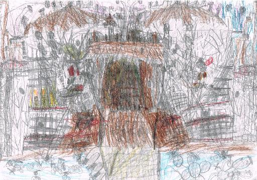

Inleiding
--------------------------------------------------------------------------------------------------------------

Op de kaft staat een afbeelding van een tekening gemaakt door een jongen met autisme. Toen hij klein was, zei men tegen hem dat hij niet tekende maar kraste. Hij vond dat zo erg dat hij op een gegeven moment niet meer wilde tekenen.

Thuis vertelde hij over zijn tekeningen. Het was duidelijk dat hij heel veel in zijn eigen tekeningen zag. Tijdens het vertellen kwam de tekening tot leven. Het bleek niet zomaar een tekening te zijn, maar een heel verhaal!

Hij werd gestimuleerd om verder te tekenen. Hij kreeg informatie over en voorbeelden van kunstenaars die ieder een eigen stijl hadden en waarvan niet iedereen meteen herkende hoe geweldig hun kunst was. Dit gaf hem zelfvertrouwen en hij begon weer te tekenen. Wanneer hij weer eens te horen kreeg dat het krassen was, vertelde hij dat hij een eigen stijl had en begon te vertellen over de tekening. Men begon in te zien dat hij inderdaad een unieke tekenstijl had en dat het geen krassen was. Dit bevestigde hem in zijn manier van tekenen en zijn tekeningen werden dieper en uitgebreider, laag op laag.

Zo is het ook met autisme. Mensen met autisme worden vaak niet goed begrepen. Ze passen niet in de maatschappij, ze zijn niet zoals het hoort. Zoals bij de tekening: het lijkt op krassen. Het is niet tekenen zoals het 'hoort'.

Maar heb je geduld en een ‘open mind’ om beter te kijken naar een autist, dan zie je zoveel meer. Je kan misschien nog niet alles bevatten, maar je staat open voor het anders zijn. Je kijkt oprecht naar de mens die tegenover je staat en niet alleen naar 'een autist'. Zoals bij de tekening: je wilt zien wat er echt getekend is, ook al is het moeilijk en zul je niet meteen alles herkennen.

Om de persoon echt te kunnen doorgronden, zul je moeten luisteren naar wat iemand met autisme te vertellen heeft. Echt luisteren en doorvragen en meekijken. Dan zul je aangenaam verrast zijn en zelfs versteld staan van wat er aan het licht komt. Een hele persoonlijkheid, een heel verhaal. Zoals bij de tekening: je ziet het pas echt tot leven komen wanneer je meekijkt en goed luistert naar de uitleg.

Zelfs dan blijft het moeilijk. Er is zoveel te ontdekken aan de mens met autisme. Zelfs als je denkt dat je alles weet, blijkt dat er nog veel meer is. Zoals bij de tekening: laag op laag.

Kijk goed, kijk mee en luister. Er gaat een wereld voor je open.

Ondanks het feit dat er al veel geschreven is over autisme, mist er in veel boeken nog essentiële informatie over autisme en autisten. Dit boek wil alle aspecten van autisme en de onderwerpen die te maken hebben met autisme belichten. Er wordt niet altijd zeer diep op de verschillende aspecten en onderwerpen ingegaan, omdat getracht is het boek handzaam te houden, maar er wordt wel geprobeerd zo volledig mogelijk te zijn in de informatie die gegeven wordt. Het boek dient als een gids. Wanneer meer informatie over een bepaald aspect of onderwerp gewenst is, kan men de bronvermelding raadplegen en/of zelf verder zoeken. Het boek kan ook een prima aanvulling zijn op andere boeken over autisme.

In dit boek staat de autistische mens centraal. Daarmee onderscheidt dit boek zich van andere boeken over autisme waarin er vaak vanuit kenmerken gekeken wordt en minder snel vanuit de mens met de stoornis zelf. Wanneer er 'autisme' staat wordt het hele spectrum aan autismestoornissen bedoeld. Wanneer er staat 'autisten' worden alle mensen met een stoornis in het autismespectrum bedoeld. Er is bewust gekozen voor de term autisten, omdat de stoornis verweven is met de persoon en je die niet los kunt koppelen. Net zoals wanneer je een persoon doof noemt en meestal niet ‘een persoon met een auditieve beperking’ zegt.

Dit boek gaat uitsluitend over autisten met een normale tot hoge begaafdheid. Alle autisten waar we het hier over hebben, zijn gewone mensen met een gewone intelligentie die een zo gewoon mogelijk leven (willen) leiden. Een autist is namelijk ook een kind, vader, moeder, partner, leerling, student, werknemer of werkgever en neemt deel aan de maatschappij, net als iedereen. Waar hij/hem staat, kan ook zij/haar gelezen worden.

Ondanks dat veel stoornissen in verband staan met elkaar en dat mensen met een stoornis vaker last kunnen hebben van meerdere stoornissen tegelijk, wordt er hier niet zeer diep op ingegaan in verband met de handzaamheid van het boek.

Het boek is een ontdekkingstocht geweest naar de mens met autisme. Tijdens het schrijven ervan zijn bepaalde ontdekkingen gedaan en inzichten verworven. Er worden regelmatig logische redenaties gevolgd, waardoor bepaalde conclusies kunnen worden getrokken. Toch is ook getracht om zo objectief mogelijk te blijven en alle gevonden informatie te geven over de verschillende onderwerpen, zodat de lezer tevens zijn eigen conclusies kan trekken. De bedoeling is dat je, door het boek te lezen, wordt meegenomen op ontdekkingstocht en dat je je eigen ontdekkingen kunt doen en inzichten kan verwerven. Aan het einde van het boek komen wel een aantal conclusies, meningen en vragen naar voren van de auteur zelf.

